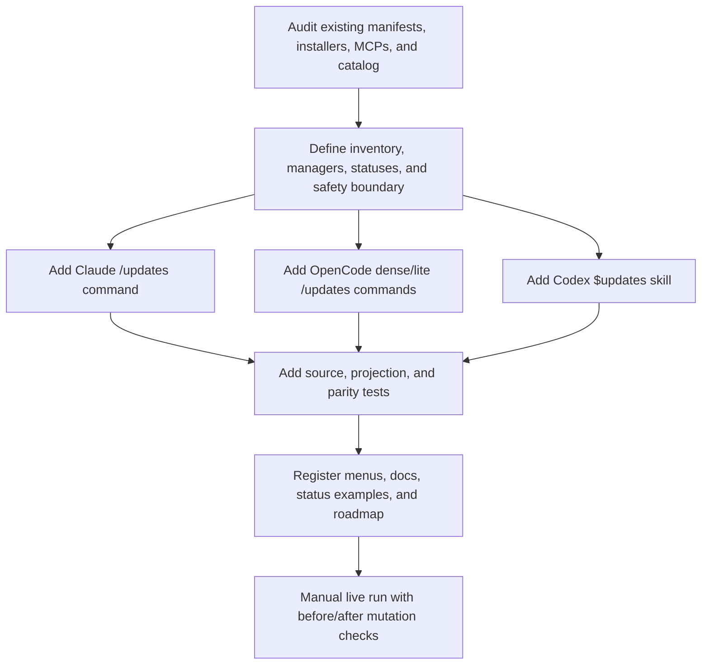
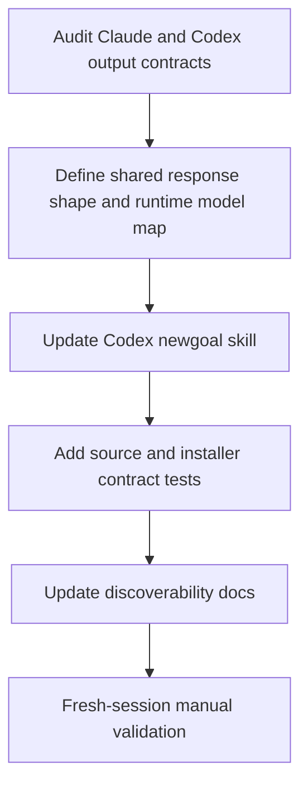
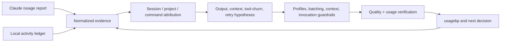
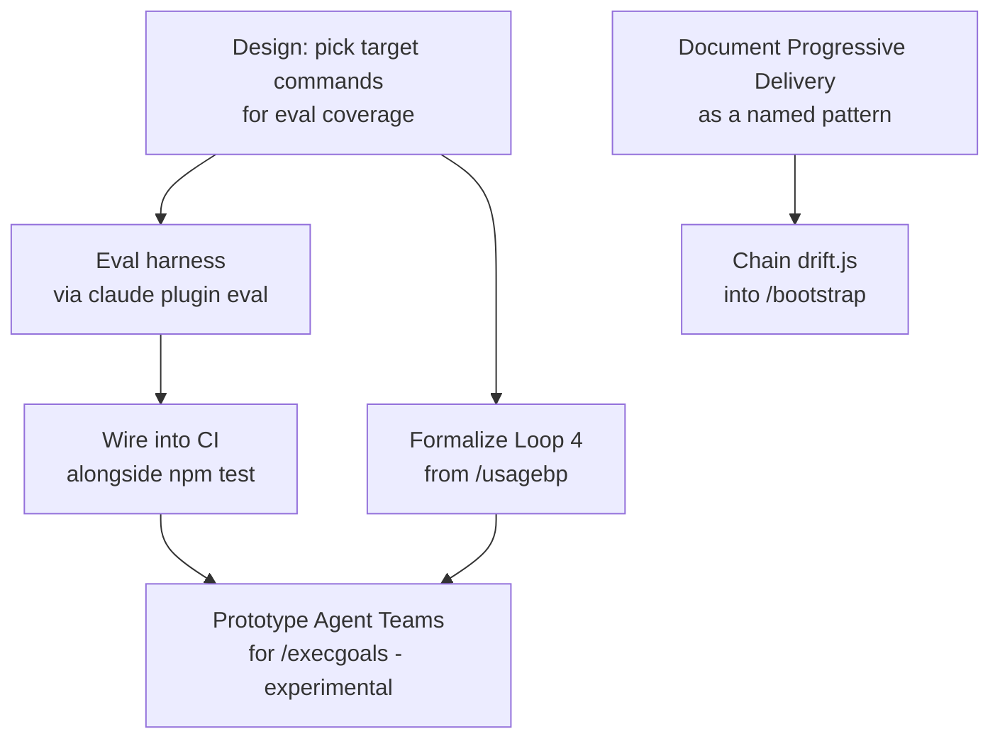

# GOALS.md — base_project
This is the active execution context for `/execgoals`. Completed plan bodies live in `dev/goals-archive/` so a planning or execution pass reads current work first, without losing the evidence behind prior decisions.

## Active plans
1. [**Dependency and Tool Update Report Command**](#goals-15-dependency-and-tool-update-report-command) — add a read-only `$updates`/`/updates` workflow for the base_project-managed dependency and CLI surfaces.
2. [**Codex Model Recommendation Parity**](#goals-14-codex-model-recommendation-parity) — make `$newgoal` show a runtime-correct, manual-only model + effort recommendation.
3. [**Harness & Loop Engineering Adoption**](#goals-8-harness--loop-engineering-adoption-base_project-feature) — deterministic contract coverage is complete; live-model evaluation remains optional and separately scoped.
4. [**Usage Efficiency & Quality Loop**](#goals-12-usage-efficiency--quality-loop-base_project-process) — measure real usage first, then reduce waste without trading away correctness.

## Completed plans
The completed bodies for GOALS 1–7, 9–11, and 13 are preserved in the [archive index](dev/goals-archive/README.md). Consult an individual archived plan only when its historic scope or evidence is relevant.

`dev/ROADMAP.md` remains the chronological decision log; this file contains only work that `/execgoals` can still execute.

---

## GOALS 15 — Dependency and Tool Update Report Command (base_project feature)

The project currently checks npm dependencies through CI/Dependabot and installs several
global tools, but no user-facing command gives one read-only report for the complete
base_project-managed surface. This goal adds `/updates` for Claude Code and OpenCode and
`$updates` for Codex. It is deliberately separate from `/update`/`$update`, which pulls and
reinstalls base_project itself after confirmation.

Suggested: gpt-5.6-sol · high — the command spans four runtime projections, multiple package managers, registry lookups, and a strict no-mutation guarantee.

### Design rationale

Suggested: gpt-5.6-sol · high — the highest-risk decision is defining truthful status semantics across npm, uv/pipx, OS package managers, floating npx MCPs, and optional catalog entries.

- [x] **U15.1 Settle the command boundary and name** (`architect`) — use `/updates` and
  `$updates`, keeping `/update` and `$update` reserved for pulling the base_project repository
  and rerunning its installer. The new command must inspect base_project-managed dependencies
  from the repository recorded in `~/.base_project/repo-path.txt`, not silently scan or modify
  the unrelated project in which the command was invoked. **Done when:** the architect records
  the naming decision, invocation scope, and the explicit distinction between reporting and
  upgrading before implementation begins.
- [x] **U15.2 Define the inventory of things to check** (`architect`) — cover the sources that
  already own each dependency instead of inventing a second manifest:
  - root `package.json` plus `package-lock.json`: direct npm dependencies
    (`ajv`, `ajv-formats`) and devDependencies (`@biomejs/biome`, `typescript`), with
    transitive lockfile updates reported through npm's `--all` mode;
  - installer-managed global tools: Node.js/npm, Git, GitHub CLI (`gh`), Graphify
    (`graphifyy` providing `graphify`), Repomix, global Biome, global TypeScript, and `jq`
    where the Unix installer needs it;
  - always-on MCP packages from `source/opencode/mcp.json` (`@upstash/context7-mcp`,
    `@modelcontextprotocol/server-filesystem`, and `mcp-git`), reported as floating/on-demand
    packages when no local version is pinned;
  - optional catalog entries from `source/plugins.json` only when detected as installed, or
    when an explicit `all` argument requests catalog visibility. Entries with no reliable
    installed-version signal must be shown as unknown, never falsely marked current or
    outdated.
  **Done when:** every listed item maps to a concrete source file, detection method, and
  honest unavailable/not-installed state; the old `check-plugin-updates.js` stub is not treated
  as a full registry update check without first proving its behavior.
- [x] **U15.3 Choose read-only checks per manager** (`architect`) — use native commands and
  preserve their exit/output semantics:
  - `npm outdated --json --all` in the base_project repository for manifest and lockfile
    packages, and `npm outdated --global --json` filtered to installer-managed npm CLIs;
  - `uv tool list --outdated` for uv-managed Python tools and `pipx list --outdated` for
    pipx-managed tools, including `graphifyy` when installed by either route;
  - Windows `winget list --upgrade-available`, macOS/Linux `brew outdated --json=v2` when
    Homebrew is present, and Linux `apt list --upgradable` when apt is the relevant source,
    filtering results to the required host/CLI tools instead of dumping every OS package;
  - registry metadata lookup such as `npm view <package> version --json` for npx MCP entries
    that have no installed version to compare;
  - local `~/.github`/Dependabot configuration inspection for GitHub Actions coverage rather
    than calling a credentialed API. Never use `npm update`, `pip install`, `pipx upgrade`,
    `uv tool upgrade`, `winget upgrade`, `brew upgrade`, `apt upgrade`, `git pull`, or an
    installer as part of the report.
  **Done when:** each manager has a command that is demonstrably non-mutating, a fallback or
  `unsupported` result when it is absent, and a rule for interpreting non-zero "updates found"
  exits as data rather than command failure.
- [x] **U15.4 Define the report contract** (`architect`) — produce concise user-language output
  grouped by `core npm`, `global tools`, `MCPs`, `optional catalog`, and `automation coverage`.
  Each row should expose component/package, manager/source, installed or current version,
  wanted/latest version when available, and one status: `current`, `update-in-range`,
  `major-update`, `floating/latest-on-use`, `not-installed`, `unknown`, `unsupported`, or
  `check-failed`. Continue checking independent groups after one network/tool error and finish
  with a count plus concrete manual follow-up commands; do not persist a report or credentials.
  **Done when:** the output distinguishes a compatible update from a major update, a floating
  npx package from an installed package, and an unavailable checker from an up-to-date result.
- [x] **U15.5 Preserve safety and privacy boundaries** (`architect`) — the command is read-only,
  may query public registries, must not require secrets, must not read `.env` values, must use
  bounded command/network attempts, and must not write manifests, locks, caches, settings,
  global configuration, or generated project artifacts. State that applying any update is a
  separate manual action and that this command does not upgrade anything. **Done when:** the
  design includes explicit before/after mutation checks for manual validation and no command
  path can be mistaken for an upgrade path.

### Implementation

Suggested: gpt-5.6-sol · high — the implementation must keep the same safe behavior across Claude, OpenCode dense/lite, and Codex while preserving runtime-specific syntax.

- [x] **U15.6 Add the Claude command** (`coder`) — create
  `source/claude/commands/updates.md` with the settled inventory, manager checks, report
  statuses, public-registry/network error handling, and the no-install/no-pull boundary. The
  command must honor optional `all` scope without making the default report noisy.
  **Done when:** a Claude user can invoke `/updates` from any project and it resolves the
  base_project repository before checking its managed surfaces.
- [x] **U15.7 Add OpenCode dense and lite projections** (`coder`) — create semantic mirrors at
  `source/opencode/command/updates.md` and `source/opencode/command-lite/updates.md`. Keep the
  same checks, statuses, `all` behavior, and safety contract; only the surrounding instruction
  density/format may differ. **Done when:** both OpenCode profiles expose `/updates` and neither
  can accidentally turn a report into an install or upgrade operation.
- [x] **U15.8 Add the Codex-native skill** (`coder`) — create
  `source/codex/skills/updates/SKILL.md` with `$updates` invocation, the same source inventory,
  manager commands, status meanings, and manual-only boundary. Use Codex-native wording and
  preserve the global planning/safety rules. **Done when:** the Codex installer projects the
  skill and the skill does not use Claude-only command or model vocabulary.

### Tests

Suggested: gpt-5.6-terra · medium — the main risk is contract drift and unsafe verbs, which can be covered deterministically before one live network check.

- [x] **U15.9 Add focused update-command contract tests** (`coder`) — create
  `dev/tests/updates.test.js` to assert all four source variants contain the complete managed
  inventory, native manager checks, status vocabulary, language/output instruction, and explicit
  no-mutation terms. Assert that `/update`/`$update` remains the base_project pull path and that
  the new command does not instruct `upgrade`, `install`, `pull`, or lockfile mutation. Add an
  invariant for Claude/OpenCode dense/lite/Codex semantic parity.
  **Done when:** the test fails if a runtime loses Graphify, global npm tools, MCPs, optional
  scope, or the read-only boundary, without requiring network access or real credentials.
- [x] **U15.10 Verify source-to-installed projections** (`coder`) — extend the existing
  installer/projection coverage so the Claude command, both OpenCode command profiles, and
  Codex skill are present in temporary roots after installation and preserve user-owned files.
  **Done when:** all four installed surfaces contain the new command and repeated installation is
  idempotent.
- [x] **U15.11 Run the complete local quality gate** (`reviewer`) — run the repository's own
  `npm test`, `npm run lint`, `npm run typecheck`, `npm run validate:plugins`,
  `npm run check:unused-deps`, `npm run test:harness`, `node dev/scripts/validate-goals-structure.js GOALS.md`,
  and `git diff --check`. **Done when:** all pass, the command count increases consistently,
  and no unrelated dirty work is staged, reverted, or rewritten.
  Proof (2026-09-09): `npm run verify` passed (Biome, TypeScript, plugin schema, unused-deps,
  129 tests, production audit with 0 vulnerabilities); `npm run test:harness` passed 12/12
  artifacts and 16/16 scenarios; GOALS structure and `git diff --check` passed. Existing
  GOALS 14 edits remain uncommitted and were preserved.
- [ ] **U15.12 Perform a live manual read-only check** (`manual`) — after installation, run
  `/updates` or `$updates` from a harmless disposable project on a machine with the available
  package managers. Record the date, checker availability, and a representative result such as
  the installed Graphify version versus the registry version. Verify before/after that no
  repository, package manifest, lockfile, settings, or global package version changed.
  **Done when:** the command produces a truthful grouped report and any limitation (network,
  manager missing, or version source unavailable) is recorded instead of claiming full coverage.

### Registration

Suggested: gpt-5.6-terra · medium — registration is repetitive but must keep four projections, menus, docs, and command-count references synchronized.

- [x] **U15.13 Register the command everywhere users discover workflows** (`coder`) — add the
  entry to `source/claude/references/command-menu.md`,
  `source/opencode/references/command-menu.md`, and
  `source/codex/references/command-menu.md`; update the user-facing command tables in
  `README.md` and `source/codex/README.md`; add `updates` to the dynamic/status examples in
  the Claude, OpenCode, and Codex status projections; and update any stale 20/21 command/skill
  wording so the resulting count is accurate everywhere.
  **Done when:** each engine's menu, selector/skill directory, status listing convention, and
  README point to the same `/updates`/`$updates` behavior.
- [x] **U15.14 Record the decision and maintenance source** (`coder`) — add a concise
  `dev/ROADMAP.md` entry pointing to GOALS 15, the manager-specific read-only checks, the
  source-of-truth files, and the limitation that optional/catalog or OS-managed versions may be
  unknown. Keep `dev/scripts/check-plugin-updates.js`'s historical contract documented rather
  than silently claiming it now covers every dependency unless implementation explicitly proves
  that change.
  **Done when:** a future maintainer can add a new installer-managed tool or MCP and see exactly
  which source and test contract must be updated.

### Execution evidence (2026-09-09)

- **U15.1–U15.5:** all four source projections resolve the recorded base_project repository,
  derive their inventory without a duplicate manifest, name the native read-only checks and
  eight status values, prohibit mutation and `.env` reads, and require before/after state
  comparison for the manual live validation.
- **U15.6–U15.8:** added managed Claude, OpenCode dense/lite, and Codex `$updates` artifacts.
  They support default installed-only optional scope and literal `all` catalog scope while
  keeping the existing pull-and-installer update command distinct.
- **U15.9:** `dev/tests/updates.test.js` asserts every required package/tool/MCP, manager check,
  output group/status, safety boundary, manual comparison, and existing `/update`/`$update`
  pull path. It is deterministic and requires no network or credentials.
- **U15.10:** CI's POSIX and Windows throwaway-home expectations now require the Claude,
  OpenCode dense/lite, and Codex `updates` artifacts. `dev/tests/codex.test.js` additionally
  verifies a byte-identical Codex skill after repeated temporary-root installation and the
  21-skill count.
- **U15.13–U15.14:** all menus, status examples, user docs, architecture tables and command
  counts register the same read-only behavior; ROADMAP item 52 preserves the source and
  maintenance decision, including the historical plugin-pin helper limit.

### Explicitly out of scope

- Automatically installing, upgrading, pulling, pinning, or changing any dependency, CLI,
  MCP, plugin, manifest, lockfile, cache, setting, or global configuration.
- Replacing `/update`/`$update`, `/audit`/`$audit`, `/status`/`$status`, or the existing
  `check-plugin-updates.js` historical helper.
- Running vulnerability audits, secret scans, or arbitrary checks against every project on the
  machine; `$audit` and project-specific commands retain those responsibilities.
- Adding a scheduler, background monitor, cloud service, credentialed GitHub integration, or
  auto-merge/update policy.
- Treating an optional catalog entry with no reliable installed-version signal as current or
  outdated by inference.

### Sources consulted

- `package.json`, `package-lock.json`, `dev/scripts/install.ps1`, and `dev/scripts/install.sh`
  — current npm dependencies and globally installed tool paths.
- `source/opencode/mcp.json`, `source/plugins.json`, and `dev/scripts/check-plugin-updates.js`
  — always-on MCP packages, optional catalog, and the existing historical plugin-check helper.
- `.github/dependabot.yml` and `.github/workflows/ci.yml` — current weekly npm/GitHub Actions
  automation and Node.js CI setup.
- `source/claude/commands/update.md`, `source/opencode/command/update.md`, and
  `source/codex/skills/update/SKILL.md` — the existing base_project update boundary that must
  remain separate.
- [npm outdated documentation](https://docs.npmjs.com/cli/v11/commands/npm-outdated/) — direct
  versus `--all` reporting and JSON output.
- [uv tool documentation](https://docs.astral.sh/uv/reference/cli/) — installed-tool listing
  and upgrade semantics; the command must use listing only.
- [pipx list documentation](https://pipx.pypa.io/latest/how-to/manage-installed-apps.html) —
  `pipx list --outdated` as a read-only check.
- [WinGet list documentation](https://learn.microsoft.com/en-us/windows/package-manager/winget/list)
  — `winget list --upgrade-available` without invoking the mutating upgrade command.
- [Homebrew manpage](https://docs.brew.sh/Manpage) — `brew outdated` and JSON output.

---

## GOALS 14 — Codex Model Recommendation Parity for `$newgoal` (base_project feature)

The Claude command already ends a successful `/newgoal` run with a localized, bold model +
effort recommendation and an explicit manual-only disclaimer. The Codex skill has a related
instruction, but its model vocabulary is still Claude-specific (`haiku`/`sonnet`/`opus`) and
does not define the visible response shape strongly enough. This goal makes `$newgoal` behave
the same way at the interaction level while using Codex's own current model names and effort
levels.

Suggested: gpt-5.6-sol · high — the change is bounded but spans Codex prompt semantics, cross-runtime contract tests, installed projection, and a live behavior check.

### Design rationale

- [x] **M14.1 Define the parity contract** (`architect`) — use the Claude final-response rule as
  the semantic reference, not as a claim that OpenCode currently emits the same visible line.
  After the path and short outline, Codex must emit exactly one localized recommendation sentence
  with one bold `<Codex model> · <effort>` pair, one reason tied to the plan's highest-complexity/
  highest-risk module, the manual-only disclaimer, and the question asking whether to continue
  with `$execgoals` or adjust the plan. **Done when:** the architect confirmed these four
  invariants and the implementation/test items encode them. Proof: read-only architecture review
  completed by the `architect` subagent; no files were edited by that review.
- [x] **M14.2 Define Codex-specific recommendation mapping** (`architect`) — keep Claude and
  OpenCode's `haiku`/`sonnet`/`opus` vocabulary unchanged, but make Codex recommend the model
  actually usable in the current Codex session: `gpt-5.6-luna · low` for mechanical routine work,
  `gpt-5.6-terra · medium` for typical implementation, `gpt-5.6-sol · high` for difficult
  multi-system work, and `gpt-6-astra · xhigh` for high-cost-of-failure work. Resolve availability
  against the models visible in the active Codex surface; fall back along Astra → Sol → Terra →
  Luna, preserve effort when supported, and disclose any fallback. Never print Claude model names
  as Codex choices. **Done when:** the architect approved this deterministic mapping and the plan
  metadata uses the selected Codex pair. Proof: current official model roles and the available
  Codex model surface were reviewed; Sol/Astra ambiguity was removed.
- [x] **M14.3 Preserve scope boundaries** (`architect`) — do not change the active model,
  reasoning setting, `fallbackModel`, global Codex configuration, billing behavior, command
  count, menu entries, or any workflow other than `$newgoal`. The recommendation remains advice
  applied by hand, never an automatic mid-session switch. **Done when:** the architect confirmed
  the out-of-scope list and no file outside the approved paths is required. Proof: the read-only
  architecture review approved this boundary.

### Implementation

- [x] **M14.4 Make the Codex final-response contract explicit** (`coder`) — update
  `source/codex/skills/newgoal/SKILL.md` so the final response cannot be satisfied by merely
  mentioning a `Suggested:` line inside `GOALS.md`: require the visible localized sentence,
  bold model/effort pair, plan-specific reason, manual-only disclaimer, and `$execgoals` versus
  plan-adjustment question. Keep the planning-only boundary and the Codex-native `$` spelling.
  Replace the Claude-only model set in the Codex-specific guidance with the approved Codex map;
  do not copy the full Claude command or add a new skill.
  **Done when:** the source skill contains one unambiguous final-response contract, uses
  Codex-compatible model identifiers, and preserves `never execute`. **Proof:**
  `source/codex/skills/newgoal/SKILL.md` now contains the explicit localized final-response
  contract and Codex model mapping.
- [x] **M14.5 Keep source and installed projections aligned** (`coder`) — rely on the existing
  `dev/scripts/install-codex.js` source-of-truth flow; do not edit `~/.agents/skills/` manually or
  change the installer for a content-only skill update. Exercise the temporary-root installer
  path so the installed Codex skill receives the same contract and existing user-owned skill
  content remains preserved. **Done when:** the temporary installed file is byte-equivalent to
  the managed source file and the existing idempotency/user-collision tests still pass. **Proof:**
  the installer test compares the temporary installed skill byte-for-byte with source and passes
  while preserving a user-owned colliding skill.

### Tests

- [x] **M14.6 Add deterministic cross-runtime contract coverage** (`coder`) — extend
  `dev/tests/codex.test.js` with a focused assertion over
  `source/claude/commands/newgoal.md`, `source/opencode/command/newgoal.md`,
  `source/opencode/command-lite/newgoal.md`, and `source/codex/skills/newgoal/SKILL.md`:
  Claude/OpenCode retain their existing model-tier contract; Codex has the visible final-output
  contract, Codex model vocabulary, localized-output instruction, and manual/no-auto-switch
  disclaimer; none loses the planning-only boundary. Assert the Codex-specific section does not
  present `haiku`/`sonnet`/`opus` as Codex models.
  **Done when:** the test fails if the Codex instruction regresses to a GOALS-only suggestion or
  to Claude model names, and it passes against all four source variants. **Proof:**
  `node --test dev/tests/codex.test.js` passed 6/6.
- [x] **M14.7 Verify the complete local quality gate** (`reviewer`) — run the repository's own
  checks after the source/test edits: `npm test`, `npm run lint`, `npm run typecheck`,
  `npm run validate:plugins`, `npm run check:unused-deps`, `npm run test:harness`, and
  `git diff --check` for the owned paths. **Done when:** all checks pass and no unrelated dirty
  work is staged, reverted, or rewritten. **Proof:** `npm run verify` passed (Biome 56 files,
  typecheck, plugin validation, unused-dependency check, full test suite 127/127, and audit with
  0 vulnerabilities); `npm run test:harness` passed 12/12 artifacts and 16/16 scenarios; GOALS
  structure and `git diff --check` passed.
- [ ] **M14.8 Confirm real Codex behavior in a fresh session** (`manual`) — after synchronization,
  invoke `$newgoal` on a disposable harmless project and inspect the actual final response. It
  must show the localized bold model + effort recommendation, a reason, the manual-only warning,
  and the execution/adjustment question; it must not change the selected model or effort. Record
  the exact observed model/effort and the session/date because prompt tests cannot prove a
  probabilistic model followed its instruction. **Done when:** the live response matches the
  contract, or a concrete Codex limitation is recorded instead of claiming success. **Proof:**
  Codex global synchronization completed successfully; the installed skill's SHA-256 matches
  the source (`D09A8898ECA6D77499C89056188BE1C28C40274E87DD208ACA3F0B7A55B88ADE`). **Current
  blocker:** opening a fresh Codex session and observing the live `$newgoal` response is still
  required; installation and structural checks do not prove model obedience.

### Registration

- [x] **M14.9 Document the runtime distinction without creating another command** (`coder`) —
  update the existing `/newgoal` description in `README.md` and the Codex integration note in
  `source/codex/README.md` to explain that the recommendation is manual and that each runtime
  uses its own model vocabulary. Do not add a menu/status entry or change the 20/20 command-skill
  parity counts. **Done when:** the existing user-facing `/newgoal` entry and Codex README agree
  with the implemented behavior and the command-count tests remain unchanged. **Proof:**
  `README.md` and `source/codex/README.md` document the runtime-specific manual mapping; stale
  21-workflow wording was corrected to 20; no menu or parity-count change was made.
- [x] **M14.10 Record the decision in the chronological roadmap** (`coder`) — add a concise
  `dev/ROADMAP.md` entry referencing this goal, the runtime-specific model mapping, the source
  paths, and the honest limit that structural tests do not prove live model obedience.
  **Done when:** the roadmap points to the shipped contract and does not imply automatic model
  routing or live validation unless M14.8 produced that evidence. **Proof:** `dev/ROADMAP.md`
  item 51 records the mapping, fallback, files, and structural-test/live-obedience limitation.

### Explicitly out of scope

- Automatic model/effort switching, model routing middleware, `fallbackModel`, or changes to
  Codex/Claude account settings.
- A new command, a model API, billing/token instrumentation, or recommendations for every
  workflow beyond `$newgoal`.
- Replacing the existing Claude/OpenCode vocabulary or pretending that Claude model names are
  valid Codex model selections.
- Treating a passing string/structure test as proof that every live model will obey the prompt;
  M14.8 remains a separate manual check.

### Sources consulted

- [OpenAI Models](https://developers.openai.com/api/docs/models) — current model roles and
  reasoning-effort ranges used to keep Codex recommendations runtime-aware; availability and
  account access remain session-dependent.
- `source/claude/commands/newgoal.md`, `source/opencode/command/newgoal.md`,
  `source/opencode/command-lite/newgoal.md`, and `source/codex/skills/newgoal/SKILL.md` — current
  source contracts and the exact parity gap.
- `dev/tests/codex.test.js` and `dev/scripts/install-codex.js` — existing cross-runtime and
  source-to-installed verification boundaries.

---

## GOALS 12 — Usage Efficiency & Quality Loop (base_project process)

This plan turns the current Claude usage report and the existing local activity ledger into
a controlled feedback loop. The governing rule is **quality first**: token efficiency is a
secondary outcome of better context, batching, attribution, and verification. No default,
limit, model, skill, MCP, or command should be changed merely because it appears cheaper.
Any reduction must be demonstrated not to lower correctness or increase rework.

### Evidence baseline

The user-provided report for 2026-09-04 shows:

- `6.4k input`, `1.8M output`, `1.6B cache read`, and `16M cache write` tokens;
- locally calculated cost of `$16.89`, `22m` API time, and `38m` wall time;
- `session-0` at `92%` and `weekly_all-1` at `65%`.

The shared local ledger contains 82 JSONL files from 2026-08-17 through 2026-09-04:

- 829 prompt events and 12,792 tool events;
- Bash, Read, Edit, and Grep account for 84.3% of tool calls;
- 34 `/ship`, 34 `/execgoals`, and 31 `/newgoal` prompt events;
- 137 responses match a broad error-like heuristic, mostly Bash (95), but this includes
  expected negative tests and is not yet a failure rate;
- only two consecutive tool runs of length at least three were found, with a maximum of
  four, so this window does not prove a classic infinite tool loop.

These sources are not directly interchangeable. The local ledger does not record actual
input/output/cache token counts, its prompt and tool fields are truncated, and it does not
cover opencode. The product activity counter is also not the same unit as a local prompt
event. Cache reads are not automatically waste: prompt caching is designed to make repeated
context cheaper. The report therefore identifies hypotheses and urgency, not a final causal
diagnosis.

### Operating model

### Evidence and attribution

- [x] **V.1 Define a normalized usage envelope** (`coder`) — specified a small, versioned
  representation for a user-provided `/usage` report and local ledger facts. It must keep
  model, effort, session, time window, uncached input, output, cache read/write, estimated
  cost, API/wall time, and limit percentages distinct. It must explicitly label unavailable,
  estimated, and authoritative values and reject credentials or raw secret material.
  **Done when:** `dev/scripts/usage-envelope.js` parses the supplied report deterministically,
  missing fields remain `null` with `status: "unavailable"`, and credential-like input is
  rejected. Proof: `node --test dev/tests/usage-envelope.test.js dev/tests/usage-log.test.js`
  (12/12), targeted Biome clean, and `node dev/scripts/validate-goals-structure.js GOALS.md`
  reports `structure OK`.

- [x] **V.2 Extend the existing `/usagebp` path** (`architect then coder`) — added an
  optional usage-report input or import mode to the existing review workflow instead of
  creating a new slash command. Correlate report windows with ledger session, `prompt_id`,
  `cwd`, command class, model, and tool events where evidence permits. Keep direct
  attribution separate from inference and state that opencode is outside the current
  Claude-only ledger. **Done when:** the source variants expose the same optional input,
  the installers synchronize the normalizer to the shared scripts directory, and the
  targeted integration tests pass. Proof: `node --test dev/tests/usage-envelope.test.js
  dev/tests/codex.test.js` (9/9), targeted Biome clean, and `node
  dev/scripts/validate-goals-structure.js GOALS.md` reports `structure OK`.

- [x] **V.3 Establish a privacy and retention policy** (`manual`) — user chose ephemeral
  processing: imported reports are read in memory and not retained; prompt/tool payloads
  are excluded by default. Preserve the existing ledger format and
  diary boundary; never move diary data into the repository. **Done when:** the selected
  policy is written down and a redaction test proves that credentials and full payloads are
  not copied into the usage analysis artifact. Proof: imported reports are read-only and
  ephemeral; the normalizer writes only JSON to stdout, never to the ledger or diary paths;
  credential-like material is rejected by `dev/tests/usage-envelope.test.js`.

### Diagnosis and baselines

- [x] **V.4 Establish a baseline by task class** (`architect then coder`) — established a
  baseline for short fix, complex implementation, research, and planning/execution workflows.
  Record
  quality outcome, user rework, total/uncached input, output, cache ratio, tool calls per
  prompt, duration, model/effort, error classification, and limit consumption. Use the
  current report as the first urgent baseline, not as a universal average. **Done when:**
  two comparable baseline samples per selected task class are stored with timestamps and
  their limitations are documented. Proof: `usage-baseline.js` produced an ephemeral
  aggregate from 82 ledger files with 31 planning, 34 execution, 5 research, and 10
  short-fix samples; output includes timestamps, tool-call/duration/error proxies, and
  explicit unavailable status for tokens, cache, quality, rework, model, and effort.
  The run showed 52.79 tools/prompt for execution and 53.90 for short-fix. Full direct
  verification: 112/112 tests, Biome, TypeScript, plugin validation, and GOALS structure.

- [x] **V.5 Separate real failures from expected negative output** (`coder`) — classified
  error-like responses into expected test assertions, user-cancelled work, transient
  infrastructure errors, model/tool retries, and genuine task failures. Do not optimize
  away a deliberate safety check just because its output contains `error` or `failed`.
  **Done when:** the heuristic sample can be audited by category and the report exposes both
  raw count and classified count. Proof: `usage-baseline.js` uses a response-only error gate
  and, in the current ledger run, classified 92 signals as 43 transient infrastructure,
  1 model/tool retry, 6 genuine-task-failure signals, and 42 `needs_review`; expected
  negative tests and user cancellations were 0. The earlier broad 137-event heuristic is
  retained as non-comparable context rather than silently relabeled. Unit coverage exercises
  every classification boundary and the full direct test suite remains green.

- [x] **V.6 Audit workflow fragmentation and no-op cycles** (`coder`) — correlated repeated
  `/newgoal` → `/execgoals` → `/ship` cycles, repeated validation, re-reading of the same
  files, and rework after failed commands. The command counts are a signal, not proof of
  waste. Identify which cycles were necessary and which could have been batched. **Done
  when:** the report contains concrete examples and a measured batching opportunity rather
  than a blanket recommendation to use fewer commands. Proof: the current ledger run
  reports 15 complete plan/execute/ship cycles, 204 empty prompt chains, 377 repeated tool
  signatures, 246 repeated reads, 13 repeated validations, and 50 error-then-follow-up
  chains. `workflow_audit` labels all of these as candidates and includes the necessary
  caution; no payload or file path is emitted.

### Context, model, and invocation controls

- [x] **V.7 Optimize global context for correctness per token** (`architect then coder`) —
  inspected the global instructions, command descriptions, skill descriptions, MCP loading,
  and trigger overlap. The decision is to preserve the core rules and avoid a blanket context
  reduction: the source global instruction files are approximately 7 KB, while full skill
  bodies are deferred until invocation. The measured waste signal is tool/rework churn, not
  proven global context size. **Done when:** the balanced policy is wired into all three
  global instruction layers and no required command, diary rule, safety gate, or project
  standard becomes undiscoverable. Proof: `source/CLAUDE.md`, `source/opencode-instructions.md`,
  and `source/codex/AGENTS.md` now preserve the essential context and define routine versus
  complex effort profiles; unit coverage checks policy parity. No global capability was
  removed and no default model/limit was silently changed.

- [ ] **V.8 Define graduated operating profiles** (`architect then coder`, then `manual`) —
  document defaults that match task risk instead of applying a global low-token mode:
  short routine work may use low/medium effort; complex changes keep high effort; `xhigh`
  or `max` is reserved for high-value ambiguity; research is isolated when practical;
  unrelated work uses `/clear`; natural breaks use `/compact`; an abandoned path uses
  `/rewind`. Treat `CLAUDE_CODE_MAX_OUTPUT_TOKENS`, `CLAUDE_CODE_MAX_TURNS`, and retry
  limits as experimental controls because premature caps can cause truncation and rework.
  The policy is now documented in `source/CLAUDE.md`, `source/opencode-instructions.md`,
  and `source/codex/AGENTS.md`; no model or limit default was changed. **Done when:** the
  user approves the profiles and an A/B sample shows no correctness regression before any
  profile becomes the default. **Current blocker:** the A/B evidence does not exist yet;
  this item remains open and no automatic low-token profile is active.

- [ ] **V.9 Add batching guidance to existing workflows** (`coder`) — make the current
  commands communicate when to group independent reads/checks and when to stop. Keep
  `/newgoal` planning-only, let `/execgoals` execute a coherent batch, and use `/ship` at
  a meaningful delivery boundary. Avoid adding another command solely for token accounting.
  The guidance now exists as one canonical block in all 15 relevant source surfaces (the three
  global instruction layers plus the `execgoals`, `fixproject`, and `ship` variants for Claude,
  opencode dense/lite, and Codex). **Done when:** a representative before/after sample shows
  fewer redundant turns/tool calls without weakening the explicit plan/execute/commit
  boundaries. **Current status:** guidance is installed and parity-tested; the effectiveness
  sample remains open and is part of the comparison evidence required by V.10.

### Verification and feedback loop

- [ ] **V.10 Build a quality-preserving comparison harness** (`architect then coder`) —
  reuse the structural guardrails and deterministic checks already planned in the harness
  work. Compare baseline and intervention runs on the same task class, repository state,
  model, and effort. Score requested behavior, tests, regressions, unnecessary changes,
  user rework, output, cache use, duration, and limit consumption. Do not treat lower token
  usage as success when correctness or recovery work worsens. The existing
  `usage-baseline.js` now exposes `--compare <baseline.json> <intervention.json>` and emits
  `usage-comparison/v1` with comparability gates, quality scorecard, aggregate metric deltas,
  and `keep_intervention`/`revert_or_review`/`needs_review` decisions. **Done when:** at least
  one real intervention has a before/after result and a documented keep/revert decision.
  **Current status:** the harness and unit proof are complete; the real paired sample is still
  unavailable, so no intervention has been promoted automatically.

- [x] **V.11 Verify installation, command, and diary compatibility** (`coder`) — exercise
  the analyzer through source and installed layouts, Windows and POSIX paths, and the
  existing Claude usage directory. Confirm that `source/` remains the source of truth,
  diary files stay external, and no usage hook becomes responsible for interpretation.
  **Done when:** the relevant test suite passes and a diary-compatible ledger remains
  readable before and after the change. Proof: source and installed `usage-baseline.js` were
  compared against the same temporary JSONL ledger using native and slash-normalized Windows
  paths; the ledger and an external diary sentinel remained byte-for-byte unchanged. The
  installed script also read the real Claude ledger successfully (84 files, 877 prompts,
  12,972 tools at verification time), and the Windows installer synchronized all three
  environments. Targeted tests passed 18/18 and the full verification suite remains green.

- [ ] **V.12 Revisit cleanup only after evidence accumulates** (`manual`) — wait for the
  existing zero-use escalation window and corroborate across projects before disabling or
  removing skills, plugins, MCP servers, or commands. A single large report, an unused
  description, or a failed optional integration is not enough. **Done when:** each proposed
  cleanup has usage evidence, capability impact, rollback path, and an explicit user choice.

### Documentation and registration

- [x] **V.13 Keep the operating contract discoverable** (`coder`) — update the relevant
  usage documentation, `README.md`, `ARCHITECTURE.md`, `dev/ROADMAP.md`, and the `status`
  command inventory when an implementation actually lands. Include the distinction between
  subscription limits, locally estimated cost, authoritative billing, and cache metrics.
  **Done when:** a fresh session can discover the measurement path and the installed status
  output matches the registered hooks and capabilities. Proof: `usagebp` now documents and
  reports the prioritized `diagnostics.queue`; README, ARCHITECTURE, and ROADMAP describe the
  same contract; the Windows installer synchronized Claude, Codex, and opencode; 119 tests,
  Biome, TypeScript, plugin validation, and GOALS structure validation pass.

### Explicitly out of scope

- Creating a new slash command for usage analysis; extend `/usagebp` or use a documented
  input artifact.
- Applying a universal low-effort, low-output, low-turn, or low-context policy before an
  A/B quality comparison.
- Treating cache reads as waste or deleting repeated context without measuring correctness.
- Removing skills, plugins, MCP servers, commands, or hooks from one report alone.
- Changing the external diary root, historical ledger format, or diary-generation behavior.
- Funding or wiring a future external live-model eval; the deterministic local scope is complete,
  and any live-model version needs a separate cost and security decision.

### Sources consulted

- [Claude Code cost management](https://code.claude.com/docs/en/costs) — context size,
  `/clear`, `/compact`, `/rewind`, agent-team cost, and the distinction between local cost
  estimates and authoritative billing.
- [Claude Code prompt caching](https://code.claude.com/docs/en/prompt-caching) — automatic
  caching, exact-prefix behavior, cache reads/writes, and when compaction or resuming can
  affect cache economics.
- [Claude Code environment variables](https://code.claude.com/docs/en/env-vars) — output,
  turn, retry, concurrency, and web-search controls.
- [Claude Code model configuration](https://code.claude.com/docs/en/model-config) — effort
  levels, adaptive reasoning, and the quality/token tradeoff.
- [Claude Code extension overview](https://code.claude.com/docs/en/features-overview) —
  skill loading, user-only invocation, deferred MCP schemas, context inspection, and
  isolated subagent context.
- [Claude Agent SDK cost tracking](https://code.claude.com/docs/en/agent-sdk/cost-tracking)
  — cache TTL and why short sessions can lose cache benefits.

---

## GOALS 8 — Harness & Loop Engineering Adoption (base_project feature)

Converts `dev/analise-harness-loop-engineering-2026.md`'s own roadmap (§4) into checkable
items — that document already did the research (harness engineering, loop engineering, and
4 adjacent trends, all sourced); this section doesn't re-research, it makes the plan
executable.

### Design rationale

- The single highest-leverage gap identified: `npm test`/Biome/`tsc` cover this project's
  *scripts* thoroughly (92 tests) but zero automated coverage exists for whether the 21
  commands/agents themselves produce correct behavior when a model actually runs them — every
  verification of a command this session (`/bootstrap`, `/scanproject`, `/ship`, etc.) was
  manual. `claude plugin eval` (native Claude Code capability — eval suites, JSON/report,
  sandbox, CI) closes exactly this gap without inventing new tooling.
- Explicitly out of scope for Phase 1: eval coverage for all 21 commands at once — start with
  the 3-5 already carrying the most explicit safety logic in their own text (`/ship`,
  `/fixproject`, `/uninstall`), where a regression is most costly, per the source analysis's
  own prioritization.
- Agent Teams (GOALS 8's Teams node) stays a prototype, not a production dependency, while
  `CLAUDE_CODE_EXPERIMENTAL_AGENT_TEAMS` remains experimental — same reasoning `dev/ROADMAP.md`
  already applies elsewhere to not betting production behavior on Anthropic-side experimental
  flags.

### Research: eval harness mechanism (H.1/H.2 historical research; informs optional live-model work)

`claude plugin eval` and `skill-creator`'s `evals.json` were both investigated live and ruled
out (see the historical decision below). The external live-model path was researched to answer
what would be needed for a high-fidelity eval and whether there was a better tool than
hand-rolling one. The implemented local harness deliberately avoids that dependency:

- **Better tool found for a future live-model eval — not required by the local harness**:
  [`anthropics/claude-code-action`](https://github.com/anthropics/claude-code-action), the
  official Anthropic GitHub Action. Its "agent mode" runs a direct prompt non-interactively
  (the same underlying mechanism as `claude -p`, packaged as a ready-made Action instead of
  plumbing auth/invocation/output-parsing by hand), accepts `--json-schema` in `claude_args`
  and exposes a schema-validated `structured_output` — closer to a real grading report than
  parsing raw `claude -p --output-format json` text ourselves would be. Runs on your own
  runner, calls go straight to the Anthropic API — no marketplace packaging, no early-access
  gate, no interactive-only constraint (the exact three problems that ruled out both prior
  candidates). If a future live-model eval is authorized, it would need scenario definitions
  plus assertions against `structured_output`, not hand-built invocation plumbing.
- **Confirmed real, not assumed**: `claude -p "<prompt>"` headless mode exists, exits with a
  status code, never opens a permission dialog. Supports `--output-format
  text|json|stream-json`, `--allowedTools`, `--permission-mode` (pre-approves tools so a run
  never hangs), and `ANTHROPIC_API_KEY` takes precedence over subscription auth in `-p` mode —
  the determinism CI needs. `claude-code-action`'s agent mode wraps exactly this.
- **Still open only if a future live-model eval is authorized**:
  1. **Scenario isolation.** Each scenario needs its own throwaway `CLAUDE_HOME` + scratch git
     repo with base_project's own commands actually installed (same pattern the existing
     `install-test` CI job already uses, `$RUNNER_TEMP/claude-home`) — otherwise `/ship` etc.
     don't resolve as real commands inside the eval run. Open question: does
     `claude-code-action` expose a way to point at a custom config/`CLAUDE_HOME`, or does the
     workflow need to run `install.sh` against a scratch home as its own step first, then
     invoke the action inside that environment?
  2. **Tool access shape per scenario.** A refusal scenario (e.g. "`/ship` must refuse to
     commit a staged secret") is only a real test if Claude genuinely *has* the tool access to
     attempt the risky action and chooses not to — not a test that passes only because the
     tool was withheld. `--allowedTools` needs to be scoped deliberately per scenario, not
     just "as open as possible" or "as locked as possible."
  3. **Assertion strategy.** Prefer deterministic checks (git log/diff state, file existence,
     exit codes) over LLM-as-judge grading wherever the outcome is a hard fact — matches this
     project's own harness-engineering research (`dev/analise-harness-loop-engineering-2026.md`)
     that determinism beats probabilistic compliance. Reserve judge-based grading only for
     genuinely qualitative outcomes (e.g. "did it explain the refusal clearly"), and treat those
     results with less confidence than the deterministic ones.
  4. **Cost and trigger strategy.** Each scenario run is a real, billed API call. Needs a
     decision: run on every push (cost scales with commit volume) vs. on a schedule vs.
     PR-label-triggered; which model per scenario (a cheaper/faster model for routine runs vs.
     the model users would actually run these commands with — a real fidelity/cost tradeoff,
     not free to ignore).
  5. **A new secret, and a new attack surface.** This repo's CI has no `ANTHROPIC_API_KEY`
     today — it only tests the *installer*, never makes a real model call. Adding one means a
     real, spendable credential as a GitHub Actions secret. `CONTRIBUTING.md` says this project
     accepts outside PRs — the workflow trigger needs to be scoped so an external PR can't run
     with access to that secret (`pull_request` vs. `pull_request_target` matters here, not a
     detail to skip). This is a real security/cost decision, not just a wiring task.
  6. **Scenario spec per command**, concrete enough to actually write: `/ship` — staged secret
     must never reach `git commit`; force-push never happens regardless of phrasing; detached
     HEAD stops and asks. `/uninstall` — a Tier C action never runs without its own separate
     confirmation, declining Tier A doesn't skip to Tier B/C. `/fixproject` — never commits
     automatically; a finding needing a user-only decision stops and asks instead of guessing.

### Implementation

- [x] **H.1 Deterministic contract harness for `/ship`, `/fixproject`, `/uninstall`** (`architect` then
  `coder`) — implemented `dev/scripts/eval-harness.js` and `dev/harness/scenarios.json` using
  only Node's standard library. It checks all 12 command artifacts (Claude, opencode dense/
  lite, and Codex) for the required safety contracts and evaluates 16 compliant, blocked, and
  unsafe action traces. The harness never invokes an LLM, network, CLI, or credential, so it
  removes the billed external-eval dependency. **Explicit limitation:** it proves source
  contract presence and deterministic policy classification, not that a probabilistic model
  will obey the text; live-model evaluation remains optional and separately scoped.
- [x] **H.2 Wire the deterministic harness into CI** (`coder`) — added `npm run test:harness`,
  a named CI step, and regression assertions in `dev/tests/ci-contract.test.js`. The step uses
  no secret, network, model, or external service.
- [x] **H.3 Formalize Loop 4 (hill-climbing) from `/usagebp`** (`architect` then `coder`) —
  **mechanism decided**: a small self-owned state file,
  `~/.claude/base_project/usage/.zero-use-tracking.json` (`{ id: firstFlaggedDateISO }`) — not
  a note auto-written into a tracked project file, since that would conflict with this
  project's own "never write unasked" norm (`/diario`, the plugin-suggestion rule); this stays
  entirely within `/usagebp`'s own existing "report only, on demand" contract, just makes
  the on-demand report itself remember across runs. Added to step 4a (all 3 variants): first
  sighting gets dated, repeat sightings report elapsed days, past 60 days (this command's own
  "two months" bar) gets called out explicitly, and a finding that resolves gets removed from
  tracking rather than staying stuck reporting zero. **Verification limit, stated honestly**:
  this is prompt/instruction text, not executable code — no unit test can prove an LLM follows
  it, the same class GOALS 7 already names for `/newgoal`/`/repertoire`. What's actually
  verified: the instruction text exists in all 3 files (`grep` confirmed), `npx biome
  check`/`npx tsc` stay clean. Not verified: an actual two-run escalation, which needs a real
  zero-use catalog entry and two real `/usagebp` invocations spaced apart — first live use
  is the real test, same honesty `dev/ROADMAP.md` item 40 already applies to an unexercised
  `/ship` code path.
- [x] **H.4 Document Progressive Delivery as a reusable pattern** (`coder`) — added
  `CONTRIBUTING.md` § "Rolling out a risky change to a command/agent", naming the
  `command-lite`/`command` split (flag, default unchanged, persisted state, promote after
  validation) as the reusable template for any future risky command/agent change. Verified:
  section exists, references the lite/dense implementation by name and path.
- [x] **H.5 Chain `drift.js` into `/bootstrap`** (`coder`) — added to step 0 of all 3
  `bootstrap.md` variants, right after `sync.js pull`. **Design correction made live, not as
  originally written**: ran `drift.js --project . --json` against this repo before writing the
  instruction, and it flagged ~40 lines of `"status": "missing"` (every agent base_project
  itself never adopted) alongside one genuine `"status": "drift"` entry — a literal reading of
  the original item text ("report any drift finding") would have made `/bootstrap` spam
  "missing" noise on every run for any project that hasn't opted into the unified layer, which
  is most projects. The instruction now explicitly filters to `"status": "drift"` only, ignores
  `"missing"`, and points at `apply.js --agent <id> --fix` as the concrete remedy.
- [x] **H.6 Prototype Agent Teams for `/execgoals`** (`architect`, prototype only — not a
  production dependency) — **skipped for now, deliberately, not forgotten**:
  `CLAUDE_CODE_EXPERIMENTAL_AGENT_TEAMS` prototype stays unscheduled — nothing to execute
  without the flag actually set and a real multi-area `GOALS.md` to test dispatch against, and
  betting effort on an Anthropic-side experimental feature isn't worth it yet. Not blocking
  anything else in this section. Revisit once the flag graduates past experimental.

### Tests

- [x] **H.7 Regression coverage for H.5** (`coder`) — extended `dev/tests/drift.test.js` with
  a new case asserting `drift --json`'s exact `"missing"` vs `"drift"` distinction the new
  `/bootstrap` step depends on: a never-adopted project reports zero `"drift"` entries, and
  mutating a projected file flips exactly that entry (and only that one) to `"drift"`. Verified
  by actually running it: `node --test dev/tests/drift.test.js` — both cases pass. Full suite
  `npm test`: 93/93 (up from 92). `npx biome check .`/`npx tsc` clean.

### Registration

- [x] **H.8 Register the deterministic harness and its evidence** (`coder`) — updated
  `dev/ROADMAP.md`, this plan, the research addendum, and all three command menus. The menus
  describe coverage as part of the existing `/ship`, `/fixproject`, and `/uninstall` flows;
  no new user-facing command was created. The original external live-model eval remains
  explicitly documented as optional rather than being represented as completed.

### Sources consulted

Already gathered in `dev/analise-harness-loop-engineering-2026.md` — see that file's own
"Fontes consultadas" section (LangChain's loop engineering framework, Faros.ai's harness
engineering breakdown, PluginEval/`claude plugin eval`, Claude Code Agent Teams) rather than
re-listing them here; this section converts that research into execution items; it doesn't
re-derive it.

---
