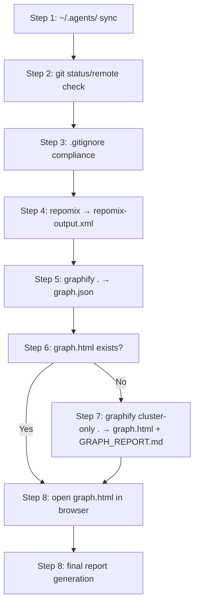
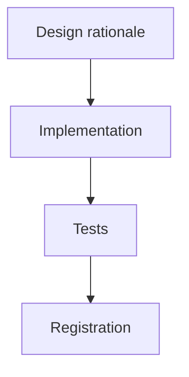
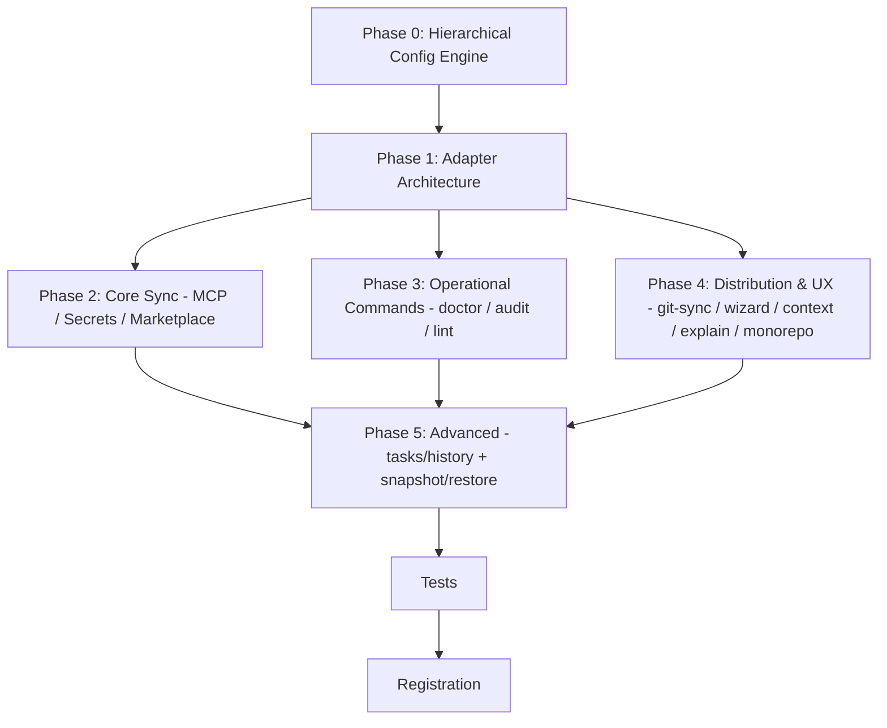

# GOALS.md — base_project

Six plans live in this file, kept separate rather than merged into one narrative, because
they're different kinds of work with different consumers:

1. [**Design-Review Skill**](#goals-1-design-review-skill-base_project-feature) — the
   original plan, status `done` (below, unchanged from when it was written).
2. [**Public Release Readiness**](#goals-2-public-release-readiness) — status `done`, get
   base_project itself from "works great for me" to "safe for a stranger to install,"
   researched the same way as plan 1 (real, current sources, not assumption).
3. [**Repertoire Research Command**](#goals-3-repertoire-research-command-base_project-feature)
   — status `done`, a command that researches a target project's *domain* (scientific,
   cultural, regulatory, media) before `/newgoal` plans it, not just the tech stack
   `/newgoal` already researches.
4. [**Design-Review Calibration Upgrade**](#goals-4-design-review-calibration-upgrade-base_project-feature)
   — status `done`, grounds `/designreview`'s judgment in named real-world design exemplars
   instead of judging from unanchored training-data memory, plus two new catalog entries for
   the generation side (closing the "found it, now fix it well" loop).
5. [**Contribution Diary System**](#goals-5-contribution-diary-system-base_project-feature)
   — status `done`, a per-project contribution diary, kept in one central directory
   outside every repository so it can never reach GitHub, synthesized from the tool-call
   ledger this project's `usage-log.js` hook already records.
6. [**Multi-Agent Expansion & Platform Unification**](#goals-6-multi-agent-expansion--platform-unification-base_project-build)
   — new, added 2026-08-23: transform base_project from a 2-agent (Claude Code + opencode)
   installer into a unified configuration layer for 31+ AI coding agents, with hierarchical
   config, MCP sync, health diagnostics, task tracking, and cross-machine sync — researched
   against agentsync (31 agents, 9 deep adapters), dot-agents (symlink/hardlink strategy),
   and the broader competitive landscape.

## GOALS 7 — Bootstrap & Token-Efficient AI Context Mapping (base_project/build)
   — new, added 2026-08-30: bootstrap process that synchronizes project state, generates
   token-efficient context mappings via repomix and graphify, and produces a comprehensive
   AI-ready briefing for `/execgoals` and subsequent sessions. Documents: git sync result,
   generated artifacts status, graph community structure, and knowledge-gap identification.

### Scope (what this plan covers)

- **Git sync**: fast-forward pull from origin/main, detection of dirty tree/ahead-of-remote/diverged states
- **Artifact generation**: repomix-output.xml (file packing, token summary), graphify-out/ (graph.json, graph.html, GRAPH_REPORT.md)
- **Graph analysis**: community detection, god nodes, knowledge gaps, cross-community bridges
- **Artifact hygiene**: .gitignore compliance (graphify-out/ and repomix-output.xml never committed)

### Git-Sync Checklist (enter each as `GOALS 7 a`, `GOALS 7 b`, etc., or as checklist items below)

- [ ] Step 1: Sync `~/.agents/` canonical rules/MCP/skills via `node dev/scripts/sync.js pull` (fast-forward only; skip if dirty)
- [ ] Step 2: Project-internal git sync — `git status --porcelain` check, then `git fetch` + compare local vs upstream
  - Up to date: continue silently
  - Behind, fast-forward: `git pull` automatically
  - Ahead/diverged: note in report, do not touch
- [ ] Step 3: Ensure `.gitignore` contains `graphify-out/` and `repomix-output.xml` (create if project has no `.gitignore`)
- [ ] Step 4: Run `repomix` → verify `repomix-output.xml` generated with token summary
- [ ] Step 5: Run `graphify .` → verify `graphify-out/graph.json` and `graphify-out/graph.html` generated
- [ ] Step 6: If `graphify-out/graph.html` exists, open in default browser (Platform-specific: Windows `Start-Process`, macOS `open`, Linux `xdg-open`)
- [ ] Step 7: If `graphify-out/graph.html` does not exist but `graphify-out/graph.json` does, run `graphify cluster-only .` → generate `GRAPH_REPORT.md` and `graph.html`
- [ ] Step 8: Report: git sync result (pulled N commits / already up to date / skipped — dirty tree / ahead of remote / diverged), artifact status, graph node/edge/community counts

### Done-when convention

The bootstrap script has been run successfully and all artifacts are present at `repomix-output.xml` and `graphify-out/` with valid `graph.html` openable in the default browser. The GRAPH_REPORT.md exists and contains community analysis. Knowledge gaps (isolated nodes) are documented but do not block completion.

### Ordering rule

Bootstrap must run before `/execgoals` can produce meaningful plans — it provides the token-efficient context that eliminates re-research. Items are ordered: git-sync steps → artifact generation → graph analysis → report.

### Mermaid dependency flowchart for GOALS 7 areas

### Sources consulted (session 2026-08-30)

- base_project `dev/scripts/sync.js` — canonical rules/MCP/skills sync
- `git status --porcelain` and `git log --oneline` — git state detection
- `npx repomix` — file packing and token analysis (143 files, 220.822 tokens)
- `graphify .` — semantic graph extraction (708 nodes, 815 edges, 85 communities)
- `graphify cluster-only .` — HTML generation from existing graph
- Platform-specific browser launch commands (Windows/macOS/Linux)
`dev/ROADMAP.md` remains the living decision log for *everything that happened* in this
project — this file stays what it always was, the format `/execgoals` can execute against:
concrete, checkable items, not prose.

---

## GOALS 1 — Design-Review Skill (base_project feature)

Research-backed build plan for a new base_project command that critiques design quality.
This is a *feature-level* plan, not a whole-project plan; this section is scoped to the
one deliverable described below, written in the format `/execgoals` executes against
without re-researching anything.

## Scope, as decided

Decided via explicit user choice (2026-08-16), not assumed:

- **What it checks**: both entry points — (1) critique an external design the user points to
  (image, mockup, live URL), and (2) act as an optional self-review step Claude can run on a UI
  it just generated, before presenting it. One engine, two invocations.
- **Where it lives**: inside base_project itself, distributed to everyone who installs it — not
  a personal-only skill. This means it needs the same review/registration discipline as every
  other base_project command (marker, both engines, menu/status/ROADMAP entries), not a
  one-off script.
- **Suggested command name**: `/designreview` (mirrors the existing `/code-review` naming
  convention already familiar from this harness). Open to a different name — not yet locked in
  anywhere.

## Methodology — grounded in current research, not invented from scratch

- [x] Baseline rubric skeleton: Nielsen Norman Group's usability heuristics — the durable,
      widely-taught standard, no need to re-derive one from zero.
- [x] Rating dimensions per UICrit (Berkeley, UIST 2024) and CHI 2026 follow-ups: aesthetics,
      efficiency, learnability, usability, and overall design quality, plus whether the design
      matches its stated intent (screenshot-to-description alignment).
- [x] Two-pass structure per Criticmate (CHI 2026): a global pass first (layout, hierarchy,
      first impression), then a local pass (spacing, contrast, copy, component-level detail).
      Stagewise global-then-local was found to align closer with expert feedback than a single
      undifferentiated pass — worth adopting rather than reinventing a review order.
- [x] Actionability requirement per UXBench (2026): a finding that doesn't name a concrete next
      step doesn't count as done. This already matches how this project's own review tooling
      works (`ReportFindings`'s `failure_scenario` field) — reuse that shape, don't invent a
      second one.
- [x] Deterministic pre-check layer before any LLM judgment call: WCAG contrast ratio and
      minimum tap-target size, objective and computable, no judgment needed — implemented as
      `dev/scripts/contrast-check.js`. **Deviation from the original plan**: spacing-scale
      adherence was dropped from this layer during implementation — there is no single
      universal "correct" spacing scale to check without knowing a project's own design
      tokens, so it moved into the local LLM pass instead (judged, not computed).

## Intake paths

- [x] **External image/mockup** — native multimodal vision via the `Read` tool. No new tooling.
- [x] **External live URL** — **deviation from the original plan**: written generically
      ("whatever browser/preview automation tooling is available in this session") instead of
      hardcoding `mcp__Claude_Browser__*`. That tool name is Claude Code-specific and the
      command also ships to opencode, where it wouldn't resolve — matches how `bootstrap.md`
      already handles opening a file in the default browser without naming a specific tool.
- [x] **Claude's own just-generated Artifact/UI** — same generic tooling instruction as above;
      critiques the *rendered* output, not just the source. Source-only review misses overflow,
      broken responsive behavior, and rendered-contrast issues that only show up once painted.

## Command design (packaging, once actually built)

- [x] New files: `source/claude/commands/designreview.md` + `source/opencode/command/`
      mirror — same pattern as every command shipped this session.
- [x] Output contract: reuse the `ReportFindings` shape (severity-ranked, one-sentence summary
      + concrete failure/improvement scenario per finding) instead of inventing a new report
      format.
- [x] Two invocation modes matching the two chosen entry points: `/designreview <url-or-file>`
      for external critique; a documented *optional* self-invoke instruction for Claude to run
      after producing a UI artifact — **not** a hard hook gate. Hooks in this repo
      (`post-edit-format.js`, `usage-log.js`) are deterministic scripts, not LLM calls; forcing
      an LLM critique pass onto every artifact via hook would add real latency/cost to every
      single generation and breaks that existing convention. Self-invocation stays a judgment
      call, same as when `/council` gets suggested elsewhere in this project.
- [x] Registration: `command-menu.md` (both engines + installed copies on this machine),
      `status.md` Commands list, `dev/ROADMAP.md` item 28.

## Testing

- [x] The deterministic pre-check layer (contrast ratio math, tap-target size) is real logic →
      got a real `dev/tests/contrast-check.test.js` file (12 tests), same convention as
      `usage-log.test.js`.
- [x] The LLM judgment layer itself is not unit-testable — same situation as `/council` and
      `/newgoal` today. Validated by `npm test` / `npx tsc` / `npx biome check .` /
      `npm run validate:plugins` staying green, not by asserting on subjective output.

## Explicitly out of scope for this pass

- [x] Hook-enforced automatic gating on every artifact — cost/latency; left as an optional
      self-invoked step instead (see Command design above).
- [x] Figma API integration — no confirmed need yet; image-export intake already covers the
      common case without needing OAuth/API-key setup.
- [x] A trained/fine-tuned scoring model — UICrit and UXBench are research datasets, not
      off-the-shelf APIs; out of reach for a markdown-instruction command, and unnecessary when
      an LLM judgment pass plus a solid rubric already covers the need.

## Sources consulted

- [UICrit: Enhancing Automated Design Evaluation with a UI Critique Dataset](https://dl.acm.org/doi/fullHtml/10.1145/3654777.3676381) — UIST 2024, rubric dimensions.
- [Criticmate: Stagewise Human–AI Co-Critique in Single-Screen UI Evaluation](https://dl.acm.org/doi/full/10.1145/3772318.3790929) — CHI 2026, global-then-local pass ordering.
- [UXBench: Measuring the Actionability of LLM-Generated UX Critiques](https://arxiv.org/pdf/2606.16262) — 2026, actionability as a required quality bar.

---

## GOALS 2 — Public Release Readiness

Plan to take base_project from "works well for its own maintainer" to "safe and legible
for a stranger to install," triggered by an explicit ask: *"vamos criar um /newgoal para
entender e melhorar esse projeto ao ponto de eu publicar ele."* Researched the same way as
GOALS 1 — real sources, checked against this repo's actual current state (not the stale
`audit-report.md`/`fix-report.md`/`organization-audit.md` already at root, which were
generated on a different machine and are one of this plan's own findings — see Area B).

### Scope, as decided

This is **not** a build-from-zero plan — base_project already exists, works, and has 46
passing tests, clean typecheck, 0 `npm audit` vulnerabilities, and a CI pipeline. The areas
`/newgoal`'s template normally covers for an application — backend framework, frontend
framework, database, auth, deployment/infra — **do not apply** and are skipped outright:
base_project is a CLI installer with no service, no database, and no runtime to deploy. What
applies instead is the actual gap between "correct" and "safe for strangers to run," found by
directly verifying this repo's state (not assuming from the stale reports at its root):

| Area | Applies? | Why |
|---|---|---|
| Backend / Frontend / Database / Auth / Deployment | No | Not that kind of project — installer only, nothing served, nothing stored. |
| Connectivity | No | The only "connectivity" is git remotes and MCP registration, both already covered by `/ship`/`/bootstrap`/the installer itself. |
| Legal / Licensing | **Yes** | README claims MIT and links to a `LICENSE` file that does not exist — verified via direct file search, not assumed. |
| Testing | Partially | Unit-test coverage is already strong (46/46); the real gap is CI *artifact coverage*, not test logic — see Area C. |
| Security | **Yes** | No `SECURITY.md`; the project registers hooks and MCP servers on the installer's own machine, which is exactly the kind of surface a disclosure policy exists for. |
| Repository hygiene / structure | **Yes** | Session-report files from a different machine are committed at root — see Area B. |
| Community readiness | **Yes** | README already promises Issues/Discussions but nothing scaffolds them. |

### Area A — Legal & Licensing (blocking; do this first)

- [x] Create `LICENSE` at repo root — MIT, "Copyright (c) 2026 Allu" (confirmed by the user,
      2026-08-17).
- [x] Add `"license": "MIT"` to `package.json` (was absent entirely).
- [x] Confirmed the README's `[LICENSE](LICENSE)` link resolves — `LICENSE` now exists at repo
      root, same directory as `README.md`.

### Area B — Repository Hygiene

- [x] Decided (user, 2026-08-17): removed `audit-report.md`, `fix-report.md`,
      `organization-audit.md` from the tracked tree (`git rm`) — confirmed they were one-off
      output from a different machine's session, findings already folded into this plan and
      `dev/ROADMAP.md`.
- [x] `assets/` documented in `ARCHITECTURE.md`'s directory map — Windows Explorer folder icon,
      purely cosmetic, applied by `install.ps1`, not distributed to anyone.
- [x] Root re-checked directly (`ls` + `git status`) after the above — clean: only expected
      files remain, no other dead/misplaced content found.

### Area C — CI Coverage Completeness

- [x] Extended `install-test`'s artifact assertions in `.github/workflows/ci.yml` to cover all
      17 commands, on both Linux/macOS and Windows steps, both engines (Claude Code +
      opencode) — `bootstrap.md`, `audit.md`, `council.md`, `plugins.md`, `ship.md`,
      `newgoal.md`, `execgoals.md`, `designreview.md`, `reviewusage.md` were the 9 missing.
- [x] Added `contrast-check.js`/`usage-log.js` to the same assertion list.
- [x] Added `macos-latest` to the `install-test` matrix, and widened the Linux-only
      `if: runner.os == 'Linux'` steps to `if: runner.os != 'Windows'` so they actually run on
      macOS too (they wouldn't have otherwise — `runner.os` on a macOS runner is `macOS`, not
      `Linux`) — `jq` install branches on `$RUNNER_OS` (`apt-get` vs. `brew`).
- [x] **Validated for real, not just edited**: ran `dev/scripts/install.sh` against a scratch
      `CLAUDE_HOME`/`OPENCODE_HOME` in this session (not CI) and confirmed all 17 new assertion
      paths — the 11 new Claude Code ones and the 6 spot-checked opencode ones — actually exist
      after a real install, then re-ran the installer a second time to confirm idempotency
      (no error). Full CI run (which also covers the actual macOS runner) still pending on next
      push — see Area E.
- [x] **Real, pre-existing bug found and fixed, unrelated to this plan's own additions**: the
      first real CI run after pushing Areas A-D revealed `install-test (ubuntu-latest)` has been
      failing since at least the 2026-08-16 commit — `install.sh`'s settings.json section
      computes `BASE_SETTINGS` correctly for a missing/fresh file, but never writes it to disk
      before the next block's blind `cat "$SETTINGS_PATH"` — so a genuinely fresh install (no
      pre-existing `settings.json`, e.g. a brand-new user's first run, or CI's throwaway HOME)
      crashes with `cat: ... No such file or directory`. `install.ps1` doesn't have this bug —
      it builds one in-memory object and writes once at the end; `install.sh` round-trips
      through disk on every block instead. Fix: write `$BASE_SETTINGS` to disk immediately after
      computing it, before the first re-read. **Caught because `jq` isn't installed in this
      session's shell, which silently skipped the buggy code path on the first "validated
      locally" pass above** — re-verified after downloading a real `jq` binary specifically to
      exercise this path: fresh install now creates a valid `settings.json` with all 3 hook
      events, and a second run stays idempotent. This is exactly the kind of finding a
      first-time user would have hit; more consequential than any single item this plan
      originally listed.

### Area D — Community & Security Documentation

- [x] Added `SECURITY.md`: scope named concretely (install scripts + hooks that write to
      global config, `scan-skill.js` bypass, this repo's own dependencies), reporting via
      GitHub private vulnerability reporting (no public issue), 72h acknowledgment commitment.
- [x] Added `CONTRIBUTING.md`: links to README's existing scratch-`$HOME` testing instructions
      and the `plugins.json` catalog-entry guide instead of duplicating them, states the
      `architect`→`coder`→`reviewer` expectation for non-trivial PRs, Conventional Commits.
- [x] Added `CODE_OF_CONDUCT.md` (Contributor Covenant v2.1, standard text, enforcement contact
      routed through the same GitHub private-reporting channel as `SECURITY.md`).
- [x] Added `.github/ISSUE_TEMPLATE/bug_report.md` and `feature_request.md` — bug template
      explicitly redirects security-shaped reports to `SECURITY.md`; feature template points
      at `dev/ROADMAP.md`'s "Descartado" section so requests already decided against aren't
      re-litigated blind.
- [x] Removed the README's "Screenshots" section (three placeholder lines, no real images) —
      also added `SECURITY.md`/`CONTRIBUTING.md` links to the README's Support section while
      touching that area.

### Area E — Cross-Platform Verification

- [x] Ran for real on `macos-latest` via CI (run
      [32071701135](https://github.com/alexmiguel011014-stack/base_project/actions/runs/32071701135),
      2026-08-17) — `install-test (macos-latest)` passed in 30s, same run also confirmed
      `ubuntu-latest`/`windows-latest` green after the settings.json fix above. Also bumped
      `node-version: 20 → 22` in `ci.yml` (both jobs) — cleared a deprecation warning that was
      showing on every run (Node 20 setup being force-upgraded to 24 by the runner).

### Area F — GitHub Repository Presentation

- [x] Set the repo description and topics on GitHub via `gh repo edit` (confirmed by the user
      before running, 2026-08-17) — description + topics `claude-code`, `opencode`, `cli`,
      `developer-tools`, `mcp`. Verified after with `gh repo view --json description,
      repositoryTopics`, not assumed from the command's exit code.
- [x] Tagged `v1.1.0` and pushed (confirmed by the user first, 2026-08-17) — verified live on
      `origin` via `git ls-remote --tags`, not assumed from the push command's exit code.

### Area G — Final Verification Pass

- [x] Re-verified every finding from the deleted `audit-report.md` directly against current
      state (not from memory of the report): `.env.example` exists (was missing); CI exists and
      is now more thorough (the original "no CI found" finding was itself wrong — `ci.yml`
      exists and always did, likely a checkout artifact on the other machine); `npm audit
      --depth=0` → 0 vulnerabilities; `node dev/scripts/scan-skill.js .` → 13 findings, all
      either inside `repomix-output.xml` (gitignored, never committed — confirmed via
      `.gitignore:25`) or a documentation line in `scanproject.md:24` describing the scanner's
      own detection rule, not executable code. **0 real findings in shipped source.**
- [x] Re-ran the full local bar: `npm test` (46/46), `npx tsc --noEmit` (clean), `npx biome
      check .` (1 warning + 12 infos, all pre-existing in `source/hooks/*.js`/
      `dev/scripts/scan-skill.js`, unrelated to this plan's changes), `npm run validate:plugins`
      (catalog valid).

### Explicitly out of scope for this pass

- [x] A formal release/changelog automation pipeline (e.g. `semantic-release`) — this project's
      existing versioning decision (ROADMAP item 16) is deliberately manual (`git tag`, no
      publish flow), and nothing in this plan's trigger asked to revisit that.
- [x] A dedicated documentation site — `README.md`/`ARCHITECTURE.md` already serve that role at
      this project's current scale; revisit only if that stops being enough.
- [x] Rewriting or relicensing away from MIT — out of scope unless the user says otherwise;
      this plan only fills the gap between the license already advertised and one that exists.

### Sources consulted

- [OpenSSF Vulnerability Disclosures Working Group](https://github.com/ossf/wg-vulnerability-disclosures) — disclosure process standards.
- [google/oss-vulnerability-guide](https://github.com/google/oss-vulnerability-guide) — `SECURITY.md` template guidance, response-time norms.
- [GitHub: 6 security settings every maintainer should enable](https://github.blog/security/6-security-settings-every-github-maintainer-should-enable-this-week/) — repo-level security posture, current as of 2026.
- [opensource.guide — security best practices](https://github.com/github/opensource.guide/blob/main/_articles/pl/security-best-practices-for-your-project.md) — general OSS security documentation norms.
- MIT vs. Apache 2.0 comparison sources (license-choice research, 2026) — patent-grant tradeoff, confirming MIT fits a CLI tool's risk profile.
- Open-source pre-launch checklist sources (2026) — CONTRIBUTING/CODE_OF_CONDUCT/issue-template baseline.

---

## GOALS 3 — Repertoire Research Command (base_project feature)

Goal type: **Feature** (`references/goal-types/feature.md`) — a bounded new command added to
the existing base_project command set, not a rewrite. Triggered by an explicit request:
*"um comando para instruir o chat a fazer uma pesquisa profunda em relação ao tema do
projeto para ele ter mais repertório... com base científica, cultural e midiática"* — refining
the "feeding" idea already logged as `dev/ROADMAP.md` item 31 (form already decided there,
2026-08-17: standalone external command, merges with `/newgoal` only via combined invocation,
mirroring `/council`'s existing pattern — this plan does not re-open that decision).

### Scope, as decided

- **What it's for**: `/newgoal`'s own research step (its step 4) researches *how to build* —
  tech stack, libraries, architecture patterns. It has no mechanism for researching *what the
  project is about* — the subject-matter grounding a domain expert would already have. This
  command fills that gap as a distinct research pass, not a bigger `/newgoal` step 4.
- **What it deliberately doesn't do**: it doesn't replace or duplicate `/newgoal`'s tech
  research; it doesn't force every one of its research lenses onto every project (see
  Methodology below — same mistake this repo's own history already made once by forcing
  `build.md`'s stack-area breakdown onto a Process-type plan, see GOALS 2's trigger); and it
  never runs automatically — always opt-in, same restraint `/council` and `/designreview`'s
  self-invocation already apply elsewhere in this project.
- **Suggested command name**: `/repertoire` — matches the user's own word for what this
  produces. Open to a different name — not yet locked in anywhere, same as `/designreview`
  was left open in GOALS 1 until it was actually built.

### Methodology — grounded in current research on how research agents actually plan

- [x] **Decomposition into a small set of lenses, not a fixed per-industry source list.**
      Real evidence-synthesis practice (systematic-review frameworks) segments coverage by
      information type rather than by industry vertical — a taxonomy that's stable across
      domains, unlike a hardcoded "if health app then PubMed" table that needs constant
      expansion and breaks on anything novel. Five reference lenses, not all mandatory per
      project: **Scientific/evidence base**, **Regulatory/legal**, **Cultural/social context**,
      **Media/public discourse**, **Competitive/market landscape**. The command judges which
      lenses actually apply to the specific project — an internal CRUD tool may need zero of
      them; a health app needs most.
- [x] **Surface the lens plan before spending the research budget** — current deep-research
      agent architectures split into three planning strategies: plan-then-search silently
      (fastest, most likely to chase the wrong decomposition), ask clarifying questions first,
      or generate the plan and show it to the user before executing (Gemini Deep Research's
      approach). This command follows the third: list which lenses apply and why, get
      confirmation, same cost-gate spirit `/council` already uses ("this costs real research
      time — want me to run it?"), before running any actual search.
- [x] **Evaluate source credibility per lens, don't just collect links** — real deep-research
      systems retrieve across multiple passes and weigh source credibility/consistency before
      synthesizing, rather than citing the first result found. Apply per lens: scientific
      claims prefer peer-reviewed/primary sources over blog summaries; media claims deliberately
      pull from more than one outlet to surface bias rather than one narrative (the same
      concern the Media Bias Taxonomy research documents); regulatory claims cite the primary
      text (the law/standard itself), not a secondary description of it.
- [x] **Synthesize into a briefing with traceable sources, reusing this project's own existing
      convention** — every `GOALS.md` section already ends with a "Sources consulted" list
      (see GOALS 1/2 above); this command's output follows the same shape per lens instead of
      inventing a new report format.

### Implementation

- [x] New files: `source/claude/commands/repertoire.md` + `source/opencode/command/` mirror —
      same pattern as every command shipped this project.
- [x] Output: a new `REPERTOIRE.md` at the target project's root — git-tracked like
      `GOALS.md`/`README.md`, not gitignored (it's a reference briefing the user keeps, not a
      regenerable artifact). Mirrors `research.md`'s "standalone deliverable" convention rather
      than a `GOALS.md` checklist section, since this output is reference material `/newgoal`
      reads, not a list of checkable build items itself.
- [x] Never overwrite silently — same rule `newgoal.md` step 6 already applies to `GOALS.md`:
      if `REPERTOIRE.md` already exists, read it first and merge, don't discard.
- [x] Hook point in `newgoal.md` (both engines): a new step, alongside the existing step 4a
      that handles `/council`, for the combined-invocation case (`/newgoal /repertoire` in the
      same message) — if `REPERTOIRE.md` exists or was just produced by the combined call,
      `/newgoal`'s own step 4 research reads it first as grounding before researching tech/build
      specifics. Standalone `/repertoire` (no `/newgoal` in the same message) just produces
      `REPERTOIRE.md` on its own, same standalone usability `/council` already has.
- [x] Confirmation gate text in `repertoire.md` itself, modeled on `council.md`'s step 0 — ask
      before running every time, note when the project looks low-stakes/generic and suggest
      skipping.

### Tests

- [x] Same situation as `/council`/`/newgoal`/`/designreview`'s LLM-judgment layer today — not
      unit-testable, no new `dev/tests/*.test.js` file expected. Validated by `npm test` /
      `npx tsc` / `npx biome check .` / `npm run validate:plugins` staying green, not by
      asserting on subjective research output.

### Registration

- [x] `source/claude/references/command-menu.md` + opencode mirror (same file, byte-identical
      today — confirm still true before editing just one).
- [x] `README.md` command table + command count (currently 19 → 20).
- [x] `ARCHITECTURE.md` §1 count, §4 table + header count, §5.2 category table.
- [x] `source/claude/commands/status.md` + opencode mirror — example command list (again;
      third time this count has changed this project — worth noting if this keeps recurring
      the illustrative-example approach itself may be worth revisiting, not just re-editing).
- [x] `.github/workflows/ci.yml` install-test assertions, both OS matrices, both engines.
- [x] `dev/ROADMAP.md` item 31 — update status from "não implementado" to `feito` once actually
      built, with the same `Validado:` honesty this project's other entries already use (name
      what was actually tested vs. what's still just a specification).

### Explicitly out of scope for this pass

- [x] Hardcoding a fixed per-industry source list (e.g. "health app → these 5 exact journals")
      — the whole point of the lens approach above is judgment per project, not a lookup table
      that goes stale and needs maintenance.
- [x] Making this a mandatory step inside `/newgoal` for every goal type — explicitly decided
      against in `dev/ROADMAP.md` item 31's "Decisão de forma"; stays opt-in only.
- [x] A UI/dashboard for browsing past `REPERTOIRE.md` briefings across projects — no
      confirmed need yet, and this repo removed its one prior dashboard already (ROADMAP item
      13) for being more surface than value.

### Sources consulted

- [Deep Research Agents: A Systematic Examination and Roadmap](https://www.alphaxiv.org/abs/2506.18096) — the three planning-strategy taxonomy (plan-then-search / clarify-first / plan-and-confirm) and the decompose→retrieve→evaluate→synthesize core loop.
- [Zylos Research — Deep Research Agent Architectures](https://zylos.ai/research/2026-04-21-deep-research-agent-architectures) — multi-pass retrieval and source-credibility evaluation before synthesis.
- [Conceptual and practical classification of research reviews and other evidence synthesis products (PMC)](https://pmc.ncbi.nlm.nih.gov/articles/PMC8428026/) — evidence-taxonomy-by-information-type precedent for the fixed-lens/variable-source design.
- [The Media Bias Taxonomy: A Systematic Literature Review (arXiv)](https://arxiv.org/html/2312.16148v3) — grounds the "pull more than one outlet" rule for the media/public-discourse lens.

---

## GOALS 4 — Design-Review Calibration Upgrade (base_project feature)

Goal type: **Feature** (`references/goal-types/feature.md`) — a bounded upgrade to
`/designreview`, which already exists and works (GOALS 1). Triggered by an explicit request:
*"temos que conseguir entender os melhores repositórios para colocar e ter uma opinião boa
para poder mudar o design de um app ou site"* — `/designreview` today judges from the model's
own unanchored training-data sense of "good design," with no concrete reference points to
compare against, and has no companion tool for actually *changing* a design once critiqued.

### Scope, as decided

- **What this upgrades**: `/designreview`'s judgment quality (grounds it in named exemplars
  instead of vague impression) and closes a real gap — the command critiques but has no
  companion for fixing. It does not change the rubric/pre-check layer GOALS 1 already built
  (NNG heuristics, UICrit dimensions, Criticmate's global-then-local pass, the WCAG/tap-target
  pre-check) — those stay as-is; this adds a calibration layer on top.
- **What it deliberately doesn't do**: it doesn't embed an actual image corpus (no built-in
  reference-image dataset to ship — infeasible for a markdown-instruction command); it doesn't
  make browser-based gallery lookup mandatory (optional, only when live browser tooling is
  already available in the session, same conditional `/designreview` step 1 already uses for
  live-URL critique); it doesn't turn `/designreview` into a design-generation tool itself —
  fixing stays a separate step (`/fixproject`, or the two new catalog entries below), matching
  the read-only-critique/separate-fix boundary this project already draws everywhere else
  (`/scanproject` vs `/fixproject`, `/audit` vs its own fix step).

### Methodology — grounded in current research, not invented from scratch

- [x] **Few-shot/named exemplars measurably raise LLM design-judgment quality** — the same
      UICrit dataset already grounding GOALS 1's rubric dimensions also found that few-shot and
      visual prompts raise LLM feedback quality; general LLM-as-judge research confirms 2-4
      annotated reference examples anchor a judge's scale and clarify edge cases where criteria
      conflict. `/designreview` today has zero exemplar-anchoring — this closes that gap using
      the same evidence base already cited in this file, not a new methodology.
- [x] **Which real-world exemplars to name, and why these specifically**: reference production
      design systems the model already has strong, reliable training-data familiarity with —
      Stripe, Linear, Vercel, Notion (chosen because they're independently the four brands
      StyleSeed, a 100+-star MIT-licensed open-source design-judgment engine for Claude
      Code/Cursor, already curated reference "skins" for — reusing an existing independent
      curation is stronger evidence than inventing a list from scratch). Naming concrete
      products beats abstract criteria alone: "compare this dense settings panel's information
      density to how Linear handles the same problem" is a sharper prompt than "assess
      hierarchy."
- [x] **Live gallery lookup as an optional deepening, not a requirement**: when browser tooling
      is already available in the session (same condition `/designreview` step 1 already
      checks), it may open a reference gallery for a real side-by-side rather than judging from
      memory alone — Mobbin (real shipped product UI/UX patterns), Awwwards or Godly (visual
      craft, award-curated), Land-book (landing-page-specific). Pick the gallery matching what's
      being reviewed (a dashboard → Mobbin's real-product patterns; a landing page → Godly or
      Land-book) rather than always defaulting to one.
- [x] **Closing the critique-to-fix loop**: `/designreview` only ever critiqued; it never
      offered a next step for someone who wants the design actually changed well. Two catalog
      candidates found this session close that loop without `/designreview` itself becoming a
      generator: **StyleSeed** (`bitjaru/styleseed`) — open-source, MIT, 100+ stars, 69-74
      design rules plus reference-compiled brand skins (Toss/Stripe/Linear/Vercel/Notion) built
      specifically for Claude Code/Cursor; and **ux-ui-agent-skills** (`plugin87`) — DTCG design
      tokens, WCAG 2.2 accessibility, a much larger reference corpus (138 design systems).
      Neither is installed automatically — both become new `/plugins` catalog entries the user
      opts into, same as every other catalog entry.

### Implementation

- [x] Add a **calibration step** to `source/claude/commands/designreview.md` + opencode mirror,
      positioned between the existing step 2 (deterministic WCAG/tap-target pre-check) and step
      3 (global pass) — before judgment starts, not after: name which 1-2 real-world exemplars
      are most relevant to what's being reviewed (a dashboard vs. a landing page vs. a mobile
      app call for different comparables) and hold the critique against them explicitly in the
      global and local passes that follow.
- [x] Extend the same step with the **optional live-gallery-lookup** conditional, reusing
      `/designreview`'s existing step 1 language for "whatever browser/preview automation
      tooling is available in this session" rather than inventing new tool-availability
      phrasing.
- [x] Add **StyleSeed** and **ux-ui-agent-skills** to `source/plugins.json`'s `catalog` array —
      `kind: "skill"`, `recommend_if` targeting "the project has a UI and `/designreview` (or
      the user) found problems worth fixing, not just critiquing." **Verify the actual install
      command against each repo's own README before writing the catalog entry** — this session's
      research found what these tools are and why they're relevant, not their exact install
      invocation; never invent one, same rule `/plugins` step 5b already applies to
      live-discovery results.
- [x] Validate both new entries against `dev/schemas/plugins.schema.json` via
      `npm run validate:plugins` before considering the catalog addition done.

### Tests

- [x] Same situation as `/designreview`'s own LLM-judgment layer already noted in GOALS 1 — not
      unit-testable, no new `dev/tests/*.test.js` expected for the calibration step itself.
      Validated by `npm test` / `npx tsc` / `npx biome check .` / `npm run validate:plugins`
      staying green, plus the plugins-schema validation above for the two new catalog entries
      specifically.

### Registration

- [x] `README.md` — `/designreview` row (mention calibration briefly) and the "Currently
      cataloged" plugin list (add StyleSeed + ux-ui-agent-skills).
- [x] `ARCHITECTURE.md` §5.2 Design/UI table — add the two new catalog entries alongside the
      existing four.
- [x] `dev/ROADMAP.md` — new item logging this upgrade with sources consulted, following the
      same format every prior item uses.

### Explicitly out of scope for this pass

- [x] Shipping an actual bundled reference-image dataset — no feasible mechanism for a
      markdown-instruction command; named exemplars + optional live gallery lookup cover the
      same need without it.
- [x] Installing StyleSeed/ux-ui-agent-skills automatically, or making either a hard dependency
      of `/designreview` — both stay opt-in catalog entries, same as every other plugin.
- [x] Making live gallery lookup mandatory even without browser tooling available — degrades
      gracefully to named-exemplar-only judgment, same fallback pattern `/designreview` step 1
      already uses for live-URL critique without browser tooling.

### Sources consulted

- [UX Links — 50 design inspiration sites (Awwwards, Mobbin, Land-book, SiteInspire, etc.)](https://x.com/uxlinks/status/2058454587061719067) — the reference-gallery landscape and which gallery fits which review type (real-product patterns vs. visual craft vs. landing-page-specific).
- [StyleSeed (bitjaru/styleseed)](https://github.com/bitjaru/styleseed) — open-source, MIT, 100+ stars, reference-compiled brand skins for Stripe/Linear/Vercel/Notion/Toss; the specific-brands choice for this plan's exemplar list is drawn from this independent curation.
- [ux-ui-agent-skills (plugin87)](https://github.com/plugin87/ux-ui-agent-skills) — 138-design-system reference corpus, DTCG tokens, WCAG 2.2.
- [How Good is ChatGPT in Giving Advice on Your Visualization Design? (arXiv)](https://arxiv.org/pdf/2310.09617) and general LLM-as-judge calibration research — few-shot/named exemplars anchor a judge's scale; UICrit (already cited in GOALS 1) independently found the same for visual design critique specifically.

---

## GOALS 5 — Contribution Diary System (base_project feature)

Goal type: **Feature** (`references/goal-types/feature.md`) — a bounded new capability added
to base_project, which already works. Triggered by an explicit request: keep a contribution
diary per project (modeled on a university extension-project template the user has to fill in),
centralized in one directory, auto-accumulating as work happens — *"tem um adendo, coloque de
um jeito que isso não apareça quando subir para o github, não pode aparecer isso lá de jeito
nenhum."*

### Scope, as decided

- **What it produces**: one Markdown diary per project, in the format of the template the user
  supplied — a header (project, repository, start date), then dated entries (`Dia N -
  DD/MM/YYYY`, a short bold title, a narrative paragraph in first person covering what was done
  and why, ending in `(duração: Xh Ymin)`), then a summary table (Data | Título | Horas) ending
  in a TOTAL row. University-specific sections (orientador, assinaturas) are added only when
  exporting one diary for that purpose, not carried in every file.
- **What it deliberately doesn't do**: it does not write anything inside a project repository
  (the entire point of the constraint below); it does not add a new capture mechanism when one
  already exists; it does not auto-write narrative entries via hook (see the hook/command
  decision below); and it does not copy raw prompt text into diaries — entries are synthesized,
  which is both better writing and safer, since prompts can contain content the user would not
  want transcribed verbatim into a document.

### Design rationale

- [x] **Placement is the whole answer to the GitHub constraint, and it's architectural, not a
      `.gitignore` promise.** Verified directly, not assumed: `D:\ProjetosPessoais` is **not** a
      git repository (`git rev-parse --is-inside-work-tree` → fatal: not a git repository), while
      all six projects under it (`Personal APP`, `TunelSSH`, `MGGP_Vmatlab`, `base_project`,
      `ERP_HK`, `ponto_csh`) **are** repositories with live GitHub remotes. A diary inside any
      project could be committed by accident; a diary in `Diarios_contribuicao/` — a sibling
      directory of every repo, inside none of them — is outside every work tree, so git cannot
      see it even in principle. Done when: this reasoning is written down before any file is
      created.
- [x] **Belt-and-suspenders on top of that, because "can't happen" deserves a second lock**:
      a `.gitignore` containing `*` inside the diary directory (covers the case where the user
      or a tool ever runs `git init` there later), plus a hard guard in the command itself —
      before writing any diary file, resolve its absolute path and refuse if
      `git rev-parse --is-inside-work-tree` succeeds for that location. Three independent
      layers, none depending on the others holding.
- [x] **Reuse the ledger that already exists; do not build a second capture mechanism.** The
      `usage-log.js` hook has been recording every tool call and user prompt to
      `~/.claude/base_project/usage/*.jsonl` since 2026-08-17 — verified live: 2826 events
      across `Personal APP` (1133), `base_project` (424), `ERP_HK` (373 across its subpaths),
      `TunelSSH` (290), `MGGP_Vmatlab` (169), each tagged with `cwd`, `ts`, `tool`, and the
      originating prompt. That is already the raw material for a diary; what is missing is a
      synthesis layer, not a recorder. This is also what makes "toda vez que for fazendo
      modificação ir acrescentando" true in the honest sense: capture is continuous and
      automatic, and a diary can be synthesized for any past date range even if the command
      wasn't run that day.
- [x] **Two sources for backfill, because the ledger only starts 2026-08-17 and the work
      doesn't.** Real git history per project, verified: `TunelSSH` 62 commits (2026-07-29 →
      08-19), `ERP_HK` 52 (07-31 → 08-19), `base_project` 33 (08-01 → 08-19), `MGGP_Vmatlab` 14
      (08-13 → 08-18), `Personal APP` 6 (07-29 → 08-19), `ponto_csh` 3 (08-02 → 08-18). Backfill
      = `git log` for everything before the ledger existed, ledger for everything after (richer:
      it knows what was attempted, not only what was committed). Projects with no repository at
      all (`IC`) are ledger-only — the design must not assume git is present.
- [x] **A project's name and its folder name are not the same thing, and the diary must use the
      name.** Found while executing this plan, not while writing it: the folder on disk is
      `ERP_HK`, but the git repository inside it points at `github.com/.../ERP.git`, and the
      project is "ERP" everywhere the user refers to it. Resolve identity from the git remote's
      repository name when a remote exists, falling back to the directory's own name only when
      it doesn't — otherwise every diary is titled by whatever the folder happened to be called
      locally, which is the one name that means nothing to anyone else.
- [x] **Split deterministic extraction from narrative synthesis**, the same split this repo
      already uses twice (`contrast-check.js` computes WCAG ratios, the LLM judges everything
      else in `/designreview`; `scan-skill.js` finds patterns, the LLM interprets them in
      `/plugins`): a script produces structured facts (sessions, dates, durations, files
      touched, commits), and the command turns those facts into readable Portuguese entries.
      The script is real logic and gets real tests; the narrative pass is a judgment call and
      doesn't.
- [x] **A command, not a hook.** `designreview.md` already settled this precedent explicitly in
      this repo: hooks here (`post-edit-format.js`, `usage-log.js`) are deterministic scripts,
      not LLM calls, and forcing an LLM pass into a hook adds real latency and cost on every
      trigger. Narrative synthesis needs an LLM, so it belongs in a command. The hook side of
      the system is the recording that already happens.
- [x] **Duration must measure something defensible.** Computed as the span from first to last
      ledger event per project per day, with any idle gap longer than 30 minutes excluded rather
      than counted — a session left open overnight otherwise reports as 14 hours of work. State
      this convention in the diary header itself so the number is never read as a precise
      timesheet; it is an honest estimate of active session time.
- [x] **Language: diary content in Portuguese, command file in English** — this repo's own rule
      (`CLAUDE.md`: text the model executes → English; text rendered literally to the user →
      the user's language). The diary is a document the user reads and may hand to a university,
      so its content is Portuguese; `diario.md`'s instructions are English like every other
      command.
- [x] **The diary root is configurable, not hardcoded to this machine.** base_project ships to
      other people, and `D:\ProjetosPessoais\Diarios_contribuicao` is one user's path. Resolve
      it from `~/.base_project/diary-root.txt` — reusing exactly the state-file convention
      `~/.base_project/repo-path.txt` already established for `/update`/`/status` — falling back
      to `~/Documentos/Diarios_contribuicao` when that file is absent. This user's file holds
      their real path.

### Implementation

- [x] `dev/scripts/diary-source.js` — deterministic extractor, Node-only with no new
      dependencies (same constraint `scan-skill.js` already respects). Reads every
      `~/.claude/base_project/usage/*.jsonl`, groups events by resolved project and by day,
      applies the idle-gap rule above, and emits JSON: per project per day, the session count,
      active duration, tools used, files touched, and the prompts that opened each chain. Takes
      `--project <path>` and `--since <date>` filters. Resolves a nested `cwd`
      (`ERP_HK\ERP\modules`) up to its owning project root rather than treating it as a separate
      project, and skips the bare parent directory (`D:\ProjetosPessoais`) since it is not a
      project.
- [x] Same script, git side: when the target project is a repository, also read `git log
      --format=...` for the range being backfilled and merge those commits into the same
      per-day structure — labeled as commits, distinct from ledger sessions, so the command can
      tell "what was committed" from "what was worked on."
- [x] Diary directory scaffolding at the resolved root: `.gitignore` containing `*`, and a short
      `README.md` explaining what the directory is, why it is deliberately outside every
      repository, and that it is never to be committed anywhere.
- [x] `source/claude/commands/diario.md` + `source/opencode/command/` mirror. Behavior: resolve
      the diary root; determine the target project (current directory by default, `$ARGUMENTS`
      to name another, `--all` to sweep every project); run `diary-source.js` for everything
      since the diary's last recorded date; synthesize new dated entries in the template format;
      append them; then rebuild the summary table and TOTAL from the full entry list rather than
      incrementing a stored number, so the table can never drift out of sync with the entries
      above it.
- [x] The refuse-if-inside-a-repo guard from the design section, implemented in the command as a
      hard stop with an explanatory message — never a silent skip, never a "write it anyway."
- [x] Never overwrite silently: if a diary already exists, read it first, find the last recorded
      date, and only append entries after it — the same rule `newgoal.md` step 6 already applies
      to `GOALS.md`. Re-running the command must be safe and idempotent for a date range already
      written.
- [x] Backfill the five projects the user named plus the ones found alongside them —
      `Personal APP`, `TunelSSH`, `MGGP_Vmatlab`, `base_project`, and `IC` (ledger-only, no
      repository) — from git history and the ledger, using the real date ranges verified above.
      `ERP_HK` and `ponto_csh` were not named by the user; ask before creating diaries for them
      rather than assuming (`manual`).
- [x] Add the standing rule to `source/CLAUDE.md` and `source/opencode-instructions.md`: after
      closing a substantial task in a project that has a diary, mention once that `/diario` can
      record it. A suggestion at a specific moment, never an automatic write — the same shape as
      the existing plugin-suggestion rule ("suggest only, never auto-install") and the
      WhatsApp-menu rule's two specific moments, not a per-turn interruption.
- [x] Future projects are covered without further work: the command creates a diary for any
      project that doesn't have one yet on first run, so a new project only needs `/diario` once.

### Tests

- [x] `dev/tests/diary-source.test.js` — real coverage for real logic, same convention as
      `usage-log.test.js`/`contrast-check.test.js`: day-boundary grouping, the 30-minute idle-gap
      exclusion (including a gap that spans midnight), nested-`cwd`-resolves-to-project-root, the
      bare-parent-directory exclusion, a project with no git repository, and a malformed JSONL
      line not taking down the whole run (the ledger's own per-line durability guarantee).
- [x] The narrative synthesis layer is not unit-testable — same situation as `/council`,
      `/newgoal` and `/designreview` already have in this repo. Validated by `npm test` /
      `npx tsc` / `npx biome check .` / `npm run validate:plugins` staying green.

### Registration

- [x] `source/claude/references/command-menu.md` + opencode mirror (byte-identical today —
      confirm before editing just one).
- [x] `README.md` command table + command count (currently 20 → 21).
- [x] `ARCHITECTURE.md` §1 count, §4 table + header count, §5.2 category table, and the
      `dev/scripts/` line in the §2 directory map for `diary-source.js`.
- [x] `source/claude/commands/status.md` + opencode mirror — example command list.
- [x] `.github/workflows/ci.yml` install-test assertions for `diario.md` (both OS matrices, both
      engines) and for `diary-source.js` landing in `~/.claude/base_project/scripts/`.
- [x] Installer: `diary-source.js` must be added to whatever list syncs `scan-skill.js` and
      `contrast-check.js` into `~/.claude/base_project/scripts/` in **both** `install.ps1` and
      `install.sh` — check both, since these two scripts have already diverged once in this
      project's history (the non-recursive reference-sync bug, ROADMAP item 30).
- [x] `dev/ROADMAP.md` — new item with the same `Validado:` honesty the other entries use.

### Explicitly out of scope for this pass

- [x] Version-controlling the diaries themselves in a private repository — it would give them
      backup and history, but it reintroduces exactly the risk the user asked to eliminate
      (a remote, a push, a wrong remote) and is their call to make, not a default to ship.
      Worth revisiting only if they ask.
- [x] Exporting a diary to the university's PDF format with orientador and assinatura blocks —
      the Markdown carries all the content needed; converting one diary for submission is a
      separate, occasional task, not part of continuous recording.
- [x] Retroactively reconstructing work from before both sources exist (before 2026-07-29, and
      for any project whose early work predates its first commit) — there is no evidence to
      synthesize from, and inventing entries would defeat the entire purpose of a diary.
      Diaries state their own coverage start date instead of pretending completeness.
- [x] Auto-pruning or archiving old ledger files — noted as a real risk (unsynthesized history
       would be lost if those `.jsonl` files are ever deleted), but this plan doesn't change
       retention; running `/diario` regularly is the mitigation.

---

## GOALS 6 — Multi-Agent Expansion & Platform Unification (base_project feature epic)

Goal type: **Feature** (`references/goal-types/feature.md`) as dominant — 18 bounded, additive
capabilities on top of an installer that already works for 2 agents — with **Build-style**
internal dependency ordering (foundation before adapters before commands). Triggered by
explicit request: *"procure por melhorias para adicionar no projeto: implementações de
funções que façam sentido para melhorar toda e qualquer estrutura do projeto. não pare de
pesquisar enquanto não achar algo relevante"* plus *"cria uma meta para poder implementar
tudo isso uma a um, da mais complexa para a menos complexo. Estruture todas as dependências
corretamente e completamente sem errar."* Researched against 5 real codebases/sites:
`spxrogers/agentsync` (31 agents, 9 deep adapters, Go, translation reports, `age` secrets),
`dot-agents/dot-agents` (unified `~/.agents/` layer, symlink+hardlink strategy, `doctor`/`audit`/`sync`/`context`/`explain`),
`dallay/agentsync` (Rust, TOML, wizard, monorepo `nested-glob`), `tctinh/opencode-sync`
(Gist sync), `alexxanderdiaz/ai-coding-stack` + `drmowinckels.io` dotfiles pattern.
Classification rationale: flowchart `Deliverable is code? Yes → Something broken? No →
Bounded addition to something that already works? Yes → Feature`. Treated as one epic with
18 checkable items rather than 18 separate `GOALS.md` files, ordered by real technical
dependency (what must exist before what) which — for this project — happens to coincide
with most-complex-first, since the foundation is the hardest part and leaf utilities are
the easiest.

### Scope, as decided

- **What this epic builds**: transforms base_project from a 2-engine installer (Claude Code +
  opencode, hardcoded in `install.ps1`/`.sh`) into a **unified config layer** that can
  project one canonical source (`~/.agents/` or `~/.base_project/` — see design decision
  below) into N agent shapes via per-agent adapters. Covers all 4 surfaces the competitors
  actually ship: MCP servers, memory/instructions (`CLAUDE.md`/`AGENTS.md`/`GEMINI.md` etc.),
  skills, and subagents/commands + hooks where the target supports them. Does not aim for
  31-adapter parity on day one — ships 9 deep adapters first (the `spxrogers/agentsync`
  tier that has verified specs), breadth tier as data-driven generic adapter later.
- **What it deliberately doesn't do**: does not migrate `install.ps1`/`.sh` to Go/Rust in this
  epic (keeps the current shell layer working; a language migration is a separate `process`
  decision with its own tradeoff analysis — see out-of-scope); does not auto-migrate a user's
  existing `~/.claude/` files without consent (apply is explicit, drift is reported, never
  silently overwritten); does not introduce cloud sync (100% local-default, git-to-own-remote
  only, matching `dot-agents` and `agentsync` posture).
- **Stack guardrails from `project-standards.md`**: stays within `package.json` + `dev/tests`
  + `biome.json` + `.github/workflows/ci.yml` conventions the project already has; new Node
  scripts remain dependency-light (same constraint `scan-skill.js`/`contrast-check.js`/
  `diary-source.js` respect — no new runtime dep without locking it); every new command gets
  both-engine mirrors and install coverage.

### Methodology — what was actually verified

- Deep adapters' file locations/formats were cross-checked against the competitor source, not
  assumed from names: e.g. Cursor `~/.cursor/mcp.json` vs Codex `~/.codex/config.toml` (`mcpServers`
  vs `[mcp_servers.NAME]`), Gemini CLI `.gemini/settings.json`, Continue `.continue/mcpServers/*.yaml`,
  Windsurf `~/.codeium/windsurf/mcp_config.json` (global-only), Roo `.roo/mcp.json`, Cline
  `~/.cline/mcp.json`.
- Symlink vs hardlink distinction verified: Cursor's `.cursor/rules/*.mdc` does not follow
  symlinks → hardlinks required (dot-agents confirms via inode sharing); `CLAUDE.md`/`AGENTS.md`
  work as symlinks. This changes per-adapter `link_type`, not a global flag.

### Design rationale — decide before any code

- [x] **R0 — Canonical store location & migration path** (`architect`) — decide: keep
  `~/.base_project/` as canonical and extend it, vs adopt `~/.agents/` (dot-agents convention)
  with a one-time migration (`~/.base_project/` → `~/.agents/` symlink/shim). Must answer:
  existing `repo-path.txt` and `diary-root.txt` under `~/.base_project/` — keep there or move?
  Explicit out-of-scope if we stay: renaming the state directory. Done when: decision written
  in `ARCHITECTURE.md` §2 and `dev/ROADMAP.md` entry, before any adapter code lands.
- [x] **R1 — Hierarchical layer model & merge semantics** (`architect`) — define three layers
  `global → agent → project` matching `dot-agents`/`agentsync`, file layout under
  `<canonical>/rules/global/`, `<canonical>/rules/<project>/`, `<canonical>/mcp/`, etc., and
  merge rule (later layer overrides conflicting keys, preserves non-conflicting — same wording
  `opencode.ai/docs/config` already uses for its own config precedence). Project binding via
  `~/.config/base_project/projects.json` (or `config.json`) listing `{ project, path, added }`
  rather than scanning HOME. Also define `extends` for shared layers (git/local/HTTP) only if
  kept minimal — otherwise explicitly defer to a later epic. Done when: a `source/*/references/config-model.md`
  (both engines, `base_project:managed`) exists describing the three layers and merge rule.
- [x] **R2 — Adapter interface shape** (`architect`) — define the minimal interface every
  adapter implements, modeled on `spxrogers/agentsync` internal packages (`apply`/`capture`/
  `drift-classifier`): `detect()`, `apply(canonical, scope)`, `capture(native)`, `report()`
  returning a **translation report** (what was projected, what was skipped, what was lossy —
  never silently dropped). Also decide `breadth` vs `deep` tier boundary (deep = 9 verified
  agents above; breadth = data-driven JSON map for `amp/goose/qwen/...` where only memory/MCP/
  `SKILL.md` apply). Done when: `dev/scripts/adapter-interface.md` or header doc in
  `source/hooks/`-adjacent area exists, before adapters are coded.
- [x] **R3 — Secrets boundary** (`architect`) — adopt `age` encryption for any secret-bearing
  MCP env (`OPENAI_API_KEY` etc.) as `agentsync` does; canonical never stores plaintext
  secrets; apply decrypts at projection time. Also set invariant: `scan-skill.js` pre-trust
  scan runs before any marketplace skill install (reuse existing ROADMAP item 10 guarantee).
  Done when: secret invariant documented in `SECURITY.md` (add a short section), before
  `Phase 2` marketplace code.
- [x] **R4 — Monorepo & link-type strategy** (`architect`) — adopt `dallay/agentsync`
  `nested-glob` semantics for the memory target (`**/AGENTS.md` with excludes
  `node_modules/**`, `.agents/**`, `.git/**`) and per-agent `link_type` (`auto` → symlink
  default, hardlink for Cursor). Done when: written into the config-model doc from R1.

### Implementation — Phase 0: Hierarchical Config Engine (most complex, no prerequisites)

- [x] **0.1 Config store & CLI entry** (`coder`) — create `<canonical>/config.json` (or keep
  `<canonical>/projects.json` + extend) handling `init`/`add <path>`/`remove <name>` persistence,
  plus helpers `paths.js` centralizing `CANONICAL_HOME`/`TARGET_ROOT` resolution honoring
  `BASE_PROJECT_HOME` (env override, mirrors `AGENTSYNC_HOME`). Done when: `node dev/scripts/config-store.js --help`
  reads/writes the file and `install.ps1`/`install.sh` create `<canonical>/` on fresh install.
- [x] **0.2 Canonical layout scaffolding** (`coder`) — on `init`, create
  `<canonical>/rules/global/`, `<canonical>/mcp/`, `<canonical>/skills/`, `<canonical>/commands/`
  with a starter `AGENTS.md`/`CLAUDE.md` seed. Done when: a scratch `HOME` run creates the
  four directories and `doctor` (Phase 3) would report them as healthy.
- [x] **0.3 Layer resolver** (`coder`) — `dev/scripts/resolve-layers.js` that given a project
  path returns the effective ordered list `[global, agent:<name>, project:<name>]` and merged
  JSON for MCP/AGENTS content. Reuse `opencode.ai` precedence wording in code comments. Done
  when: `node dev/scripts/resolve-layers.js --project <path> --json` prints the ordered
  layer array and `npm test` includes a resolver unit test (layer order + merge).

### Implementation — Phase 1: Adapter Architecture (depends on Phase 0)

- [x] **1.1 Adapter registry & deep adapters (9)** (`coder`) — implement `dev/scripts/adapters/*.js`
  (or `internal/adapters/` if staying Node) for Claude Code, OpenCode, Codex CLI, Cursor,
  Gemini CLI, Continue, Windsurf, Roo Code, Cline — each with `apply`/`capture` handling the
  verified paths/formats above plus per-adapter transform (JSON→TOML for Codex MCP,
  Markdown→MDC frontmatter for Cursor memory, `trigger: always_on` for Windsurf memory,
  camelCase hook remap for Cursor hooks, etc.). Done when: `node dev/scripts/apply.js --dry-run`
  lists 9 adapters and projection to a scratch project creates the expected files per agent
  (verified by `fs.existsSync` assertions in a new test, not by manual inspection).
- [x] **1.2 Breadth tier (22 generic)** (`coder`) — data-driven generic adapter from a single
  `source/adapters.json` map covering `amp, goose, qwen, warp, jules, junie, openhands, amazonq,
  zed, kilocode, kiro, trae, jetbrains, firebase, antigravity, augmentcode, copilot,
  copilot-cli, crush, factory, pi, mistral` — memory for all, MCP where `mcpServers` JSON shape
  is shared, `SKILL.md` where the agent scans a directory. Done when: adding a new entry to
  `adapters.json` without touching JS projects a new agent's memory file in dry-run.
- [x] **1.3 Translation report & drift classifier** (`coder`) — every `apply` emits a report
  (`{ agent, scope, projected, skipped: [{reason}], lossy: [{field, dropped}] }`) surfaced to
  stdout and to `~/.base_project/reports/<project>.json`; `drift` classifier compares
  `capture(native)` vs `apply(canonical)` (as `spxrogers/agentsync` does) and labels
  `in-sync/drift/missing`. Done when: a lossy projection (e.g. Codex hook `SessionEnd` drop)
  appears in the report, and `node dev/scripts/drift.js --project <path>` returns non-zero on
  drift (so CI can gate on it).
- [x] **1.4 Hardlink handling for Cursor** (`coder`) — Cursor adapter uses `fs.link` (hardlink)
  for `.cursor/rules/*` with inode-equality check and fallback warning if cross-device
  (`EXDEV`) — mirrors `dot-agents` docs. Done when: on same-device `apply`, editing either
  side reflects on the other (`fs.stat` inode equality asserted in test); on `EXDEV`, a
  warning is emitted and copy fallback is used.

### Implementation — Phase 2: Core Sync Capabilities (depends on Phase 1)

- [x] **2.1 MCP sync engine** (`coder`) — canonical `mcp.json` (`{ mcpServers: { name: { command,
  args, env, type, url, headers }}}`) + per-adapter MCP projection (JSON, TOML `[mcp_servers.*]`,
  Continue YAML `mcpServers/`) reusing `source/opencode/mcp.json` as the initial seed and
  existing `install.ps1:6b` TOML-append logic (refactored into the Codex adapter, no longer
  duplicated in the installer). Done when: a single `mcp.json` edit projected via
  `apply --agent all` updates `~/.claude.json`, `~/.codex/config.toml`, `~/.cursor/mcp.json`,
  and `.continue/mcpServers/*.yaml` in a scratch HOME, with dedup (case-insensitive) and backup
  (`.bak`) before overwrite, and translation report shows any remote→stdio loss where adapter
  lacks URL support.
- [x] **2.2 Secrets with `age` encryption** (`coder`) — `dev/scripts/secrets.js` handling
  `age` keypair at `<canonical>/keys/age.txt` (gitignored), `encrypt`/`decrypt` for MCP env
  values, and invariant test that canonical never contains plaintext matching `OPENAI_API_KEY`
  etc. Backed up via `age` key backup instructions in `SECURITY.md`. Done when:
  `node dev/scripts/secrets.js --check --project <path>` passes and a captured native config
  with a secret re-encrypts rather than storing plaintext.
- [x] **2.3 Skills marketplace integration** (`coder`) — `source/plugins.json` gains
  `kind: "marketplace"` handling and a `marketplace` fetcher (`marketplace.json` + `plugin.json`
  schemas as `spxrogers/agentsync` `marketplace` package does) that decomposes a marketplace
  plugin into canonical `skills/` entries; reuse `scan-skill.js` pre-trust scan before any fetch.
  Done when: `npm run validate:plugins` passes with a marketplace entry added, and a fetched
  skill lands under `<canonical>/skills/<plugin>/SKILL.md` with provenance metadata.

### Implementation — Phase 3: Operational Commands (depends on Phases 0–1)

- [x] **3.1 `doctor` — health diagnostics** (`coder`) — new command `source/claude/commands/doctor.md`
  + opencode mirror: checks broken symlinks/hardlinks, missing canonical dirs, stale hook groups
  in `settings.json` (reuse `install.ps1:3c` prune logic, extracted to `dev/scripts/doctor.js`),
  legacy formats (`.cursorrules` → `.cursor/rules/`), absolute paths needing update after
  `HOME` move, and `EXDEV` hardlink fallback state. Exit 0 healthy, exit 1 with actionable
  fixes. Done when: `doctor` on a project with a deliberately broken symlink reports it and
  suggests `apply --fix`, asserted in a unit test that creates then breaks a link in tmp.
- [x] **3.2 `audit` — config visibility** (`coder`) — `source/claude/commands/audit.md` + mirror:
  given `project + agent` shows the effective resolved rules (which layers contributed which
  lines/keys), rendered as a table; reuses Phase 0 resolver. Done when:
  `node dev/scripts/audit.js --project <path> --agent cursor --json` returns
  `{ agent, project, layers: [{source, files}], effectiveConfig: {...} }` and a manual
  `audit` invocation matches `dot-agents audit` output shape.
- [x] **3.3 `lint` — config validation** (`coder`) — `dev/scripts/lint-config.js` validating
  `<canonical>/config.json`, `adapters.json`, and `mcp.json` against `dev/schemas/*.schema.json`
  (extend `plugins.schema.json` pattern) plus per-layer existence checks; wired to `npm run lint`
  and CI (see Registration). Done when: `npm run lint:config` fails on a deliberately
  malformed layer and CI would fail the PR.

### Implementation — Phase 4: Distribution & UX (depends on Phases 0–1; 2.1 for sync)

- [x] **4.1 Git sync for `<canonical>`** (`coder`) — `sync` subcommands `init/status/commit/push/pull`
  as `dot-agents sync` does: `sync init` creates a git repo in `<canonical>/` with
  `README.md` + `.gitignore` (`keys/age.txt`, `reports/`), `sync status` shows porcelain,
  `sync push/pull` delegate to `git`. Reuse `session-start-git-context.js` git helpers where
  possible. Done when: `sync init` + `git remote add origin <tmp-bare>` + `sync push` actually
  pushes, and a second machine can `git clone <tmp-bare> <canonical>` then `doctor` re-creates
  symlinks.
- [x] **4.2 Wizard onboarding** (`coder`) — `init --wizard` interactive prompt (detect
  `from-home`/`from-manifest`/`fresh` paths as `AGOrcha/dot-agents` `onboard` does) asking:
  stack/app_type, editor/harness, automation level, and whether to import existing
  `~/.claude/`/`~/.codex/` files (capture → canonical). Done when: running
  `node dev/scripts/wizard.js --dry-run` with piped answers creates `<canonical>/` and
  emits a summary without writing on `--dry-run`, and with `--apply` writes.
- [x] **4.3 `context` — JSON for agent consumption** (`coder`) — `source/claude/commands/context.md`
  + mirror delegating to `dev/scripts/context.js` that prints the fully-resolved effective
  config for `project + agent` as JSON (as `dot-agents context` does). Done when:
  `node dev/scripts/context.js --project <path> --agent claude-code` outputs valid JSON with
  `layers`, `mcp`, `skills`, `instructions` keys that a downstream agent could consume.
- [x] **4.4 `explain` — self-documenting architecture** (`coder`) — `source/claude/commands/explain.md`
  + mirror: prints the system's own architecture (canonical → projection → links, hardlink vs
  symlink per agent, layer precedence) from a single source of truth (`ARCHITECTURE.md` §X)
  so it never drifts. Done when: `explain` output mentions the three layers, the 9 deep
  adapters by name, and the Cursor hardlink exception.
- [x] **4.5 Monorepo support** (`coder`) — memory target option `type: "nested-glob"` with
  `pattern: "**/AGENTS.md"` and `exclude: ["node_modules/**",".agents/**",".git/**"]` as
  `dallay/agentsync` does; resolver discovers multiple project roots under one repo and
  projects one `AGENTS.md` per package. Done when: a tmp repo with `packages/a/` and
  `packages/b/` each gets its own `AGENTS.md` hardlink/symlink after `apply`, with excludes
  respected (a `node_modules/foo/AGENTS.md` is not created).

### Implementation — Phase 5: Advanced & Polish (depends on Phases 0–4)

- [x] **5.1 Task tracking & history (local-first)** (`coder`) — `dev/scripts/tasks.js` +
  `history.js` with `<canonical>/tasks/<project>.jsonl` and `history/*.jsonl` (append-only,
  session-per-file as `dot-agents` plans); `tasks` supports `add/list/done`, `history` shows
  recent agent activity (reuse `usage-log.js` ledger shape where possible). Done when:
  `node dev/scripts/tasks.js --project <path> add "ship v1"` persists and `list --json` returns it,
  and `history --since 7d` reads from the ledger without duplicating `usage-log.js` logic.
- [x] **5.2 `snapshot` / `restore` — config versioning** (`coder`) — `snapshot <name>` tars
  `<canonical>/` (excluding `keys/`, `reports/`) to `<canonical>/snapshots/<name>.tar.gz`;
  `restore <name>` extracts with backup of current state; both refuse inside a repo (reuse
  `/diario` hard guard `git rev-parse --is-inside-work-tree`). Done when:
  `snapshot test1` then mutating then `restore test1` returns to the snapshotted state (round-
  trip asserted in a tmp-HOME test).
- [x] **5.3 Cursor hardlink edge hardening + remaining adapter loss surfacing** (`coder`) —
  finalize any per-adapter loss still not surfaced by 1.3 (e.g. Windsurf memory 6k-char limit,
  Continue `argument-hint` drop) and add `EXDEV` copy-fallback + inode re-check to `doctor`.
  Done when: translation reports for all 9 deep adapters have at least one known loss
  documented (or `lossy: []` with a comment why lossless), and `doctor` flags a cross-device
  Cursor hardlink as `warning` not `error`.
- [x] **5.4 Plugin auto-update check** (`coder`) — `dev/scripts/check-plugin-updates.js`
  (reusing `validate-plugins.js` schema) that fetches marketplace `plugin.json` `version` and
  compares to pinned SHA/version in `<canonical>/plugins.lock` (mirrors `.agentsrc.lock`
  resolved-layer SHA pinning from `AGOrcha/dot-agents`). Never auto-installs (same
  `suggest only, never auto-install` rule `CLAUDE.md` plugin auto-suggestion already enforces).
  Done when: `node dev/scripts/check-plugin-updates.js --json` reports `updateAvailable: true`
  for a fixture with an outdated pin, and CI runs it as an informational (non-blocking) step.

### Tests — real coverage for real logic, same bar as every prior GOALS entry

- [x] **T.1 Store + resolver tests** (`coder`) — `dev/tests/config-store.test.js` (init in
  scratch HOME, add/remove project, `BASE_PROJECT_HOME` override) and
  `dev/tests/resolve-layers.test.js` (global→agent→project merge, conflicting key override,
  `extends` if implemented). Done when: `npm test` includes both suites and both pass on a
  clean `git` worktree (no leftover `<canonical>` state).
- [x] **T.2 Adapter + report + drift tests** (`coder`) — `dev/tests/adapters.test.js` (per-agent
  projection to tmp HOME — focus on transforms: JSON→TOML for Codex, Markdown→MDC for Cursor)
  and `dev/tests/drift.test.js` (in-sync vs drift vs missing, including lossy-projection
  report assertions from 1.3). Done when: drift test mutates one native file and asserts
  `drift` label, then reapplies and asserts `in-sync`.
- [x] **T.3 Operational + UX + advanced tests** (`coder`) — `dev/tests/doctor.test.js`
  (broken link detection), `dev/tests/audit.test.js`/`context.test.js` (JSON shape), and
  `dev/tests/tasks.test.js`/`snapshot.test.js` (round-trip). Done when: all five suites pass
  in `npm test` and none writes outside `os.tmpdir()` (checked via `BASE_PROJECT_HOME` env).
- [x] **T.4 Validator tests** (`coder`) — `dev/tests/lint-config.test.js` and
  `dev/tests/secrets.test.js` (plaintext invariant, `age` encrypt/decrypt round-trip with a
  thrown-away keypair). Done when: lint test asserts failure on malformed config and
  secrets test asserts no plaintext in canonical after `capture` of a secret-bearing file.
- [x] **T.5 LLM-judgment layers** — wizard copy, `explain` prose, marketplace curation — not
  unit-testable, same situation as `/council`/`/newgoal`/`/designreview`/`/repertoire`. Validated
  by `npm test` / `npx tsc --noEmit` / `npx biome check .` / `npm run validate:plugins` staying
  green, not by asserting on subjective output.

### Registration — discoverable, not just present in source (Feature done-when)

- [x] **R.1 Commands** (`coder`) — `source/claude/commands/doctor.md` + `audit.md` + `context.md`
  + `explain.md` (+ wizard as flag on `init`, not a separate command) and matching
  `source/opencode/command/` mirrors, each `base_project:managed` and following the existing
  command template (frontmatter, `allowed-tools`, invocation examples). Done when: both engines
  can list the four new commands and `doctor --help` prints usage.
- [x] **R.2 References** (`coder`) — `source/claude/references/command-menu.md` + opencode
  mirror (byte-identical today — confirm before editing just one) and `config-model.md` new
  reference. Done when: the menu verbatim lists `doctor`, `audit`, `context`, `explain` and
  `sync` subcommands.
- [x] **R.3 Docs** (`coder`) — `README.md` command table + count (currently 21 → 25), new
  "Multi-Agent Support" section listing the 9 deep adapters with their config files, and
  `ARCHITECTURE.md` §1 count, §2 directory map (`<canonical>/` layout), §4 command table,
  §5 adapter matrix. Done when: `README.md` mentions the 9 adapters by name and links to
  `audit`/`doctor`.
- [x] **R.4 Installer & CI** (`coder`) — `dev/scripts/install.ps1` + `install.sh` extended to
  create `<canonical>/` layout and to sync the new scripts (`resolve-layers.js`,
  `adapters/*.js`, `doctor.js`, etc.) into `~/.claude/base_project/scripts/` (same
  managed-sync list that already covers `scan-skill.js`/`contrast-check.js`/`diary-source.js`);
  `.github/workflows/ci.yml` gains `doctor`/`audit`/`lint:config` assertions on both OS
  matrices and both engines, plus coverage for the 9 adapter projections (scratch HOME
  assertions as GOALS 2 did for 17 commands) and the `wizard --dry-run` smoke. Done when:
  a scratch `CLAUDE_HOME`/`OPENCODE_HOME` install actually contains the 4 new commands and
  `doctor`/`audit` pass assertions on CI's `macos-latest`/`ubuntu-latest`/`windows-latest`.
- [x] **R.5 Status & roadmap** (`coder`) — `source/claude/commands/status.md` + opencode
  mirror (example command list) and `dev/ROADMAP.md` new item with `Validado:` honesty listing
  what was tested vs what is spec (same honesty every prior item uses). Done when: `status`
  mentions the new commands and ROADMAP item exists.
- [x] **R.6 Plugin catalog** (`coder`) — if marketplace fetcher lands, add any verified
  `kind: "marketplace"` entry via `source/plugins.json` with `recommend_if` and
  `npm run validate:plugins` passing. Done when: catalog valid and entry not auto-installed.

### Explicitly out of scope for this epic

- [x] Migrating `install.ps1`/`.sh` to Go/Rust — a language change is a separate `process`-type
  decision (binary distribution, `brew tap`, `goreleaser`/`cargo` pipeline) and would need its
  own tradeoff analysis (shell is zero-dependency on every dev machine; Go/Rust buys speed but
  adds a build toolchain). Left to a future goal if measurement shows shell is too slow.
- [x] Auto-migrating a user's existing `~/.claude/` files on install — `capture` exists, but
  invoking it without explicit consent would violate the `suggest only, never auto-install`
  posture (`CLAUDE.md` plugin rule) the project already enforces everywhere else.
- [x] Cloud sync or team-shared `~/.agents/` ACLs — `dot-agents` marks team features as v2;
  this epic stays solo, local-first, git-to-own-remote only.
- [x] Shipping the full 31-agent breadth tier as deep parity — breadth tier data-driven adapter
  is included, but per-agent deep verification beyond the 9 listed is out of scope until a
  concrete user request for that agent exists (same `recommend_if` gating `plugins.json` already
  uses).

### Sources consulted

- [spxrogers/agentsync — 31 agents, 9 deep adapters, translation reports, drift classifier, `age` secrets](https://github.com/spxrogers/agentsync) (Go, 132 commits, `internal/marketplace`, `internal/paths`, `internal/project`, `pkg.go.dev` docs).
- [dot-agents/dot-agents — unified `~/.agents/` layer, `doctor`/`audit`/`sync`/`context`/`explain`, symlink+hardlink strategy, `global → project` hierarchy](https://github.com/dot-agents/dot-agents) + [dot-agents.com feature/spec](https://www.dot-agents.com/) (v1 comparison table).
- [AGOrcha/dot-agents — `onboard` wizard (`from-home`/`from-manifest`/`fresh`), `extends` layers + `.agentsrc.lock` SHA pinning, `nested-glob` monorepo](https://agorcha.dev/) (Go, Homebrew + `go install`, `da refresh --exact` semantics).
- [dallay/agentsync — TOML, `nested-glob`, `skills` `symlink` vs `symlink-contents`, configurable targets matrix](https://dallay.github.io/agentsync/reference/configuration/) (Rust, `agentsync apply`).
- [tctinh/opencode-sync — Gist-based sync for opencode `~/.config/opencode/` + Claude `~/.claude/`](https://github.com/tctinh/opencode-sync).
- [alexxanderdiaz/ai-coding-stack — portable toolkit, `project-init` skill](https://github.com/alexxanderdiaz/ai-coding-stack) + [drmowinckels.io — dotfiles symlinks tying `~/.claude` + `~/.config/opencode` together](https://drmowinckels.io/blog/2026/dotfiles-coding-agents/).
- [opencode.ai/docs/config — `opencode.json` 8-layer precedence (`remote → global → custom → project → .opencode → inline → managed`)](https://opencode.ai/docs/config/).
