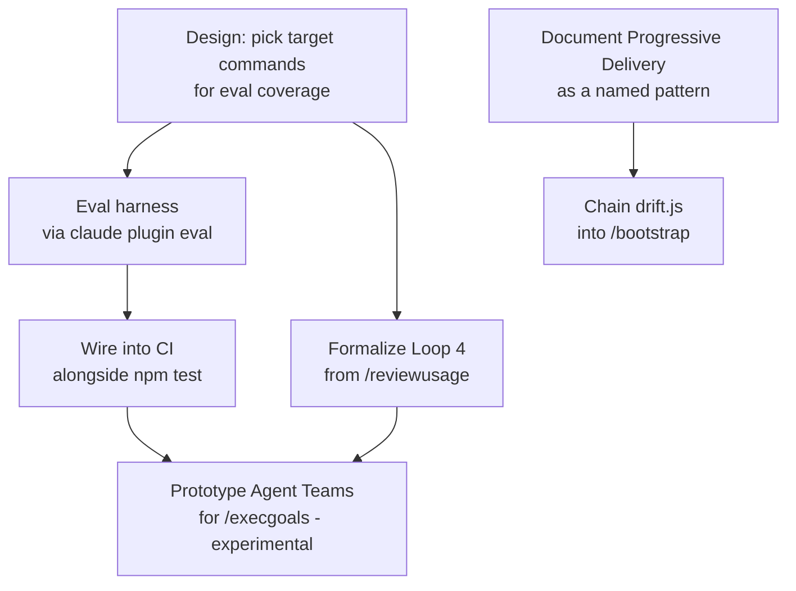

# GOALS.md — base_project
This is the active execution context for `/execgoals`. Completed plan bodies live in `dev/goals-archive/` so a planning or execution pass reads current work first, without losing the evidence behind prior decisions.

## Active plans
1. [**Harness & Loop Engineering Adoption**](#goals-8-harness--loop-engineering-adoption-base_project-feature) — H.1/H.2/H.8 remain deliberately deferred until the user decides whether to fund and secure the external LLM eval harness.

## Completed plans
The completed bodies for GOALS 1–7 and 9–12 are preserved in the [archive index](dev/goals-archive/README.md). Consult an individual archived plan only when its historic scope or evidence is relevant.

`dev/ROADMAP.md` remains the chronological decision log; this file contains only work that `/execgoals` can still execute.

---

## GOALS 8 — Harness & Loop Engineering Adoption (base_project feature)

Converts `dev/analise-harness-loop-engineering-2026.md`'s own roadmap (§4) into checkable
items — that document already did the research (harness engineering, loop engineering, and
4 adjacent trends, all sourced); this section doesn't re-research, it makes the plan
executable.

### Design rationale

- The single highest-leverage gap identified: `npm test`/Biome/`tsc` cover this project's
  *scripts* thoroughly (92 tests) but zero automated coverage exists for whether the 21
  commands/agents themselves produce correct behavior when a model actually runs them — every
  verification of a command this session (`/bootstrap`, `/scanproject`, `/ship`, etc.) was
  manual. `claude plugin eval` (native Claude Code capability — eval suites, JSON/report,
  sandbox, CI) closes exactly this gap without inventing new tooling.
- Explicitly out of scope for Phase 1: eval coverage for all 21 commands at once — start with
  the 3-5 already carrying the most explicit safety logic in their own text (`/ship`,
  `/fixproject`, `/uninstall`), where a regression is most costly, per the source analysis's
  own prioritization.
- Agent Teams (GOALS 8's Teams node) stays a prototype, not a production dependency, while
  `CLAUDE_CODE_EXPERIMENTAL_AGENT_TEAMS` remains experimental — same reasoning `dev/ROADMAP.md`
  already applies elsewhere to not betting production behavior on Anthropic-side experimental
  flags.

### Research: eval harness mechanism (feeds H.1/H.2 — done, informs the still-open decision)

`claude plugin eval` and `skill-creator`'s `evals.json` were both investigated live and ruled
out (see H.1 below). Researched further, specifically to answer "what do we still need to
figure out to build a good custom harness, and is there a better tool than hand-rolling one":

- **Better tool found — recommend this over a fully hand-rolled script**:
  [`anthropics/claude-code-action`](https://github.com/anthropics/claude-code-action), the
  official Anthropic GitHub Action. Its "agent mode" runs a direct prompt non-interactively
  (the same underlying mechanism as `claude -p`, packaged as a ready-made Action instead of
  plumbing auth/invocation/output-parsing by hand), accepts `--json-schema` in `claude_args`
  and exposes a schema-validated `structured_output` — closer to a real grading report than
  parsing raw `claude -p --output-format json` text ourselves would be. Runs on your own
  runner, calls go straight to the Anthropic API — no marketplace packaging, no early-access
  gate, no interactive-only constraint (the exact three problems that ruled out both prior
  candidates). This changes what H.1 needs to build: scenario definitions + assertions against
  `structured_output`, not the invocation plumbing itself.
- **Confirmed real, not assumed**: `claude -p "<prompt>"` headless mode exists, exits with a
  status code, never opens a permission dialog. Supports `--output-format
  text|json|stream-json`, `--allowedTools`, `--permission-mode` (pre-approves tools so a run
  never hangs), and `ANTHROPIC_API_KEY` takes precedence over subscription auth in `-p` mode —
  the determinism CI needs. `claude-code-action`'s agent mode wraps exactly this.
- **Still open — real research points before H.1 can actually be written**:
  1. **Scenario isolation.** Each scenario needs its own throwaway `CLAUDE_HOME` + scratch git
     repo with base_project's own commands actually installed (same pattern the existing
     `install-test` CI job already uses, `$RUNNER_TEMP/claude-home`) — otherwise `/ship` etc.
     don't resolve as real commands inside the eval run. Open question: does
     `claude-code-action` expose a way to point at a custom config/`CLAUDE_HOME`, or does the
     workflow need to run `install.sh` against a scratch home as its own step first, then
     invoke the action inside that environment?
  2. **Tool access shape per scenario.** A refusal scenario (e.g. "`/ship` must refuse to
     commit a staged secret") is only a real test if Claude genuinely *has* the tool access to
     attempt the risky action and chooses not to — not a test that passes only because the
     tool was withheld. `--allowedTools` needs to be scoped deliberately per scenario, not
     just "as open as possible" or "as locked as possible."
  3. **Assertion strategy.** Prefer deterministic checks (git log/diff state, file existence,
     exit codes) over LLM-as-judge grading wherever the outcome is a hard fact — matches this
     project's own harness-engineering research (`dev/analise-harness-loop-engineering-2026.md`)
     that determinism beats probabilistic compliance. Reserve judge-based grading only for
     genuinely qualitative outcomes (e.g. "did it explain the refusal clearly"), and treat those
     results with less confidence than the deterministic ones.
  4. **Cost and trigger strategy.** Each scenario run is a real, billed API call. Needs a
     decision: run on every push (cost scales with commit volume) vs. on a schedule vs.
     PR-label-triggered; which model per scenario (a cheaper/faster model for routine runs vs.
     the model users would actually run these commands with — a real fidelity/cost tradeoff,
     not free to ignore).
  5. **A new secret, and a new attack surface.** This repo's CI has no `ANTHROPIC_API_KEY`
     today — it only tests the *installer*, never makes a real model call. Adding one means a
     real, spendable credential as a GitHub Actions secret. `CONTRIBUTING.md` says this project
     accepts outside PRs — the workflow trigger needs to be scoped so an external PR can't run
     with access to that secret (`pull_request` vs. `pull_request_target` matters here, not a
     detail to skip). This is a real security/cost decision, not just a wiring task.
  6. **Scenario spec per command**, concrete enough to actually write: `/ship` — staged secret
     must never reach `git commit`; force-push never happens regardless of phrasing; detached
     HEAD stops and asks. `/uninstall` — a Tier C action never runs without its own separate
     confirmation, declining Tier A doesn't skip to Tier B/C. `/fixproject` — never commits
     automatically; a finding needing a user-only decision stops and asks instead of guessing.

### Implementation

- [ ] **H.1 Golden-path eval suite for `/ship`, `/fixproject`, `/uninstall`** (`architect` then
  `coder`) — **still deferred, blocked on a go/no-go decision, not on effort or a missing
  mechanism anymore.** The mechanism question is answered by the research above
  (`claude-code-action`, agent mode, `structured_output`) — what's still open is whether to
  actually spend the effort (scenario writing + a new billed CI secret) now. Investigated two
  real candidates live before finding the one above, rather than guessing from the original plan:
  - `claude plugin eval` — wrong fit: designed for packaged plugins (`plugin.json` + skills/
    MCP) distributed via a marketplace, not loose commands shipped by an installer; would need
    unusual repackaging, and depends on early-access enablement never confirmed on this account.
  - `skill-creator`'s `evals/evals.json` (the public alternative, chosen over the above) —
    also wrong fit, for different reasons: interactive-only (no CLI, no exit codes, results
    shown in an HTML review viewer), built for iterating on a skill you're actively authoring,
    not for testing pre-existing installed commands non-interactively.
  Recommended real path, not yet built: a small custom harness (~50 lines, in the same spirit
  as the existing `dev/scripts/*.js`) spawning isolated `claude -p` sessions per scenario and
  asserting on observed behavior — genuinely testable, no early-access dependency, fully owned.
  User's call: park this rather than commit to building custom test infrastructure inside this
  same run. Revisit as its own scoped item later.
- [ ] **H.2 Wire the eval suite into CI** (`coder`) — blocked on H.1's mechanism; nothing to
  wire in yet.
- [x] **H.3 Formalize Loop 4 (hill-climbing) from `/reviewusage`** (`architect` then `coder`) —
  **mechanism decided**: a small self-owned state file,
  `~/.claude/base_project/usage/.zero-use-tracking.json` (`{ id: firstFlaggedDateISO }`) — not
  a note auto-written into a tracked project file, since that would conflict with this
  project's own "never write unasked" norm (`/diario`, the plugin-suggestion rule); this stays
  entirely within `/reviewusage`'s own existing "report only, on demand" contract, just makes
  the on-demand report itself remember across runs. Added to step 4a (all 3 variants): first
  sighting gets dated, repeat sightings report elapsed days, past 60 days (this command's own
  "two months" bar) gets called out explicitly, and a finding that resolves gets removed from
  tracking rather than staying stuck reporting zero. **Verification limit, stated honestly**:
  this is prompt/instruction text, not executable code — no unit test can prove an LLM follows
  it, the same class GOALS 7 already names for `/newgoal`/`/repertoire`. What's actually
  verified: the instruction text exists in all 3 files (`grep` confirmed), `npx biome
  check`/`npx tsc` stay clean. Not verified: an actual two-run escalation, which needs a real
  zero-use catalog entry and two real `/reviewusage` invocations spaced apart — first live use
  is the real test, same honesty `dev/ROADMAP.md` item 40 already applies to an unexercised
  `/ship` code path.
- [x] **H.4 Document Progressive Delivery as a reusable pattern** (`coder`) — added
  `CONTRIBUTING.md` § "Rolling out a risky change to a command/agent", naming the
  `command-lite`/`command` split (flag, default unchanged, persisted state, promote after
  validation) as the reusable template for any future risky command/agent change. Verified:
  section exists, references the lite/dense implementation by name and path.
- [x] **H.5 Chain `drift.js` into `/bootstrap`** (`coder`) — added to step 0 of all 3
  `bootstrap.md` variants, right after `sync.js pull`. **Design correction made live, not as
  originally written**: ran `drift.js --project . --json` against this repo before writing the
  instruction, and it flagged ~40 lines of `"status": "missing"` (every agent base_project
  itself never adopted) alongside one genuine `"status": "drift"` entry — a literal reading of
  the original item text ("report any drift finding") would have made `/bootstrap` spam
  "missing" noise on every run for any project that hasn't opted into the unified layer, which
  is most projects. The instruction now explicitly filters to `"status": "drift"` only, ignores
  `"missing"`, and points at `apply.js --agent <id> --fix` as the concrete remedy.
- [x] **H.6 Prototype Agent Teams for `/execgoals`** (`architect`, prototype only — not a
  production dependency) — **skipped for now, deliberately, not forgotten**:
  `CLAUDE_CODE_EXPERIMENTAL_AGENT_TEAMS` prototype stays unscheduled — nothing to execute
  without the flag actually set and a real multi-area `GOALS.md` to test dispatch against, and
  betting effort on an Anthropic-side experimental feature isn't worth it yet. Not blocking
  anything else in this section. Revisit once the flag graduates past experimental.

### Tests

- [x] **H.7 Regression coverage for H.5** (`coder`) — extended `dev/tests/drift.test.js` with
  a new case asserting `drift --json`'s exact `"missing"` vs `"drift"` distinction the new
  `/bootstrap` step depends on: a never-adopted project reports zero `"drift"` entries, and
  mutating a projected file flips exactly that entry (and only that one) to `"drift"`. Verified
  by actually running it: `node --test dev/tests/drift.test.js` — both cases pass. Full suite
  `npm test`: 93/93 (up from 92). `npx biome check .`/`npx tsc` clean.

### Registration

- [ ] **H.8 Update `dev/ROADMAP.md` and `command-menu.md` once H.1-H.6 land** (`coder`) —
  **partially done, stays open**: `command-menu.md` (both engines) already mentions the
  drift-chain (H.5) and the zero-use escalation (H.3); `dev/ROADMAP.md` item 42 already
  documents H.3-H.5/H.7 plus this whole GOALS 7/8/9 execution run. What's still missing:
  H.1/H.2 have no registration yet because they don't exist yet (deferred, not landed) — this
  item stays open specifically to not forget registering them once a mechanism is actually
  chosen and built, not because the H.3-H.7 registration work wasn't done.

### Sources consulted

Already gathered in `dev/analise-harness-loop-engineering-2026.md` — see that file's own
"Fontes consultadas" section (LangChain's loop engineering framework, Faros.ai's harness
engineering breakdown, PluginEval/`claude plugin eval`, Claude Code Agent Teams) rather than
re-listing them here; this section converts that research into execution items; it doesn't
re-derive it.

---
