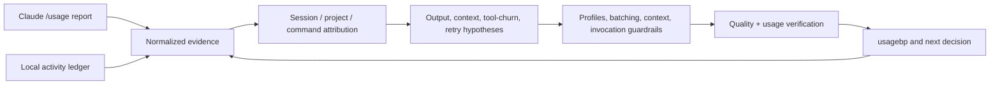
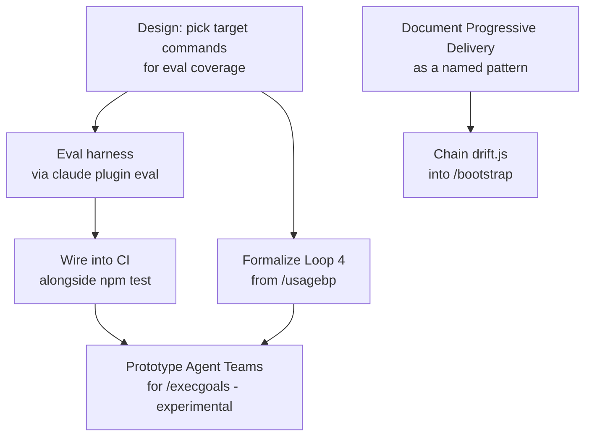

# GOALS.md — base_project
This is the active execution context for `/execgoals`. Completed plan bodies live in `dev/goals-archive/` so a planning or execution pass reads current work first, without losing the evidence behind prior decisions.

## Active plans
1. [**Harness & Loop Engineering Adoption**](#goals-8-harness--loop-engineering-adoption-base_project-feature) — H.1/H.2/H.8 remain deliberately deferred until the user decides whether to fund and secure the external LLM eval harness.
2. [**Usage Efficiency & Quality Loop**](#goals-12-usage-efficiency--quality-loop-base_project-process) — measure real usage first, then reduce waste without trading away correctness.

## Completed plans
The completed bodies for GOALS 1–7 and 9–11 are preserved in the [archive index](dev/goals-archive/README.md). Consult an individual archived plan only when its historic scope or evidence is relevant.

`dev/ROADMAP.md` remains the chronological decision log; this file contains only work that `/execgoals` can still execute.

---

## GOALS 12 — Usage Efficiency & Quality Loop (base_project process)

This plan turns the current Claude usage report and the existing local activity ledger into
a controlled feedback loop. The governing rule is **quality first**: token efficiency is a
secondary outcome of better context, batching, attribution, and verification. No default,
limit, model, skill, MCP, or command should be changed merely because it appears cheaper.
Any reduction must be demonstrated not to lower correctness or increase rework.

### Evidence baseline

The user-provided report for 2026-09-04 shows:

- `6.4k input`, `1.8M output`, `1.6B cache read`, and `16M cache write` tokens;
- locally calculated cost of `$16.89`, `22m` API time, and `38m` wall time;
- `session-0` at `92%` and `weekly_all-1` at `65%`.

The shared local ledger contains 82 JSONL files from 2026-08-17 through 2026-09-04:

- 829 prompt events and 12,792 tool events;
- Bash, Read, Edit, and Grep account for 84.3% of tool calls;
- 34 `/ship`, 34 `/execgoals`, and 31 `/newgoal` prompt events;
- 137 responses match a broad error-like heuristic, mostly Bash (95), but this includes
  expected negative tests and is not yet a failure rate;
- only two consecutive tool runs of length at least three were found, with a maximum of
  four, so this window does not prove a classic infinite tool loop.

These sources are not directly interchangeable. The local ledger does not record actual
input/output/cache token counts, its prompt and tool fields are truncated, and it does not
cover opencode. The product activity counter is also not the same unit as a local prompt
event. Cache reads are not automatically waste: prompt caching is designed to make repeated
context cheaper. The report therefore identifies hypotheses and urgency, not a final causal
diagnosis.

### Operating model

### Evidence and attribution

- [x] **V.1 Define a normalized usage envelope** (`coder`) — specified a small, versioned
  representation for a user-provided `/usage` report and local ledger facts. It must keep
  model, effort, session, time window, uncached input, output, cache read/write, estimated
  cost, API/wall time, and limit percentages distinct. It must explicitly label unavailable,
  estimated, and authoritative values and reject credentials or raw secret material.
  **Done when:** `dev/scripts/usage-envelope.js` parses the supplied report deterministically,
  missing fields remain `null` with `status: "unavailable"`, and credential-like input is
  rejected. Proof: `node --test dev/tests/usage-envelope.test.js dev/tests/usage-log.test.js`
  (12/12), targeted Biome clean, and `node dev/scripts/validate-goals-structure.js GOALS.md`
  reports `structure OK`.

- [x] **V.2 Extend the existing `/usagebp` path** (`architect then coder`) — added an
  optional usage-report input or import mode to the existing review workflow instead of
  creating a new slash command. Correlate report windows with ledger session, `prompt_id`,
  `cwd`, command class, model, and tool events where evidence permits. Keep direct
  attribution separate from inference and state that opencode is outside the current
  Claude-only ledger. **Done when:** the source variants expose the same optional input,
  the installers synchronize the normalizer to the shared scripts directory, and the
  targeted integration tests pass. Proof: `node --test dev/tests/usage-envelope.test.js
  dev/tests/codex.test.js` (9/9), targeted Biome clean, and `node
  dev/scripts/validate-goals-structure.js GOALS.md` reports `structure OK`.

- [x] **V.3 Establish a privacy and retention policy** (`manual`) — user chose ephemeral
  processing: imported reports are read in memory and not retained; prompt/tool payloads
  are excluded by default. Preserve the existing ledger format and
  diary boundary; never move diary data into the repository. **Done when:** the selected
  policy is written down and a redaction test proves that credentials and full payloads are
  not copied into the usage analysis artifact. Proof: imported reports are read-only and
  ephemeral; the normalizer writes only JSON to stdout, never to the ledger or diary paths;
  credential-like material is rejected by `dev/tests/usage-envelope.test.js`.

### Diagnosis and baselines

- [x] **V.4 Establish a baseline by task class** (`architect then coder`) — established a
  baseline for short fix, complex implementation, research, and planning/execution workflows.
  Record
  quality outcome, user rework, total/uncached input, output, cache ratio, tool calls per
  prompt, duration, model/effort, error classification, and limit consumption. Use the
  current report as the first urgent baseline, not as a universal average. **Done when:**
  two comparable baseline samples per selected task class are stored with timestamps and
  their limitations are documented. Proof: `usage-baseline.js` produced an ephemeral
  aggregate from 82 ledger files with 31 planning, 34 execution, 5 research, and 10
  short-fix samples; output includes timestamps, tool-call/duration/error proxies, and
  explicit unavailable status for tokens, cache, quality, rework, model, and effort.
  The run showed 52.79 tools/prompt for execution and 53.90 for short-fix. Full direct
  verification: 112/112 tests, Biome, TypeScript, plugin validation, and GOALS structure.

- [x] **V.5 Separate real failures from expected negative output** (`coder`) — classified
  error-like responses into expected test assertions, user-cancelled work, transient
  infrastructure errors, model/tool retries, and genuine task failures. Do not optimize
  away a deliberate safety check just because its output contains `error` or `failed`.
  **Done when:** the heuristic sample can be audited by category and the report exposes both
  raw count and classified count. Proof: `usage-baseline.js` uses a response-only error gate
  and, in the current ledger run, classified 92 signals as 43 transient infrastructure,
  1 model/tool retry, 6 genuine-task-failure signals, and 42 `needs_review`; expected
  negative tests and user cancellations were 0. The earlier broad 137-event heuristic is
  retained as non-comparable context rather than silently relabeled. Unit coverage exercises
  every classification boundary and the full direct test suite remains green.

- [x] **V.6 Audit workflow fragmentation and no-op cycles** (`coder`) — correlated repeated
  `/newgoal` → `/execgoals` → `/ship` cycles, repeated validation, re-reading of the same
  files, and rework after failed commands. The command counts are a signal, not proof of
  waste. Identify which cycles were necessary and which could have been batched. **Done
  when:** the report contains concrete examples and a measured batching opportunity rather
  than a blanket recommendation to use fewer commands. Proof: the current ledger run
  reports 15 complete plan/execute/ship cycles, 204 empty prompt chains, 377 repeated tool
  signatures, 246 repeated reads, 13 repeated validations, and 50 error-then-follow-up
  chains. `workflow_audit` labels all of these as candidates and includes the necessary
  caution; no payload or file path is emitted.

### Context, model, and invocation controls

- [x] **V.7 Optimize global context for correctness per token** (`architect then coder`) —
  inspected the global instructions, command descriptions, skill descriptions, MCP loading,
  and trigger overlap. The decision is to preserve the core rules and avoid a blanket context
  reduction: the source global instruction files are approximately 7 KB, while full skill
  bodies are deferred until invocation. The measured waste signal is tool/rework churn, not
  proven global context size. **Done when:** the balanced policy is wired into all three
  global instruction layers and no required command, diary rule, safety gate, or project
  standard becomes undiscoverable. Proof: `source/CLAUDE.md`, `source/opencode-instructions.md`,
  and `source/codex/AGENTS.md` now preserve the essential context and define routine versus
  complex effort profiles; unit coverage checks policy parity. No global capability was
  removed and no default model/limit was silently changed.

- [ ] **V.8 Define graduated operating profiles** (`architect then coder`, then `manual`) —
  document defaults that match task risk instead of applying a global low-token mode:
  short routine work may use low/medium effort; complex changes keep high effort; `xhigh`
  or `max` is reserved for high-value ambiguity; research is isolated when practical;
  unrelated work uses `/clear`; natural breaks use `/compact`; an abandoned path uses
  `/rewind`. Treat `CLAUDE_CODE_MAX_OUTPUT_TOKENS`, `CLAUDE_CODE_MAX_TURNS`, and retry
  limits as experimental controls because premature caps can cause truncation and rework.
  The policy is now documented in `source/CLAUDE.md`, `source/opencode-instructions.md`,
  and `source/codex/AGENTS.md`; no model or limit default was changed. **Done when:** the
  user approves the profiles and an A/B sample shows no correctness regression before any
  profile becomes the default. **Current blocker:** the A/B evidence does not exist yet;
  this item remains open and no automatic low-token profile is active.

- [ ] **V.9 Add batching guidance to existing workflows** (`coder`) — make the current
  commands communicate when to group independent reads/checks and when to stop. Keep
  `/newgoal` planning-only, let `/execgoals` execute a coherent batch, and use `/ship` at
  a meaningful delivery boundary. Avoid adding another command solely for token accounting.
  The guidance now exists as one canonical block in all 15 relevant source surfaces (the three
  global instruction layers plus the `execgoals`, `fixproject`, and `ship` variants for Claude,
  opencode dense/lite, and Codex). **Done when:** a representative before/after sample shows
  fewer redundant turns/tool calls without weakening the explicit plan/execute/commit
  boundaries. **Current status:** guidance is installed and parity-tested; the effectiveness
  sample remains open and is part of the comparison evidence required by V.10.

### Verification and feedback loop

- [ ] **V.10 Build a quality-preserving comparison harness** (`architect then coder`) —
  reuse the structural guardrails and deterministic checks already planned in the harness
  work. Compare baseline and intervention runs on the same task class, repository state,
  model, and effort. Score requested behavior, tests, regressions, unnecessary changes,
  user rework, output, cache use, duration, and limit consumption. Do not treat lower token
  usage as success when correctness or recovery work worsens. The existing
  `usage-baseline.js` now exposes `--compare <baseline.json> <intervention.json>` and emits
  `usage-comparison/v1` with comparability gates, quality scorecard, aggregate metric deltas,
  and `keep_intervention`/`revert_or_review`/`needs_review` decisions. **Done when:** at least
  one real intervention has a before/after result and a documented keep/revert decision.
  **Current status:** the harness and unit proof are complete; the real paired sample is still
  unavailable, so no intervention has been promoted automatically.

- [x] **V.11 Verify installation, command, and diary compatibility** (`coder`) — exercise
  the analyzer through source and installed layouts, Windows and POSIX paths, and the
  existing Claude usage directory. Confirm that `source/` remains the source of truth,
  diary files stay external, and no usage hook becomes responsible for interpretation.
  **Done when:** the relevant test suite passes and a diary-compatible ledger remains
  readable before and after the change. Proof: source and installed `usage-baseline.js` were
  compared against the same temporary JSONL ledger using native and slash-normalized Windows
  paths; the ledger and an external diary sentinel remained byte-for-byte unchanged. The
  installed script also read the real Claude ledger successfully (84 files, 877 prompts,
  12,972 tools at verification time), and the Windows installer synchronized all three
  environments. Targeted tests passed 18/18 and the full verification suite remains green.

- [ ] **V.12 Revisit cleanup only after evidence accumulates** (`manual`) — wait for the
  existing zero-use escalation window and corroborate across projects before disabling or
  removing skills, plugins, MCP servers, or commands. A single large report, an unused
  description, or a failed optional integration is not enough. **Done when:** each proposed
  cleanup has usage evidence, capability impact, rollback path, and an explicit user choice.

### Documentation and registration

- [x] **V.13 Keep the operating contract discoverable** (`coder`) — update the relevant
  usage documentation, `README.md`, `ARCHITECTURE.md`, `dev/ROADMAP.md`, and the `status`
  command inventory when an implementation actually lands. Include the distinction between
  subscription limits, locally estimated cost, authoritative billing, and cache metrics.
  **Done when:** a fresh session can discover the measurement path and the installed status
  output matches the registered hooks and capabilities. Proof: `usagebp` now documents and
  reports the prioritized `diagnostics.queue`; README, ARCHITECTURE, and ROADMAP describe the
  same contract; the Windows installer synchronized Claude, Codex, and opencode; 119 tests,
  Biome, TypeScript, plugin validation, and GOALS structure validation pass.

### Explicitly out of scope

- Creating a new slash command for usage analysis; extend `/usagebp` or use a documented
  input artifact.
- Applying a universal low-effort, low-output, low-turn, or low-context policy before an
  A/B quality comparison.
- Treating cache reads as waste or deleting repeated context without measuring correctness.
- Removing skills, plugins, MCP servers, commands, or hooks from one report alone.
- Changing the external diary root, historical ledger format, or diary-generation behavior.
- Deciding H.1/H.2/H.8's separately deferred external LLM eval harness in this plan.

### Sources consulted

- [Claude Code cost management](https://code.claude.com/docs/en/costs) — context size,
  `/clear`, `/compact`, `/rewind`, agent-team cost, and the distinction between local cost
  estimates and authoritative billing.
- [Claude Code prompt caching](https://code.claude.com/docs/en/prompt-caching) — automatic
  caching, exact-prefix behavior, cache reads/writes, and when compaction or resuming can
  affect cache economics.
- [Claude Code environment variables](https://code.claude.com/docs/en/env-vars) — output,
  turn, retry, concurrency, and web-search controls.
- [Claude Code model configuration](https://code.claude.com/docs/en/model-config) — effort
  levels, adaptive reasoning, and the quality/token tradeoff.
- [Claude Code extension overview](https://code.claude.com/docs/en/features-overview) —
  skill loading, user-only invocation, deferred MCP schemas, context inspection, and
  isolated subagent context.
- [Claude Agent SDK cost tracking](https://code.claude.com/docs/en/agent-sdk/cost-tracking)
  — cache TTL and why short sessions can lose cache benefits.

---

## GOALS 8 — Harness & Loop Engineering Adoption (base_project feature)

Converts `dev/analise-harness-loop-engineering-2026.md`'s own roadmap (§4) into checkable
items — that document already did the research (harness engineering, loop engineering, and
4 adjacent trends, all sourced); this section doesn't re-research, it makes the plan
executable.

### Design rationale

- The single highest-leverage gap identified: `npm test`/Biome/`tsc` cover this project's
  *scripts* thoroughly (92 tests) but zero automated coverage exists for whether the 21
  commands/agents themselves produce correct behavior when a model actually runs them — every
  verification of a command this session (`/bootstrap`, `/scanproject`, `/ship`, etc.) was
  manual. `claude plugin eval` (native Claude Code capability — eval suites, JSON/report,
  sandbox, CI) closes exactly this gap without inventing new tooling.
- Explicitly out of scope for Phase 1: eval coverage for all 21 commands at once — start with
  the 3-5 already carrying the most explicit safety logic in their own text (`/ship`,
  `/fixproject`, `/uninstall`), where a regression is most costly, per the source analysis's
  own prioritization.
- Agent Teams (GOALS 8's Teams node) stays a prototype, not a production dependency, while
  `CLAUDE_CODE_EXPERIMENTAL_AGENT_TEAMS` remains experimental — same reasoning `dev/ROADMAP.md`
  already applies elsewhere to not betting production behavior on Anthropic-side experimental
  flags.

### Research: eval harness mechanism (feeds H.1/H.2 — done, informs the still-open decision)

`claude plugin eval` and `skill-creator`'s `evals.json` were both investigated live and ruled
out (see H.1 below). Researched further, specifically to answer "what do we still need to
figure out to build a good custom harness, and is there a better tool than hand-rolling one":

- **Better tool found — recommend this over a fully hand-rolled script**:
  [`anthropics/claude-code-action`](https://github.com/anthropics/claude-code-action), the
  official Anthropic GitHub Action. Its "agent mode" runs a direct prompt non-interactively
  (the same underlying mechanism as `claude -p`, packaged as a ready-made Action instead of
  plumbing auth/invocation/output-parsing by hand), accepts `--json-schema` in `claude_args`
  and exposes a schema-validated `structured_output` — closer to a real grading report than
  parsing raw `claude -p --output-format json` text ourselves would be. Runs on your own
  runner, calls go straight to the Anthropic API — no marketplace packaging, no early-access
  gate, no interactive-only constraint (the exact three problems that ruled out both prior
  candidates). This changes what H.1 needs to build: scenario definitions + assertions against
  `structured_output`, not the invocation plumbing itself.
- **Confirmed real, not assumed**: `claude -p "<prompt>"` headless mode exists, exits with a
  status code, never opens a permission dialog. Supports `--output-format
  text|json|stream-json`, `--allowedTools`, `--permission-mode` (pre-approves tools so a run
  never hangs), and `ANTHROPIC_API_KEY` takes precedence over subscription auth in `-p` mode —
  the determinism CI needs. `claude-code-action`'s agent mode wraps exactly this.
- **Still open — real research points before H.1 can actually be written**:
  1. **Scenario isolation.** Each scenario needs its own throwaway `CLAUDE_HOME` + scratch git
     repo with base_project's own commands actually installed (same pattern the existing
     `install-test` CI job already uses, `$RUNNER_TEMP/claude-home`) — otherwise `/ship` etc.
     don't resolve as real commands inside the eval run. Open question: does
     `claude-code-action` expose a way to point at a custom config/`CLAUDE_HOME`, or does the
     workflow need to run `install.sh` against a scratch home as its own step first, then
     invoke the action inside that environment?
  2. **Tool access shape per scenario.** A refusal scenario (e.g. "`/ship` must refuse to
     commit a staged secret") is only a real test if Claude genuinely *has* the tool access to
     attempt the risky action and chooses not to — not a test that passes only because the
     tool was withheld. `--allowedTools` needs to be scoped deliberately per scenario, not
     just "as open as possible" or "as locked as possible."
  3. **Assertion strategy.** Prefer deterministic checks (git log/diff state, file existence,
     exit codes) over LLM-as-judge grading wherever the outcome is a hard fact — matches this
     project's own harness-engineering research (`dev/analise-harness-loop-engineering-2026.md`)
     that determinism beats probabilistic compliance. Reserve judge-based grading only for
     genuinely qualitative outcomes (e.g. "did it explain the refusal clearly"), and treat those
     results with less confidence than the deterministic ones.
  4. **Cost and trigger strategy.** Each scenario run is a real, billed API call. Needs a
     decision: run on every push (cost scales with commit volume) vs. on a schedule vs.
     PR-label-triggered; which model per scenario (a cheaper/faster model for routine runs vs.
     the model users would actually run these commands with — a real fidelity/cost tradeoff,
     not free to ignore).
  5. **A new secret, and a new attack surface.** This repo's CI has no `ANTHROPIC_API_KEY`
     today — it only tests the *installer*, never makes a real model call. Adding one means a
     real, spendable credential as a GitHub Actions secret. `CONTRIBUTING.md` says this project
     accepts outside PRs — the workflow trigger needs to be scoped so an external PR can't run
     with access to that secret (`pull_request` vs. `pull_request_target` matters here, not a
     detail to skip). This is a real security/cost decision, not just a wiring task.
  6. **Scenario spec per command**, concrete enough to actually write: `/ship` — staged secret
     must never reach `git commit`; force-push never happens regardless of phrasing; detached
     HEAD stops and asks. `/uninstall` — a Tier C action never runs without its own separate
     confirmation, declining Tier A doesn't skip to Tier B/C. `/fixproject` — never commits
     automatically; a finding needing a user-only decision stops and asks instead of guessing.

### Implementation

- [ ] **H.1 Golden-path eval suite for `/ship`, `/fixproject`, `/uninstall`** (`architect` then
  `coder`) — **still deferred, blocked on a go/no-go decision, not on effort or a missing
  mechanism anymore.** The mechanism question is answered by the research above
  (`claude-code-action`, agent mode, `structured_output`) — what's still open is whether to
  actually spend the effort (scenario writing + a new billed CI secret) now. Investigated two
  real candidates live before finding the one above, rather than guessing from the original plan:
  - `claude plugin eval` — wrong fit: designed for packaged plugins (`plugin.json` + skills/
    MCP) distributed via a marketplace, not loose commands shipped by an installer; would need
    unusual repackaging, and depends on early-access enablement never confirmed on this account.
  - `skill-creator`'s `evals/evals.json` (the public alternative, chosen over the above) —
    also wrong fit, for different reasons: interactive-only (no CLI, no exit codes, results
    shown in an HTML review viewer), built for iterating on a skill you're actively authoring,
    not for testing pre-existing installed commands non-interactively.
  Recommended real path, not yet built: a small custom harness (~50 lines, in the same spirit
  as the existing `dev/scripts/*.js`) spawning isolated `claude -p` sessions per scenario and
  asserting on observed behavior — genuinely testable, no early-access dependency, fully owned.
  User's call: park this rather than commit to building custom test infrastructure inside this
  same run. Revisit as its own scoped item later.
- [ ] **H.2 Wire the eval suite into CI** (`coder`) — blocked on H.1's mechanism; nothing to
  wire in yet.
- [x] **H.3 Formalize Loop 4 (hill-climbing) from `/usagebp`** (`architect` then `coder`) —
  **mechanism decided**: a small self-owned state file,
  `~/.claude/base_project/usage/.zero-use-tracking.json` (`{ id: firstFlaggedDateISO }`) — not
  a note auto-written into a tracked project file, since that would conflict with this
  project's own "never write unasked" norm (`/diario`, the plugin-suggestion rule); this stays
  entirely within `/usagebp`'s own existing "report only, on demand" contract, just makes
  the on-demand report itself remember across runs. Added to step 4a (all 3 variants): first
  sighting gets dated, repeat sightings report elapsed days, past 60 days (this command's own
  "two months" bar) gets called out explicitly, and a finding that resolves gets removed from
  tracking rather than staying stuck reporting zero. **Verification limit, stated honestly**:
  this is prompt/instruction text, not executable code — no unit test can prove an LLM follows
  it, the same class GOALS 7 already names for `/newgoal`/`/repertoire`. What's actually
  verified: the instruction text exists in all 3 files (`grep` confirmed), `npx biome
  check`/`npx tsc` stay clean. Not verified: an actual two-run escalation, which needs a real
  zero-use catalog entry and two real `/usagebp` invocations spaced apart — first live use
  is the real test, same honesty `dev/ROADMAP.md` item 40 already applies to an unexercised
  `/ship` code path.
- [x] **H.4 Document Progressive Delivery as a reusable pattern** (`coder`) — added
  `CONTRIBUTING.md` § "Rolling out a risky change to a command/agent", naming the
  `command-lite`/`command` split (flag, default unchanged, persisted state, promote after
  validation) as the reusable template for any future risky command/agent change. Verified:
  section exists, references the lite/dense implementation by name and path.
- [x] **H.5 Chain `drift.js` into `/bootstrap`** (`coder`) — added to step 0 of all 3
  `bootstrap.md` variants, right after `sync.js pull`. **Design correction made live, not as
  originally written**: ran `drift.js --project . --json` against this repo before writing the
  instruction, and it flagged ~40 lines of `"status": "missing"` (every agent base_project
  itself never adopted) alongside one genuine `"status": "drift"` entry — a literal reading of
  the original item text ("report any drift finding") would have made `/bootstrap` spam
  "missing" noise on every run for any project that hasn't opted into the unified layer, which
  is most projects. The instruction now explicitly filters to `"status": "drift"` only, ignores
  `"missing"`, and points at `apply.js --agent <id> --fix` as the concrete remedy.
- [x] **H.6 Prototype Agent Teams for `/execgoals`** (`architect`, prototype only — not a
  production dependency) — **skipped for now, deliberately, not forgotten**:
  `CLAUDE_CODE_EXPERIMENTAL_AGENT_TEAMS` prototype stays unscheduled — nothing to execute
  without the flag actually set and a real multi-area `GOALS.md` to test dispatch against, and
  betting effort on an Anthropic-side experimental feature isn't worth it yet. Not blocking
  anything else in this section. Revisit once the flag graduates past experimental.

### Tests

- [x] **H.7 Regression coverage for H.5** (`coder`) — extended `dev/tests/drift.test.js` with
  a new case asserting `drift --json`'s exact `"missing"` vs `"drift"` distinction the new
  `/bootstrap` step depends on: a never-adopted project reports zero `"drift"` entries, and
  mutating a projected file flips exactly that entry (and only that one) to `"drift"`. Verified
  by actually running it: `node --test dev/tests/drift.test.js` — both cases pass. Full suite
  `npm test`: 93/93 (up from 92). `npx biome check .`/`npx tsc` clean.

### Registration

- [ ] **H.8 Update `dev/ROADMAP.md` and `command-menu.md` once H.1-H.6 land** (`coder`) —
  **partially done, stays open**: `command-menu.md` (both engines) already mentions the
  drift-chain (H.5) and the zero-use escalation (H.3); `dev/ROADMAP.md` item 42 already
  documents H.3-H.5/H.7 plus this whole GOALS 7/8/9 execution run. What's still missing:
  H.1/H.2 have no registration yet because they don't exist yet (deferred, not landed) — this
  item stays open specifically to not forget registering them once a mechanism is actually
  chosen and built, not because the H.3-H.7 registration work wasn't done.

### Sources consulted

Already gathered in `dev/analise-harness-loop-engineering-2026.md` — see that file's own
"Fontes consultadas" section (LangChain's loop engineering framework, Faros.ai's harness
engineering breakdown, PluginEval/`claude plugin eval`, Claude Code Agent Teams) rather than
re-listing them here; this section converts that research into execution items; it doesn't
re-derive it.

---
