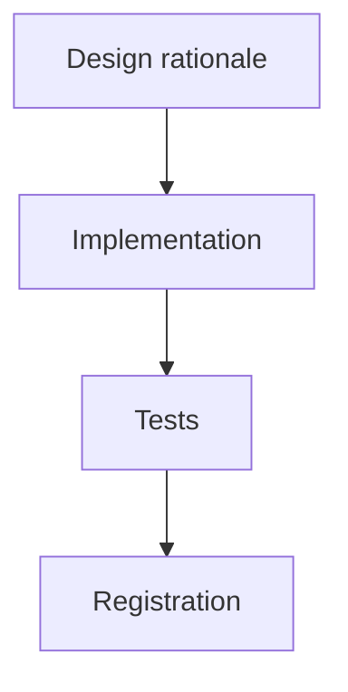

# GOALS.md — base_project

Four plans live in this file, kept separate rather than merged into one narrative, because
they're different kinds of work with different consumers:

1. [**Design-Review Skill**](#goals-1-design-review-skill-base_project-feature) — the
   original plan, status `done` (below, unchanged from when it was written).
2. [**Public Release Readiness**](#goals-2-public-release-readiness) — status `done`, get
   base_project itself from "works great for me" to "safe for a stranger to install,"
   researched the same way as plan 1 (real, current sources, not assumption).
3. [**Repertoire Research Command**](#goals-3-repertoire-research-command-base_project-feature)
   — status `done`, a command that researches a target project's *domain* (scientific,
   cultural, regulatory, media) before `/newgoal` plans it, not just the tech stack
   `/newgoal` already researches.
4. [**Design-Review Calibration Upgrade**](#goals-4-design-review-calibration-upgrade-base_project-feature)
   — new, added 2026-08-19: grounds `/designreview`'s judgment in named real-world design
   exemplars instead of judging from unanchored training-data memory, plus two new catalog
   entries for the generation side (closing the "found it, now fix it well" loop).

`dev/ROADMAP.md` remains the living decision log for *everything that happened* in this
project — this file stays what it always was, the format `/execgoals` can execute against:
concrete, checkable items, not prose.

---

## GOALS 1 — Design-Review Skill (base_project feature)

Research-backed build plan for a new base_project command that critiques design quality.
This is a *feature-level* plan, not a whole-project plan; this section is scoped to the
one deliverable described below, written in the format `/execgoals` executes against
without re-researching anything.

## Scope, as decided

Decided via explicit user choice (2026-08-16), not assumed:

- **What it checks**: both entry points — (1) critique an external design the user points to
  (image, mockup, live URL), and (2) act as an optional self-review step Claude can run on a UI
  it just generated, before presenting it. One engine, two invocations.
- **Where it lives**: inside base_project itself, distributed to everyone who installs it — not
  a personal-only skill. This means it needs the same review/registration discipline as every
  other base_project command (marker, both engines, menu/status/ROADMAP entries), not a
  one-off script.
- **Suggested command name**: `/designreview` (mirrors the existing `/code-review` naming
  convention already familiar from this harness). Open to a different name — not yet locked in
  anywhere.

## Methodology — grounded in current research, not invented from scratch

- [x] Baseline rubric skeleton: Nielsen Norman Group's usability heuristics — the durable,
      widely-taught standard, no need to re-derive one from zero.
- [x] Rating dimensions per UICrit (Berkeley, UIST 2024) and CHI 2026 follow-ups: aesthetics,
      efficiency, learnability, usability, and overall design quality, plus whether the design
      matches its stated intent (screenshot-to-description alignment).
- [x] Two-pass structure per Criticmate (CHI 2026): a global pass first (layout, hierarchy,
      first impression), then a local pass (spacing, contrast, copy, component-level detail).
      Stagewise global-then-local was found to align closer with expert feedback than a single
      undifferentiated pass — worth adopting rather than reinventing a review order.
- [x] Actionability requirement per UXBench (2026): a finding that doesn't name a concrete next
      step doesn't count as done. This already matches how this project's own review tooling
      works (`ReportFindings`'s `failure_scenario` field) — reuse that shape, don't invent a
      second one.
- [x] Deterministic pre-check layer before any LLM judgment call: WCAG contrast ratio and
      minimum tap-target size, objective and computable, no judgment needed — implemented as
      `dev/scripts/contrast-check.js`. **Deviation from the original plan**: spacing-scale
      adherence was dropped from this layer during implementation — there is no single
      universal "correct" spacing scale to check without knowing a project's own design
      tokens, so it moved into the local LLM pass instead (judged, not computed).

## Intake paths

- [x] **External image/mockup** — native multimodal vision via the `Read` tool. No new tooling.
- [x] **External live URL** — **deviation from the original plan**: written generically
      ("whatever browser/preview automation tooling is available in this session") instead of
      hardcoding `mcp__Claude_Browser__*`. That tool name is Claude Code-specific and the
      command also ships to opencode, where it wouldn't resolve — matches how `bootstrap.md`
      already handles opening a file in the default browser without naming a specific tool.
- [x] **Claude's own just-generated Artifact/UI** — same generic tooling instruction as above;
      critiques the *rendered* output, not just the source. Source-only review misses overflow,
      broken responsive behavior, and rendered-contrast issues that only show up once painted.

## Command design (packaging, once actually built)

- [x] New files: `source/claude/commands/designreview.md` + `source/opencode/command/`
      mirror — same pattern as every command shipped this session.
- [x] Output contract: reuse the `ReportFindings` shape (severity-ranked, one-sentence summary
      + concrete failure/improvement scenario per finding) instead of inventing a new report
      format.
- [x] Two invocation modes matching the two chosen entry points: `/designreview <url-or-file>`
      for external critique; a documented *optional* self-invoke instruction for Claude to run
      after producing a UI artifact — **not** a hard hook gate. Hooks in this repo
      (`post-edit-format.js`, `usage-log.js`) are deterministic scripts, not LLM calls; forcing
      an LLM critique pass onto every artifact via hook would add real latency/cost to every
      single generation and breaks that existing convention. Self-invocation stays a judgment
      call, same as when `/council` gets suggested elsewhere in this project.
- [x] Registration: `command-menu.md` (both engines + installed copies on this machine),
      `status.md` Commands list, `dev/ROADMAP.md` item 28.

## Testing

- [x] The deterministic pre-check layer (contrast ratio math, tap-target size) is real logic →
      got a real `dev/tests/contrast-check.test.js` file (12 tests), same convention as
      `usage-log.test.js`.
- [x] The LLM judgment layer itself is not unit-testable — same situation as `/council` and
      `/newgoal` today. Validated by `npm test` / `npx tsc` / `npx biome check .` /
      `npm run validate:plugins` staying green, not by asserting on subjective output.

## Explicitly out of scope for this pass

- [x] Hook-enforced automatic gating on every artifact — cost/latency; left as an optional
      self-invoked step instead (see Command design above).
- [x] Figma API integration — no confirmed need yet; image-export intake already covers the
      common case without needing OAuth/API-key setup.
- [x] A trained/fine-tuned scoring model — UICrit and UXBench are research datasets, not
      off-the-shelf APIs; out of reach for a markdown-instruction command, and unnecessary when
      an LLM judgment pass plus a solid rubric already covers the need.

## Sources consulted

- [UICrit: Enhancing Automated Design Evaluation with a UI Critique Dataset](https://dl.acm.org/doi/fullHtml/10.1145/3654777.3676381) — UIST 2024, rubric dimensions.
- [Criticmate: Stagewise Human–AI Co-Critique in Single-Screen UI Evaluation](https://dl.acm.org/doi/full/10.1145/3772318.3790929) — CHI 2026, global-then-local pass ordering.
- [UXBench: Measuring the Actionability of LLM-Generated UX Critiques](https://arxiv.org/pdf/2606.16262) — 2026, actionability as a required quality bar.

---

## GOALS 2 — Public Release Readiness

Plan to take base_project from "works well for its own maintainer" to "safe and legible
for a stranger to install," triggered by an explicit ask: *"vamos criar um /newgoal para
entender e melhorar esse projeto ao ponto de eu publicar ele."* Researched the same way as
GOALS 1 — real sources, checked against this repo's actual current state (not the stale
`audit-report.md`/`fix-report.md`/`organization-audit.md` already at root, which were
generated on a different machine and are one of this plan's own findings — see Area B).

### Scope, as decided

This is **not** a build-from-zero plan — base_project already exists, works, and has 46
passing tests, clean typecheck, 0 `npm audit` vulnerabilities, and a CI pipeline. The areas
`/newgoal`'s template normally covers for an application — backend framework, frontend
framework, database, auth, deployment/infra — **do not apply** and are skipped outright:
base_project is a CLI installer with no service, no database, and no runtime to deploy. What
applies instead is the actual gap between "correct" and "safe for strangers to run," found by
directly verifying this repo's state (not assuming from the stale reports at its root):

| Area | Applies? | Why |
|---|---|---|
| Backend / Frontend / Database / Auth / Deployment | No | Not that kind of project — installer only, nothing served, nothing stored. |
| Connectivity | No | The only "connectivity" is git remotes and MCP registration, both already covered by `/ship`/`/bootstrap`/the installer itself. |
| Legal / Licensing | **Yes** | README claims MIT and links to a `LICENSE` file that does not exist — verified via direct file search, not assumed. |
| Testing | Partially | Unit-test coverage is already strong (46/46); the real gap is CI *artifact coverage*, not test logic — see Area C. |
| Security | **Yes** | No `SECURITY.md`; the project registers hooks and MCP servers on the installer's own machine, which is exactly the kind of surface a disclosure policy exists for. |
| Repository hygiene / structure | **Yes** | Session-report files from a different machine are committed at root — see Area B. |
| Community readiness | **Yes** | README already promises Issues/Discussions but nothing scaffolds them. |

### Area A — Legal & Licensing (blocking; do this first)

- [x] Create `LICENSE` at repo root — MIT, "Copyright (c) 2026 Allu" (confirmed by the user,
      2026-08-17).
- [x] Add `"license": "MIT"` to `package.json` (was absent entirely).
- [x] Confirmed the README's `[LICENSE](LICENSE)` link resolves — `LICENSE` now exists at repo
      root, same directory as `README.md`.

### Area B — Repository Hygiene

- [x] Decided (user, 2026-08-17): removed `audit-report.md`, `fix-report.md`,
      `organization-audit.md` from the tracked tree (`git rm`) — confirmed they were one-off
      output from a different machine's session, findings already folded into this plan and
      `dev/ROADMAP.md`.
- [x] `assets/` documented in `ARCHITECTURE.md`'s directory map — Windows Explorer folder icon,
      purely cosmetic, applied by `install.ps1`, not distributed to anyone.
- [x] Root re-checked directly (`ls` + `git status`) after the above — clean: only expected
      files remain, no other dead/misplaced content found.

### Area C — CI Coverage Completeness

- [x] Extended `install-test`'s artifact assertions in `.github/workflows/ci.yml` to cover all
      17 commands, on both Linux/macOS and Windows steps, both engines (Claude Code +
      opencode) — `bootstrap.md`, `audit.md`, `council.md`, `plugins.md`, `ship.md`,
      `newgoal.md`, `execgoals.md`, `designreview.md`, `reviewusage.md` were the 9 missing.
- [x] Added `contrast-check.js`/`usage-log.js` to the same assertion list.
- [x] Added `macos-latest` to the `install-test` matrix, and widened the Linux-only
      `if: runner.os == 'Linux'` steps to `if: runner.os != 'Windows'` so they actually run on
      macOS too (they wouldn't have otherwise — `runner.os` on a macOS runner is `macOS`, not
      `Linux`) — `jq` install branches on `$RUNNER_OS` (`apt-get` vs. `brew`).
- [x] **Validated for real, not just edited**: ran `dev/scripts/install.sh` against a scratch
      `CLAUDE_HOME`/`OPENCODE_HOME` in this session (not CI) and confirmed all 17 new assertion
      paths — the 11 new Claude Code ones and the 6 spot-checked opencode ones — actually exist
      after a real install, then re-ran the installer a second time to confirm idempotency
      (no error). Full CI run (which also covers the actual macOS runner) still pending on next
      push — see Area E.
- [x] **Real, pre-existing bug found and fixed, unrelated to this plan's own additions**: the
      first real CI run after pushing Areas A-D revealed `install-test (ubuntu-latest)` has been
      failing since at least the 2026-08-16 commit — `install.sh`'s settings.json section
      computes `BASE_SETTINGS` correctly for a missing/fresh file, but never writes it to disk
      before the next block's blind `cat "$SETTINGS_PATH"` — so a genuinely fresh install (no
      pre-existing `settings.json`, e.g. a brand-new user's first run, or CI's throwaway HOME)
      crashes with `cat: ... No such file or directory`. `install.ps1` doesn't have this bug —
      it builds one in-memory object and writes once at the end; `install.sh` round-trips
      through disk on every block instead. Fix: write `$BASE_SETTINGS` to disk immediately after
      computing it, before the first re-read. **Caught because `jq` isn't installed in this
      session's shell, which silently skipped the buggy code path on the first "validated
      locally" pass above** — re-verified after downloading a real `jq` binary specifically to
      exercise this path: fresh install now creates a valid `settings.json` with all 3 hook
      events, and a second run stays idempotent. This is exactly the kind of finding a
      first-time user would have hit; more consequential than any single item this plan
      originally listed.

### Area D — Community & Security Documentation

- [x] Added `SECURITY.md`: scope named concretely (install scripts + hooks that write to
      global config, `scan-skill.js` bypass, this repo's own dependencies), reporting via
      GitHub private vulnerability reporting (no public issue), 72h acknowledgment commitment.
- [x] Added `CONTRIBUTING.md`: links to README's existing scratch-`$HOME` testing instructions
      and the `plugins.json` catalog-entry guide instead of duplicating them, states the
      `architect`→`coder`→`reviewer` expectation for non-trivial PRs, Conventional Commits.
- [x] Added `CODE_OF_CONDUCT.md` (Contributor Covenant v2.1, standard text, enforcement contact
      routed through the same GitHub private-reporting channel as `SECURITY.md`).
- [x] Added `.github/ISSUE_TEMPLATE/bug_report.md` and `feature_request.md` — bug template
      explicitly redirects security-shaped reports to `SECURITY.md`; feature template points
      at `dev/ROADMAP.md`'s "Descartado" section so requests already decided against aren't
      re-litigated blind.
- [x] Removed the README's "Screenshots" section (three placeholder lines, no real images) —
      also added `SECURITY.md`/`CONTRIBUTING.md` links to the README's Support section while
      touching that area.

### Area E — Cross-Platform Verification

- [x] Ran for real on `macos-latest` via CI (run
      [32071701135](https://github.com/alexmiguel011014-stack/base_project/actions/runs/32071701135),
      2026-08-17) — `install-test (macos-latest)` passed in 30s, same run also confirmed
      `ubuntu-latest`/`windows-latest` green after the settings.json fix above. Also bumped
      `node-version: 20 → 22` in `ci.yml` (both jobs) — cleared a deprecation warning that was
      showing on every run (Node 20 setup being force-upgraded to 24 by the runner).

### Area F — GitHub Repository Presentation

- [x] Set the repo description and topics on GitHub via `gh repo edit` (confirmed by the user
      before running, 2026-08-17) — description + topics `claude-code`, `opencode`, `cli`,
      `developer-tools`, `mcp`. Verified after with `gh repo view --json description,
      repositoryTopics`, not assumed from the command's exit code.
- [x] Tagged `v1.1.0` and pushed (confirmed by the user first, 2026-08-17) — verified live on
      `origin` via `git ls-remote --tags`, not assumed from the push command's exit code.

### Area G — Final Verification Pass

- [x] Re-verified every finding from the deleted `audit-report.md` directly against current
      state (not from memory of the report): `.env.example` exists (was missing); CI exists and
      is now more thorough (the original "no CI found" finding was itself wrong — `ci.yml`
      exists and always did, likely a checkout artifact on the other machine); `npm audit
      --depth=0` → 0 vulnerabilities; `node dev/scripts/scan-skill.js .` → 13 findings, all
      either inside `repomix-output.xml` (gitignored, never committed — confirmed via
      `.gitignore:25`) or a documentation line in `scanproject.md:24` describing the scanner's
      own detection rule, not executable code. **0 real findings in shipped source.**
- [x] Re-ran the full local bar: `npm test` (46/46), `npx tsc --noEmit` (clean), `npx biome
      check .` (1 warning + 12 infos, all pre-existing in `source/hooks/*.js`/
      `dev/scripts/scan-skill.js`, unrelated to this plan's changes), `npm run validate:plugins`
      (catalog valid).

### Explicitly out of scope for this pass

- [x] A formal release/changelog automation pipeline (e.g. `semantic-release`) — this project's
      existing versioning decision (ROADMAP item 16) is deliberately manual (`git tag`, no
      publish flow), and nothing in this plan's trigger asked to revisit that.
- [x] A dedicated documentation site — `README.md`/`ARCHITECTURE.md` already serve that role at
      this project's current scale; revisit only if that stops being enough.
- [x] Rewriting or relicensing away from MIT — out of scope unless the user says otherwise;
      this plan only fills the gap between the license already advertised and one that exists.

### Sources consulted

- [OpenSSF Vulnerability Disclosures Working Group](https://github.com/ossf/wg-vulnerability-disclosures) — disclosure process standards.
- [google/oss-vulnerability-guide](https://github.com/google/oss-vulnerability-guide) — `SECURITY.md` template guidance, response-time norms.
- [GitHub: 6 security settings every maintainer should enable](https://github.blog/security/6-security-settings-every-github-maintainer-should-enable-this-week/) — repo-level security posture, current as of 2026.
- [opensource.guide — security best practices](https://github.com/github/opensource.guide/blob/main/_articles/pl/security-best-practices-for-your-project.md) — general OSS security documentation norms.
- MIT vs. Apache 2.0 comparison sources (license-choice research, 2026) — patent-grant tradeoff, confirming MIT fits a CLI tool's risk profile.
- Open-source pre-launch checklist sources (2026) — CONTRIBUTING/CODE_OF_CONDUCT/issue-template baseline.

---

## GOALS 3 — Repertoire Research Command (base_project feature)

Goal type: **Feature** (`references/goal-types/feature.md`) — a bounded new command added to
the existing base_project command set, not a rewrite. Triggered by an explicit request:
*"um comando para instruir o chat a fazer uma pesquisa profunda em relação ao tema do
projeto para ele ter mais repertório... com base científica, cultural e midiática"* — refining
the "feeding" idea already logged as `dev/ROADMAP.md` item 31 (form already decided there,
2026-08-17: standalone external command, merges with `/newgoal` only via combined invocation,
mirroring `/council`'s existing pattern — this plan does not re-open that decision).

### Scope, as decided

- **What it's for**: `/newgoal`'s own research step (its step 4) researches *how to build* —
  tech stack, libraries, architecture patterns. It has no mechanism for researching *what the
  project is about* — the subject-matter grounding a domain expert would already have. This
  command fills that gap as a distinct research pass, not a bigger `/newgoal` step 4.
- **What it deliberately doesn't do**: it doesn't replace or duplicate `/newgoal`'s tech
  research; it doesn't force every one of its research lenses onto every project (see
  Methodology below — same mistake this repo's own history already made once by forcing
  `build.md`'s stack-area breakdown onto a Process-type plan, see GOALS 2's trigger); and it
  never runs automatically — always opt-in, same restraint `/council` and `/designreview`'s
  self-invocation already apply elsewhere in this project.
- **Suggested command name**: `/repertoire` — matches the user's own word for what this
  produces. Open to a different name — not yet locked in anywhere, same as `/designreview`
  was left open in GOALS 1 until it was actually built.

### Methodology — grounded in current research on how research agents actually plan

- [x] **Decomposition into a small set of lenses, not a fixed per-industry source list.**
      Real evidence-synthesis practice (systematic-review frameworks) segments coverage by
      information type rather than by industry vertical — a taxonomy that's stable across
      domains, unlike a hardcoded "if health app then PubMed" table that needs constant
      expansion and breaks on anything novel. Five reference lenses, not all mandatory per
      project: **Scientific/evidence base**, **Regulatory/legal**, **Cultural/social context**,
      **Media/public discourse**, **Competitive/market landscape**. The command judges which
      lenses actually apply to the specific project — an internal CRUD tool may need zero of
      them; a health app needs most.
- [x] **Surface the lens plan before spending the research budget** — current deep-research
      agent architectures split into three planning strategies: plan-then-search silently
      (fastest, most likely to chase the wrong decomposition), ask clarifying questions first,
      or generate the plan and show it to the user before executing (Gemini Deep Research's
      approach). This command follows the third: list which lenses apply and why, get
      confirmation, same cost-gate spirit `/council` already uses ("this costs real research
      time — want me to run it?"), before running any actual search.
- [x] **Evaluate source credibility per lens, don't just collect links** — real deep-research
      systems retrieve across multiple passes and weigh source credibility/consistency before
      synthesizing, rather than citing the first result found. Apply per lens: scientific
      claims prefer peer-reviewed/primary sources over blog summaries; media claims deliberately
      pull from more than one outlet to surface bias rather than one narrative (the same
      concern the Media Bias Taxonomy research documents); regulatory claims cite the primary
      text (the law/standard itself), not a secondary description of it.
- [x] **Synthesize into a briefing with traceable sources, reusing this project's own existing
      convention** — every `GOALS.md` section already ends with a "Sources consulted" list
      (see GOALS 1/2 above); this command's output follows the same shape per lens instead of
      inventing a new report format.

### Implementation

- [x] New files: `source/claude/commands/repertoire.md` + `source/opencode/command/` mirror —
      same pattern as every command shipped this project.
- [x] Output: a new `REPERTOIRE.md` at the target project's root — git-tracked like
      `GOALS.md`/`README.md`, not gitignored (it's a reference briefing the user keeps, not a
      regenerable artifact). Mirrors `research.md`'s "standalone deliverable" convention rather
      than a `GOALS.md` checklist section, since this output is reference material `/newgoal`
      reads, not a list of checkable build items itself.
- [x] Never overwrite silently — same rule `newgoal.md` step 6 already applies to `GOALS.md`:
      if `REPERTOIRE.md` already exists, read it first and merge, don't discard.
- [x] Hook point in `newgoal.md` (both engines): a new step, alongside the existing step 4a
      that handles `/council`, for the combined-invocation case (`/newgoal /repertoire` in the
      same message) — if `REPERTOIRE.md` exists or was just produced by the combined call,
      `/newgoal`'s own step 4 research reads it first as grounding before researching tech/build
      specifics. Standalone `/repertoire` (no `/newgoal` in the same message) just produces
      `REPERTOIRE.md` on its own, same standalone usability `/council` already has.
- [x] Confirmation gate text in `repertoire.md` itself, modeled on `council.md`'s step 0 — ask
      before running every time, note when the project looks low-stakes/generic and suggest
      skipping.

### Tests

- [x] Same situation as `/council`/`/newgoal`/`/designreview`'s LLM-judgment layer today — not
      unit-testable, no new `dev/tests/*.test.js` file expected. Validated by `npm test` /
      `npx tsc` / `npx biome check .` / `npm run validate:plugins` staying green, not by
      asserting on subjective research output.

### Registration

- [x] `source/claude/references/command-menu.md` + opencode mirror (same file, byte-identical
      today — confirm still true before editing just one).
- [x] `README.md` command table + command count (currently 19 → 20).
- [x] `ARCHITECTURE.md` §1 count, §4 table + header count, §5.2 category table.
- [x] `source/claude/commands/status.md` + opencode mirror — example command list (again;
      third time this count has changed this project — worth noting if this keeps recurring
      the illustrative-example approach itself may be worth revisiting, not just re-editing).
- [x] `.github/workflows/ci.yml` install-test assertions, both OS matrices, both engines.
- [x] `dev/ROADMAP.md` item 31 — update status from "não implementado" to `feito` once actually
      built, with the same `Validado:` honesty this project's other entries already use (name
      what was actually tested vs. what's still just a specification).

### Explicitly out of scope for this pass

- [x] Hardcoding a fixed per-industry source list (e.g. "health app → these 5 exact journals")
      — the whole point of the lens approach above is judgment per project, not a lookup table
      that goes stale and needs maintenance.
- [x] Making this a mandatory step inside `/newgoal` for every goal type — explicitly decided
      against in `dev/ROADMAP.md` item 31's "Decisão de forma"; stays opt-in only.
- [x] A UI/dashboard for browsing past `REPERTOIRE.md` briefings across projects — no
      confirmed need yet, and this repo removed its one prior dashboard already (ROADMAP item
      13) for being more surface than value.

### Sources consulted

- [Deep Research Agents: A Systematic Examination and Roadmap](https://www.alphaxiv.org/abs/2506.18096) — the three planning-strategy taxonomy (plan-then-search / clarify-first / plan-and-confirm) and the decompose→retrieve→evaluate→synthesize core loop.
- [Zylos Research — Deep Research Agent Architectures](https://zylos.ai/research/2026-04-21-deep-research-agent-architectures) — multi-pass retrieval and source-credibility evaluation before synthesis.
- [Conceptual and practical classification of research reviews and other evidence synthesis products (PMC)](https://pmc.ncbi.nlm.nih.gov/articles/PMC8428026/) — evidence-taxonomy-by-information-type precedent for the fixed-lens/variable-source design.
- [The Media Bias Taxonomy: A Systematic Literature Review (arXiv)](https://arxiv.org/html/2312.16148v3) — grounds the "pull more than one outlet" rule for the media/public-discourse lens.

---

## GOALS 4 — Design-Review Calibration Upgrade (base_project feature)

Goal type: **Feature** (`references/goal-types/feature.md`) — a bounded upgrade to
`/designreview`, which already exists and works (GOALS 1). Triggered by an explicit request:
*"temos que conseguir entender os melhores repositórios para colocar e ter uma opinião boa
para poder mudar o design de um app ou site"* — `/designreview` today judges from the model's
own unanchored training-data sense of "good design," with no concrete reference points to
compare against, and has no companion tool for actually *changing* a design once critiqued.

### Scope, as decided

- **What this upgrades**: `/designreview`'s judgment quality (grounds it in named exemplars
  instead of vague impression) and closes a real gap — the command critiques but has no
  companion for fixing. It does not change the rubric/pre-check layer GOALS 1 already built
  (NNG heuristics, UICrit dimensions, Criticmate's global-then-local pass, the WCAG/tap-target
  pre-check) — those stay as-is; this adds a calibration layer on top.
- **What it deliberately doesn't do**: it doesn't embed an actual image corpus (no built-in
  reference-image dataset to ship — infeasible for a markdown-instruction command); it doesn't
  make browser-based gallery lookup mandatory (optional, only when live browser tooling is
  already available in the session, same conditional `/designreview` step 1 already uses for
  live-URL critique); it doesn't turn `/designreview` into a design-generation tool itself —
  fixing stays a separate step (`/fixproject`, or the two new catalog entries below), matching
  the read-only-critique/separate-fix boundary this project already draws everywhere else
  (`/scanproject` vs `/fixproject`, `/audit` vs its own fix step).

### Methodology — grounded in current research, not invented from scratch

- [x] **Few-shot/named exemplars measurably raise LLM design-judgment quality** — the same
      UICrit dataset already grounding GOALS 1's rubric dimensions also found that few-shot and
      visual prompts raise LLM feedback quality; general LLM-as-judge research confirms 2-4
      annotated reference examples anchor a judge's scale and clarify edge cases where criteria
      conflict. `/designreview` today has zero exemplar-anchoring — this closes that gap using
      the same evidence base already cited in this file, not a new methodology.
- [x] **Which real-world exemplars to name, and why these specifically**: reference production
      design systems the model already has strong, reliable training-data familiarity with —
      Stripe, Linear, Vercel, Notion (chosen because they're independently the four brands
      StyleSeed, a 100+-star MIT-licensed open-source design-judgment engine for Claude
      Code/Cursor, already curated reference "skins" for — reusing an existing independent
      curation is stronger evidence than inventing a list from scratch). Naming concrete
      products beats abstract criteria alone: "compare this dense settings panel's information
      density to how Linear handles the same problem" is a sharper prompt than "assess
      hierarchy."
- [x] **Live gallery lookup as an optional deepening, not a requirement**: when browser tooling
      is already available in the session (same condition `/designreview` step 1 already
      checks), it may open a reference gallery for a real side-by-side rather than judging from
      memory alone — Mobbin (real shipped product UI/UX patterns), Awwwards or Godly (visual
      craft, award-curated), Land-book (landing-page-specific). Pick the gallery matching what's
      being reviewed (a dashboard → Mobbin's real-product patterns; a landing page → Godly or
      Land-book) rather than always defaulting to one.
- [x] **Closing the critique-to-fix loop**: `/designreview` only ever critiqued; it never
      offered a next step for someone who wants the design actually changed well. Two catalog
      candidates found this session close that loop without `/designreview` itself becoming a
      generator: **StyleSeed** (`bitjaru/styleseed`) — open-source, MIT, 100+ stars, 69-74
      design rules plus reference-compiled brand skins (Toss/Stripe/Linear/Vercel/Notion) built
      specifically for Claude Code/Cursor; and **ux-ui-agent-skills** (`plugin87`) — DTCG design
      tokens, WCAG 2.2 accessibility, a much larger reference corpus (138 design systems).
      Neither is installed automatically — both become new `/plugins` catalog entries the user
      opts into, same as every other catalog entry.

### Implementation

- [x] Add a **calibration step** to `source/claude/commands/designreview.md` + opencode mirror,
      positioned between the existing step 2 (deterministic WCAG/tap-target pre-check) and step
      3 (global pass) — before judgment starts, not after: name which 1-2 real-world exemplars
      are most relevant to what's being reviewed (a dashboard vs. a landing page vs. a mobile
      app call for different comparables) and hold the critique against them explicitly in the
      global and local passes that follow.
- [x] Extend the same step with the **optional live-gallery-lookup** conditional, reusing
      `/designreview`'s existing step 1 language for "whatever browser/preview automation
      tooling is available in this session" rather than inventing new tool-availability
      phrasing.
- [x] Add **StyleSeed** and **ux-ui-agent-skills** to `source/plugins.json`'s `catalog` array —
      `kind: "skill"`, `recommend_if` targeting "the project has a UI and `/designreview` (or
      the user) found problems worth fixing, not just critiquing." **Verify the actual install
      command against each repo's own README before writing the catalog entry** — this session's
      research found what these tools are and why they're relevant, not their exact install
      invocation; never invent one, same rule `/plugins` step 5b already applies to
      live-discovery results.
- [x] Validate both new entries against `dev/schemas/plugins.schema.json` via
      `npm run validate:plugins` before considering the catalog addition done.

### Tests

- [x] Same situation as `/designreview`'s own LLM-judgment layer already noted in GOALS 1 — not
      unit-testable, no new `dev/tests/*.test.js` expected for the calibration step itself.
      Validated by `npm test` / `npx tsc` / `npx biome check .` / `npm run validate:plugins`
      staying green, plus the plugins-schema validation above for the two new catalog entries
      specifically.

### Registration

- [x] `README.md` — `/designreview` row (mention calibration briefly) and the "Currently
      cataloged" plugin list (add StyleSeed + ux-ui-agent-skills).
- [x] `ARCHITECTURE.md` §5.2 Design/UI table — add the two new catalog entries alongside the
      existing four.
- [x] `dev/ROADMAP.md` — new item logging this upgrade with sources consulted, following the
      same format every prior item uses.

### Explicitly out of scope for this pass

- [x] Shipping an actual bundled reference-image dataset — no feasible mechanism for a
      markdown-instruction command; named exemplars + optional live gallery lookup cover the
      same need without it.
- [x] Installing StyleSeed/ux-ui-agent-skills automatically, or making either a hard dependency
      of `/designreview` — both stay opt-in catalog entries, same as every other plugin.
- [x] Making live gallery lookup mandatory even without browser tooling available — degrades
      gracefully to named-exemplar-only judgment, same fallback pattern `/designreview` step 1
      already uses for live-URL critique without browser tooling.

### Sources consulted

- [UX Links — 50 design inspiration sites (Awwwards, Mobbin, Land-book, SiteInspire, etc.)](https://x.com/uxlinks/status/2058454587061719067) — the reference-gallery landscape and which gallery fits which review type (real-product patterns vs. visual craft vs. landing-page-specific).
- [StyleSeed (bitjaru/styleseed)](https://github.com/bitjaru/styleseed) — open-source, MIT, 100+ stars, reference-compiled brand skins for Stripe/Linear/Vercel/Notion/Toss; the specific-brands choice for this plan's exemplar list is drawn from this independent curation.
- [ux-ui-agent-skills (plugin87)](https://github.com/plugin87/ux-ui-agent-skills) — 138-design-system reference corpus, DTCG tokens, WCAG 2.2.
- [How Good is ChatGPT in Giving Advice on Your Visualization Design? (arXiv)](https://arxiv.org/pdf/2310.09617) and general LLM-as-judge calibration research — few-shot/named exemplars anchor a judge's scale; UICrit (already cited in GOALS 1) independently found the same for visual design critique specifically.
