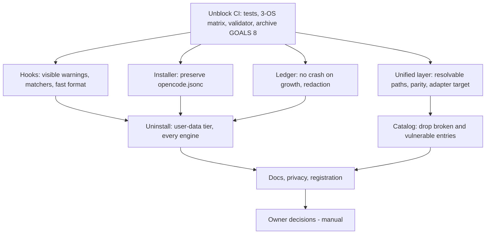
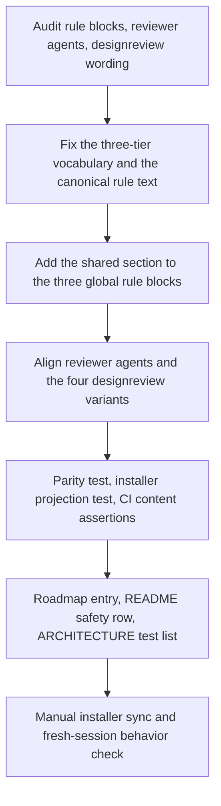
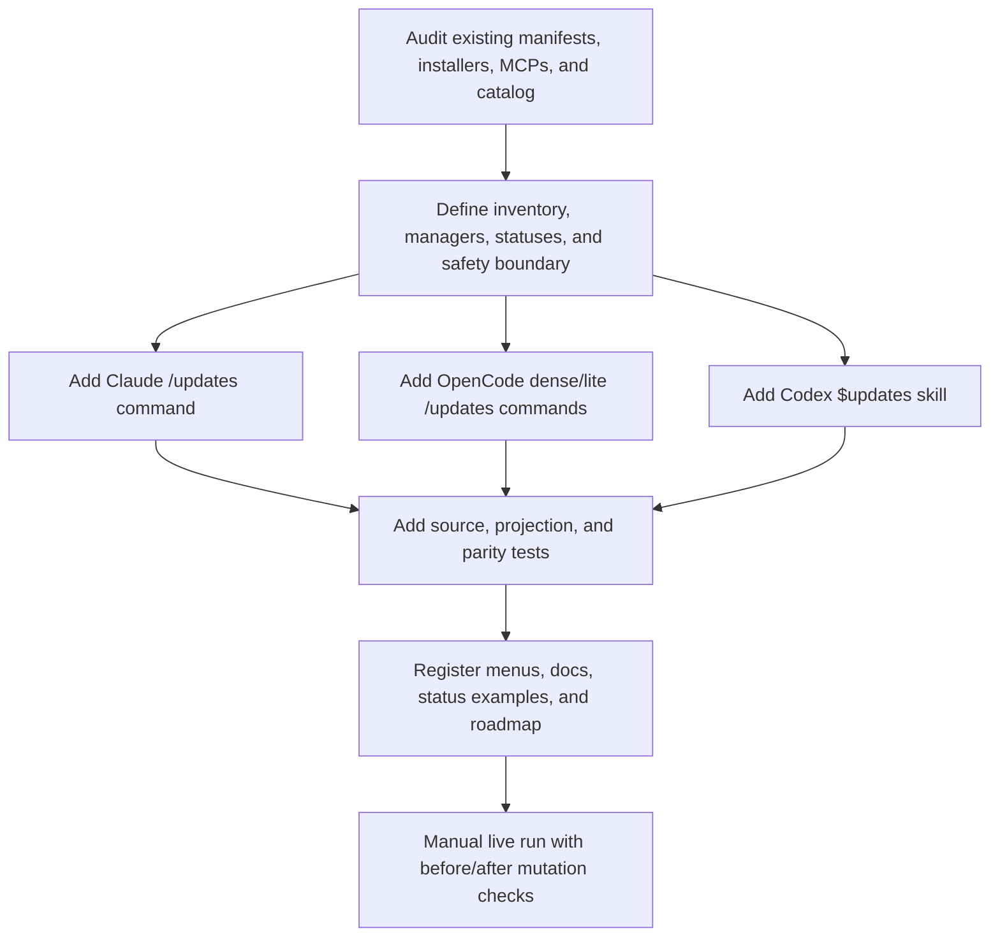
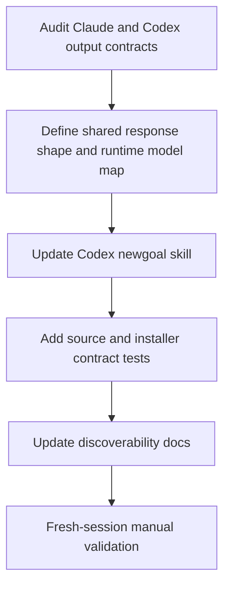
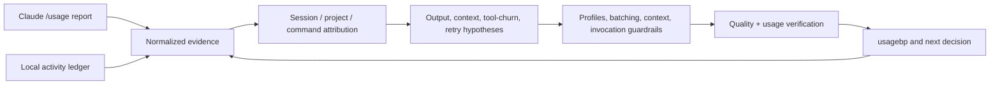

# GOALS.md — base_project
This is the active execution context for `/execgoals`. Completed plan bodies live in `dev/goals-archive/` so a planning or execution pass reads current work first, without losing the evidence behind prior decisions.

## Active plans
1. [**Audit Remediation: CI, Hooks, Installer Safety**](#goals-17-audit-remediation-ci-hooks-installer-safety) — fix the decision-free findings of `dev/auditoria-2026-09-24.md` in severity order; owner decisions stay open as `manual` items.
2. [**Screen-Control Last Resort & App-Driven UI Verification**](#goals-16-screen-control-last-resort-and-app-driven-ui-verification) — make Claude Code, Codex, and opencode test UIs through DOM-driven app tooling, treat desktop screen control as an approval-gated last resort, and ask the user for screenshots instead of capturing the desktop.
3. [**Dependency and Tool Update Report Command**](#goals-15-dependency-and-tool-update-report-command) — add a read-only `$updates`/`/updates` workflow for the base_project-managed dependency and CLI surfaces.
4. [**Codex Model Recommendation Parity**](#goals-14-codex-model-recommendation-parity) — make `$newgoal` show a runtime-correct, manual-only model + effort recommendation.
5. [**Usage Efficiency & Quality Loop**](#goals-12-usage-efficiency--quality-loop-base_project-process) — measure real usage first, then reduce waste without trading away correctness.

## Completed plans
The completed bodies for GOALS 1–11 and 13 are preserved in the [archive index](dev/goals-archive/README.md). Consult an individual archived plan only when its historic scope or evidence is relevant.

`dev/ROADMAP.md` remains the chronological decision log; this file contains only work that `/execgoals` can still execute.

---

<a id="goals-17-audit-remediation-ci-hooks-installer-safety"></a>
## GOALS 17 — Audit Remediation: CI, Hooks, Installer Safety (base_project fix)

Executes the fix-type findings of `dev/auditoria-2026-09-24.md` (F1–F14) that need no product
decision, ordered by severity and dependency. Every item states repro → root cause → fix →
regression test, per `goal-types/fix.md`. Findings that need a material choice only the owner can
make — the unified layer's future, the always-on MCP set, replacement database servers,
typecheck policy, ledger retention, branch protection and the release tag — are recorded as
`manual` decision items and stay open until decided.



Suggested: opus · high — cross-cutting fixes across hooks, both installers, four command projections, and CI, where a wrong edit silently degrades every user's sessions.

### Unblock CI

- [x] **R17.1 Make the doctor test platform-independent** (`coder`) — Repro: `npm test` on Linux
  fails "doctor detects broken symlink and suggests apply --fix"; CI has been red since run #21.
  Root cause: `dev/tests/doctor.test.js` calls `doctor.js --json` through `execSync`, which throws
  when doctor correctly exits 1; on Windows the symlink cannot be created, so the fallback branch
  hides the failure. Fix: run it through `spawnSync` and assert the real contract. **Done when:**
  the test passes on Linux and asserts exit status 1, `healthy === false`, and a broken-symlink
  issue — so it fails if doctor stops reporting the broken link.
- [x] **R17.2 Restore and automate the goals-archive checksum index** (`coder`) — Repro: "completed
  GOALS archive preserves navigable bodies and recorded checksums" fails. Root cause: commit
  `0710eb5` rewrote 10 of the 11 checksums in `dev/goals-archive/README.md` with values that match
  no committed body (the bodies are unchanged since `ebb61e6`). Fix: `dev/scripts/goals-archive-index.js`
  with `--check`/`--write` recomputes the checksum column from the files, so it is never hand-edited
  again. **Done when:** the existing test passes, `--check` exits 0 on the real archive, and a
  regression test proves `--check` fails for a tampered body.
- [ ] **R17.3 Run the unit tests on all three OSes** (`coder`) — Root cause of a month of unnoticed
  red CI: tests run only on Ubuntu while validation happens locally on Windows, so platform-dependent
  tests pass on one side and fail on the other. Fix: add `npm ci` + `npm test` to the existing
  `install-test` matrix in `.github/workflows/ci.yml`. **Done when:** `dev/tests/ci-contract.test.js`
  asserts the step exists and passes; execution on Windows/macOS is confirmed by the first PR run.
- [x] **R17.4 Validator checks real item definitions** (`coder`) — Repro: two checklist items
  both defined as `S16.1` (or `H.1`) produce no finding. Root cause: `ITEM_ID` in
  `dev/scripts/validate-goals-structure.js` matched a bold span containing *only* an `A.1`-style
  ID anywhere in the text, so every real item — written with its title inside the bold, and with
  a plan-numbered ID since GOALS 14 — was never checked, while mere mentions in prose were.
  Fix: detect IDs only where a checklist line defines them, accepting both ID formats.
  **Done when:** regression tests reject duplicated titled and plan-numbered definitions, ignore
  mentions in prose, and the real `GOALS.md` still passes.
- [x] **R17.5 Archive GOALS 8** (`coder`) — every item is `[x]` but the plan is still listed as
  active. **Done when:** its body lives in `dev/goals-archive/goals-08-...md` with a checksum row
  produced by R17.2's script, the root file no longer lists it, and the structure test passes.

### Hooks

- [x] **R17.6 Deliver hook warnings through `additionalContext`** (`coder`) — Repro: five identical
  tool calls or a malformed `GOALS.md` produce a warning the model never receives. Root cause:
  `loop-detect.js` and `validate-goals.js` write to stderr and exit 0; Claude Code documents that
  exit-0 stderr "goes to the debug log only … Claude never sees it", and Codex ignores it too. Fix:
  print `{"hookSpecificOutput":{"hookEventName":"PostToolUse","additionalContext":…}}` on stdout —
  the shape both runtimes document for PostToolUse — and nothing when there is no warning.
  **Done when:** tests assert the stdout JSON for the warning case and empty stdout otherwise,
  and neither hook ever exits non-zero.
- [x] **R17.7 Register the edit-only hooks with an edit-tool matcher in Claude Code** (`coder`) —
  Repro: every `Read`/`Grep`/`Bash` call starts four `node` processes. Root cause:
  `install.sh`/`install.ps1` register `post-edit-format` and `validate-goals` without a `matcher`
  (the Codex projection already uses one). Fix: `"matcher": "Edit|Write|MultiEdit"` for those two
  entries in both installers. **Done when:** an install into a scratch `HOME` yields exactly one
  entry per hook with that matcher, and a second run stays idempotent.
- [x] **R17.8 Format with the project's own Biome binary, never `npx`** (`coder`) — Repro: each
  edit of a `.js/.ts/.json/.css` file costs ~500 ms with local Biome and ~900 ms plus a registry
  lookup without it. Root cause: `npx --no-install biome` in `post-edit-format.js` (in projects
  without local Biome it resolves the unrelated `biome@0.3.3` package — the pitfall this repo's own
  `CLAUDE.md` documents). Fix: walk up from the edited file to the nearest `biome.json(c)`; if found,
  run the closest `node_modules/.bin/biome` directly; otherwise do nothing. **Done when:** tests prove
  a file under a Biome config is formatted, a file without one is untouched, and no `npx` is spawned.
- [x] **R17.9 Bound the session-start git context** (`coder`) — Repro: a work tree with hundreds of
  changed files injects the whole `git diff --stat` into context. Root cause:
  `session-start-git-context.js` never caps `diffStat`. Fix: keep the first 20 lines plus a
  one-line remainder count. **Done when:** a regression test with a long diffstat gets a capped
  output.

### Installer safety

- [ ] **R17.10 Merge `opencode.jsonc` instead of replacing it** (`coder`) — Repro: an existing
  `opencode.jsonc` with the user's own `instructions` entry and MCP server loses both after
  `install.sh`; a single `//` comment makes the installer recreate the file from scratch while
  printing "other keys preserved". Root cause: the `jq`/`ConvertFrom-Json` step assigns `.instructions`
  and `.mcp` wholesale and treats JSONC as invalid JSON. Fix: one Node helper,
  `dev/scripts/install-opencode.js`, called by both installers — tolerant JSONC parsing, targeted
  text edits that keep comments outside the edited values, user `instructions` and non-base_project
  MCP servers preserved, managed server names tracked in `~/.base_project/`, and an abort (never a
  reset) on unparseable input. **Done when:** regression tests cover the comment, user-MCP,
  user-instructions, fresh-file, and unparseable cases, and an install into a scratch `HOME`
  reproduces the fix end to end.

### Unified layer (fixes only — its future is R17.22)

- [ ] **R17.11 Resolve unified-layer scripts from the base_project clone** (`coder`) — Repro:
  `/bootstrap`, `/scanproject`, `/audit --agent` in any consumer project run
  `node dev/scripts/*.js`, which does not exist there. Root cause: relative paths in the Claude,
  opencode dense and opencode lite variants (the Codex skills already resolve the clone through
  `~/.base_project/repo-path.txt`). Fix: resolve `<repo>` from `repo-path.txt` in every variant, and
  make the `fix` hints printed by `doctor.js` absolute. **Done when:** a contract test fails if any
  shipped command or skill runs `node dev/scripts/...` relative to the current project.
- [ ] **R17.12 Installer parity for the unified layer and stale-command pruning** (`coder`) — Root
  cause: `install.ps1` copies 17 unified-layer scripts that cannot find `adapters.json` once
  installed (they see 0 adapters) and initializes `~/.agents`, while `install.sh` does neither; the
  stale-command prune lists also differ. Fix: stop copying the non-functional copies (the commands
  now run the clone's scripts), initialize the canonical store from both installers through the
  clone, and prune the same stale commands on both sides. **Done when:** a scratch-`HOME` install
  on Linux initializes `~/.agents` and prunes a managed `doctor.md`, and the PowerShell diff is
  reviewed line by line (no PowerShell in this environment; the Windows CI job confirms it).
- [ ] **R17.13 Project Claude Code MCP config to `.mcp.json`** (`coder`) — Root cause: the
  `claude-code` adapter writes `<project>/.claude.json`, which Claude Code does not read; its
  project-scope MCP file is `.mcp.json`. **Done when:** adapter, doctor candidates and tests use
  `.mcp.json`, and `apply`→`drift` round-trips in-sync.
- [ ] **R17.14 `sync.js` without shell interpolation, fast-forward-only pull** (`coder`) — Root
  cause: `commit` builds `git commit -m "<msg>"` through a shell (a `$(...)` in the message would
  execute) and `pull` is a plain `git pull`, although `/bootstrap` promises fast-forward only.
  Fix: `execFileSync("git", [...])` and `pull --ff-only`. **Done when:** a test commits a message
  containing `$(...)` literally and the pull uses `--ff-only`.

### Ledger

- [ ] **R17.15 Ledger readers survive a growing ledger** (`coder`) — Repro: `/usagebp` crashes
  with `Maximum call stack size exceeded` above ~125–130k events (~4 months of heavy use). Root
  cause: `Math.min(...dates)`/`Math.max(...dates)` in `usage-baseline.js` and
  `lines.push(...split)` in `diary-source.js` spread one argument per event. Fix: loops instead of
  argument spreading. **Done when:** a regression test with 200k synthetic events passes for
  `buildBaseline` and the diary parser.
- [ ] **R17.16 Redact secret-like values before writing the ledger** (`coder`) — Root cause:
  `usage-log.js` stores the start of every prompt and tool input (Bash commands with tokens,
  `Authorization` headers) in plain text, indefinitely. Fix: mask well-known token shapes and
  `key/token/secret/password=value` assignments before truncation. **Done when:** tests prove
  masking for each pattern and that file paths and ordinary commands survive unchanged.

### Uninstall

- [ ] **R17.17 Uninstall protects user data and covers every engine** (`coder`) — Root cause: the
  usage ledger lives inside the namespace Tier A calls "100% reversible by re-running the
  installer", yet it is the only source for `/diario` and cannot be restored; the Claude/opencode
  variants still look for the removed `mcp.file`/`~/.config/opencode/mcp.json` shape and ignore
  Codex, Kimi and `~/.agents`. Fix: a separate Tier D for user data (ledger, diaries) that defaults
  to keeping it, current opencode `mcp` handling, and all-engine inventory in the Claude, opencode
  dense and lite variants, matching the Codex skill. **Done when:** the deterministic contract
  harness still passes and a new contract asserts the user-data tier in all four variants.

### Catalog

- [ ] **R17.18 Remove the test fixture and the broken or vulnerable database entries** (`coder`) —
  Root cause: `marketplace-demo` is a test fixture shipped to users; `sqlite` installs
  `@modelcontextprotocol/server-sqlite`, which does not exist on npm (404), and the official Python
  server it was meant to be has an unpatched SQL injection (Trend Micro, June 2025); `postgres`
  installs `@modelcontextprotocol/server-postgres@0.6.2`, deprecated with an unpatched SQL injection
  that bypasses read-only mode (Datadog Security Labs). Fix: remove the three entries and their
  profile references; replacements are the owner's call (R17.24). **Done when:**
  `npm run validate:plugins` passes and no shipped doc still lists them as available.

### Docs, privacy, registration

- [ ] **R17.19 Correct documentation drift** (`coder`) — README install table, stale
  `~/.config/opencode/mcp.json` references, `/status` vs `/wpp`, the `/bootstrap` menu line, undocumented
  Kimi support, ARCHITECTURE counts and adapter map, and the uninstall tiers. **Done when:** every
  row of the audit's F11 table is either corrected or explicitly left to a manual item.
- [ ] **R17.20 Neutral example in the distributed autonomy rule** (`coder`) — the rules shipped to
  every user cite "The ERP database compatibility test", a private project. Fix: a generic example
  with the same meaning in the three rule blocks. **Done when:** the three blocks stay consistent
  and their parity tests pass.
- [ ] **R17.21 Register the remediation** (`coder`) — ROADMAP entry, ARCHITECTURE hooks/installer
  sections, README changelog, `package.json` version `1.2.0`. **Done when:** `npm run verify` and
  `npm run test:harness` pass on the final tree.

### Owner decisions (manual — stay open until decided)

- [ ] **R17.22 Decide the unified layer's future** (`manual`) — park it (recommended: 22 of its 31
  adapters reduce to an `AGENTS.md` those tools already read, and projecting files into projects
  contradicts the zero-footprint rule) or redesign it as explicit per-project adoption. Unwired
  scripts (`wizard`, `marketplace`, `history`, `tasks`, `snapshot`, `secrets`, `lint-config`,
  `context`) follow this decision.
- [ ] **R17.23 Decide the always-on MCP set** (`manual`) — `filesystem` and `git` showed zero calls
  in GOALS 9; `git` is `mcp-git@0.0.4` (individual maintainer, last release April 2025); all three
  run through unpinned `npx -y`. Options: keep only `context7`, pin versions, or both.
- [ ] **R17.24 Choose replacement database MCP servers, if any** (`manual`) — candidates need a
  trust decision (for Postgres, the patched `@zeddotdev/postgres-context-server` ships no `bin`,
  so it is not an `npx` drop-in).
- [ ] **R17.25 Decide the typecheck policy** (`manual`) — `checkJs: false` makes `tsc` report no
  type errors; enable it progressively (`// @ts-check`) or drop the step, then settle Dependabot's
  TypeScript 7 PR.
- [ ] **R17.26 Decide ledger retention** (`manual`) — raw events are kept forever; `/diario`
  depends on history, so any automatic pruning needs an owner-chosen window.
- [ ] **R17.27 Protect `main` and cut the release** (`manual`) — require the `validate` and
  `install-test` checks before merge (GitHub settings), merge the Dependabot action/Biome PRs once
  CI is green, and tag `v1.2.0`.

### Explicitly out of scope

- A single Node installer core with an install manifest, generated command variants, and Claude
  Code plugin packaging (audit §6.1–6.3): architectural changes to plan separately.
- Rewriting archived GOALS bodies or `dev/ROADMAP.md` history to remove private project details:
  archived bodies are immutable by design; that clean-up is part of R17.22's broader call.

### Sources consulted

- `dev/auditoria-2026-09-24.md` — findings F1–F14, measurements, and reproduction steps.
- [Claude Code hooks](https://code.claude.com/docs/en/hooks) — exit-0 stderr never reaches Claude;
  `additionalContext`; matchers; hooks run in parallel.
- [Codex hooks](https://learn.chatgpt.com/docs/hooks) — PostToolUse ignores plain stdout and accepts
  `hookSpecificOutput.additionalContext`.
- [Claude Code MCP](https://code.claude.com/docs/en/mcp) — project-scope servers live in `.mcp.json`.
- [Datadog Security Labs](https://securitylabs.datadoghq.com/articles/mcp-vulnerability-case-study-SQL-injection-in-the-postgresql-mcp-server/) — Postgres reference server read-only bypass.
- [Trend Micro](https://www.trendmicro.com/en_us/research/25/f/why-a-classic-mcp-server-vulnerability-can-undermine-your-entire-ai-agent.html) — SQLite reference server SQL injection, won't be fixed.

---

<a id="goals-16-screen-control-last-resort-and-app-driven-ui-verification"></a>
## GOALS 16 — Screen-Control Last Resort & App-Driven UI Verification (base_project feature)

No shipped rule says anything about *how* an agent may look at or drive a running app. Both
runtimes now ship two very different modes: **screen control** (Claude Code's `computer-use`
MCP server / Codex **Computer Use** — capture the screen, click and type by pixel coordinates,
take over the foreground) and **app-driving tooling** (Claude Code's Browser pane and Claude in
Chrome / Codex `@Browser` and its Chrome extension, plus Playwright MCP — drive the app through
its DOM/accessibility tree with typed inputs and read state back as text, console, and network).
The owner's experience is that screen control rarely resolves anything while the app-driving
mode is genuinely useful. This goal adds one shared rule section to the three global rule blocks
(Claude Code, opencode, Codex) so every runtime tests UIs through the app-driving tooling by
default, treats screen control as an approval-gated last resort, and asks the user for a
screenshot instead of capturing the desktop — then aligns the reviewer agents and `/designreview`
wording, proves parity and installer projection with tests, and registers the change.



Suggested: sonnet · high — the edits are text-only, but the block must stay byte-identical across three runtimes, every existing parity test must stay green, and the wording has to be precise enough that a live model actually picks the browser tooling over screen control (Codex equivalent: gpt-5.6-sol · high).

### Design rationale

- [x] **S16.1 Fix the three-tier vocabulary before touching any file** (`architect`) — every
  later item, test, and doc reuses exactly these names; no synonyms.
  - **Tier 0 — non-visual proof:** the project's own tests and CLI output, direct HTTP/API calls
    (`curl`), logs. Always first.
  - **Tier 1 — app-driving tooling** (the default for any UI check): tools that drive the running
    app through its DOM/accessibility tree with typed inputs and read state back as text.
    *Claude Code:* the Browser pane (`preview_start` with `.claude/launch.json`, `navigate`,
    `find`, `read_page`, `get_page_text`, `form_input`, `computer` with element `ref`s,
    `read_console_messages`, `read_network_requests`), Claude in Chrome
    (`mcp__claude-in-chrome__*`), the Playwright MCP from the `/plugins` catalog (entry
    `playwright`: accessibility tree, no vision), and the iOS Simulator pane. *Codex:* `@Browser`
    (the desktop app's built-in Browser — documented as unavailable in Codex CLI and the IDE
    extension), the Browser extension for Chrome, Playwright MCP. *opencode:* Playwright MCP plus
    the project's test runner.
  - **Tier 2 — screen control** (last resort, approval-gated): desktop computer use — screen
    capture, clicks/typing by pixel coordinates, foreground takeover. *Claude Code:* the
    `computer-use` MCP server (`mcp__computer-use__*`: `screenshot`, `left_click`, `type`, `key`,
    `open_application`, `request_access`), enabled via Desktop **Settings > General > Computer
    use** or CLI `/mcp`. *Codex:* **Computer Use** (Plugins > Computer Use; Settings > Computer
    use; "Always-allowed apps"; macOS since April 2026, Windows since May 2026, foreground
    takeover on Windows). *opencode:* any desktop-control MCP.
  **Done when:** the architect confirmed the tiers and the per-runtime mapping above and every
  later item cites them by these names.
- [x] **S16.2 Adopt the canonical rule text** (`architect`) — the block below is the research
  deliverable; S16.5 copies it verbatim. Bullets are single unwrapped lines on purpose: the
  existing "Batching and stopping" parity test proves a shared block by exact string match across
  the three global files, and this block is tested the same way (S16.8). No runtime-specific name
  appears inside it — those go in the per-runtime bullet that follows it (S16.5).

  ```markdown
  ### UI verification & screen control
  - Verify behavior through the most precise channel first: the project's own tests and CLI output, direct HTTP/API calls, and logs; then app-driving tooling that drives the running app through its DOM/accessibility tree — typed inputs, form fills, element references, page text, console and network reads. That tooling is the default way to test a UI: drive the flow end to end with it before considering anything else.
  - Screen control (desktop computer use: capturing the screen and clicking or typing by pixel coordinates, taking over the foreground) is a last resort, not a testing tool — it rarely produces a reliable result. Use it only when the target is a native app with no DOM, API, CLI, or test path, and only after stating why nothing else can reach it and getting the user's explicit go-ahead for that specific task in chat; never because it is available or looks quicker, and never as a fallback when the app-driving tooling reports a problem.
  - Never take desktop screenshots on your own initiative. When a visual check is genuinely needed (layout, rendering, what the user actually sees), ask the user for a screenshot and say exactly which window, state, and viewport it should show; keep working from tests, DOM, text, and console evidence meanwhile. Page captures produced by the app-driving tooling itself are not screen control, but take them only when the check is visual by nature (a design review at several viewport widths) or the user asked for one — otherwise read the state as text.
  ```

  **Done when:** the architect confirmed the block states exactly the three rules the owner asked
  for (app-driving tooling is the testing default; screen control only when entirely necessary
  and explicitly approved; screenshots are requested from the user) and nothing else, and that
  no `/`- or `$`-spelled command name is inside the shared block (it would break exact parity
  between Claude/opencode and Codex spellings).
- [x] **S16.3 Decide placement and the single cross-reference** (`architect`) — the section
  goes immediately after `### Self-Correction` and before `### Task Sizing & Response
  Discipline` in all three files (it is a verification rule, so it sits next to the rule that
  says "run the project's own tests"). One cross-reference only: in the **Tiered autonomy**
  bullet of each file, extend the human-in-the-loop list "sensitive data, credentials, or
  external publication" to "sensitive data, credentials, external publication, or screen control
  (see *UI verification & screen control*)". No other existing sentence is reworded.
  **Done when:** the three files show the same section order and the same cross-reference, and
  `git diff` touches no other section.
- [x] **S16.4 Confirm the "screenshots → ask the user" interpretation** (`manual`) — assumption
  taken by this plan: *desktop* captures are never taken by the agent; *page captures* produced
  inside the app-driving tooling (Browser pane / `@Browser` rendering a page at a viewport width)
  stay allowed only when the check is visual by nature (`/designreview` at several widths) or the
  user asked for one. This keeps `/designreview` working as designed. If the owner wants page
  captures gated behind asking too, drop the last sentence of the third bullet in S16.2 (in all
  three files) and change S16.7's clause to "ask the user for screenshots at those widths".
  **Done when:** the owner's answer is recorded on this item before S16.5 starts. **Proof:** asked via AskUserQuestion on 2026-09-16; owner chose "Continuar automático (recomendado)" — desktop screenshots are always requested from the user, page captures produced by the app-driving tooling itself (e.g. `/designreview` at several widths) stay automatic. S16.2's third bullet and S16.7's clause are implemented as originally drafted, no rewording needed.

### Implementation

- [x] **S16.5 Add the shared section to the three global rule blocks** (`coder`) — files:
  `source/CLAUDE.md`, `source/opencode-instructions.md`, `source/codex/AGENTS.md`. Insert the
  S16.2 block verbatim at the S16.3 position, then one runtime-specific bullet directly under it
  (outside the exact-parity string), then apply the S16.3 cross-reference (note the Claude and
  opencode sentence is hard-wrapped across two lines; Codex's is one line):
  - `source/CLAUDE.md`: `- In Claude Code, app-driving tooling means the Browser pane (`preview_start` with `.claude/launch.json`, `navigate`, `find`, `read_page`, `get_page_text`, `form_input`, `computer` with element refs, `read_console_messages`, `read_network_requests`), Claude in Chrome, a Playwright MCP from `/plugins`, and the iOS Simulator pane; screen control means the `computer-use` MCP server (`mcp__computer-use__*`, Desktop **Settings > General > Computer use**, CLI `/mcp`). Ask for screenshots as an image pasted or dropped into the prompt.`
  - `source/opencode-instructions.md`: `- In opencode, app-driving tooling means a Playwright MCP from `/plugins` (accessibility tree, no vision) plus the project's own test runner; any desktop-control MCP is screen control. Ask for screenshots as an image attached to the prompt.`
  - `source/codex/AGENTS.md`: `- In Codex, app-driving tooling means `@Browser` (the desktop app's built-in Browser), the Browser extension for Chrome, and a Playwright MCP from `$plugins`; in Codex CLI, where `@Browser` is unavailable, fall back to Playwright MCP or the project's tests — not to Computer Use. Screen control means **Computer Use** (Plugins > Computer Use, Settings > Computer use, Always-allowed apps). Ask for screenshots as an attached image (`codex -i <file>` in the CLI).`
  Keep Codex's `$` spelling and Claude/opencode's `/` spelling in the runtime bullets only. Kimi
  Code CLI receives the Claude block unchanged through `~/.kimi/AGENTS.md`, as it does for every
  other rule — no Kimi-specific wording.
  **Done when:** `### UI verification & screen control` occurs exactly once in each file, the
  shared block is found exactly once per file by the same `split(block).length - 1 === 1`
  technique the Batching test uses, the runtime bullet follows it, and the existing parity tests
  (`Batching and stopping`, `quality-per-token`) still pass. **Proof:** verified programmatically — block-count 1 in all three files, correct Self-Correction→UI verification→Task Sizing ordering, human-in-the-loop list mentions "screen control" in all three; `node --test dev/tests/codex.test.js dev/tests/usage-envelope.test.js` passed 21/21 including "Batching and stopping guidance has exact parity" and "global instruction layers share the quality-per-token policy".
- [x] **S16.6 Align the reviewer agents' behavioral-proof wording** (`coder`) — the gate today
  lists "a screenshot" as acceptable proof, which the new rule would contradict.
  `source/claude/agents/reviewer.md` and `source/opencode/agent/reviewer.md` (gate 4): replace
  "(a passing test, a real command's output, a screenshot)" with "(a passing test, a real
  command's output, a state read through the app-driving tooling, or a screenshot the user
  provided — never one taken by screen control)". `source/codex/agents/reviewer.toml`: extend
  the "Behavioral proof" line with the same evidence list. **Done when:** no reviewer definition
  lists a bare "screenshot" as proof and the three files carry the same evidence list. **Proof:** all three reviewer definitions (`source/claude/agents/reviewer.md`, `source/opencode/agent/reviewer.md`, `source/codex/agents/reviewer.toml`) now contain "screenshot the user provided" and no longer contain a bare "a screenshot)" as proof; `node --test dev/tests/codex.test.js` still passed 6/6.
- [x] **S16.7 Make `/designreview`'s capture step explicitly browser-tooling-only** (`coder`) —
  the four variants already say "use browser/preview tooling to open it, screenshot it at a few
  widths"; make the boundary explicit so a runtime with Computer Use enabled cannot read it as
  permission to control the screen. `source/claude/commands/designreview.md` (step 1),
  `source/opencode/command/designreview.md` (step 1), `source/opencode/command-lite/designreview.md`
  (the Live URL bullet), `source/codex/skills/designreview/SKILL.md` (step 1): add "(page
  captures from that browser/preview tooling — never desktop screen control; if no such tooling
  is available, ask the user for screenshots at those widths instead)". **Done when:** all four
  variants carry the clause, the four still describe the same procedure, and the existing
  `dev/tests/codex.test.js` skill/menu assertions and `npm run test:harness` still pass. **Proof:** all four designreview variants (Claude, OpenCode dense, OpenCode lite, Codex skill) contain "never desktop screen control" (line-wrapped in the two dense variants, verified whitespace-insensitively); `node --test dev/tests/codex.test.js` passed 6/6.

### Tests

- [x] **S16.8 Add `dev/tests/ui-verification-rule.test.js`** (`coder`) — `node:test`, same
  style as the "Batching and stopping" test: (a) the exact S16.2 block occurs once in each of
  `source/CLAUDE.md`, `source/opencode-instructions.md`, `source/codex/AGENTS.md`; (b) it sits
  after `### Self-Correction` and before `### Task Sizing` in each file (index comparison);
  (c) runtime vocabulary is present — Claude file matches `/computer-use/`, `/Browser pane/`,
  `/Claude in Chrome/`; Codex file matches `/@Browser/`, `/Computer Use/`, `/Browser extension/`;
  opencode file matches `/Playwright MCP/`; (d) the human-in-the-loop list in all three files
  mentions "screen control"; (e) the three reviewer definitions no longer match
  `/a real command's output, a screenshot\)/` and do match `/screenshot the user provided/`;
  (f) all four designreview variants match `/never desktop screen control/`.
  **Done when:** the test fails if the block is removed or reworded in any one file, if a
  runtime bullet goes missing, or if a reviewer/designreview file regresses — and passes on the
  edited tree. **Proof:** `dev/tests/ui-verification-rule.test.js` created with 6 assertions; `node --test dev/tests/ui-verification-rule.test.js` passed 6/6.
- [x] **S16.9 Prove Codex projection in the installer test** (`coder`) — in
  `dev/tests/codex.test.js` "Codex installer synchronizes native layers and is idempotent",
  assert the installed temporary `AGENTS.md` contains `### UI verification & screen control`
  exactly once while still containing exactly one `<!-- base_project:start -->` and the
  `user rule` line. **Done when:** the temporary-root install proves the section reaches the
  managed block without disturbing user-owned content. **Proof:** added a `### UI verification & screen control` exact-count-1 assertion to the existing installer idempotency test; `node --test dev/tests/codex.test.js` passed 6/6 including that test.
- [x] **S16.10 Add CI content assertions for the real installers** (`coder`) —
  `.github/workflows/ci.yml` `install-test` currently only checks that `$CLAUDE_HOME/CLAUDE.md`
  and `$BASE_PROJECT_CODEX_ROOT/AGENTS.md` exist. Add, in the bash matrix step,
  `grep -q "### UI verification & screen control" "$CLAUDE_HOME/CLAUDE.md"` and the same for
  `"$BASE_PROJECT_CODEX_ROOT/AGENTS.md"`; in the PowerShell (windows) step, a
  `Select-String -SimpleMatch` check on both files that fails the job when missing.
  **Done when:** CI would fail if either installer stopped projecting the section on any OS,
  and `dev/tests/ci-contract.test.js` still passes. **Proof:** added `grep -q` assertions to the bash install-test step (Linux/macOS) and `Select-String -SimpleMatch` checks that `throw` on missing content to the PowerShell (Windows) step, both against `$CLAUDE_HOME/CLAUDE.md` and the Codex `AGENTS.md`; `node --test dev/tests/ci-contract.test.js` still passed 1/1. Not run through actual GitHub Actions in this session — the assertions were verified by direct inspection of the workflow diff and match the existing steps' syntax exactly.
- [x] **S16.11 Run the full local quality gate** (`reviewer`) — `npm run verify` (Biome,
  typecheck, plugin schema, unused deps, full `node:test` suite, prod audit), `npm run
  test:harness`, `node dev/scripts/validate-goals-structure.js GOALS.md`, `git diff --check`,
  and the language-drift check from the project `CLAUDE.md`
  (`grep -nE "\b(não|para|você|projeto|arquivo)\b" source/**/*.md` must still match only the
  `command-menu.md` files and the `diario` example blocks). **Done when:** every check passes
  and the outputs are recorded on this item. **Proof:** `npm run verify` — Biome (clean), typecheck (clean), plugin schema validation (clean), unused-dependency check (clean), `node --test dev/tests/*.test.js` 134/135 passed, `npm audit --omit=dev --audit-level=high` 0 vulnerabilities. `npm run test:harness` passed 12/12 artifacts and 16/16 scenarios. `node dev/scripts/validate-goals-structure.js GOALS.md` OK. `git diff --check` clean. Language-drift grep matched only `command-menu.md` (all three engines) and the two `diario.md` files, as expected. **One pre-existing, unrelated failure found and left as-is:** "completed GOALS archive preserves navigable bodies and recorded checksums" (`dev/tests/validate-goals-structure.test.js:101`) — 10 of 11 recorded SHA-256 checksums in `dev/goals-archive/README.md` (GOALS 1–11, all except GOALS 13) don't match their archived file's actual hash. `dev/goals-archive/` was never touched this session (confirmed via `git status`), so this predates GOALS 16 and is out of scope here; also found that GOALS.md itself was accidentally converted to CRLF by an earlier Python write step in this session (Windows text-mode default) and was normalized back to LF to match `.gitattributes`, which is what fixed the sibling "active GOALS.md stays structurally valid" test.

### Registration

- [x] **S16.12 Record the decision in the chronological roadmap** (`coder`) — `dev/ROADMAP.md`
  item 53, in the file's own language: the three tiers, the files touched, the approval gate,
  the screenshot rule, and the honest limits — structural tests do not prove live obedience, and
  hook-based enforcement was deliberately left out (see out of scope). **Done when:** the entry
  exists, links this goal, and does not claim live validation before S16.15 produced it. **Proof:** `dev/ROADMAP.md` item 53 added, describing the three tiers, files touched, the approval gate, the screenshot rule, the CI content assertions, and the honest limits (structural tests only, S16.15 still pending, hook enforcement out of scope, and the unrelated pre-existing checksum issue found and spun off separately).
- [x] **S16.13 README safety row and ARCHITECTURE test list** (`coder`) — `README.md`
  `## 🛡️ Safety` table: add the row **Screen control is a last resort** — "the global rules make
  every runtime test UIs through DOM-driven browser tooling and the project's own tests; desktop
  computer use needs your explicit per-task go-ahead, and screenshots are requested from you
  rather than captured". `ARCHITECTURE.md` §8 test list: add `ui-verification-rule.test.js`.
  **Done when:** both files mention it, checked directly, not assumed from the diff. **Proof:** `README.md`'s Safety table has the new "Screen control is a last resort" row; `ARCHITECTURE.md` §8's test list now includes `ui-verification-rule.test.js`; both verified by direct read after the edit.
- [x] **S16.14 Sync the installed copies on this machine** (`manual`) — after the source edits,
  run `dev\scripts\install.ps1` (the project's rule: editing `source/` alone changes nothing
  installed), then verify `~/.claude/CLAUDE.md` and `~/.codex/AGENTS.md` contain the heading
  exactly once and `~/.config/opencode/opencode.jsonc` still references
  `opencode-instructions.md`. Human-in-the-loop because it rewrites global config outside the
  repository. **Done when:** the owner confirmed the run and the three checks pass. **Proof:** owner confirmed via AskUserQuestion on 2026-09-16; ran `dev\scripts\install.ps1` from this worktree (so the just-edited `source/` was the sync source) against the real `$HOME`; it completed with no errors (only pre-existing unrelated warnings: Kimi Code CLI not installed, MCP servers already registered). Verified directly: `~/.claude/CLAUDE.md` and `~/.codex/AGENTS.md` each contain `### UI verification & screen control` exactly once and exactly one `<!-- base_project:start -->` marker each; `~/.config/opencode/opencode.jsonc` still references `opencode-instructions.md`.
- [ ] **S16.15 Fresh-session behavior check in both runtimes** (`manual`) — in a new Claude
  Code session and a new Codex session, on a disposable local web app with one button: (a) "test
  the button flow" must be done through the Browser pane / `@Browser` (element refs, page text,
  console) with no `request_access`/`screenshot` call from `computer-use` and no Computer Use
  activation; (b) "does the header look right at mobile width?" must produce a request for a
  screenshot (or, with the S16.4 carve-out kept, a page capture only inside the browser tooling),
  never a desktop capture; (c) a request that only a native app could satisfy must produce a
  stated reason and a question before any screen control. Record date, model, and the observed
  tool calls; a mismatch is a wording defect to fix in S16.5, not a reason to add enforcement
  silently. **Done when:** the observed behavior matches the rule, or a concrete runtime
  limitation is recorded instead of claiming success.

### Explicitly out of scope

- Turning screen control off at the app level — Claude Desktop **Settings > General > Computer
  use** / **Denied apps**, CLI `/mcp` disable; Codex Plugins > Computer Use toggle, Settings >
  Computer use, admin `requirements.toml` `[features].computer_use = false`. These are the owner's
  own settings, recorded here so the option is not lost; `/execgoals` never changes them.
- Deterministic enforcement through a `PreToolUse` hook that denies `mcp__computer-use__*`
  calls unless a consent marker exists. Stronger than a prompt rule, but it is a hook feature
  with its own design (consent mechanism, Codex hook parity, escape hatch) — a separate goal if
  S16.15 shows the rule alone is not obeyed.
- Any change to what the app-driving tooling does, to `.claude/launch.json` generation, to the
  Playwright catalog entry, to command count, menus, or `/status` output.
- Treating a passing string/structure test as proof that a live model obeys the rule; S16.15
  stays a separate manual check, as M14.8 did.

### Sources consulted

- [Let Claude use your computer from the CLI](https://code.claude.com/docs/en/computer-use) —
  the `computer-use` MCP server, per-app session approval, screenshots + coordinate clicks, and
  the documented tool order (MCP → Bash → Claude in Chrome → computer use; "screen control is
  reserved for things nothing else can reach").
- [Claude Code Desktop](https://code.claude.com/docs/en/desktop) — "Preview your app" (Browser
  pane, `.claude/launch.json`, DOM inspection, clicks, forms), "Let Claude use your computer"
  (**Settings > General > Computer use**, **Denied apps**), "App permissions" tiers, and the
  iOS Simulator pane that replaces screen control for iOS.
- [Codex Computer Use](https://learn.chatgpt.com/docs/computer-use) — screenshots, clicks and
  typing, Windows foreground takeover, Plugins > Computer Use, Settings > Computer use,
  "Always-allowed apps", `[features].computer_use = false`.
- [Codex Browser extension](https://learn.chatgpt.com/docs/chrome-extension) and
  [Codex Browser (`@Browser`)](https://developers.openai.com/codex/app/browser) — DOM-driven
  browser use (open a local page, find a button, click it, verify the page text changed),
  per-host approval, unavailable in Codex CLI/IDE extension.
- [Codex CLI features](https://developers.openai.com/codex/cli/features) — image input via
  `--image`/`-i` for user-provided screenshots.
- Codex Computer Use on Windows shipped 2026-05-29 (Codex app 26.527), macOS in April 2026 —
  [TechTimes](https://www.techtimes.com/articles/317531/20260601/openai-codex-computer-use-now-windows-foreground-takeover-europe-excluded.htm).
- Repository: `source/CLAUDE.md`, `source/opencode-instructions.md`, `source/codex/AGENTS.md`
  (no existing rule on the topic), `source/*/agents/reviewer.*` (gate 4 lists "a screenshot"),
  the four `designreview` variants, `dev/tests/codex.test.js` ("Batching and stopping" exact
  parity + installer projection pattern), `dev/tests/usage-envelope.test.js` (regex parity
  pattern), `.github/workflows/ci.yml` (`install-test` existence-only assertions),
  `dev/scripts/install.ps1` (`Sync-InstructionBlock`, Kimi projection),
  `dev/scripts/install-codex.js` (managed block), `source/plugins.json` (`playwright` entry).

---

<a id="goals-15-dependency-and-tool-update-report-command"></a>
## GOALS 15 — Dependency and Tool Update Report Command (base_project feature)

The project currently checks npm dependencies through CI/Dependabot and installs several
global tools, but no user-facing command gives one read-only report for the complete
base_project-managed surface. This goal adds `/updates` for Claude Code and OpenCode and
`$updates` for Codex. It is deliberately separate from `/update`/`$update`, which pulls and
reinstalls base_project itself after confirmation.



Suggested: gpt-5.6-sol · high — the command spans four runtime projections, multiple package managers, registry lookups, and a strict no-mutation guarantee.

### Design rationale

Suggested: gpt-5.6-sol · high — the highest-risk decision is defining truthful status semantics across npm, uv/pipx, OS package managers, floating npx MCPs, and optional catalog entries.

- [x] **U15.1 Settle the command boundary and name** (`architect`) — use `/updates` and
  `$updates`, keeping `/update` and `$update` reserved for pulling the base_project repository
  and rerunning its installer. The new command must inspect base_project-managed dependencies
  from the repository recorded in `~/.base_project/repo-path.txt`, not silently scan or modify
  the unrelated project in which the command was invoked. **Done when:** the architect records
  the naming decision, invocation scope, and the explicit distinction between reporting and
  upgrading before implementation begins.
- [x] **U15.2 Define the inventory of things to check** (`architect`) — cover the sources that
  already own each dependency instead of inventing a second manifest:
  - root `package.json` plus `package-lock.json`: direct npm dependencies
    (`ajv`, `ajv-formats`) and devDependencies (`@biomejs/biome`, `typescript`), with
    transitive lockfile updates reported through npm's `--all` mode;
  - installer-managed global tools: Node.js/npm, Git, GitHub CLI (`gh`), Graphify
    (`graphifyy` providing `graphify`), Repomix, global Biome, global TypeScript, and `jq`
    where the Unix installer needs it;
  - always-on MCP packages from `source/opencode/mcp.json` (`@upstash/context7-mcp`,
    `@modelcontextprotocol/server-filesystem`, and `mcp-git`), reported as floating/on-demand
    packages when no local version is pinned;
  - optional catalog entries from `source/plugins.json` only when detected as installed, or
    when an explicit `all` argument requests catalog visibility. Entries with no reliable
    installed-version signal must be shown as unknown, never falsely marked current or
    outdated.
  **Done when:** every listed item maps to a concrete source file, detection method, and
  honest unavailable/not-installed state; the old `check-plugin-updates.js` stub is not treated
  as a full registry update check without first proving its behavior.
- [x] **U15.3 Choose read-only checks per manager** (`architect`) — use native commands and
  preserve their exit/output semantics:
  - `npm outdated --json --all` in the base_project repository for manifest and lockfile
    packages, and `npm outdated --global --json` filtered to installer-managed npm CLIs;
  - `uv tool list --outdated` for uv-managed Python tools and `pipx list --outdated` for
    pipx-managed tools, including `graphifyy` when installed by either route;
  - Windows `winget list --upgrade-available`, macOS/Linux `brew outdated --json=v2` when
    Homebrew is present, and Linux `apt list --upgradable` when apt is the relevant source,
    filtering results to the required host/CLI tools instead of dumping every OS package;
  - registry metadata lookup such as `npm view <package> version --json` for npx MCP entries
    that have no installed version to compare;
  - local `~/.github`/Dependabot configuration inspection for GitHub Actions coverage rather
    than calling a credentialed API. Never use `npm update`, `pip install`, `pipx upgrade`,
    `uv tool upgrade`, `winget upgrade`, `brew upgrade`, `apt upgrade`, `git pull`, or an
    installer as part of the report.
  **Done when:** each manager has a command that is demonstrably non-mutating, a fallback or
  `unsupported` result when it is absent, and a rule for interpreting non-zero "updates found"
  exits as data rather than command failure.
- [x] **U15.4 Define the report contract** (`architect`) — produce concise user-language output
  grouped by `core npm`, `global tools`, `MCPs`, `optional catalog`, and `automation coverage`.
  Each row should expose component/package, manager/source, installed or current version,
  wanted/latest version when available, and one status: `current`, `update-in-range`,
  `major-update`, `floating/latest-on-use`, `not-installed`, `unknown`, `unsupported`, or
  `check-failed`. Continue checking independent groups after one network/tool error and finish
  with a count plus concrete manual follow-up commands; do not persist a report or credentials.
  **Done when:** the output distinguishes a compatible update from a major update, a floating
  npx package from an installed package, and an unavailable checker from an up-to-date result.
- [x] **U15.5 Preserve safety and privacy boundaries** (`architect`) — the command is read-only,
  may query public registries, must not require secrets, must not read `.env` values, must use
  bounded command/network attempts, and must not write manifests, locks, caches, settings,
  global configuration, or generated project artifacts. State that applying any update is a
  separate manual action and that this command does not upgrade anything. **Done when:** the
  design includes explicit before/after mutation checks for manual validation and no command
  path can be mistaken for an upgrade path.

### Implementation

Suggested: gpt-5.6-sol · high — the implementation must keep the same safe behavior across Claude, OpenCode dense/lite, and Codex while preserving runtime-specific syntax.

- [x] **U15.6 Add the Claude command** (`coder`) — create
  `source/claude/commands/updates.md` with the settled inventory, manager checks, report
  statuses, public-registry/network error handling, and the no-install/no-pull boundary. The
  command must honor optional `all` scope without making the default report noisy.
  **Done when:** a Claude user can invoke `/updates` from any project and it resolves the
  base_project repository before checking its managed surfaces.
- [x] **U15.7 Add OpenCode dense and lite projections** (`coder`) — create semantic mirrors at
  `source/opencode/command/updates.md` and `source/opencode/command-lite/updates.md`. Keep the
  same checks, statuses, `all` behavior, and safety contract; only the surrounding instruction
  density/format may differ. **Done when:** both OpenCode profiles expose `/updates` and neither
  can accidentally turn a report into an install or upgrade operation.
- [x] **U15.8 Add the Codex-native skill** (`coder`) — create
  `source/codex/skills/updates/SKILL.md` with `$updates` invocation, the same source inventory,
  manager commands, status meanings, and manual-only boundary. Use Codex-native wording and
  preserve the global planning/safety rules. **Done when:** the Codex installer projects the
  skill and the skill does not use Claude-only command or model vocabulary.

### Tests

Suggested: gpt-5.6-terra · medium — the main risk is contract drift and unsafe verbs, which can be covered deterministically before one live network check.

- [x] **U15.9 Add focused update-command contract tests** (`coder`) — create
  `dev/tests/updates.test.js` to assert all four source variants contain the complete managed
  inventory, native manager checks, status vocabulary, language/output instruction, and explicit
  no-mutation terms. Assert that `/update`/`$update` remains the base_project pull path and that
  the new command does not instruct `upgrade`, `install`, `pull`, or lockfile mutation. Add an
  invariant for Claude/OpenCode dense/lite/Codex semantic parity.
  **Done when:** the test fails if a runtime loses Graphify, global npm tools, MCPs, optional
  scope, or the read-only boundary, without requiring network access or real credentials.
- [x] **U15.10 Verify source-to-installed projections** (`coder`) — extend the existing
  installer/projection coverage so the Claude command, both OpenCode command profiles, and
  Codex skill are present in temporary roots after installation and preserve user-owned files.
  **Done when:** all four installed surfaces contain the new command and repeated installation is
  idempotent.
- [x] **U15.11 Run the complete local quality gate** (`reviewer`) — run the repository's own
  `npm test`, `npm run lint`, `npm run typecheck`, `npm run validate:plugins`,
  `npm run check:unused-deps`, `npm run test:harness`, `node dev/scripts/validate-goals-structure.js GOALS.md`,
  and `git diff --check`. **Done when:** all pass, the command count increases consistently,
  and no unrelated dirty work is staged, reverted, or rewritten.
  Proof (2026-09-09): `npm run verify` passed (Biome, TypeScript, plugin schema, unused-deps,
  129 tests, production audit with 0 vulnerabilities); `npm run test:harness` passed 12/12
  artifacts and 16/16 scenarios; GOALS structure and `git diff --check` passed. Existing
  GOALS 14 edits remain uncommitted and were preserved.
- [ ] **U15.12 Perform a live manual read-only check** (`manual`) — after installation, run
  `/updates` or `$updates` from a harmless disposable project on a machine with the available
  package managers. Record the date, checker availability, and a representative result such as
  the installed Graphify version versus the registry version. Verify before/after that no
  repository, package manifest, lockfile, settings, or global package version changed.
  **Done when:** the command produces a truthful grouped report and any limitation (network,
  manager missing, or version source unavailable) is recorded instead of claiming full coverage.

### Registration

Suggested: gpt-5.6-terra · medium — registration is repetitive but must keep four projections, menus, docs, and command-count references synchronized.

- [x] **U15.13 Register the command everywhere users discover workflows** (`coder`) — add the
  entry to `source/claude/references/command-menu.md`,
  `source/opencode/references/command-menu.md`, and
  `source/codex/references/command-menu.md`; update the user-facing command tables in
  `README.md` and `source/codex/README.md`; add `updates` to the dynamic/status examples in
  the Claude, OpenCode, and Codex status projections; and update any stale 20/21 command/skill
  wording so the resulting count is accurate everywhere.
  **Done when:** each engine's menu, selector/skill directory, status listing convention, and
  README point to the same `/updates`/`$updates` behavior.
- [x] **U15.14 Record the decision and maintenance source** (`coder`) — add a concise
  `dev/ROADMAP.md` entry pointing to GOALS 15, the manager-specific read-only checks, the
  source-of-truth files, and the limitation that optional/catalog or OS-managed versions may be
  unknown. Keep `dev/scripts/check-plugin-updates.js`'s historical contract documented rather
  than silently claiming it now covers every dependency unless implementation explicitly proves
  that change.
  **Done when:** a future maintainer can add a new installer-managed tool or MCP and see exactly
  which source and test contract must be updated.

### Execution evidence (2026-09-09)

- **U15.1–U15.5:** all four source projections resolve the recorded base_project repository,
  derive their inventory without a duplicate manifest, name the native read-only checks and
  eight status values, prohibit mutation and `.env` reads, and require before/after state
  comparison for the manual live validation.
- **U15.6–U15.8:** added managed Claude, OpenCode dense/lite, and Codex `$updates` artifacts.
  They support default installed-only optional scope and literal `all` catalog scope while
  keeping the existing pull-and-installer update command distinct.
- **U15.9:** `dev/tests/updates.test.js` asserts every required package/tool/MCP, manager check,
  output group/status, safety boundary, manual comparison, and existing `/update`/`$update`
  pull path. It is deterministic and requires no network or credentials.
- **U15.10:** CI's POSIX and Windows throwaway-home expectations now require the Claude,
  OpenCode dense/lite, and Codex `updates` artifacts. `dev/tests/codex.test.js` additionally
  verifies a byte-identical Codex skill after repeated temporary-root installation and the
  21-skill count.
- **U15.13–U15.14:** all menus, status examples, user docs, architecture tables and command
  counts register the same read-only behavior; ROADMAP item 52 preserves the source and
  maintenance decision, including the historical plugin-pin helper limit.

### Explicitly out of scope

- Automatically installing, upgrading, pulling, pinning, or changing any dependency, CLI,
  MCP, plugin, manifest, lockfile, cache, setting, or global configuration.
- Replacing `/update`/`$update`, `/audit`/`$audit`, `/status`/`$status`, or the existing
  `check-plugin-updates.js` historical helper.
- Running vulnerability audits, secret scans, or arbitrary checks against every project on the
  machine; `$audit` and project-specific commands retain those responsibilities.
- Adding a scheduler, background monitor, cloud service, credentialed GitHub integration, or
  auto-merge/update policy.
- Treating an optional catalog entry with no reliable installed-version signal as current or
  outdated by inference.

### Sources consulted

- `package.json`, `package-lock.json`, `dev/scripts/install.ps1`, and `dev/scripts/install.sh`
  — current npm dependencies and globally installed tool paths.
- `source/opencode/mcp.json`, `source/plugins.json`, and `dev/scripts/check-plugin-updates.js`
  — always-on MCP packages, optional catalog, and the existing historical plugin-check helper.
- `.github/dependabot.yml` and `.github/workflows/ci.yml` — current weekly npm/GitHub Actions
  automation and Node.js CI setup.
- `source/claude/commands/update.md`, `source/opencode/command/update.md`, and
  `source/codex/skills/update/SKILL.md` — the existing base_project update boundary that must
  remain separate.
- [npm outdated documentation](https://docs.npmjs.com/cli/v11/commands/npm-outdated/) — direct
  versus `--all` reporting and JSON output.
- [uv tool documentation](https://docs.astral.sh/uv/reference/cli/) — installed-tool listing
  and upgrade semantics; the command must use listing only.
- [pipx list documentation](https://pipx.pypa.io/latest/how-to/manage-installed-apps.html) —
  `pipx list --outdated` as a read-only check.
- [WinGet list documentation](https://learn.microsoft.com/en-us/windows/package-manager/winget/list)
  — `winget list --upgrade-available` without invoking the mutating upgrade command.
- [Homebrew manpage](https://docs.brew.sh/Manpage) — `brew outdated` and JSON output.

---

<a id="goals-14-codex-model-recommendation-parity"></a>
## GOALS 14 — Codex Model Recommendation Parity for `$newgoal` (base_project feature)

The Claude command already ends a successful `/newgoal` run with a localized, bold model +
effort recommendation and an explicit manual-only disclaimer. The Codex skill has a related
instruction, but its model vocabulary is still Claude-specific (`haiku`/`sonnet`/`opus`) and
does not define the visible response shape strongly enough. This goal makes `$newgoal` behave
the same way at the interaction level while using Codex's own current model names and effort
levels.



Suggested: gpt-5.6-sol · high — the change is bounded but spans Codex prompt semantics, cross-runtime contract tests, installed projection, and a live behavior check.

### Design rationale

- [x] **M14.1 Define the parity contract** (`architect`) — use the Claude final-response rule as
  the semantic reference, not as a claim that OpenCode currently emits the same visible line.
  After the path and short outline, Codex must emit exactly one localized recommendation sentence
  with one bold `<Codex model> · <effort>` pair, one reason tied to the plan's highest-complexity/
  highest-risk module, the manual-only disclaimer, and the question asking whether to continue
  with `$execgoals` or adjust the plan. **Done when:** the architect confirmed these four
  invariants and the implementation/test items encode them. Proof: read-only architecture review
  completed by the `architect` subagent; no files were edited by that review.
- [x] **M14.2 Define Codex-specific recommendation mapping** (`architect`) — keep Claude and
  OpenCode's `haiku`/`sonnet`/`opus` vocabulary unchanged, but make Codex recommend the model
  actually usable in the current Codex session: `gpt-5.6-luna · low` for mechanical routine work,
  `gpt-5.6-terra · medium` for typical implementation, `gpt-5.6-sol · high` for difficult
  multi-system work, and `gpt-6-astra · xhigh` for high-cost-of-failure work. Resolve availability
  against the models visible in the active Codex surface; fall back along Astra → Sol → Terra →
  Luna, preserve effort when supported, and disclose any fallback. Never print Claude model names
  as Codex choices. **Done when:** the architect approved this deterministic mapping and the plan
  metadata uses the selected Codex pair. Proof: current official model roles and the available
  Codex model surface were reviewed; Sol/Astra ambiguity was removed.
- [x] **M14.3 Preserve scope boundaries** (`architect`) — do not change the active model,
  reasoning setting, `fallbackModel`, global Codex configuration, billing behavior, command
  count, menu entries, or any workflow other than `$newgoal`. The recommendation remains advice
  applied by hand, never an automatic mid-session switch. **Done when:** the architect confirmed
  the out-of-scope list and no file outside the approved paths is required. Proof: the read-only
  architecture review approved this boundary.

### Implementation

- [x] **M14.4 Make the Codex final-response contract explicit** (`coder`) — update
  `source/codex/skills/newgoal/SKILL.md` so the final response cannot be satisfied by merely
  mentioning a `Suggested:` line inside `GOALS.md`: require the visible localized sentence,
  bold model/effort pair, plan-specific reason, manual-only disclaimer, and `$execgoals` versus
  plan-adjustment question. Keep the planning-only boundary and the Codex-native `$` spelling.
  Replace the Claude-only model set in the Codex-specific guidance with the approved Codex map;
  do not copy the full Claude command or add a new skill.
  **Done when:** the source skill contains one unambiguous final-response contract, uses
  Codex-compatible model identifiers, and preserves `never execute`. **Proof:**
  `source/codex/skills/newgoal/SKILL.md` now contains the explicit localized final-response
  contract and Codex model mapping.
- [x] **M14.5 Keep source and installed projections aligned** (`coder`) — rely on the existing
  `dev/scripts/install-codex.js` source-of-truth flow; do not edit `~/.agents/skills/` manually or
  change the installer for a content-only skill update. Exercise the temporary-root installer
  path so the installed Codex skill receives the same contract and existing user-owned skill
  content remains preserved. **Done when:** the temporary installed file is byte-equivalent to
  the managed source file and the existing idempotency/user-collision tests still pass. **Proof:**
  the installer test compares the temporary installed skill byte-for-byte with source and passes
  while preserving a user-owned colliding skill.

### Tests

- [x] **M14.6 Add deterministic cross-runtime contract coverage** (`coder`) — extend
  `dev/tests/codex.test.js` with a focused assertion over
  `source/claude/commands/newgoal.md`, `source/opencode/command/newgoal.md`,
  `source/opencode/command-lite/newgoal.md`, and `source/codex/skills/newgoal/SKILL.md`:
  Claude/OpenCode retain their existing model-tier contract; Codex has the visible final-output
  contract, Codex model vocabulary, localized-output instruction, and manual/no-auto-switch
  disclaimer; none loses the planning-only boundary. Assert the Codex-specific section does not
  present `haiku`/`sonnet`/`opus` as Codex models.
  **Done when:** the test fails if the Codex instruction regresses to a GOALS-only suggestion or
  to Claude model names, and it passes against all four source variants. **Proof:**
  `node --test dev/tests/codex.test.js` passed 6/6.
- [x] **M14.7 Verify the complete local quality gate** (`reviewer`) — run the repository's own
  checks after the source/test edits: `npm test`, `npm run lint`, `npm run typecheck`,
  `npm run validate:plugins`, `npm run check:unused-deps`, `npm run test:harness`, and
  `git diff --check` for the owned paths. **Done when:** all checks pass and no unrelated dirty
  work is staged, reverted, or rewritten. **Proof:** `npm run verify` passed (Biome 56 files,
  typecheck, plugin validation, unused-dependency check, full test suite 127/127, and audit with
  0 vulnerabilities); `npm run test:harness` passed 12/12 artifacts and 16/16 scenarios; GOALS
  structure and `git diff --check` passed.
- [ ] **M14.8 Confirm real Codex behavior in a fresh session** (`manual`) — after synchronization,
  invoke `$newgoal` on a disposable harmless project and inspect the actual final response. It
  must show the localized bold model + effort recommendation, a reason, the manual-only warning,
  and the execution/adjustment question; it must not change the selected model or effort. Record
  the exact observed model/effort and the session/date because prompt tests cannot prove a
  probabilistic model followed its instruction. **Done when:** the live response matches the
  contract, or a concrete Codex limitation is recorded instead of claiming success. **Proof:**
  Codex global synchronization completed successfully; the installed skill's SHA-256 matches
  the source (`D09A8898ECA6D77499C89056188BE1C28C40274E87DD208ACA3F0B7A55B88ADE`). **Current
  blocker:** opening a fresh Codex session and observing the live `$newgoal` response is still
  required; installation and structural checks do not prove model obedience.

### Registration

- [x] **M14.9 Document the runtime distinction without creating another command** (`coder`) —
  update the existing `/newgoal` description in `README.md` and the Codex integration note in
  `source/codex/README.md` to explain that the recommendation is manual and that each runtime
  uses its own model vocabulary. Do not add a menu/status entry or change the 20/20 command-skill
  parity counts. **Done when:** the existing user-facing `/newgoal` entry and Codex README agree
  with the implemented behavior and the command-count tests remain unchanged. **Proof:**
  `README.md` and `source/codex/README.md` document the runtime-specific manual mapping; stale
  21-workflow wording was corrected to 20; no menu or parity-count change was made.
- [x] **M14.10 Record the decision in the chronological roadmap** (`coder`) — add a concise
  `dev/ROADMAP.md` entry referencing this goal, the runtime-specific model mapping, the source
  paths, and the honest limit that structural tests do not prove live model obedience.
  **Done when:** the roadmap points to the shipped contract and does not imply automatic model
  routing or live validation unless M14.8 produced that evidence. **Proof:** `dev/ROADMAP.md`
  item 51 records the mapping, fallback, files, and structural-test/live-obedience limitation.

### Explicitly out of scope

- Automatic model/effort switching, model routing middleware, `fallbackModel`, or changes to
  Codex/Claude account settings.
- A new command, a model API, billing/token instrumentation, or recommendations for every
  workflow beyond `$newgoal`.
- Replacing the existing Claude/OpenCode vocabulary or pretending that Claude model names are
  valid Codex model selections.
- Treating a passing string/structure test as proof that every live model will obey the prompt;
  M14.8 remains a separate manual check.

### Sources consulted

- [OpenAI Models](https://developers.openai.com/api/docs/models) — current model roles and
  reasoning-effort ranges used to keep Codex recommendations runtime-aware; availability and
  account access remain session-dependent.
- `source/claude/commands/newgoal.md`, `source/opencode/command/newgoal.md`,
  `source/opencode/command-lite/newgoal.md`, and `source/codex/skills/newgoal/SKILL.md` — current
  source contracts and the exact parity gap.
- `dev/tests/codex.test.js` and `dev/scripts/install-codex.js` — existing cross-runtime and
  source-to-installed verification boundaries.

---

<a id="goals-12-usage-efficiency--quality-loop-base_project-process"></a>
## GOALS 12 — Usage Efficiency & Quality Loop (base_project process)

This plan turns the current Claude usage report and the existing local activity ledger into
a controlled feedback loop. The governing rule is **quality first**: token efficiency is a
secondary outcome of better context, batching, attribution, and verification. No default,
limit, model, skill, MCP, or command should be changed merely because it appears cheaper.
Any reduction must be demonstrated not to lower correctness or increase rework.

### Evidence baseline

The user-provided report for 2026-09-04 shows:

- `6.4k input`, `1.8M output`, `1.6B cache read`, and `16M cache write` tokens;
- locally calculated cost of `$16.89`, `22m` API time, and `38m` wall time;
- `session-0` at `92%` and `weekly_all-1` at `65%`.

The shared local ledger contains 82 JSONL files from 2026-08-17 through 2026-09-04:

- 829 prompt events and 12,792 tool events;
- Bash, Read, Edit, and Grep account for 84.3% of tool calls;
- 34 `/ship`, 34 `/execgoals`, and 31 `/newgoal` prompt events;
- 137 responses match a broad error-like heuristic, mostly Bash (95), but this includes
  expected negative tests and is not yet a failure rate;
- only two consecutive tool runs of length at least three were found, with a maximum of
  four, so this window does not prove a classic infinite tool loop.

These sources are not directly interchangeable. The local ledger does not record actual
input/output/cache token counts, its prompt and tool fields are truncated, and it does not
cover opencode. The product activity counter is also not the same unit as a local prompt
event. Cache reads are not automatically waste: prompt caching is designed to make repeated
context cheaper. The report therefore identifies hypotheses and urgency, not a final causal
diagnosis.

### Operating model



### Evidence and attribution

- [x] **V.1 Define a normalized usage envelope** (`coder`) — specified a small, versioned
  representation for a user-provided `/usage` report and local ledger facts. It must keep
  model, effort, session, time window, uncached input, output, cache read/write, estimated
  cost, API/wall time, and limit percentages distinct. It must explicitly label unavailable,
  estimated, and authoritative values and reject credentials or raw secret material.
  **Done when:** `dev/scripts/usage-envelope.js` parses the supplied report deterministically,
  missing fields remain `null` with `status: "unavailable"`, and credential-like input is
  rejected. Proof: `node --test dev/tests/usage-envelope.test.js dev/tests/usage-log.test.js`
  (12/12), targeted Biome clean, and `node dev/scripts/validate-goals-structure.js GOALS.md`
  reports `structure OK`.

- [x] **V.2 Extend the existing `/usagebp` path** (`architect then coder`) — added an
  optional usage-report input or import mode to the existing review workflow instead of
  creating a new slash command. Correlate report windows with ledger session, `prompt_id`,
  `cwd`, command class, model, and tool events where evidence permits. Keep direct
  attribution separate from inference and state that opencode is outside the current
  Claude-only ledger. **Done when:** the source variants expose the same optional input,
  the installers synchronize the normalizer to the shared scripts directory, and the
  targeted integration tests pass. Proof: `node --test dev/tests/usage-envelope.test.js
  dev/tests/codex.test.js` (9/9), targeted Biome clean, and `node
  dev/scripts/validate-goals-structure.js GOALS.md` reports `structure OK`.

- [x] **V.3 Establish a privacy and retention policy** (`manual`) — user chose ephemeral
  processing: imported reports are read in memory and not retained; prompt/tool payloads
  are excluded by default. Preserve the existing ledger format and
  diary boundary; never move diary data into the repository. **Done when:** the selected
  policy is written down and a redaction test proves that credentials and full payloads are
  not copied into the usage analysis artifact. Proof: imported reports are read-only and
  ephemeral; the normalizer writes only JSON to stdout, never to the ledger or diary paths;
  credential-like material is rejected by `dev/tests/usage-envelope.test.js`.

### Diagnosis and baselines

- [x] **V.4 Establish a baseline by task class** (`architect then coder`) — established a
  baseline for short fix, complex implementation, research, and planning/execution workflows.
  Record
  quality outcome, user rework, total/uncached input, output, cache ratio, tool calls per
  prompt, duration, model/effort, error classification, and limit consumption. Use the
  current report as the first urgent baseline, not as a universal average. **Done when:**
  two comparable baseline samples per selected task class are stored with timestamps and
  their limitations are documented. Proof: `usage-baseline.js` produced an ephemeral
  aggregate from 82 ledger files with 31 planning, 34 execution, 5 research, and 10
  short-fix samples; output includes timestamps, tool-call/duration/error proxies, and
  explicit unavailable status for tokens, cache, quality, rework, model, and effort.
  The run showed 52.79 tools/prompt for execution and 53.90 for short-fix. Full direct
  verification: 112/112 tests, Biome, TypeScript, plugin validation, and GOALS structure.

- [x] **V.5 Separate real failures from expected negative output** (`coder`) — classified
  error-like responses into expected test assertions, user-cancelled work, transient
  infrastructure errors, model/tool retries, and genuine task failures. Do not optimize
  away a deliberate safety check just because its output contains `error` or `failed`.
  **Done when:** the heuristic sample can be audited by category and the report exposes both
  raw count and classified count. Proof: `usage-baseline.js` uses a response-only error gate
  and, in the current ledger run, classified 92 signals as 43 transient infrastructure,
  1 model/tool retry, 6 genuine-task-failure signals, and 42 `needs_review`; expected
  negative tests and user cancellations were 0. The earlier broad 137-event heuristic is
  retained as non-comparable context rather than silently relabeled. Unit coverage exercises
  every classification boundary and the full direct test suite remains green.

- [x] **V.6 Audit workflow fragmentation and no-op cycles** (`coder`) — correlated repeated
  `/newgoal` → `/execgoals` → `/ship` cycles, repeated validation, re-reading of the same
  files, and rework after failed commands. The command counts are a signal, not proof of
  waste. Identify which cycles were necessary and which could have been batched. **Done
  when:** the report contains concrete examples and a measured batching opportunity rather
  than a blanket recommendation to use fewer commands. Proof: the current ledger run
  reports 15 complete plan/execute/ship cycles, 204 empty prompt chains, 377 repeated tool
  signatures, 246 repeated reads, 13 repeated validations, and 50 error-then-follow-up
  chains. `workflow_audit` labels all of these as candidates and includes the necessary
  caution; no payload or file path is emitted.

### Context, model, and invocation controls

- [x] **V.7 Optimize global context for correctness per token** (`architect then coder`) —
  inspected the global instructions, command descriptions, skill descriptions, MCP loading,
  and trigger overlap. The decision is to preserve the core rules and avoid a blanket context
  reduction: the source global instruction files are approximately 7 KB, while full skill
  bodies are deferred until invocation. The measured waste signal is tool/rework churn, not
  proven global context size. **Done when:** the balanced policy is wired into all three
  global instruction layers and no required command, diary rule, safety gate, or project
  standard becomes undiscoverable. Proof: `source/CLAUDE.md`, `source/opencode-instructions.md`,
  and `source/codex/AGENTS.md` now preserve the essential context and define routine versus
  complex effort profiles; unit coverage checks policy parity. No global capability was
  removed and no default model/limit was silently changed.

- [ ] **V.8 Define graduated operating profiles** (`architect then coder`, then `manual`) —
  document defaults that match task risk instead of applying a global low-token mode:
  short routine work may use low/medium effort; complex changes keep high effort; `xhigh`
  or `max` is reserved for high-value ambiguity; research is isolated when practical;
  unrelated work uses `/clear`; natural breaks use `/compact`; an abandoned path uses
  `/rewind`. Treat `CLAUDE_CODE_MAX_OUTPUT_TOKENS`, `CLAUDE_CODE_MAX_TURNS`, and retry
  limits as experimental controls because premature caps can cause truncation and rework.
  The policy is now documented in `source/CLAUDE.md`, `source/opencode-instructions.md`,
  and `source/codex/AGENTS.md`; no model or limit default was changed. **Done when:** the
  user approves the profiles and an A/B sample shows no correctness regression before any
  profile becomes the default. **Current blocker:** the A/B evidence does not exist yet;
  this item remains open and no automatic low-token profile is active.

- [ ] **V.9 Add batching guidance to existing workflows** (`coder`) — make the current
  commands communicate when to group independent reads/checks and when to stop. Keep
  `/newgoal` planning-only, let `/execgoals` execute a coherent batch, and use `/ship` at
  a meaningful delivery boundary. Avoid adding another command solely for token accounting.
  The guidance now exists as one canonical block in all 15 relevant source surfaces (the three
  global instruction layers plus the `execgoals`, `fixproject`, and `ship` variants for Claude,
  opencode dense/lite, and Codex). **Done when:** a representative before/after sample shows
  fewer redundant turns/tool calls without weakening the explicit plan/execute/commit
  boundaries. **Current status:** guidance is installed and parity-tested; the effectiveness
  sample remains open and is part of the comparison evidence required by V.10.

### Verification and feedback loop

- [ ] **V.10 Build a quality-preserving comparison harness** (`architect then coder`) —
  reuse the structural guardrails and deterministic checks already planned in the harness
  work. Compare baseline and intervention runs on the same task class, repository state,
  model, and effort. Score requested behavior, tests, regressions, unnecessary changes,
  user rework, output, cache use, duration, and limit consumption. Do not treat lower token
  usage as success when correctness or recovery work worsens. The existing
  `usage-baseline.js` now exposes `--compare <baseline.json> <intervention.json>` and emits
  `usage-comparison/v1` with comparability gates, quality scorecard, aggregate metric deltas,
  and `keep_intervention`/`revert_or_review`/`needs_review` decisions. **Done when:** at least
  one real intervention has a before/after result and a documented keep/revert decision.
  **Current status:** the harness and unit proof are complete; the real paired sample is still
  unavailable, so no intervention has been promoted automatically.

- [x] **V.11 Verify installation, command, and diary compatibility** (`coder`) — exercise
  the analyzer through source and installed layouts, Windows and POSIX paths, and the
  existing Claude usage directory. Confirm that `source/` remains the source of truth,
  diary files stay external, and no usage hook becomes responsible for interpretation.
  **Done when:** the relevant test suite passes and a diary-compatible ledger remains
  readable before and after the change. Proof: source and installed `usage-baseline.js` were
  compared against the same temporary JSONL ledger using native and slash-normalized Windows
  paths; the ledger and an external diary sentinel remained byte-for-byte unchanged. The
  installed script also read the real Claude ledger successfully (84 files, 877 prompts,
  12,972 tools at verification time), and the Windows installer synchronized all three
  environments. Targeted tests passed 18/18 and the full verification suite remains green.

- [ ] **V.12 Revisit cleanup only after evidence accumulates** (`manual`) — wait for the
  existing zero-use escalation window and corroborate across projects before disabling or
  removing skills, plugins, MCP servers, or commands. A single large report, an unused
  description, or a failed optional integration is not enough. **Done when:** each proposed
  cleanup has usage evidence, capability impact, rollback path, and an explicit user choice.

### Documentation and registration

- [x] **V.13 Keep the operating contract discoverable** (`coder`) — update the relevant
  usage documentation, `README.md`, `ARCHITECTURE.md`, `dev/ROADMAP.md`, and the `status`
  command inventory when an implementation actually lands. Include the distinction between
  subscription limits, locally estimated cost, authoritative billing, and cache metrics.
  **Done when:** a fresh session can discover the measurement path and the installed status
  output matches the registered hooks and capabilities. Proof: `usagebp` now documents and
  reports the prioritized `diagnostics.queue`; README, ARCHITECTURE, and ROADMAP describe the
  same contract; the Windows installer synchronized Claude, Codex, and opencode; 119 tests,
  Biome, TypeScript, plugin validation, and GOALS structure validation pass.

### Explicitly out of scope

- Creating a new slash command for usage analysis; extend `/usagebp` or use a documented
  input artifact.
- Applying a universal low-effort, low-output, low-turn, or low-context policy before an
  A/B quality comparison.
- Treating cache reads as waste or deleting repeated context without measuring correctness.
- Removing skills, plugins, MCP servers, commands, or hooks from one report alone.
- Changing the external diary root, historical ledger format, or diary-generation behavior.
- Funding or wiring a future external live-model eval; the deterministic local scope is complete,
  and any live-model version needs a separate cost and security decision.

### Sources consulted

- [Claude Code cost management](https://code.claude.com/docs/en/costs) — context size,
  `/clear`, `/compact`, `/rewind`, agent-team cost, and the distinction between local cost
  estimates and authoritative billing.
- [Claude Code prompt caching](https://code.claude.com/docs/en/prompt-caching) — automatic
  caching, exact-prefix behavior, cache reads/writes, and when compaction or resuming can
  affect cache economics.
- [Claude Code environment variables](https://code.claude.com/docs/en/env-vars) — output,
  turn, retry, concurrency, and web-search controls.
- [Claude Code model configuration](https://code.claude.com/docs/en/model-config) — effort
  levels, adaptive reasoning, and the quality/token tradeoff.
- [Claude Code extension overview](https://code.claude.com/docs/en/features-overview) —
  skill loading, user-only invocation, deferred MCP schemas, context inspection, and
  isolated subagent context.
- [Claude Agent SDK cost tracking](https://code.claude.com/docs/en/agent-sdk/cost-tracking)
  — cache TTL and why short sessions can lose cache benefits.

---
