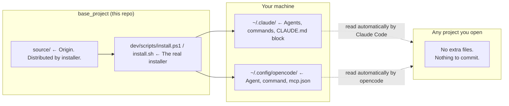

# base_project

[](https://opensource.org/licenses/MIT)
[](https://github.com/alexmiguel011014-stack/base_project)
[](https://github.com/alexmiguel011014-stack/base_project)

## 📦 A global operating layer for Claude Code and opencode

**base_project** is a one-time installation that provides a consistent layer of agents, commands, MCP servers, and rules for **Claude Code** and **opencode**. Install it once on your machine, and every project you open afterward gets the same capabilities automatically — **without ever writing a single file into your project repositories.**

> ⭐ **Star this repo** to show your support!

---

## 🚀 Quick Start

### Installation

#### Windows
```powershell
git clone https://github.com/alexmiguel011014-stack/base_project.git
cd base_project
powershell -File dev/scripts/install.ps1
```

#### macOS / Linux
```bash
git clone https://github.com/alexmiguel011014-stack/base_project.git
cd base_project
bash dev/scripts/install.sh
```

That's it. Open any project — nothing else to configure per-project.

### 📈 Updating

```sh
git pull inside base_project/, then re-run the same install command.
```

It's safe to run repeatedly — it only touches the file blocks it manages and merges your existing customizations.

---

## 🏗️ How It Works

<details>
<summary><b>Project Architecture</b></summary>



Both Claude Code and opencode have native, built-in behaviors — the installer simply writes to those locations once, so **nothing needs to be copied into (or committed by) your actual project**.

Anything project‑specific — `graphify-out/`, `repomix-output.xml`, your `.env` — still lives in the project itself, generated on demand by the `/bootstrap` command.

</details>

---

## 📥 What Gets Installed

| Source | Installed To | Purpose |
|--------|-------------|---------|
| `source/CLAUDE.md` | `~/.claude/CLAUDE.md` (delimited block) | Global rules for Claude Code |
| `source/opencode-instructions.md` | Linked from `~/.config/opencode/opencode.jsonc` | Global rules for opencode |
| `source/claude/agents/*.md` | `~/.claude/agents/` | `architect`, `coder`, `reviewer` subagents |
| `source/claude/commands/*.md` | `~/.claude/commands/` | `/bootstrap`, `/audit`, `/plugins`, `/council`, `/status` |
| `source/opencode/agent/*.md` | `~/.config/opencode/agent/` | Same trio, opencode format |
| `source/opencode/command/*.md` | `~/.config/opencode/command/` | Same commands, opencode format |
| `source/opencode/mcp.json` | `~/.config/opencode/mcp.json` + registered via `claude mcp add` | Context7, GitHub, filesystem, git (always on) |
| `source/plugins.json` | `~/.claude/base_project/plugins.json` | Optional plugin catalog, read by `/plugins` |
| `source/hooks/*.js` | `~/.claude/base_project/hooks/` | Loop detection, auto-format, git-context injection, usage ledger |

The installer also checks for (and installs if missing) the global CLI tools these rely on: `gh`, `graphify`, `repomix`, `biome`, `tsc`.

20 commands ship in total — see the Commands section below for the complete, current list.

---

## 🛠️ The `architect` / `coder` / `reviewer` Workflow

1. **architect** (read-only) — plans non-trivial changes, never edits files.
2. **coder** — applies the plan with surgical, scoped edits.
3. **reviewer** — runs the project's own lint/typecheck/test commands, drafts Conventional Commit messages. Never commits unless explicitly asked to.

---

## 📜 Commands

Roughly the order you'd reach for them in a project's life — start a project, understand
what's there, fix it, ship it, then the everyday extras:

| Command | What it does |
|---|---|
| `/bootstrap` | Syncs with the project's own remote first (fast-forward pull if behind), then maps it into `graphify-out/` + `repomix-output.xml` for token-efficient context. |
| `/newproject` | Plans the structure and starting checklist for a brand-new project — read-only, produces a plan, never scaffolds files on its own. Also kicks off `/newgoal` in the background to research a deeper build plan while you review this one. |
| `/newgoal` | Classifies what kind of goal this is (full build, bug fix, bounded feature, release/process readiness, or pure research) and researches + writes `GOALS.md` at the project root accordingly — the input `/execgoals` consumes without re-researching anything. |
| `/repertoire` | Researches the target project's actual subject matter — scientific evidence, regulatory/legal context, cultural context, media discourse — not the tech stack. Confirms before running; combine with `/newgoal /repertoire` in the same message, or run standalone. |
| `/execgoals` | Executes `GOALS.md` item by item, in the order `/newgoal` wrote them, using the `architect`/`coder` workflow for anything non-trivial. Checks an item off only after verifying it's actually done (file exists, test passes, server starts) — resumes safely if interrupted. |
| `/scanproject` | Rigorously audits an existing project against the shared `project-standards.md` checklist (identity, version control, secrets, dependencies, tests, lint/CI, basic security, structure). Read-only — reports findings, never edits. **Start here.** |
| `/audit` | Deeper security-only pass than `/scanproject`: dependency vulnerabilities, outdated packages, exposed secrets. Uses Strix instead of a static scan if it's installed. |
| `/cleanproject` | Deeper organization-only pass than `/scanproject`: dead files, misplaced folders, duplication. Read-only — proposes a reorganization, never moves or deletes anything. |
| `/fixproject` | Applies the fixes found by `/scanproject` and/or `/cleanproject`, with real before/after re-verification of each one — not a patch applied and assumed to work. |
| `/undo` | Reverts the most recent batch of change — uncommitted edits, untracked new files, or the last commit — with confirmation tiered by risk. Never `git reset --hard` or force-push without a separate explicit gate; a pushed commit is undone with `git revert`, never rewritten. |
| `/ship` | Commits and pushes the current project's changes. Checks readiness first (clean state, no secrets, lint/test passing, remote configured) and guides through whatever's blocking instead of a raw git error. Never force-pushes, never resolves conflicts automatically. |
| `/pr` | Opens a pull request for the current branch — drafts the title/body from the real commit range against the base branch, confirms before creating anything. The step `/ship`'s own step 9 points at but never runs itself. |
| `/plugins` | Looks at the current project, recommends which optional plugins fit — from the catalog, the official marketplace, and the open web if nothing else covers the need — and installs the ones you pick. |
| `/council` | Pressure-tests a hard decision through 5 independent advisor perspectives + a synthesized verdict. Always asks for confirmation first — it costs roughly 6x a single-pass answer. |
| `/designreview` | Critiques a design — an external mockup/screenshot/URL, or a UI Claude just generated — against a research-backed rubric (Nielsen Norman heuristics, UICrit, Criticmate, UXBench). Runs a deterministic WCAG-contrast/tap-target check, then calibrates against named real-world exemplars (Stripe, Linear, Vercel, Notion — optionally with a live gallery lookup) before a global-then-local judgment pass, and reports findings ranked by severity. |
| `/status` | Shows the base_project version and a plain name-only list of everything currently active on this machine (agents, commands, hooks, plugins). No explanations. |
| `/reviewusage` | Reads the local usage ledger and reports what's actually being used: installed-but-never-touched tools, what's used and where, what's failing, what's slow. Claude Code only — opencode activity isn't tracked. |
| `/update` | Checks whether base_project itself has a newer version on GitHub and, on confirmation, pulls it and re-runs the installer. Never touches an unrelated project. |
| `/uninstall` | Cleanly removes everything base_project installed globally, with tiered confirmation — bigger-blast-radius items (hooks, MCP servers) confirmed separately. Never deletes the base_project repo itself. |
| `/wpp` | Shows the "what do you want to do now?" menu on demand — the same one shown automatically at session start and after a substantial task. |

---

## 🔌 Optional Plugins

Not every project needs every tool — a Next.js app doesn't need Supabase MCP, and a small script doesn't need a browser automation server sitting in context. Instead of installing everything for everyone, `source/plugins.json` is a catalog the `/plugins` command reads: it looks at the project you're actually in (`package.json`, `requirements.txt`, a `supabase/` folder, DB files, etc.), tells you which entries it recommends and why, and asks before installing anything.

```sh
you> /plugins
ai > This looks like a Next.js + Supabase project.
     Recommended: Supabase MCP, Playwright MCP.
     Also in the catalog: Strix, Headroom, Ponytail, Skill UI bundle, Postgres MCP, SQLite MCP.
     Install the recommended two, more, or none?
```

**Currently cataloged:** Playwright MCP, Supabase MCP, Postgres MCP, SQLite MCP, Strix (AI pentest agent), Skill UI bundle (frontend-design + baseline-ui), StyleSeed (design-judgment engine with Stripe/Linear/Vercel/Notion reference skins), UX/UI Agent Skills (138-design-system library + DTCG tokens), Headroom (context compression), Ponytail (anti-overengineering discipline).

### Claude Code vs. opencode

- **Claude Code** supports `claude mcp add --scope local`, which enables an MCP server for one project only — nothing is written into that project's repo.
- **opencode** has no equivalent (there's an [open feature request](https://github.com/anomalyco/opencode/issues/17605) for it); accepting an MCP recommendation there adds it to opencode's *global* config, so it becomes available in every opencode project from then on.

`/plugins` tells you this before it touches anything.

### Adding Your Own Plugins

Append an entry to `source/plugins.json` (id, kind, summary, `recommend_if`, install command per engine) — no code changes needed anywhere else. `git pull` + re-run the installer to sync it, and `/plugins` picks it up automatically next time it runs.

---

## 🛡️ Safety

| Principle | Description |
|-----------|-------------|
| **Never overwrites your own customizations** | Every file this project installs is tagged with a `base_project:managed` marker. If a file already exists at the destination without that marker (i.e. you made it yourself), the installer skips it and warns you instead of overwriting it. |
| **Merges, doesn't clobber** | `~/.claude/CLAUDE.md` and `~/.config/opencode/opencode.jsonc` keep everything you already had — base_project only owns its own marked block/keys. |
| **Secrets stay out of git** | `mcp.json` lives in your global config directory, never inside a project repo, so API keys you add there are never at risk of being committed. |
| **Nothing is installed per-project** | If you ever stop using base_project, delete the managed block from `~/.claude/CLAUDE.md` and the marked files from the global directories — your projects were never touched. |

---

## 🧪 Testing the Installer Without Touching Your Real Config

Both scripts accept overrides so you can dry-run into a scratch directory:

#### PowerShell
```powershell
powershell -File dev/scripts/install.ps1 -ClaudeHome C:\temp\fake-claude -OpencodeHome C:\temp\fake-opencode
```

#### bash
```bash
CLAUDE_HOME=/tmp/fake-claude OPENCODE_HOME=/tmp/fake-opencode bash dev/scripts/install.sh
```

---

## 📜 License

This project is licensed under the **MIT License** — see the [LICENSE](LICENSE) file for details.

---

## 🤝 Support

- ⭐ **Star the repo** on GitHub
- 🐛 **Report bugs** via [GitHub Issues](https://github.com/alexmiguel011014-stack/base_project/issues)
- 🔒 **Report a security vulnerability** — see [SECURITY.md](SECURITY.md), please don't file it as a public issue
- 🛠️ **Contribute** — see [CONTRIBUTING.md](CONTRIBUTING.md)
- 💡 **Suggest features** or ask questions in Discussions
- 📚 **Read the documentation** in `source/` and `dev/` for deep dives

---

*Made with ❤️ for the Claude Code and opencode community.*

---

## 📦 Quick Commands Cheat Sheet

| Action | Command |
|--------|---------|
| Install | `powershell -File dev/scripts/install.ps1` (Win) / `bash dev/scripts/install.sh` (Mac/Linux) |
| Update | `git pull` + re-run install |
| Scan project | `/scanproject` |
| Audit security | `/audit` |
| Manage plugins | `/plugins` |
| Pressure-test a decision | `/council` |
| Map project context | `/bootstrap` |
| View this menu | `/status` or `/wpp` |

---

## 📬 Changelog

### v1.0.0 (current)
- Initial release with full agent/command/MCP suite
- Cross-engine support (Claude Code + opencode)
- Plugin catalog system
- Safety markers and merge-versus-overwrite logic
- Graphify + Repomix integration for token-efficient context

---

## 🔗 Links

- **GitHub:** https://github.com/alexmiguel011014-stack/base_project
- **Issues:** https://github.com/alexmiguel011014-stack/base_project/issues
- **Discussions:** https://github.com/alexmiguel011014-stack/base_project/discussions