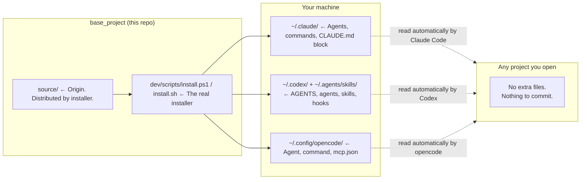

# base_project

[](https://opensource.org/licenses/MIT)
[](https://github.com/alexmiguel011014-stack/base_project)
[](https://github.com/alexmiguel011014-stack/base_project)

## 📦 A global operating layer for Claude Code, Codex, and opencode

**base_project** is a one-time installation that provides a consistent layer of agents, workflows, MCP servers, and rules for **Claude Code**, **Codex**, and **opencode**. Install it once on your machine, and every project you open afterward gets the same capabilities automatically — **without ever writing a single file into your project repositories.**

> ⭐ **Star this repo** to show your support!

---

## 🚀 Quick Start

### Installation

#### Windows
```powershell
git clone https://github.com/alexmiguel011014-stack/base_project.git
cd base_project
powershell -File dev/scripts/install.ps1
```

#### macOS / Linux
```bash
git clone https://github.com/alexmiguel011014-stack/base_project.git
cd base_project
bash dev/scripts/install.sh
```

That's it. Open any project — nothing else to configure per-project.

### 📈 Updating

```sh
git pull inside base_project/, then re-run the same install command.
```

It's safe to run repeatedly — it only touches the file blocks it manages and merges your existing customizations.

---

## 🏗️ How It Works

<details>
<summary><b>Project Architecture</b></summary>



All three engines have native customization layers — the installer writes to those locations once, so **nothing needs to be copied into (or committed by) your actual project**.

Anything project‑specific — `graphify-out/`, `repomix-output.xml`, your `.env` — still lives in the project itself, generated on demand by the `/bootstrap` command.

</details>

---

## 📥 What Gets Installed

| Source | Installed To | Purpose |
|--------|-------------|---------|
| `source/CLAUDE.md` | `~/.claude/CLAUDE.md` (delimited block) | Global rules for Claude Code |
| `source/opencode-instructions.md` | Linked from `~/.config/opencode/opencode.jsonc` | Global rules for opencode |
| `source/claude/agents/*.md` | `~/.claude/agents/` | `architect`, `coder`, `reviewer` subagents |
| `source/claude/commands/*.md` | `~/.claude/commands/` | All 21 workflows — see the Commands section below |
| `source/opencode/agent/*.md` | `~/.config/opencode/agent/` | Same trio, opencode format |
| `source/opencode/command/*.md` | `~/.config/opencode/command/` | Same commands, opencode format (`dense` profile, default) |
| `source/opencode/command-lite/*.md` | `~/.config/opencode/command/` | Same 21 commands, flat checklist rewrite for weaker/free LLM backends (`lite` profile, opt-in — see below) |
| `source/codex/AGENTS.md` | `~/.codex/AGENTS.md` (delimited block) | Codex-native global operating rules |
| `source/codex/skills/*/SKILL.md` | `~/.agents/skills/` | The same 21 workflows as native Codex skills (`$scanproject`, `$wpp`, etc.) |
| `source/codex/agents/*.toml` | `~/.codex/agents/` | The same `architect`, `coder`, `reviewer` roles in Codex's native format |
| `source/codex/references/` + shared references | `~/.codex/base_project/references/` | Codex menu plus shared standards and goal types |
| `source/opencode/mcp.json` | Merged into the `mcp` section of `~/.config/opencode/opencode.jsonc`, registered via `claude mcp add --scope user`, and merged into `~/.codex/config.toml` | Context7 only, pinned to an exact version (always on — no credentials needed). Filesystem and git left the always-on set in v1.2.0 (zero measured use, unpinned) and are optional in `/plugins`, like GitHub, which needs a real personal access token. Re-running the installer retires them only where they still have the definition base_project wrote (`source/opencode/mcp-previous.json`). |
| `source/plugins.json` | Engine `base_project/plugins.json` namespaces | Optional catalog read by `/plugins` or `$plugins` |
| `source/hooks/*.js` | `~/.claude/base_project/hooks/`, registered by Claude Code and Codex | Loop detection, scoped auto-format, GOALS structural validation, git-context injection, shared usage ledger (secrets masked before writing) |
| `source/CLAUDE.md` + `source/opencode/mcp.json` | `~/.kimi/AGENTS.md` (delimited block) + `~/.kimi/mcp.json` | Kimi Code CLI, only when `~/.kimi/` already exists; start it with `kimi --mcp-config-file ~/.kimi/mcp.json` |

**opencode command profile.** By default the installer copies the `dense` command set (the same rich, multi-step instructions Claude Code gets). If you're running opencode against a weaker or free LLM backend and it struggles to follow the dense commands, switch to `lite` — flatter, less-branchy versions of the same 21 commands, same names, no functionality removed:

```bash
bash dev/scripts/install.sh --opencode-commands lite   # macOS/Linux
```
```powershell
.\dev\scripts\install.ps1 -OpencodeCommands lite        # Windows
```

The choice is remembered (`~/.base_project/opencode-command-profile.txt`) — re-running the installer later with no flag keeps whichever profile you last picked. Switch back any time with `--opencode-commands dense` / `-OpencodeCommands dense`. Claude Code's own command set is unaffected either way.

The installer also checks for (and installs if missing) the global CLI tools these rely on: `gh`, `graphify`, `repomix`, `biome`, `tsc`.

21 workflows ship in total — see the Commands section below for the complete, current list.

**Codex invocation:** use `$scanproject`, `$newgoal`, `$ship`, `$wpp`, and so on. Enabled skills also appear in Codex's slash selector, but Codex does not support arbitrary custom top-level names like `/wpp`; custom prompt files would be namespaced under `/prompts:`. This is why the faithful Codex spelling is `$wpp`, not `/wpp`.

**Runtime-specific `$newgoal` recommendations:** Codex uses its own `gpt-5.6-luna`, `gpt-5.6-terra`, `gpt-5.6-sol`, and `gpt-6-astra` model vocabulary with matching effort guidance; Claude Code and opencode retain their native model vocabulary. In every runtime, the recommendation is manual only and never changes the active model, effort, or configuration automatically.

**Codex hook trust:** Codex asks you to review and trust a newly installed or changed hook command before it runs. That review is intentional; base_project merges its hooks idempotently but never bypasses Codex's trust boundary.

### Unified config layer (GOALS 6) — parked

The experimental `~/.agents/` layer — one canonical store projected into 31 agents through
per-agent adapters — is parked since v1.2.0. No command runs it and the installer no longer
initializes `~/.agents/rules/` or `~/.agents/config.json`; `~/.agents/skills/` is still used, but
only as Codex's native skills directory. It only worked inside this repository, its projections
wrote files into project repositories (breaking the promise at the top of this README), and the
22 "generic" adapters came down to an `AGENTS.md` those tools already read natively
(`dev/auditoria-2026-09-24.md`, F4). Its code and tests stay under `dev/scripts/` and `dev/tests/`
until removal is confirmed; `dev/ROADMAP.md` item 55 records the decision and the restore point.

---

## 🛠️ The `architect` / `coder` / `reviewer` Workflow

1. **architect** (read-only) — plans non-trivial changes, never edits files.
2. **coder** — applies the plan with surgical, scoped edits.
3. **reviewer** — runs the project's own lint/typecheck/test commands, drafts Conventional Commit messages. Never commits unless explicitly asked to.

---

## 📜 Commands

Roughly the order you'd reach for them in a project's life — start a project, understand
what's there, fix it, ship it, then the everyday extras:

The table uses Claude Code/opencode `/name` spelling. In Codex, every row has the same name and behavior with `$name` spelling.

| Command | What it does |
|---|---|
| `/bootstrap` | Syncs with the project's own remote first (fast-forward pull if behind), then maps it into `graphify-out/` + `repomix-output.xml` for token-efficient context. |
| `/newgoal` | Classifies what kind of goal this is (full build, bug fix, bounded feature, release/process readiness, or pure research) and researches + writes `GOALS.md` at the project root accordingly — the input `/execgoals` consumes without re-researching anything. It then recommends a model + effort for the plan's highest-complexity module and asks whether to execute or adjust the plan; the recommendation is manual and never switches the model automatically. |
| `/repertoire` | Researches a subject in depth — a project's real-world domain (scientific evidence, regulatory/legal, cultural, media discourse) feeding `/newgoal`, or a standalone topic/trend/claim you want investigated on its own. States its search limits (live web, no paid databases) before running; confirms every time. |
| `/execgoals` | Executes the active `GOALS.md` item by item, in the order `/newgoal` wrote them, using the `architect`/`coder` workflow for anything non-trivial. Checks an item off only after verifying it's actually done and runs a structural GOALS check after each edit batch — resumes safely if interrupted. |
| `/scanproject` | Rigorously audits an existing project against the shared `project-standards.md` checklist (identity, version control, secrets, dependencies, tests, lint/CI, basic security, structure). Read-only — reports findings, never edits. **Start here.** |
| `/audit` | Deeper security-only pass than `/scanproject`: dependency vulnerabilities, outdated packages, exposed secrets. Uses Strix instead of a static scan if it's installed. |
| `/cleanproject` | Deeper organization-only pass than `/scanproject`: dead files, misplaced folders, duplication. Read-only — proposes a reorganization, never moves or deletes anything. |
| `/fixproject` | Applies the fixes found by `/scanproject` and/or `/cleanproject`, with real before/after re-verification of each one — not a patch applied and assumed to work. |
| `/undo` | Reverts the most recent batch of change — uncommitted edits, untracked new files, or the last commit — with confirmation tiered by risk. Never `git reset --hard` or force-push without a separate explicit gate; a pushed commit is undone with `git revert`, never rewritten. |
| `/diario` | Records what was worked on into this project's contribution diary — dated entries plus an hours table, synthesized from the tool-call ledger `usage-log.js` already writes and from git history. Diaries live in one central directory outside every repository, so they can never reach GitHub. |
| `/ship` | Commits and pushes the current project's changes. Checks readiness first (clean state, no secrets, lint/test passing, remote configured) and guides through whatever's blocking instead of a raw git error. Never force-pushes, never resolves conflicts automatically. |
| `/pr` | Opens a pull request for the current branch — drafts the title/body from the real commit range against the base branch, confirms before creating anything. The step `/ship`'s own step 9 points at but never runs itself. |
| `/plugins` | Looks at the current project, recommends which optional plugins fit — from the catalog, the official marketplace, and the open web if nothing else covers the need — and installs the ones you pick. |
| `/council` | Pressure-tests a hard decision through 5 independent advisor perspectives + a synthesized verdict. Always asks for confirmation first — it costs roughly 6x a single-pass answer. |
| `/designreview` | Critiques a design — an external mockup/screenshot/URL, or a UI Claude just generated — against a research-backed rubric (Nielsen Norman heuristics, UICrit, Criticmate, UXBench). Runs a deterministic WCAG-contrast/tap-target check, then calibrates against named real-world exemplars (Stripe, Linear, Vercel, Notion — optionally with a live gallery lookup) before a global-then-local judgment pass, and reports findings ranked by severity. |
| `/status` | Shows the base_project version and a plain name-only list of everything currently active on this machine (agents, commands, hooks, plugins). No explanations. |
| `/usagebp` | Reads the local usage ledger and reports what's actually being used: installed-but-never-touched tools, what's used and where, what's failing, what's slow, plus a prioritized diagnostic queue. It can compare two annotated baselines without treating lower token use as success by itself. Covers Claude Code and Codex when their hooks are active; opencode activity isn't tracked. |
| `/update` | Checks whether base_project itself has a newer version on GitHub and, on confirmation, pulls it and re-runs the installer. Never touches an unrelated project. |
| `/updates` | Reports available updates for base_project-managed dependencies, tools, MCPs, and detected optional components. Read-only: never installs, upgrades, pulls, or changes configuration. |
| `/uninstall` | Cleanly removes everything base_project installed globally, with tiered confirmation — bigger-blast-radius items (hooks, MCP servers) confirmed separately. Never deletes the base_project repo itself. |
| `/wpp` | Shows the "what do you want to do now?" menu on demand — the same one shown automatically at session start and after a substantial task. |

---

## 🔌 Optional Plugins

Not every project needs every tool — a Next.js app doesn't need Supabase MCP, and a small script doesn't need a browser automation server sitting in context. Instead of installing everything for everyone, `source/plugins.json` is a catalog the `/plugins` command reads: it looks at the project you're actually in (`package.json`, `requirements.txt`, a `supabase/` folder, DB files, etc.), tells you which entries it recommends and why, and asks before installing anything.

```sh
you> /plugins
ai > This looks like a Next.js + Supabase project.
     Recommended: Supabase MCP, Playwright MCP.
     Also in the catalog: Strix, Headroom, Ponytail, Skill UI bundle, GitHub MCP.
     Install the recommended two, more, or none?
```

**Currently cataloged:** Playwright MCP, Supabase MCP, GitHub MCP (needs your own token), PostgreSQL and SQLite (Google's MCP Toolbox), Filesystem and Git MCPs (formerly always on), Strix (AI pentest agent), Skill UI bundle (frontend-design + baseline-ui), StyleSeed (design-judgment engine with Stripe/Linear/Vercel/Notion reference skins), UX/UI Agent Skills (138-design-system library + DTCG tokens), Headroom (context compression), Ponytail (anti-overengineering discipline), and more design and orchestration skills — `source/plugins.json` is the full list.

The Postgres and SQLite MCP entries were removed in GOALS 17: the official reference servers they pointed to are archived with unpatched SQL-injection flaws (the Postgres one bypasses its read-only mode), and the SQLite npm package never existed. Choosing a maintained replacement is an open decision, not a silent swap.

### Claude Code vs. Codex vs. opencode

- **Claude Code** supports `claude mcp add --scope local`, which enables an MCP server for one project only — nothing is written into that project's repo.
- **Codex** uses its native plugin, skill, and MCP configuration flows. `$plugins` never executes a Claude/opencode install block by guesswork; if a catalog entry has no verified Codex action, it shows the source and skips it.
- **opencode** has no equivalent (there's an [open feature request](https://github.com/anomalyco/opencode/issues/17605) for it); accepting an MCP recommendation there adds it to opencode's *global* config, so it becomes available in every opencode project from then on.

`/plugins` tells you this before it touches anything.

### Adding Your Own Plugins

Append an entry to `source/plugins.json` (id, kind, summary, `recommend_if`, install command per engine) — no code changes needed anywhere else. `git pull` + re-run the installer to sync it, and `/plugins` picks it up automatically next time it runs.

---

## 🛡️ Safety

| Principle | Description |
|-----------|-------------|
| **Never overwrites your own customizations** | Every file this project installs is tagged with a `base_project:managed` marker. If a file already exists at the destination without that marker (i.e. you made it yourself), the installer skips it and warns you instead of overwriting it. |
| **Merges, doesn't clobber** | `~/.claude/CLAUDE.md`, `~/.codex/AGENTS.md`, `~/.codex/hooks.json`, `~/.codex/config.toml`, and `~/.config/opencode/opencode.jsonc` keep everything you already had — base_project only owns marked blocks/entries. In `opencode.jsonc` your own instructions, MCP servers and comments survive; if the file can't be parsed, it is left untouched rather than recreated. An MCP entry you edited is yours: the installer updates or retires only entries that still have the exact definition it wrote. |
| **Secrets stay out of git** | MCP configuration lives in your global config (Claude Code user scope, `opencode.jsonc`, `~/.codex/config.toml`), never inside a project repo, so API keys you add there are never at risk of being committed. The local usage ledger masks well-known token shapes before writing. |
| **Nothing is installed per-project** | If you ever stop using base_project, delete the managed block from `~/.claude/CLAUDE.md` and the marked files from the global directories — your projects were never touched. |
| **Screen control is a last resort** | The global rules make every runtime test UIs through DOM-driven browser tooling and the project's own tests; desktop computer use needs your explicit per-task go-ahead, and screenshots are requested from you rather than captured. |

---

## 🧪 Testing the Installer Without Touching Your Real Config

Both scripts accept overrides that redirect the Claude Code, opencode, Codex and `~/.agents` directories into a scratch location. They are not a full sandbox: the installer still installs missing global CLI tools, registers MCP servers through the real `claude mcp add --scope user`, writes its state to `~/.base_project/`, and touches `~/.kimi/` when it exists. Run it with a throwaway `HOME` (as CI does) when you need complete isolation:

#### PowerShell
```powershell
$env:BASE_PROJECT_CODEX_ROOT = 'C:\temp\fake-codex'
$env:BASE_PROJECT_AGENTS_ROOT = 'C:\temp\fake-agents'
New-Item -ItemType Directory -Force $env:BASE_PROJECT_CODEX_ROOT | Out-Null
powershell -File dev/scripts/install.ps1 -ClaudeHome C:\temp\fake-claude -OpencodeHome C:\temp\fake-opencode
```

#### bash
```bash
mkdir -p /tmp/fake-codex
CLAUDE_HOME=/tmp/fake-claude OPENCODE_HOME=/tmp/fake-opencode \
BASE_PROJECT_CODEX_ROOT=/tmp/fake-codex BASE_PROJECT_AGENTS_ROOT=/tmp/fake-agents \
bash dev/scripts/install.sh
```

---

## 📜 License

This project is licensed under the **MIT License** — see the [LICENSE](LICENSE) file for details.

---

## 🤝 Support

- ⭐ **Star the repo** on GitHub
- 🐛 **Report bugs** via [GitHub Issues](https://github.com/alexmiguel011014-stack/base_project/issues)
- 🔒 **Report a security vulnerability** — see [SECURITY.md](SECURITY.md), please don't file it as a public issue
- 🛠️ **Contribute** — see [CONTRIBUTING.md](CONTRIBUTING.md)
- 💡 **Suggest features** or ask questions in Discussions
- 📚 **Read the documentation** in `source/` and `dev/` for deep dives

---

*Made with ❤️ for the Claude Code, Codex, and opencode community.*

---

## 📦 Quick Commands Cheat Sheet

| Action | Command |
|--------|---------|
| Install | `powershell -File dev/scripts/install.ps1` (Win) / `bash dev/scripts/install.sh` (Mac/Linux) |
| Update | `git pull` + re-run install |
| Scan project | `/scanproject` |
| Audit security | `/audit` |
| Manage plugins | `/plugins` |
| Pressure-test a decision | `/council` |
| Map project context | `/bootstrap` |
| View this menu | `/wpp` |
| See what's installed and active | `/status` |

In Codex, replace `/` with `$` for the workflow rows above.

---

## 📬 Changelog

### v1.2.0 (unreleased — tag pending)
- Audit remediation (GOALS 17, `dev/auditoria-2026-09-24.md`): CI green again and unit tests run on Linux, Windows and macOS
- Hook warnings now reach the model (`additionalContext`); auto-format no longer goes through `npx` and only runs on edits
- `opencode.jsonc` is merged, not replaced: your own instructions, MCP servers and comments survive; unparseable files are left untouched
- Unified config layer (GOALS 6) parked: `/bootstrap`, `/scanproject` and `/audit` no longer run it, and the installer no longer initializes `~/.agents` (it only worked inside the base_project clone)
- `/usagebp` no longer crashes on large ledgers; the ledger masks secrets before writing
- `/uninstall` keeps your usage history, diaries and `~/.agents` content unless you explicitly delete them (new Tier D)
- Catalog: removed the Postgres and SQLite MCP entries (unpatched SQL injection / nonexistent package) and a test fixture; PostgreSQL and SQLite come back through Google's MCP Toolbox, pinned, with least-privilege guidance verified against a live database
- Always-on MCPs: only Context7, pinned to an exact version; filesystem and git moved to the optional catalog (git now the official server) and are retired from existing installs only where base_project's own definition is still there
- Since v1.1.0: native Codex support, opencode `lite` profile, unified config layer (experimental), `/repertoire`, `/diario`, `/pr`, `/undo`, `/updates`, `/usagebp`, typed `/newgoal`, deterministic contract harness, screen-control-as-last-resort rule

### v1.1.0
- `/ship`, `/designreview`, `/execgoals`; `/goals` renamed to `/newgoal`; `/council` confirmation gate
- Usage ledger and multi-engine support; public release preparation

### v1.0.0
- Initial release with full agent/command/MCP suite
- Cross-engine support (Claude Code + Codex + opencode)
- Plugin catalog system
- Safety markers and merge-versus-overwrite logic
- Graphify + Repomix integration for token-efficient context

---

## 🔗 Links

- **GitHub:** https://github.com/alexmiguel011014-stack/base_project
- **Issues:** https://github.com/alexmiguel011014-stack/base_project/issues
- **Discussions:** https://github.com/alexmiguel011014-stack/base_project/discussions
