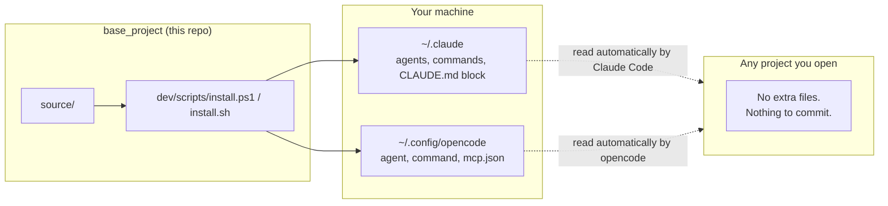

# base_project

A global operating layer for **Claude Code** and **opencode** — install it once on your machine,
and every project you open afterward gets the same agents, commands, MCP servers, and rules
automatically. It never writes a single file into your project repositories.

## Install

```sh
git clone https://github.com/alexmiguel011014-stack/base_project.git
cd base_project

# Windows
powershell -File dev/scripts/install.ps1

# Mac / Linux
bash dev/scripts/install.sh
```

That's it. Open any project — nothing else to configure per-project.

To pick up updates later: `git pull` inside `base_project/`, then re-run the same install command.
It's safe to run repeatedly — it only touches the file blocks it manages.

## How it works



Claude Code always reads `~/.claude/CLAUDE.md`, `~/.claude/agents/`, and `~/.claude/commands/` in every
session. opencode always reads `~/.config/opencode/opencode.jsonc`, `~/.config/opencode/agent/`, and
`~/.config/opencode/command/`. Both are native, built-in behaviors — the installer just writes to those
locations once, so nothing needs to be copied into (or committed by) your actual project.

Anything genuinely project-specific — `graphify-out/`, `repomix-output.xml`, your `.env` — still lives in
the project itself, generated on demand by the `/bootstrap` command.

## What gets installed

| Source | Installed to | Purpose |
|---|---|---|
| `source/CLAUDE.md` | `~/.claude/CLAUDE.md` (delimited block) | Global rules for Claude Code |
| `source/opencode-instructions.md` | linked from `~/.config/opencode/opencode.jsonc` | Global rules for opencode |
| `source/claude/agents/*.md` | `~/.claude/agents/` | `architect`, `coder`, `reviewer` subagents |
| `source/claude/commands/*.md` | `~/.claude/commands/` | `/bootstrap`, `/audit`, `/plugins`, `/council`, `/dashboard` |
| `source/opencode/agent/*.md` | `~/.config/opencode/agent/` | Same trio, opencode format |
| `source/opencode/command/*.md` | `~/.config/opencode/command/` | Same commands, opencode format |
| `source/opencode/mcp.json` | `~/.config/opencode/mcp.json` + registered with `claude mcp add` | Context7, GitHub, filesystem, git (always on) |
| `source/plugins.json` | `~/.claude/base_project/plugins.json` and `~/.config/opencode/base_project/plugins.json` | Optional plugin catalog, read by `/plugins` |
| `source/dashboard/*.js` | `~/.claude/base_project/dashboard/`, `~/.config/opencode/base_project/dashboard/`, `~/.config/opencode/plugins/` | Usage-tracking hook/plugin, local live server, launcher |

The installer also checks for (and installs if missing) the global CLI tools these rely on: `gh`,
`graphify`, `repomix`, `biome`, `tsc`.

## The `architect` / `coder` / `reviewer` workflow

1. **architect** (read-only) — plans non-trivial changes, never edits files.
2. **coder** — applies the plan with surgical, scoped edits.
3. **reviewer** — runs the project's own lint/typecheck/test commands, drafts Conventional Commit
   messages. Never commits unless explicitly asked to.

## Commands

| Command | What it does |
|---|---|
| `/bootstrap` | Maps the current project into `graphify-out/` + `repomix-output.xml` for token-efficient context. |
| `/audit` | Security scan (dependency vulnerabilities, outdated packages, exposed secrets). Uses Strix instead of a static scan if it's installed. |
| `/plugins` | Looks at the current project, recommends which optional plugins fit, and installs the ones you pick. |
| `/council` | Pressure-tests a hard decision through 5 independent advisor perspectives + a synthesized verdict, for calls worth more than a single-pass opinion. |

## Optional plugins

Not every project needs every tool — a Next.js app doesn't need Supabase MCP, and a small script doesn't
need a browser automation server sitting in context. Instead of installing everything for everyone,
`source/plugins.json` is a catalog the `/plugins` command reads: it looks at the project you're actually
in (`package.json`, `requirements.txt`, a `supabase/` folder, DB files, etc.), tells you which entries it
recommends and why, and asks before installing anything.

```
you> /plugins
ai > This looks like a Next.js + Supabase project.
     Recommended: Supabase MCP, Playwright MCP.
     Also in the catalog: Strix, Headroom, Ponytail, Skill UI bundle, Postgres MCP, SQLite MCP.
     Install the recommended two, more, or none?
```

Currently cataloged: **Playwright MCP**, **Supabase MCP**, **Postgres MCP**, **SQLite MCP**, **Strix**
(AI pentest agent), **Skill UI bundle** (frontend-design + baseline-ui), **Headroom** (context
compression), **Ponytail** (anti-overengineering discipline).

**Claude Code vs. opencode:** Claude Code supports `claude mcp add --scope local`, which enables an MCP
server for one project only — nothing is written into that project's repo. opencode has no equivalent
(there's an [open feature request](https://github.com/anomalyco/opencode/issues/17605) for it); accepting
an MCP recommendation there adds it to opencode's *global* config, so it becomes available in every
opencode project from then on. `/plugins` tells you this before it touches anything.

**Adding your own plugins:** append an entry to `source/plugins.json` (id, kind, summary, `recommend_if`,
install command per engine) — no code changes needed anywhere else. `git pull` + re-run the installer to
sync it, and `/plugins` picks it up automatically next time it runs.

## Safety

- **Never overwrites your own customizations.** Every file this project installs is tagged with a
  `base_project:managed` marker. If a file already exists at the destination without that marker (i.e.
  you made it yourself), the installer skips it and warns you instead of overwriting it.
- **Merges, doesn't clobber.** `~/.claude/CLAUDE.md` and `~/.config/opencode/opencode.jsonc` keep
  everything you already had — base_project only owns its own marked block/keys.
- **Secrets stay out of git.** `mcp.json` lives in your global config directory, never inside a project
  repo, so API keys you add there are never at risk of being committed.
- **Nothing is installed per-project.** If you ever stop using base_project, delete the managed block
  from `~/.claude/CLAUDE.md` and the marked files from the global directories — your projects were
  never touched.

## Testing the installer without touching your real config

Both scripts accept overrides so you can dry-run into a scratch directory:

```sh
# PowerShell
powershell -File dev/scripts/install.ps1 -ClaudeHome C:\temp\fake-claude -OpencodeHome C:\temp\fake-opencode

# bash
CLAUDE_HOME=/tmp/fake-claude OPENCODE_HOME=/tmp/fake-opencode bash dev/scripts/install.sh
```
