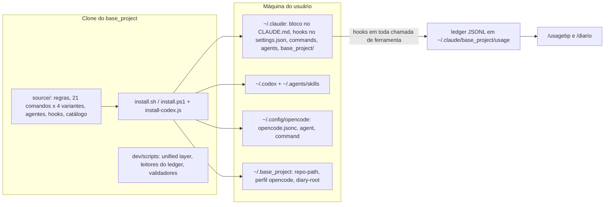
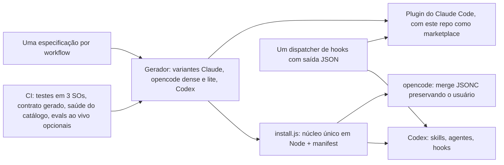

# Auditoria do base_project — falhas, gargalos, pontas soltas e caminhos de evolução

> **Data:** 2026-09-24 · **Base analisada:** `main` @ `351d878` · **Método:** leitura do código,
> execução real (suíte completa, instalador rodando num `HOME` descartável, benchmarks dos hooks
> e dos leitores do ledger), histórico do GitHub Actions e conferência na documentação oficial do
> Claude Code. Todo achado abaixo marcado como **confirmado** foi reproduzido; o que é inferência
> está dito como inferência.

---

## 0. Resumo executivo

| # | Achado | Severidade | Status |
|---|---|---|---|
| F1 | CI vermelho no `main` há um mês: 20 de 20 runs desde 24/08 falharam | Crítica | confirmado |
| F2 | Os avisos dos hooks `loop-detect` e `validate-goals` nunca chegam ao modelo | Alta | confirmado (doc oficial) |
| F3 | Instalador apaga MCPs e `instructions` do usuário no `opencode.jsonc`, e reseta o arquivo inteiro se houver um comentário | Alta | confirmado |
| F4 | A "unified layer" (GOALS 6) não funciona fora do próprio repositório do base_project | Alta | confirmado |
| F5 | `/usagebp` quebra com ~125–130 mil eventos no ledger (~3–4 meses de uso intenso) | Alta | confirmado |
| F6 | `/uninstall` pode apagar o ledger (dado irrecuperável) como se fosse "reinstalável" e está defasado | Média-alta | confirmado (texto) |
| F7 | O "teste isolado" do instalador escreve no `HOME` real e registra MCP no Claude real | Média | confirmado |
| F8 | `install.sh` e `install.ps1` divergiram (scripts, lista de limpeza, escaping) | Média | confirmado |
| F9 | Catálogo com pacote inexistente (`sqlite`), deprecado (`postgres`) e fixture de teste exposta | Média | confirmado |
| F10 | MCPs sempre-ativos sem uso medido, sem versão fixada e um deles de mantenedor individual parado | Média | confirmado |
| F11 | Documentação divergente do comportamento real (várias afirmações) | Baixa-média | confirmado |
| F12 | `npm run typecheck` não verifica nada (`checkJs: false`) | Baixa | confirmado |
| F13 | O "harness de contrato" testa a si mesmo, não os comandos | Baixa | confirmado |
| F14 | Ledger guarda prompts e comandos em texto puro, para sempre; repo público com dados de projetos pessoais | Média | confirmado |

Gargalos medidos (seção 3): 4 processos `node` por chamada de ferramenta; o hook de format custa
~500 ms por edição (74 ms chamando o binário direto) e faz consulta à rede em projeto sem Biome.

---

## 1. Como o projeto funciona hoje



- **Distribuição**: o instalador copia `source/` para os diretórios globais de cada engine. Arquivo
  gerenciado carrega o marcador `base_project:managed`; nos arquivos compartilhados (CLAUDE.md,
  AGENTS.md) ele reescreve só o bloco entre `<!-- base_project:start/end -->`.
- **Em tempo de execução**: cada sessão carrega o bloco global (~12 KB, ≈3 mil tokens) e, em sessão
  sem pedido específico, o modelo lê e imprime o menu (`command-menu.md`, ~4 KB). No Claude Code
  rodam 6 registros de hook: 4 no `PostToolUse` (loop-detect, post-edit-format, validate-goals,
  usage-log), 1 no `UserPromptSubmit` (usage-log) e 1 no `SessionStart` (git context).
- **Comandos**: 21 workflows, cada um mantido à mão em 4 variantes (Claude, opencode dense,
  opencode lite, skill do Codex) — 84 arquivos, ~316 KB de prosa.
- **Unified layer (GOALS 6)**: `~/.agents/` como fonte canônica projetada em "31 agentes" (9 deep +
  22 generic) por `dev/scripts/apply.js` + `source/adapters.json`.
- **Planejamento**: `GOALS.md` (ativo) + `dev/goals-archive/` + `dev/ROADMAP.md` (log de decisões).

Volume atual: ~7,3 mil linhas de código (scripts + hooks + instaladores), ~3,2 mil de testes,
~5,8 mil de prompts distribuídos e ~7,6 mil de documentação/planejamento.

---

## 2. Falhas confirmadas

### F1. CI vermelho no `main` há um mês — crítica

**Linha do tempo**: o último run verde foi o #20 (`fd5aee3`, 22/08). Do #21 (`f9072ae`, 24/08, o
commit que introduziu a unified layer) ao #40 (18/09), **todos os 20 runs falharam** — 11 pushes no
`main` e 9 PRs. O run #39 é o merge do PR #6, feito com o CI do PR (#38) já vermelho.

Dois testes quebrados, os dois reproduzidos localmente (`npm test`: 133/135):

1. **`dev/tests/doctor.test.js:62-66`** — o teste cria um symlink quebrado e depois chama
   `doctor.js --json` com `execSync`. O `doctor` corretamente sai com código 1 quando encontra
   problema, e o `execSync` lança exceção. No Windows a criação do symlink falha (EPERM), o teste
   cai no ramo de fallback, o doctor reporta "saudável" e o teste passa — por isso passa na máquina
   de desenvolvimento e falha no Linux do CI desde o dia em que foi escrito.
2. **`dev/tests/validate-goals-structure.test.js:101-116`** — o commit `0710eb5`
   (`feat(newgoal): recommend model after goal planning`) reescreveu 10 dos 11 checksums de
   `dev/goals-archive/README.md` com valores que não correspondem a nenhuma versão commitada dos
   arquivos. Os corpos arquivados não mudaram desde `ebb61e6`, e os checksums antigos estavam
   certos (ex.: `goals-01` = `d77d76e7…`, que é exatamente o valor que o teste procura).

**Efeitos em cascata**:
- Os PRs do Dependabot #1 (checkout v7), #2 (setup-node v7), #3 (TypeScript 7) e #7 (Biome 2.5.13)
  estão abertos e vermelhos (os mais antigos desde 04/09) — não por causa deles, mas do `main`.
- O passo "Run deterministic contract harness" (GOALS 8, item H.2, marcado como feito) **nunca
  executou no CI**: ele vem depois de "Verify project", que falha, então é sempre pulado.
- `npm run audit:prod` também nunca roda no CI: está depois de `npm test` na cadeia do `verify`.

**Causa de processo**: a validação acontece localmente (mensagens de commit citam "126/126" e
"93/93"), no Windows, enquanto o CI roda os testes só no Ubuntu; e o `main` aceita merge com CI
vermelho (o PR #6 prova que não há status check obrigatório).

**Correção sugerida**:
1. `doctor.test.js`: usar `spawnSync`, afirmar `status === 1` e validar o JSON do stdout — ou
   decidir que `--json` sempre sai 0 com `healthy: false` e documentar o contrato.
2. Gerar a tabela do `goals-archive/README.md` por script a partir dos arquivos, em vez de editar à
   mão; o teste continua comparando.
3. Rodar `npm test` também em `windows-latest` e `macos-latest` (hoje a matriz de 3 SOs só roda o
   instalador).
4. Proteger o `main`: exigir `validate` e `install-test` verdes para merge.

### F2. Os avisos dos hooks nunca chegam ao modelo — alta

`source/hooks/loop-detect.js:79-89` e `source/hooks/validate-goals.js:79-89` escrevem o aviso em
stderr e saem com `process.exit(0)`. A documentação oficial de hooks do Claude Code é explícita:

> "Stderr from a hook that exits 0 goes to the debug log only, never the transcript, and Claude
> never sees it."

Ou seja: o detector de loop — que existe por causa do incidente real do `git checkout --`
repetido — e o validador estrutural do `GOALS.md` produzem um aviso que ninguém lê. O ROADMAP
item 2 registra "Testado de verdade: o detector avisa exatamente na 5ª chamada" — o teste provou
que o texto vai para o stderr, não que o modelo o recebe.

**Correção**: emitir JSON no stdout com
`{"hookSpecificOutput": {"hookEventName": "PostToolUse", "additionalContext": "..."}}` (não
bloqueia e o Claude vê), ou sair com código 2 (mostra o stderr ao Claude). Adicionar teste que
afirma o formato do stdout. No Codex, conferir o contrato equivalente antes de assumir o mesmo.

### F3. O instalador destrói configuração do usuário no opencode — alta

`dev/scripts/install.sh:295-321` e `dev/scripts/install.ps1:369-409`.

Reproduzido num `HOME` descartável:
- `opencode.jsonc` válido com `"instructions": ["~/my-own-rules.md"]` e um MCP próprio `my-db`
  → depois da instalação, `instructions` virou só o caminho do base_project e o mapa `mcp` ficou
  só com `context7`/`filesystem`/`git`. **O MCP do usuário sumiu, sem backup** (o JSON era válido,
  então nenhum `.bak` foi feito).
- `opencode.jsonc` com **um único comentário** (formato `.jsonc` existe justamente para aceitar
  comentários) → o `jq` falha no parse, o arquivo vai para `.bak` e é recriado do zero: tema e
  modelo do usuário desaparecem. O instalador ainda imprime
  `opencode.jsonc (instructions + mcp servers inlined, other keys preserved)`.

Isso contradiz a promessa do README ("Merges, doesn't clobber… keep everything you already had",
`README.md:217`), e o `/update` reroda o instalador — então **cada atualização repete o dano**.

**Correção**: fazer merge de `instructions` (manter as entradas do usuário e trocar só a que aponta
para `opencode-instructions.md`) e de `mcp` (mexer só nas chaves que o base_project instalou —
rastreadas num manifest, ver 6.2); ler JSONC com um parser tolerante (ex.: `jsonc-parser`, cujo
`modify()` preserva comentários) e, se não der para ler, **abortar o passo**, nunca "começar do zero".

### F4. A unified layer não funciona fora do próprio repositório — alta

Cinco defeitos independentes, todos confirmados:

1. **Caminhos relativos nos comandos.** `/bootstrap` (`source/claude/commands/bootstrap.md:9-11`),
   `/audit` (`audit.md:10-12`) e `/scanproject` (`scanproject.md:38-39`) mandam rodar
   `node dev/scripts/sync.js`, `drift.js`, `apply.js`, `doctor.js`, `audit.js` — relativos ao
   diretório do **projeto do usuário**, onde esses arquivos não existem. O mesmo vale para as
   variantes opencode dense e lite. Só as skills do Codex resolvem certo, via
   `~/.base_project/repo-path.txt`.
2. **O `install.sh` não instala a camada.** O `install.ps1:673-705` copia 19 scripts + `adapters/`
   + `adapters.json` e roda `config-store.js --init`; o `install.sh` não tem nada disso. No
   `HOME` descartável, o Linux ficou com 6 scripts em `~/.claude/base_project/scripts/` e sem
   `~/.agents` inicializado.
3. **As cópias instaladas não acham o catálogo.** `dev/scripts/adapters/index.js:5` calcula
   `CATALOG_PATH` como `../../../source/adapters.json` a partir do próprio arquivo; instalado em
   `~/.claude/base_project/scripts/adapters/`, isso vira `~/.claude/source/adapters.json`, que
   não existe. Simulei o layout do `install.ps1`: **0 adapters visíveis**, e o `apply` responde
   `applied 0 adapters` com exit 0 — falha silenciosa, inclusive no Windows.
4. **Alvos errados.** O adapter `claude-code` projeta MCP em `<projeto>/.claude.json`
   (`source/adapters.json:11`), mas o Claude Code lê servidores de escopo de projeto de
   `.mcp.json` (documentação oficial de MCP). A "memória" vira um symlink `CLAUDE.md` dentro do
   projeto apontando para o `HOME` de quem rodou — quebra para qualquer outra pessoa que clonar e
   tende a ser commitado.
5. **Contradição de princípio.** `README.md` ("without ever writing a single file into your
   project repositories") e o ROADMAP ("Zero pegada no repositório do projeto instalado… não é
   negociável") versus `apply.js`, que escreve symlinks e cópias dentro do projeto.

Além disso a camada tem **stubs apresentados como funcionalidade**:
- `dev/scripts/secrets.js` — "age encryption (minimal stub)": `encrypt()` é `"age1" + base64`, com
  o comentário "not real age encryption, but satisfies never-plaintext invariant for tests". Um
  teste chamado *secrets* passando sobre codificação reversível dá falsa sensação de segurança.
- `dev/scripts/check-plugin-updates.js` — "stub version check… For demo, fixture"; nada gera o
  `plugins.lock` que ele lê, mas o `/updates` o cita como auxiliar.
- `adapters/index.js:24-27` — `detectAll()`: "naive: assume all detectable".
- `dev/scripts/sync.js` — `commit` monta `git commit -m "${msg}"` via shell escapando só aspas
  (um `$(...)` na mensagem executa); `pull` é `git pull` puro, embora o `/bootstrap` prometa
  "fast-forward only".

**Por que ninguém percebeu**: rodando os comandos **dentro do próprio repositório do
base_project**, os caminhos relativos resolvem e o catálogo é encontrado. É o viés de auto-hospedagem
— o único projeto em que a camada funciona é o que a desenvolve.

**Recomendação**: estacionar a camada (tirar dos comandos, do menu e do README até ser
redesenhada). Os 22 adapters "generic" se resumem essencialmente a um `AGENTS.md` (ou
equivalente), que essas ferramentas já leem nativamente; o valor real é pequeno frente ao custo e
ao conflito com a regra central. Se for
mantida, ela precisa de: caminhos de instalação, catálogo resolvido a partir do diretório
instalado, alvos corretos, adoção explícita por projeto e uma exceção documentada à regra de
zero pegada.

### F5. `/usagebp` quebra com o ledger crescendo — alta (bomba-relógio)

`dev/scripts/usage-baseline.js:630-636` calcula `Math.min(...dates)` e `Math.max(...dates)` com um
elemento por evento. Acima do limite de argumentos do V8 isso lança
`RangeError: Maximum call stack size exceeded`.

Medido com um ledger sintético realista (6 sessões/dia, 400 eventos/sessão):

| Ledger | Linhas | Resultado |
|---|---|---|
| 1 mês | ~75 mil | 0,6 s, ok |
| 4 meses | ~300 mil | quebra em 2,1 s com `Maximum call stack size exceeded` |
| Limite isolado | `Math.min(...array)` | ok até 125 mil, quebra a partir de 130 mil |

`dev/scripts/diary-source.js:54` usa o mesmo padrão (`lines.push(...split)`), por arquivo — só quebra
com uma única sessão-dia gigante, mas é o mesmo defeito.

**Correção**: trocar por um laço/`reduce`, ler por streaming e filtrar arquivos pelo prefixo de data
do nome antes de abrir.

### F6. `/uninstall` pode apagar dado irrecuperável e está defasado — média-alta

- O ledger de uso vive em `~/.claude/base_project/usage/`. O `/uninstall` trata "everything under
  these two directories" como namespace do base_project (`source/claude/commands/uninstall.md:23`)
  e classifica o Tier A como "100% reversible by re-running the installer" (`uninstall.md:44`). O
  ledger é a única fonte das horas do `/diario` e **não volta** reinstalando. A skill do Codex tem o
  mesmo problema ("Reinstalling restores these").
- A versão Claude/opencode procura as chaves `mcp.file` e o arquivo `~/.config/opencode/mcp.json`
  (`uninstall.md:31-33`), formatos que o instalador atual não gera mais — o MCP agora vai inline em
  `mcp`. Resultado provável: depois do uninstall, o opencode continua com os 3 MCPs.
- Não cobre Codex (`~/.codex/*`, `~/.agents/skills`), Kimi (`~/.kimi/AGENTS.md`, `~/.kimi/mcp.json`)
  nem `~/.agents`. A skill do Codex cobre todos os engines — as duas versões divergiram.
- `ARCHITECTURE.md:229-231` ainda fala em "3 registros de hook" e "4 registros de MCP"; hoje são 6 e 3.

**Correção**: criar um "Tier D — seus dados (ledger, diários): não recuperável", com padrão
*manter*; gerar o inventário do uninstall a partir de um manifest de instalação (6.2).

### F7. O teste "isolado" do instalador não é isolado — média

A seção "Testing the Installer Without Touching Your Real Config" (`README.md:224`) promete
isolamento com `CLAUDE_HOME`/`OPENCODE_HOME`/`BASE_PROJECT_*`. Mesmo com todos definidos, o
`install.sh` ainda:
- chama `claude mcp remove/add --scope user` — mexe no `~/.claude.json` **real** (capturei as 6
  chamadas com um `claude` de mentira no `PATH`);
- escreve em `$HOME/.base_project/`, anexa em `$HOME/.codex/config.toml` e escreve em `$HOME/.kimi/`;
- instala ferramentas globais (`npm install -g`, `sudo apt install gh`, `pip install graphifyy`);
- o `install-codex.js:19-21` aponta os hooks do Codex para `BASE_PROJECT_CLAUDE_ROOT` ou
  `~/.claude`, ignorando `CLAUDE_HOME`.

O próprio CI depende do vazamento: afirma o conteúdo de `$HOME/.base_project/opencode-command-profile.txt`.

**Correção**: um único override de raiz (`--home`) do qual todos os caminhos derivam, mais
`--dry-run` e `--skip-tools`; no CI, `claude` falso no `PATH`.

### F8. `install.sh` e `install.ps1` divergiram — média

| Diferença | `install.ps1` | `install.sh` |
|---|---|---|
| Scripts da unified layer + `adapters/` + `config-store --init` | sim (`:673-705`) | não |
| Limpeza de comandos antigos | dashboard, doctor, context, explain, newproject, reviewusage (`:250`) | só dashboard, newproject, reviewusage (`:269`) |
| Escape de `env` no TOML do Codex | sem escape (`:528`) | `tojson` |

Causa: duas implementações de 600–750 linhas da mesma lógica. O `install-codex.js` já mostra o
caminho melhor — uma implementação em Node chamada pelos dois.

### F9. Catálogo de plugins com itens quebrados — média

- `sqlite` (`source/plugins.json:69-75`) instala `@modelcontextprotocol/server-sqlite`, que **não
  existe no npm (404)** — o servidor de referência era Python e foi arquivado. Toda tentativa de
  instalação falha. O GOALS 9 (U.3b) decidiu "manter catalogado", mas ninguém chegou a instalar.
- `postgres` (`source/plugins.json:60`) usa `@modelcontextprotocol/server-postgres`, marcado como
  **deprecado** no npm ("Package no longer supported").
- `marketplace-demo` (`source/plugins.json:198-204`) é fixture de teste (do projeto
  `spxrogers/agentsync`), com instrução de instalação que não é um comando real, exposta ao usuário
  no `/plugins`.
- `validate-plugins.js` valida a forma do JSON, não a existência dos pacotes.

### F10. MCPs sempre-ativos: custo sem uso e risco de cadeia de suprimentos — média

`source/opencode/mcp.json` registra `context7`, `filesystem` e `git` em escopo de usuário — ativos em
**todo** projeto, todos via `npx -y` **sem versão fixada**.
- O `git` é o pacote `mcp-git@0.0.4`, de um mantenedor individual, última publicação em 04/04/2025.
  Como o `npx -y` sem versão resolve a publicação mais recente, uma versão nova publicada sob esse
  nome pode passar a rodar nas máquinas dos usuários sem nenhuma revisão.
  O campo `autoApprove` não é lido nem pelo Claude Code nem pelo opencode.
- O próprio GOALS 9 (U.2) mediu **zero chamadas** a `filesystem` e `git` em 16 dias. Os três
  agentes já têm acesso nativo a arquivos e ao `git` pelo shell.

**Correção**: manter só o `context7` (com versão fixada), mover `filesystem`/`git` para o catálogo
opcional; se um MCP de git for desejado, usar o oficial (`mcp-server-git`).

### F11. Documentação que diz uma coisa e o código faz outra — baixa-média

| Onde | Afirma | Realidade |
|---|---|---|
| `README.md:89` | comandos Claude: `/bootstrap`, `/audit`, `/plugins`, `/council`, `/status` | são 21 |
| `README.md:97`, `README.md:218`, `source/CLAUDE.md:23` | MCP em `~/.config/opencode/mcp.json` | o arquivo não é mais criado; vai inline no `opencode.jsonc` |
| `README.md:124` | "31 agents… 9 deep (verified transforms)" | ver F4 |
| `README.md:278` | "View this menu: `/status` or `/wpp`" | `/status` não é o menu |
| `README.md:286` | "v1.0.0 (current)" | existe tag `v1.1.0` no remoto (17/08); `package.json` segue 1.0.0; 22 commits (16 `feat`) depois dela |
| `ARCHITECTURE.md:70` | `adapters/` tem um módulo por agente | só existe `index.js` |
| `command-menu.md` | `/bootstrap` faz "sync push/pr" | o comando só faz pull |
| README/ARCHITECTURE | — | suporte a Kimi é instalado (`install.sh:159-163`, `:451-458`) e não documentado |
| Descrição do repo no GitHub | "Claude Code and opencode" | falta o Codex |
| `CLAUDE.md` e `AGENTS.md` da raiz | — | cópias idênticas byte a byte, sincronizadas à mão |

### F12. `npm run typecheck` não verifica nada — baixa

`tsconfig.json` tem `allowJs: true` e `checkJs: false` num repositório só de JavaScript: o `tsc`
não reporta nenhum erro de tipo (no máximo erro de sintaxe, que o Biome já pega). O passo aparece
como verde no `verify`, mas não dá sinal nenhum — e
o PR #3 (TypeScript 7) é irrelevante enquanto isso não for decidido. Ou liga `checkJs`
(progressivamente, com `// @ts-check` + JSDoc), ou remove o passo.

### F13. O harness de contrato testa a si mesmo — baixa, mas afeta a percepção de cobertura

`dev/scripts/eval-harness.js`: os 12 "artifacts" são checagens de regex por palavra-chave no texto
de 3 comandos × 4 variantes; os 16 "cenários" alimentam listas de ações escritas à mão para
`evaluateTrace`, cujas regras estão no próprio harness (ex.: `force_push` → `unsafe`). Não exercitam
comando nem modelo. O harness declara isso em `limitations` — mas GOALS/ROADMAP contam isso como
cobertura de `/ship`, `/fixproject` e `/uninstall`.

### F14. Privacidade — média

- **Ledger**: `source/hooks/usage-log.js:34-36, 74-79` grava os primeiros 200 caracteres de
  **todo prompt** e 300 de **toda entrada de ferramenta** (comandos Bash com token, headers de
  `curl`…) em texto puro, sem retenção e sem redação — e cresce para sempre. O repositório já tem
  padrões de detecção de segredo (usados por `/ship`/`/audit`) que poderiam mascarar antes de gravar.
- **Repositório público** (visibilidade `public` confirmada via API): `source/CLAUDE.md:42-44` —
  distribuído para todo usuário — cita "The ERP database compatibility test"; o ROADMAP traz nome
  de arquivo de banco de produção e descrição de app que guarda dados de clientes; o
  `goals-archive` também. Vale anonimizar ou mover o log de desenvolvimento pessoal para fora do
  repositório público.

---

## 3. Gargalos

### 3.1 Desempenho (medido neste container Linux; no Windows o `node` costuma subir mais devagar)

| Onde | Medição | Causa | Correção |
|---|---|---|---|
| Hooks `PostToolUse` no Claude Code | 4 processos `node` por chamada de ferramenta, ~50 ms cada (inclusive em `Read`/`Grep`) | registros sem `matcher` (`install.sh:213-217`); no Codex eles têm matcher (`install-codex.js:243-249`) | um *dispatcher* único por evento + matcher `Edit`, `Write`, `MultiEdit` para format e goals |
| `post-edit-format` com Biome local | ~500 ms por edição de `.js/.ts/.json/.css` | `npx --no-install biome` (`post-edit-format.js:37-52`) | resolver `node_modules/.bin/biome` subindo diretórios, só se houver `biome.json(c)`: **74 ms** |
| `post-edit-format` sem Biome local (a maioria dos projetos, ex.: Prettier) | ~900 ms por edição, com consulta ao registro npm | o `npx` resolve o pacote fantasma `biome@0.3.3` — o mesmo bug que o `CLAUDE.md` deste repo documenta | idem acima; sem Biome no projeto, não fazer nada |
| `session-start-git-context` | ~110 ms; saída sem limite (`git diff --stat HEAD` inteiro, `:102`) | — | limitar a N linhas; o próprio Claude Code já injeta um snapshot do git no início da sessão — manter só o que ele não dá (ahead/behind) |
| `/usagebp` | quebra acima de ~125 mil eventos | ver F5 | ver F5 |
| `/diario --project X --since D` | 1,8 s no ledger de 4 meses; lê o ledger inteiro e roda `git` para **todo** projeto já visto | filtros aplicados depois (`diary-source.js:205-262`, `:318-326`) | filtrar por data no nome do arquivo e por `cwd` antes de resolver raízes |
| Contexto fixo por sessão | ~3 mil tokens do bloco global + leitura e impressão do menu de ~4 KB no início de sessão sem pedido | — | enxugar o bloco; menu só sob demanda (`/wpp`) ou uma linha de ponteiro |

### 3.2 Processo

- **Quatro variantes escritas à mão por comando** (84 arquivos, ~316 KB). Claude e opencode dense
  são quase idênticos byte a byte; as skills do Codex são ~2,5× menores. Toda correção precisa ser
  aplicada 4 vezes — e o defeito de caminho relativo (F4) existe em 3 das 4.
- **Adicionar um comando mexe em ~10 lugares** (4 variantes, 3 menus, 2 `status.md`, README,
  ARCHITECTURE, CI) — o `ci.yml` tem 177 asserções de caminho escritas à mão, duplicadas para bash
  e PowerShell.
- **Limpeza de arquivos antigos por listas manuais** em 3 lugares (sh, ps1, `install-codex.js`) — e
  elas já divergiram (F8).
- **Prosa de planejamento ≈ volume de código** (~7,6 mil × ~7,3 mil linhas). As falhas mais caras
  deste relatório — um mês de CI vermelho e uma camada inteira que só funciona no próprio repo —
  passaram por esse processo sem ser detectadas: "validado" na prosa, vermelho no CI. O ganho está em
  trocar peso de prosa por portões automáticos.

---

## 4. Pontas soltas

- **GOALS.md**: 5 planos "ativos". O GOALS 8 tem todos os itens marcados e continua ativo (deveria
  ir para o arquivo). Os GOALS 14, 15 e 16 só esperam uma verificação manual ao vivo (M14.8, U15.12,
  S16.15) — funcionalidades mergeadas sem verificação real. O GOALS 12 tem V.8, V.9, V.10 e V.12 abertos.
- **Código sem nenhum chamador**: `wizard.js`, `marketplace.js`, `history.js`, `tasks.js`,
  `snapshot.js`, `secrets.js`, `lint-config.js` e `context.js` não são invocados por nenhum comando
  (só por testes ou pela lista do `install.ps1`). O GOALS 9 auditou entradas do catálogo, não scripts.
- **`dev/recomendacoes.txt`** (10/08): itens de prioridade ALTA não feitos — Semgrep (SAST) e
  gitleaks como hook de pre-commit de verdade.
- **`dev/relatorio-melhorias-comandos-2026.txt`**: diz "Nada aqui foi implementado ainda" e trata do
  `/newproject`, que foi removido — documento obsoleto.
- **`dev/plugin-proposals-numerico-cientifico.md`**: proposta de entradas para projetos
  científicos/dados, não implementada.
- **Vocabulário de modelos fixo no texto**: o `/newgoal` do opencode (dense e lite) recomenda
  `{haiku, sonnet, opus}`, mas o opencode roda qualquer provedor — e o perfil lite existe justamente
  para backends não-Claude. As skills do Codex fixam nomes de modelo; a dica de `fallbackModel` do
  instalador sugere `claude-sonnet-4-6`/`claude-haiku-4-5` (a chave existe, os IDs é que envelheceram).
- **Autonomia**: `source/CLAUDE.md:7` manda rodar `/bootstrap` sozinho em base desconhecida — o
  `/bootstrap` edita `.gitignore`, faz pull e roda o graphify (que pode exigir chave de API), o que
  conflita com a regra de autonomia em camadas do mesmo arquivo.
- **Idioma do produto**: o menu é só pt-BR, enquanto o README e o produto público estão em inglês.
- **ROADMAP**: numeração fora de ordem (13 depois do 15, 25 ausente, nível de título muda no 43).

---

## 5. O que está desatualizado

| Item | Hoje | Disponível / recomendado | Situação |
|---|---|---|---|
| `actions/checkout` | v4 (aviso de Node 20 deprecado em todo run) | v7 | PR #1 aberto desde 04/09, travado pelo CI |
| `actions/setup-node` | v4 | v7 | PR #2, idem |
| `@biomejs/biome` | 2.5.8 | 2.5.13 | PR #7; atualizar também o `$schema` do `biome.json` |
| `typescript` | 5.9.3 | 7.0.2 | PR #3; decidir F12 antes |
| MCP `postgres` | `@modelcontextprotocol/server-postgres` | pacote deprecado | trocar ou remover |
| MCP `sqlite` | `@modelcontextprotocol/server-sqlite` | não existe no npm | trocar ou remover |
| MCP `git` sempre-ativo | `mcp-git@0.0.4` (abr/2025) | — | tirar do sempre-ativo |
| Versão do projeto | `package.json` 1.0.0, changelog "v1.0.0 (current)" | tag `v1.1.0` + 22 commits | bump + CHANGELOG |
| Nomes de modelo | fixos em prosa e na dica do instalador | — | arquivo de dados por release |
| Docs | ver F11 | — | sincronizar |

---

## 6. Como poderia funcionar



### 6.1 Claude Code como plugin, não como "merge no ~/.claude"
O sistema de plugins do Claude Code empacota comandos, agentes, skills, hooks e servidores MCP, com
instalação, atualização, ativação/desativação e remoção nativas. Empacotar o lado Claude Code como
plugin (e usar este repositório como marketplace) elimina, para esse engine, o merge no
`settings.json`, as listas manuais de limpeza e boa parte do `/uninstall`. Continua respeitando a
regra de zero pegada (escopo de usuário). E destrava o que o ROADMAP registrou como bloqueio do
GOALS 8: o `claude plugin eval` foi descartado porque o base_project "não é um plugin empacotado" —
empacotando, a razão desaparece. opencode e Codex continuam com instalador (conferir se o Codex já
tem formato de plugin equivalente antes de decidir).

### 6.2 Núcleo único de instalação em Node, com manifest
O Node já é obrigatório (hooks, Codex). Um `install.js` único, com `install.sh`/`install.ps1` como
invólucros de ~20 linhas, e um `~/.base_project/manifest.json` listando cada arquivo e entrada
instalados (com hash). Isso resolve por construção: limpeza de arquivos antigos (tudo que está no
manifest e saiu do `source/`), `/uninstall` exato, detecção de arquivo gerenciado editado pelo
usuário, `--dry-run`, um único `--home` (F7), merge preciso de JSON/JSONC (F3) e paridade entre
SOs (F8).

### 6.3 Comandos a partir de uma fonte única
Uma especificação por workflow (partes comuns + trechos por engine), um gerador que emite as 4
variantes e um passo de CI que falha se os arquivos gerados estiverem desatualizados. Um teste de
paridade verifica invariantes em todas as variantes — por exemplo, "nenhum comando referencia
`dev/scripts/` com caminho relativo" (pegaria o F4 na hora).

### 6.4 Hooks: um processo, resposta que o modelo vê
Um dispatcher por evento que roda loop-detect, format, goals e ledger no mesmo processo; saída JSON
com `additionalContext`; matchers; Biome resolvido direto do binário; e hooks/scripts num local
neutro (`~/.base_project/`), para o Codex deixar de depender de `~/.claude/`.

### 6.5 Ledger v2
Redação de segredos antes de gravar, retenção configurável (ex.: 90 dias de evento cru + resumos
diários permanentes), leitura filtrada por data no nome do arquivo, streaming e nada de spread em
array grande. `/usagebp` e `/diario` passam a ler os resumos, com custo constante.

### 6.6 Unified layer: estacionar (recomendado) ou redesenhar
Ver F4. Estacionar é barato e remove a contradição de princípio; redesenhar só se houver demanda real
por Cursor/Gemini/Windsurf, e como adoção explícita por projeto.

### 6.7 Saúde do catálogo no CI
Workflow semanal que verifica, para cada entrada, se o pacote existe (npm, PyPI, GitHub), se está
deprecado e se a versão está fixada; o `validate-plugins` passa a recusar entradas de demonstração.

### 6.8 Portões de qualidade reais
Status checks obrigatórios no `main`; `npm test` nos 3 SOs; typecheck real ou removido; testes de
contrato derivados das especificações (6.3); e evals ao vivo opcionais (nightly, com teto de custo):
`claude plugin eval` depois do 6.1, ou `claude -p` em modo headless contra repositórios-fixture,
afirmando o JSON de saída de comandos como `/scanproject`.

---

## 7. Plano de progressão

**Fase 0 — Destravar (≈1 dia)**
- [ ] Corrigir os 2 testes (F1) e deixar o CI verde.
- [ ] Proteger o `main` com status checks obrigatórios.
- [ ] Mergear #1, #2 e #7; decidir o #3 junto com o F12.
- [ ] Arquivar o GOALS 8.

**Fase 1 — Parar de causar dano (≈1 semana)**
- [ ] F3: merge do `opencode.jsonc` preservando o usuário, com JSONC.
- [ ] F2: hooks com saída JSON + matchers; format hook sem `npx`.
- [ ] F5: crash do `/usagebp`.
- [ ] F6: tier de dados no `/uninstall` + cobertura de todos os engines.
- [ ] F9/F10: consertar o catálogo; fixar versões; tirar do sempre-ativo o que tem zero uso.
- [ ] F14: redação de segredos no ledger + retenção.

**Fase 2 — Consolidar (2–3 semanas)**
- [ ] Núcleo único de instalação + manifest (resolve F7/F8 por construção).
- [ ] Decidir a unified layer.
- [ ] Remover o código sem chamador; sincronizar docs; bump para v1.2.0 + CHANGELOG.
- [ ] `npm test` nos 3 SOs; typecheck real ou removido.

**Fase 3 — Evoluir (1–2 meses)**
- [ ] Gerador de comandos a partir de fonte única + teste de paridade.
- [ ] Lado Claude Code como plugin + marketplace; hooks migrados para o plugin.
- [ ] Evals ao vivo para os 3–5 comandos mais usados (o ledger diz quais são).
- [ ] Ledger v2 com resumos diários.

**Fase 4 — Aprofundar (contínuo)**
- **Enxugar a superfície pelo uso real**: 21 comandos é muito para lembrar. O ledger já registra os
  prompts que começam com `/comando` — medir quais são usados e fundir os que se sobrepõem
  (`/update` + `/updates`; `/scanproject` + `/cleanproject` + `/fixproject` como um comando com
  modos; `/status` + `/wpp`).
- **Autoverificação da instalação**: `/status --verify` comparando o manifest com o que está
  instalado — resolve o problema recorrente "editei o `source/` e esqueci de reinstalar".
- **Detecção de loop v2**: padrões alternados (A-B-A-B), o mesmo teste falhando N vezes, a mesma
  edição revertida — entregues via `additionalContext`.
- **Segurança ativa com hooks de verdade**: gitleaks como `PreToolUse` em `git commit` (bloqueando
  com código 2) — o item ALTA do `recomendacoes.txt`, agora viável com a semântica correta de hook.
- **Histórico de saúde por projeto**, fora do repositório: notas do `/scanproject` ao longo do tempo.
- **Menu em en/pt**, escolhido na instalação.
- **Confiança no catálogo**: versão fixada + checksum + `scan-skill` também em atualização, não só
  na primeira instalação.

---

## 8. Como reproduzir

```bash
# Suíte e CI local
npm ci && npm test                  # 133/135 — falham doctor e goals-archive
npm run test:harness                # passa; no CI é sempre pulado

# Instalador num HOME descartável, sem instalar ferramentas nem tocar no Claude real:
# crie um diretório de stubs com executáveis vazios para gh, graphify, repomix e biome,
# e um "claude" que só registra os argumentos; depois:
HOME=/tmp/fakehome PATH=/tmp/stubs:$PATH bash dev/scripts/install.sh
ls /tmp/fakehome/.claude/base_project/scripts   # 6 scripts; nenhum da unified layer

# Limite do V8 que derruba o /usagebp
node -e 'for (const n of [125000, 130000]) { try { Math.min(...new Array(n).fill(1)); console.log(n, "ok") } catch (e) { console.log(n, e.message) } }'
```

Fontes externas consultadas: documentação oficial do Claude Code (hooks, settings, MCP), registro
npm (`npm view`) e o histórico do GitHub Actions deste repositório.
