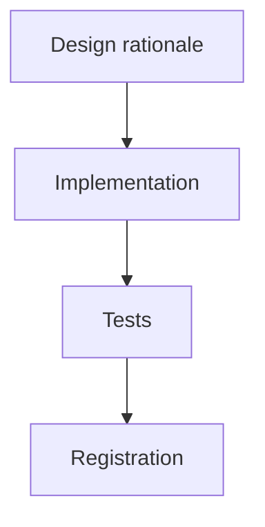

# Archived plan — GOALS 3: Repertoire Research Command

> Status: completed. Archived from root `GOALS.md` on 2026-09-03.
> This body is a historical snapshot; keep it immutable and add future active work to root `GOALS.md`.

---

## GOALS 3 — Repertoire Research Command (base_project feature)

Goal type: **Feature** (`references/goal-types/feature.md`) — a bounded new command added to
the existing base_project command set, not a rewrite. Triggered by an explicit request:
*"um comando para instruir o chat a fazer uma pesquisa profunda em relação ao tema do
projeto para ele ter mais repertório... com base científica, cultural e midiática"* — refining
the "feeding" idea already logged as `dev/ROADMAP.md` item 31 (form already decided there,
2026-08-17: standalone external command, merges with `/newgoal` only via combined invocation,
mirroring `/council`'s existing pattern — this plan does not re-open that decision).

### Scope, as decided

- **What it's for**: `/newgoal`'s own research step (its step 4) researches *how to build* —
  tech stack, libraries, architecture patterns. It has no mechanism for researching *what the
  project is about* — the subject-matter grounding a domain expert would already have. This
  command fills that gap as a distinct research pass, not a bigger `/newgoal` step 4.
- **What it deliberately doesn't do**: it doesn't replace or duplicate `/newgoal`'s tech
  research; it doesn't force every one of its research lenses onto every project (see
  Methodology below — same mistake this repo's own history already made once by forcing
  `build.md`'s stack-area breakdown onto a Process-type plan, see GOALS 2's trigger); and it
  never runs automatically — always opt-in, same restraint `/council` and `/designreview`'s
  self-invocation already apply elsewhere in this project.
- **Suggested command name**: `/repertoire` — matches the user's own word for what this
  produces. Open to a different name — not yet locked in anywhere, same as `/designreview`
  was left open in GOALS 1 until it was actually built.

### Methodology — grounded in current research on how research agents actually plan

- [x] **Decomposition into a small set of lenses, not a fixed per-industry source list.**
      Real evidence-synthesis practice (systematic-review frameworks) segments coverage by
      information type rather than by industry vertical — a taxonomy that's stable across
      domains, unlike a hardcoded "if health app then PubMed" table that needs constant
      expansion and breaks on anything novel. Five reference lenses, not all mandatory per
      project: **Scientific/evidence base**, **Regulatory/legal**, **Cultural/social context**,
      **Media/public discourse**, **Competitive/market landscape**. The command judges which
      lenses actually apply to the specific project — an internal CRUD tool may need zero of
      them; a health app needs most.
- [x] **Surface the lens plan before spending the research budget** — current deep-research
      agent architectures split into three planning strategies: plan-then-search silently
      (fastest, most likely to chase the wrong decomposition), ask clarifying questions first,
      or generate the plan and show it to the user before executing (Gemini Deep Research's
      approach). This command follows the third: list which lenses apply and why, get
      confirmation, same cost-gate spirit `/council` already uses ("this costs real research
      time — want me to run it?"), before running any actual search.
- [x] **Evaluate source credibility per lens, don't just collect links** — real deep-research
      systems retrieve across multiple passes and weigh source credibility/consistency before
      synthesizing, rather than citing the first result found. Apply per lens: scientific
      claims prefer peer-reviewed/primary sources over blog summaries; media claims deliberately
      pull from more than one outlet to surface bias rather than one narrative (the same
      concern the Media Bias Taxonomy research documents); regulatory claims cite the primary
      text (the law/standard itself), not a secondary description of it.
- [x] **Synthesize into a briefing with traceable sources, reusing this project's own existing
      convention** — every `GOALS.md` section already ends with a "Sources consulted" list
      (see GOALS 1/2 above); this command's output follows the same shape per lens instead of
      inventing a new report format.

### Implementation

- [x] New files: `source/claude/commands/repertoire.md` + `source/opencode/command/` mirror —
      same pattern as every command shipped this project.
- [x] Output: a new `REPERTOIRE.md` at the target project's root — git-tracked like
      `GOALS.md`/`README.md`, not gitignored (it's a reference briefing the user keeps, not a
      regenerable artifact). Mirrors `research.md`'s "standalone deliverable" convention rather
      than a `GOALS.md` checklist section, since this output is reference material `/newgoal`
      reads, not a list of checkable build items itself.
- [x] Never overwrite silently — same rule `newgoal.md` step 6 already applies to `GOALS.md`:
      if `REPERTOIRE.md` already exists, read it first and merge, don't discard.
- [x] Hook point in `newgoal.md` (both engines): a new step, alongside the existing step 4a
      that handles `/council`, for the combined-invocation case (`/newgoal /repertoire` in the
      same message) — if `REPERTOIRE.md` exists or was just produced by the combined call,
      `/newgoal`'s own step 4 research reads it first as grounding before researching tech/build
      specifics. Standalone `/repertoire` (no `/newgoal` in the same message) just produces
      `REPERTOIRE.md` on its own, same standalone usability `/council` already has.
- [x] Confirmation gate text in `repertoire.md` itself, modeled on `council.md`'s step 0 — ask
      before running every time, note when the project looks low-stakes/generic and suggest
      skipping.

### Tests

- [x] Same situation as `/council`/`/newgoal`/`/designreview`'s LLM-judgment layer today — not
      unit-testable, no new `dev/tests/*.test.js` file expected. Validated by `npm test` /
      `npx tsc` / `npx biome check .` / `npm run validate:plugins` staying green, not by
      asserting on subjective research output.

### Registration

- [x] `source/claude/references/command-menu.md` + opencode mirror (same file, byte-identical
      today — confirm still true before editing just one).
- [x] `README.md` command table + command count (currently 19 → 20).
- [x] `ARCHITECTURE.md` §1 count, §4 table + header count, §5.2 category table.
- [x] `source/claude/commands/status.md` + opencode mirror — example command list (again;
      third time this count has changed this project — worth noting if this keeps recurring
      the illustrative-example approach itself may be worth revisiting, not just re-editing).
- [x] `.github/workflows/ci.yml` install-test assertions, both OS matrices, both engines.
- [x] `dev/ROADMAP.md` item 31 — update status from "não implementado" to `feito` once actually
      built, with the same `Validado:` honesty this project's other entries already use (name
      what was actually tested vs. what's still just a specification).

### Explicitly out of scope for this pass

- [x] Hardcoding a fixed per-industry source list (e.g. "health app → these 5 exact journals")
      — the whole point of the lens approach above is judgment per project, not a lookup table
      that goes stale and needs maintenance.
- [x] Making this a mandatory step inside `/newgoal` for every goal type — explicitly decided
      against in `dev/ROADMAP.md` item 31's "Decisão de forma"; stays opt-in only.
- [x] A UI/dashboard for browsing past `REPERTOIRE.md` briefings across projects — no
      confirmed need yet, and this repo removed its one prior dashboard already (ROADMAP item
      13) for being more surface than value.

### Sources consulted

- [Deep Research Agents: A Systematic Examination and Roadmap](https://www.alphaxiv.org/abs/2506.18096) — the three planning-strategy taxonomy (plan-then-search / clarify-first / plan-and-confirm) and the decompose→retrieve→evaluate→synthesize core loop.
- [Zylos Research — Deep Research Agent Architectures](https://zylos.ai/research/2026-04-21-deep-research-agent-architectures) — multi-pass retrieval and source-credibility evaluation before synthesis.
- [Conceptual and practical classification of research reviews and other evidence synthesis products (PMC)](https://pmc.ncbi.nlm.nih.gov/articles/PMC8428026/) — evidence-taxonomy-by-information-type precedent for the fixed-lens/variable-source design.
- [The Media Bias Taxonomy: A Systematic Literature Review (arXiv)](https://arxiv.org/html/2312.16148v3) — grounds the "pull more than one outlet" rule for the media/public-discourse lens.
