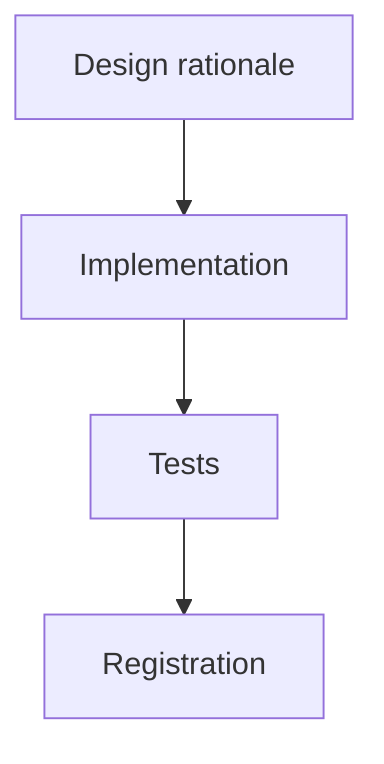

# Archived plan — GOALS 4: Design-Review Calibration Upgrade

> Status: completed. Archived from root `GOALS.md` on 2026-09-03.
> This body is a historical snapshot; keep it immutable and add future active work to root `GOALS.md`.

---

## GOALS 4 — Design-Review Calibration Upgrade (base_project feature)

Goal type: **Feature** (`references/goal-types/feature.md`) — a bounded upgrade to
`/designreview`, which already exists and works (GOALS 1). Triggered by an explicit request:
*"temos que conseguir entender os melhores repositórios para colocar e ter uma opinião boa
para poder mudar o design de um app ou site"* — `/designreview` today judges from the model's
own unanchored training-data sense of "good design," with no concrete reference points to
compare against, and has no companion tool for actually *changing* a design once critiqued.

### Scope, as decided

- **What this upgrades**: `/designreview`'s judgment quality (grounds it in named exemplars
  instead of vague impression) and closes a real gap — the command critiques but has no
  companion for fixing. It does not change the rubric/pre-check layer GOALS 1 already built
  (NNG heuristics, UICrit dimensions, Criticmate's global-then-local pass, the WCAG/tap-target
  pre-check) — those stay as-is; this adds a calibration layer on top.
- **What it deliberately doesn't do**: it doesn't embed an actual image corpus (no built-in
  reference-image dataset to ship — infeasible for a markdown-instruction command); it doesn't
  make browser-based gallery lookup mandatory (optional, only when live browser tooling is
  already available in the session, same conditional `/designreview` step 1 already uses for
  live-URL critique); it doesn't turn `/designreview` into a design-generation tool itself —
  fixing stays a separate step (`/fixproject`, or the two new catalog entries below), matching
  the read-only-critique/separate-fix boundary this project already draws everywhere else
  (`/scanproject` vs `/fixproject`, `/audit` vs its own fix step).

### Methodology — grounded in current research, not invented from scratch

- [x] **Few-shot/named exemplars measurably raise LLM design-judgment quality** — the same
      UICrit dataset already grounding GOALS 1's rubric dimensions also found that few-shot and
      visual prompts raise LLM feedback quality; general LLM-as-judge research confirms 2-4
      annotated reference examples anchor a judge's scale and clarify edge cases where criteria
      conflict. `/designreview` today has zero exemplar-anchoring — this closes that gap using
      the same evidence base already cited in this file, not a new methodology.
- [x] **Which real-world exemplars to name, and why these specifically**: reference production
      design systems the model already has strong, reliable training-data familiarity with —
      Stripe, Linear, Vercel, Notion (chosen because they're independently the four brands
      StyleSeed, a 100+-star MIT-licensed open-source design-judgment engine for Claude
      Code/Cursor, already curated reference "skins" for — reusing an existing independent
      curation is stronger evidence than inventing a list from scratch). Naming concrete
      products beats abstract criteria alone: "compare this dense settings panel's information
      density to how Linear handles the same problem" is a sharper prompt than "assess
      hierarchy."
- [x] **Live gallery lookup as an optional deepening, not a requirement**: when browser tooling
      is already available in the session (same condition `/designreview` step 1 already
      checks), it may open a reference gallery for a real side-by-side rather than judging from
      memory alone — Mobbin (real shipped product UI/UX patterns), Awwwards or Godly (visual
      craft, award-curated), Land-book (landing-page-specific). Pick the gallery matching what's
      being reviewed (a dashboard → Mobbin's real-product patterns; a landing page → Godly or
      Land-book) rather than always defaulting to one.
- [x] **Closing the critique-to-fix loop**: `/designreview` only ever critiqued; it never
      offered a next step for someone who wants the design actually changed well. Two catalog
      candidates found this session close that loop without `/designreview` itself becoming a
      generator: **StyleSeed** (`bitjaru/styleseed`) — open-source, MIT, 100+ stars, 69-74
      design rules plus reference-compiled brand skins (Toss/Stripe/Linear/Vercel/Notion) built
      specifically for Claude Code/Cursor; and **ux-ui-agent-skills** (`plugin87`) — DTCG design
      tokens, WCAG 2.2 accessibility, a much larger reference corpus (138 design systems).
      Neither is installed automatically — both become new `/plugins` catalog entries the user
      opts into, same as every other catalog entry.

### Implementation

- [x] Add a **calibration step** to `source/claude/commands/designreview.md` + opencode mirror,
      positioned between the existing step 2 (deterministic WCAG/tap-target pre-check) and step
      3 (global pass) — before judgment starts, not after: name which 1-2 real-world exemplars
      are most relevant to what's being reviewed (a dashboard vs. a landing page vs. a mobile
      app call for different comparables) and hold the critique against them explicitly in the
      global and local passes that follow.
- [x] Extend the same step with the **optional live-gallery-lookup** conditional, reusing
      `/designreview`'s existing step 1 language for "whatever browser/preview automation
      tooling is available in this session" rather than inventing new tool-availability
      phrasing.
- [x] Add **StyleSeed** and **ux-ui-agent-skills** to `source/plugins.json`'s `catalog` array —
      `kind: "skill"`, `recommend_if` targeting "the project has a UI and `/designreview` (or
      the user) found problems worth fixing, not just critiquing." **Verify the actual install
      command against each repo's own README before writing the catalog entry** — this session's
      research found what these tools are and why they're relevant, not their exact install
      invocation; never invent one, same rule `/plugins` step 5b already applies to
      live-discovery results.
- [x] Validate both new entries against `dev/schemas/plugins.schema.json` via
      `npm run validate:plugins` before considering the catalog addition done.

### Tests

- [x] Same situation as `/designreview`'s own LLM-judgment layer already noted in GOALS 1 — not
      unit-testable, no new `dev/tests/*.test.js` expected for the calibration step itself.
      Validated by `npm test` / `npx tsc` / `npx biome check .` / `npm run validate:plugins`
      staying green, plus the plugins-schema validation above for the two new catalog entries
      specifically.

### Registration

- [x] `README.md` — `/designreview` row (mention calibration briefly) and the "Currently
      cataloged" plugin list (add StyleSeed + ux-ui-agent-skills).
- [x] `ARCHITECTURE.md` §5.2 Design/UI table — add the two new catalog entries alongside the
      existing four.
- [x] `dev/ROADMAP.md` — new item logging this upgrade with sources consulted, following the
      same format every prior item uses.

### Explicitly out of scope for this pass

- [x] Shipping an actual bundled reference-image dataset — no feasible mechanism for a
      markdown-instruction command; named exemplars + optional live gallery lookup cover the
      same need without it.
- [x] Installing StyleSeed/ux-ui-agent-skills automatically, or making either a hard dependency
      of `/designreview` — both stay opt-in catalog entries, same as every other plugin.
- [x] Making live gallery lookup mandatory even without browser tooling available — degrades
      gracefully to named-exemplar-only judgment, same fallback pattern `/designreview` step 1
      already uses for live-URL critique without browser tooling.

### Sources consulted

- [UX Links — 50 design inspiration sites (Awwwards, Mobbin, Land-book, SiteInspire, etc.)](https://x.com/uxlinks/status/2058454587061719067) — the reference-gallery landscape and which gallery fits which review type (real-product patterns vs. visual craft vs. landing-page-specific).
- [StyleSeed (bitjaru/styleseed)](https://github.com/bitjaru/styleseed) — open-source, MIT, 100+ stars, reference-compiled brand skins for Stripe/Linear/Vercel/Notion/Toss; the specific-brands choice for this plan's exemplar list is drawn from this independent curation.
- [ux-ui-agent-skills (plugin87)](https://github.com/plugin87/ux-ui-agent-skills) — 138-design-system reference corpus, DTCG tokens, WCAG 2.2.
- [How Good is ChatGPT in Giving Advice on Your Visualization Design? (arXiv)](https://arxiv.org/pdf/2310.09617) and general LLM-as-judge calibration research — few-shot/named exemplars anchor a judge's scale; UICrit (already cited in GOALS 1) independently found the same for visual design critique specifically.
