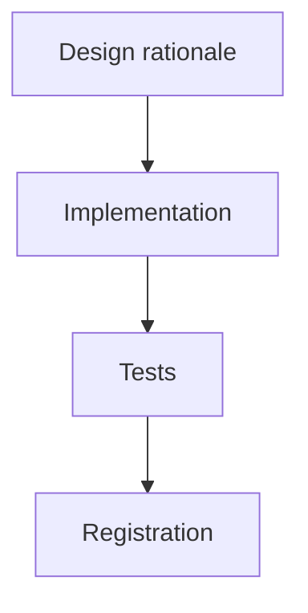

# Archived plan — GOALS 5: Contribution Diary System

> Status: completed. Archived from root `GOALS.md` on 2026-09-03.
> This body is a historical snapshot; keep it immutable and add future active work to root `GOALS.md`.

---

## GOALS 5 — Contribution Diary System (base_project feature)

Goal type: **Feature** (`references/goal-types/feature.md`) — a bounded new capability added
to base_project, which already works. Triggered by an explicit request: keep a contribution
diary per project (modeled on a university extension-project template the user has to fill in),
centralized in one directory, auto-accumulating as work happens — *"tem um adendo, coloque de
um jeito que isso não apareça quando subir para o github, não pode aparecer isso lá de jeito
nenhum."*

### Scope, as decided

- **What it produces**: one Markdown diary per project, in the format of the template the user
  supplied — a header (project, repository, start date), then dated entries (`Dia N -
  DD/MM/YYYY`, a short bold title, a narrative paragraph in first person covering what was done
  and why, ending in `(duração: Xh Ymin)`), then a summary table (Data | Título | Horas) ending
  in a TOTAL row. University-specific sections (orientador, assinaturas) are added only when
  exporting one diary for that purpose, not carried in every file.
- **What it deliberately doesn't do**: it does not write anything inside a project repository
  (the entire point of the constraint below); it does not add a new capture mechanism when one
  already exists; it does not auto-write narrative entries via hook (see the hook/command
  decision below); and it does not copy raw prompt text into diaries — entries are synthesized,
  which is both better writing and safer, since prompts can contain content the user would not
  want transcribed verbatim into a document.

### Design rationale

- [x] **Placement is the whole answer to the GitHub constraint, and it's architectural, not a
      `.gitignore` promise.** Verified directly, not assumed: `D:\ProjetosPessoais` is **not** a
      git repository (`git rev-parse --is-inside-work-tree` → fatal: not a git repository), while
      all six projects under it (`Personal APP`, `TunelSSH`, `MGGP_Vmatlab`, `base_project`,
      `ERP_HK`, `ponto_csh`) **are** repositories with live GitHub remotes. A diary inside any
      project could be committed by accident; a diary in `Diarios_contribuicao/` — a sibling
      directory of every repo, inside none of them — is outside every work tree, so git cannot
      see it even in principle. Done when: this reasoning is written down before any file is
      created.
- [x] **Belt-and-suspenders on top of that, because "can't happen" deserves a second lock**:
      a `.gitignore` containing `*` inside the diary directory (covers the case where the user
      or a tool ever runs `git init` there later), plus a hard guard in the command itself —
      before writing any diary file, resolve its absolute path and refuse if
      `git rev-parse --is-inside-work-tree` succeeds for that location. Three independent
      layers, none depending on the others holding.
- [x] **Reuse the ledger that already exists; do not build a second capture mechanism.** The
      `usage-log.js` hook has been recording every tool call and user prompt to
      `~/.claude/base_project/usage/*.jsonl` since 2026-08-17 — verified live: 2826 events
      across `Personal APP` (1133), `base_project` (424), `ERP_HK` (373 across its subpaths),
      `TunelSSH` (290), `MGGP_Vmatlab` (169), each tagged with `cwd`, `ts`, `tool`, and the
      originating prompt. That is already the raw material for a diary; what is missing is a
      synthesis layer, not a recorder. This is also what makes "toda vez que for fazendo
      modificação ir acrescentando" true in the honest sense: capture is continuous and
      automatic, and a diary can be synthesized for any past date range even if the command
      wasn't run that day.
- [x] **Two sources for backfill, because the ledger only starts 2026-08-17 and the work
      doesn't.** Real git history per project, verified: `TunelSSH` 62 commits (2026-07-29 →
      08-19), `ERP_HK` 52 (07-31 → 08-19), `base_project` 33 (08-01 → 08-19), `MGGP_Vmatlab` 14
      (08-13 → 08-18), `Personal APP` 6 (07-29 → 08-19), `ponto_csh` 3 (08-02 → 08-18). Backfill
      = `git log` for everything before the ledger existed, ledger for everything after (richer:
      it knows what was attempted, not only what was committed). Projects with no repository at
      all (`IC`) are ledger-only — the design must not assume git is present.
- [x] **A project's name and its folder name are not the same thing, and the diary must use the
      name.** Found while executing this plan, not while writing it: the folder on disk is
      `ERP_HK`, but the git repository inside it points at `github.com/.../ERP.git`, and the
      project is "ERP" everywhere the user refers to it. Resolve identity from the git remote's
      repository name when a remote exists, falling back to the directory's own name only when
      it doesn't — otherwise every diary is titled by whatever the folder happened to be called
      locally, which is the one name that means nothing to anyone else.
- [x] **Split deterministic extraction from narrative synthesis**, the same split this repo
      already uses twice (`contrast-check.js` computes WCAG ratios, the LLM judges everything
      else in `/designreview`; `scan-skill.js` finds patterns, the LLM interprets them in
      `/plugins`): a script produces structured facts (sessions, dates, durations, files
      touched, commits), and the command turns those facts into readable Portuguese entries.
      The script is real logic and gets real tests; the narrative pass is a judgment call and
      doesn't.
- [x] **A command, not a hook.** `designreview.md` already settled this precedent explicitly in
      this repo: hooks here (`post-edit-format.js`, `usage-log.js`) are deterministic scripts,
      not LLM calls, and forcing an LLM pass into a hook adds real latency and cost on every
      trigger. Narrative synthesis needs an LLM, so it belongs in a command. The hook side of
      the system is the recording that already happens.
- [x] **Duration must measure something defensible.** Computed as the span from first to last
      ledger event per project per day, with any idle gap longer than 30 minutes excluded rather
      than counted — a session left open overnight otherwise reports as 14 hours of work. State
      this convention in the diary header itself so the number is never read as a precise
      timesheet; it is an honest estimate of active session time.
- [x] **Language: diary content in Portuguese, command file in English** — this repo's own rule
      (`CLAUDE.md`: text the model executes → English; text rendered literally to the user →
      the user's language). The diary is a document the user reads and may hand to a university,
      so its content is Portuguese; `diario.md`'s instructions are English like every other
      command.
- [x] **The diary root is configurable, not hardcoded to this machine.** base_project ships to
      other people, and `D:\ProjetosPessoais\Diarios_contribuicao` is one user's path. Resolve
      it from `~/.base_project/diary-root.txt` — reusing exactly the state-file convention
      `~/.base_project/repo-path.txt` already established for `/update`/`/status` — falling back
      to `~/Documentos/Diarios_contribuicao` when that file is absent. This user's file holds
      their real path.

### Implementation

- [x] `dev/scripts/diary-source.js` — deterministic extractor, Node-only with no new
      dependencies (same constraint `scan-skill.js` already respects). Reads every
      `~/.claude/base_project/usage/*.jsonl`, groups events by resolved project and by day,
      applies the idle-gap rule above, and emits JSON: per project per day, the session count,
      active duration, tools used, files touched, and the prompts that opened each chain. Takes
      `--project <path>` and `--since <date>` filters. Resolves a nested `cwd`
      (`ERP_HK\ERP\modules`) up to its owning project root rather than treating it as a separate
      project, and skips the bare parent directory (`D:\ProjetosPessoais`) since it is not a
      project.
- [x] Same script, git side: when the target project is a repository, also read `git log
      --format=...` for the range being backfilled and merge those commits into the same
      per-day structure — labeled as commits, distinct from ledger sessions, so the command can
      tell "what was committed" from "what was worked on."
- [x] Diary directory scaffolding at the resolved root: `.gitignore` containing `*`, and a short
      `README.md` explaining what the directory is, why it is deliberately outside every
      repository, and that it is never to be committed anywhere.
- [x] `source/claude/commands/diario.md` + `source/opencode/command/` mirror. Behavior: resolve
      the diary root; determine the target project (current directory by default, `$ARGUMENTS`
      to name another, `--all` to sweep every project); run `diary-source.js` for everything
      since the diary's last recorded date; synthesize new dated entries in the template format;
      append them; then rebuild the summary table and TOTAL from the full entry list rather than
      incrementing a stored number, so the table can never drift out of sync with the entries
      above it.
- [x] The refuse-if-inside-a-repo guard from the design section, implemented in the command as a
      hard stop with an explanatory message — never a silent skip, never a "write it anyway."
- [x] Never overwrite silently: if a diary already exists, read it first, find the last recorded
      date, and only append entries after it — the same rule `newgoal.md` step 6 already applies
      to `GOALS.md`. Re-running the command must be safe and idempotent for a date range already
      written.
- [x] Backfill the five projects the user named plus the ones found alongside them —
      `Personal APP`, `TunelSSH`, `MGGP_Vmatlab`, `base_project`, and `IC` (ledger-only, no
      repository) — from git history and the ledger, using the real date ranges verified above.
      `ERP_HK` and `ponto_csh` were not named by the user; ask before creating diaries for them
      rather than assuming (`manual`).
- [x] Add the standing rule to `source/CLAUDE.md` and `source/opencode-instructions.md`: after
      closing a substantial task in a project that has a diary, mention once that `/diario` can
      record it. A suggestion at a specific moment, never an automatic write — the same shape as
      the existing plugin-suggestion rule ("suggest only, never auto-install") and the
      WhatsApp-menu rule's two specific moments, not a per-turn interruption.
- [x] Future projects are covered without further work: the command creates a diary for any
      project that doesn't have one yet on first run, so a new project only needs `/diario` once.

### Tests

- [x] `dev/tests/diary-source.test.js` — real coverage for real logic, same convention as
      `usage-log.test.js`/`contrast-check.test.js`: day-boundary grouping, the 30-minute idle-gap
      exclusion (including a gap that spans midnight), nested-`cwd`-resolves-to-project-root, the
      bare-parent-directory exclusion, a project with no git repository, and a malformed JSONL
      line not taking down the whole run (the ledger's own per-line durability guarantee).
- [x] The narrative synthesis layer is not unit-testable — same situation as `/council`,
      `/newgoal` and `/designreview` already have in this repo. Validated by `npm test` /
      `npx tsc` / `npx biome check .` / `npm run validate:plugins` staying green.

### Registration

- [x] `source/claude/references/command-menu.md` + opencode mirror (byte-identical today —
      confirm before editing just one).
- [x] `README.md` command table + command count (currently 20 → 21).
- [x] `ARCHITECTURE.md` §1 count, §4 table + header count, §5.2 category table, and the
      `dev/scripts/` line in the §2 directory map for `diary-source.js`.
- [x] `source/claude/commands/status.md` + opencode mirror — example command list.
- [x] `.github/workflows/ci.yml` install-test assertions for `diario.md` (both OS matrices, both
      engines) and for `diary-source.js` landing in `~/.claude/base_project/scripts/`.
- [x] Installer: `diary-source.js` must be added to whatever list syncs `scan-skill.js` and
      `contrast-check.js` into `~/.claude/base_project/scripts/` in **both** `install.ps1` and
      `install.sh` — check both, since these two scripts have already diverged once in this
      project's history (the non-recursive reference-sync bug, ROADMAP item 30).
- [x] `dev/ROADMAP.md` — new item with the same `Validado:` honesty the other entries use.

### Explicitly out of scope for this pass

- [x] Version-controlling the diaries themselves in a private repository — it would give them
      backup and history, but it reintroduces exactly the risk the user asked to eliminate
      (a remote, a push, a wrong remote) and is their call to make, not a default to ship.
      Worth revisiting only if they ask.
- [x] Exporting a diary to the university's PDF format with orientador and assinatura blocks —
      the Markdown carries all the content needed; converting one diary for submission is a
      separate, occasional task, not part of continuous recording.
- [x] Retroactively reconstructing work from before both sources exist (before 2026-07-29, and
      for any project whose early work predates its first commit) — there is no evidence to
      synthesize from, and inventing entries would defeat the entire purpose of a diary.
      Diaries state their own coverage start date instead of pretending completeness.
- [x] Auto-pruning or archiving old ledger files — noted as a real risk (unsynthesized history
       would be lost if those `.jsonl` files are ever deleted), but this plan doesn't change
       retention; running `/diario` regularly is the mitigation.
