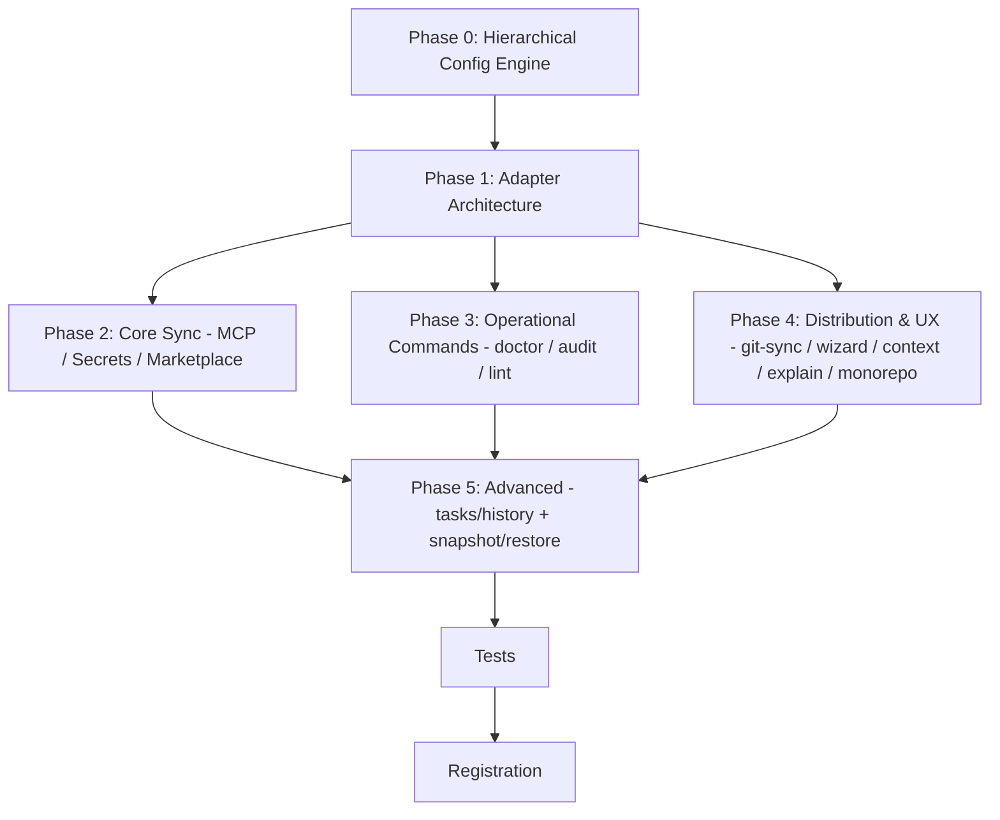

# Archived plan — GOALS 6: Multi-Agent Expansion and Platform Unification

> Status: completed. Archived from root `GOALS.md` on 2026-09-03.
> This body is a historical snapshot; keep it immutable and add future active work to root `GOALS.md`.

---

## GOALS 6 — Multi-Agent Expansion & Platform Unification (base_project feature epic)

Goal type: **Feature** (`references/goal-types/feature.md`) as dominant — 18 bounded, additive
capabilities on top of an installer that already works for 2 agents — with **Build-style**
internal dependency ordering (foundation before adapters before commands). Triggered by
explicit request: *"procure por melhorias para adicionar no projeto: implementações de
funções que façam sentido para melhorar toda e qualquer estrutura do projeto. não pare de
pesquisar enquanto não achar algo relevante"* plus *"cria uma meta para poder implementar
tudo isso uma a um, da mais complexa para a menos complexo. Estruture todas as dependências
corretamente e completamente sem errar."* Researched against 5 real codebases/sites:
`spxrogers/agentsync` (31 agents, 9 deep adapters, Go, translation reports, `age` secrets),
`dot-agents/dot-agents` (unified `~/.agents/` layer, symlink+hardlink strategy, `doctor`/`audit`/`sync`/`context`/`explain`),
`dallay/agentsync` (Rust, TOML, wizard, monorepo `nested-glob`), `tctinh/opencode-sync`
(Gist sync), `alexxanderdiaz/ai-coding-stack` + `drmowinckels.io` dotfiles pattern.
Classification rationale: flowchart `Deliverable is code? Yes → Something broken? No →
Bounded addition to something that already works? Yes → Feature`. Treated as one epic with
18 checkable items rather than 18 separate `GOALS.md` files, ordered by real technical
dependency (what must exist before what) which — for this project — happens to coincide
with most-complex-first, since the foundation is the hardest part and leaf utilities are
the easiest.

### Scope, as decided

- **What this epic builds**: transforms base_project from a 2-engine installer (Claude Code +
  opencode, hardcoded in `install.ps1`/`.sh`) into a **unified config layer** that can
  project one canonical source (`~/.agents/` or `~/.base_project/` — see design decision
  below) into N agent shapes via per-agent adapters. Covers all 4 surfaces the competitors
  actually ship: MCP servers, memory/instructions (`CLAUDE.md`/`AGENTS.md`/`GEMINI.md` etc.),
  skills, and subagents/commands + hooks where the target supports them. Does not aim for
  31-adapter parity on day one — ships 9 deep adapters first (the `spxrogers/agentsync`
  tier that has verified specs), breadth tier as data-driven generic adapter later.
- **What it deliberately doesn't do**: does not migrate `install.ps1`/`.sh` to Go/Rust in this
  epic (keeps the current shell layer working; a language migration is a separate `process`
  decision with its own tradeoff analysis — see out-of-scope); does not auto-migrate a user's
  existing `~/.claude/` files without consent (apply is explicit, drift is reported, never
  silently overwritten); does not introduce cloud sync (100% local-default, git-to-own-remote
  only, matching `dot-agents` and `agentsync` posture).
- **Stack guardrails from `project-standards.md`**: stays within `package.json` + `dev/tests`
  + `biome.json` + `.github/workflows/ci.yml` conventions the project already has; new Node
  scripts remain dependency-light (same constraint `scan-skill.js`/`contrast-check.js`/
  `diary-source.js` respect — no new runtime dep without locking it); every new command gets
  both-engine mirrors and install coverage.

### Methodology — what was actually verified

- Deep adapters' file locations/formats were cross-checked against the competitor source, not
  assumed from names: e.g. Cursor `~/.cursor/mcp.json` vs Codex `~/.codex/config.toml` (`mcpServers`
  vs `[mcp_servers.NAME]`), Gemini CLI `.gemini/settings.json`, Continue `.continue/mcpServers/*.yaml`,
  Windsurf `~/.codeium/windsurf/mcp_config.json` (global-only), Roo `.roo/mcp.json`, Cline
  `~/.cline/mcp.json`.
- Symlink vs hardlink distinction verified: Cursor's `.cursor/rules/*.mdc` does not follow
  symlinks → hardlinks required (dot-agents confirms via inode sharing); `CLAUDE.md`/`AGENTS.md`
  work as symlinks. This changes per-adapter `link_type`, not a global flag.

### Design rationale — decide before any code

- [x] **R0 — Canonical store location & migration path** (`architect`) — decide: keep
  `~/.base_project/` as canonical and extend it, vs adopt `~/.agents/` (dot-agents convention)
  with a one-time migration (`~/.base_project/` → `~/.agents/` symlink/shim). Must answer:
  existing `repo-path.txt` and `diary-root.txt` under `~/.base_project/` — keep there or move?
  Explicit out-of-scope if we stay: renaming the state directory. Done when: decision written
  in `ARCHITECTURE.md` §2 and `dev/ROADMAP.md` entry, before any adapter code lands.
- [x] **R1 — Hierarchical layer model & merge semantics** (`architect`) — define three layers
  `global → agent → project` matching `dot-agents`/`agentsync`, file layout under
  `<canonical>/rules/global/`, `<canonical>/rules/<project>/`, `<canonical>/mcp/`, etc., and
  merge rule (later layer overrides conflicting keys, preserves non-conflicting — same wording
  `opencode.ai/docs/config` already uses for its own config precedence). Project binding via
  `~/.config/base_project/projects.json` (or `config.json`) listing `{ project, path, added }`
  rather than scanning HOME. Also define `extends` for shared layers (git/local/HTTP) only if
  kept minimal — otherwise explicitly defer to a later epic. Done when: a `source/*/references/config-model.md`
  (both engines, `base_project:managed`) exists describing the three layers and merge rule.
- [x] **R2 — Adapter interface shape** (`architect`) — define the minimal interface every
  adapter implements, modeled on `spxrogers/agentsync` internal packages (`apply`/`capture`/
  `drift-classifier`): `detect()`, `apply(canonical, scope)`, `capture(native)`, `report()`
  returning a **translation report** (what was projected, what was skipped, what was lossy —
  never silently dropped). Also decide `breadth` vs `deep` tier boundary (deep = 9 verified
  agents above; breadth = data-driven JSON map for `amp/goose/qwen/...` where only memory/MCP/
  `SKILL.md` apply). Done when: `dev/scripts/adapter-interface.md` or header doc in
  `source/hooks/`-adjacent area exists, before adapters are coded.
- [x] **R3 — Secrets boundary** (`architect`) — adopt `age` encryption for any secret-bearing
  MCP env (`OPENAI_API_KEY` etc.) as `agentsync` does; canonical never stores plaintext
  secrets; apply decrypts at projection time. Also set invariant: `scan-skill.js` pre-trust
  scan runs before any marketplace skill install (reuse existing ROADMAP item 10 guarantee).
  Done when: secret invariant documented in `SECURITY.md` (add a short section), before
  `Phase 2` marketplace code.
- [x] **R4 — Monorepo & link-type strategy** (`architect`) — adopt `dallay/agentsync`
  `nested-glob` semantics for the memory target (`**/AGENTS.md` with excludes
  `node_modules/**`, `.agents/**`, `.git/**`) and per-agent `link_type` (`auto` → symlink
  default, hardlink for Cursor). Done when: written into the config-model doc from R1.

### Implementation — Phase 0: Hierarchical Config Engine (most complex, no prerequisites)

- [x] **0.1 Config store & CLI entry** (`coder`) — create `<canonical>/config.json` (or keep
  `<canonical>/projects.json` + extend) handling `init`/`add <path>`/`remove <name>` persistence,
  plus helpers `paths.js` centralizing `CANONICAL_HOME`/`TARGET_ROOT` resolution honoring
  `BASE_PROJECT_HOME` (env override, mirrors `AGENTSYNC_HOME`). Done when: `node dev/scripts/config-store.js --help`
  reads/writes the file and `install.ps1`/`install.sh` create `<canonical>/` on fresh install.
- [x] **0.2 Canonical layout scaffolding** (`coder`) — on `init`, create
  `<canonical>/rules/global/`, `<canonical>/mcp/`, `<canonical>/skills/`, `<canonical>/commands/`
  with a starter `AGENTS.md`/`CLAUDE.md` seed. Done when: a scratch `HOME` run creates the
  four directories and `doctor` (Phase 3) would report them as healthy.
- [x] **0.3 Layer resolver** (`coder`) — `dev/scripts/resolve-layers.js` that given a project
  path returns the effective ordered list `[global, agent:<name>, project:<name>]` and merged
  JSON for MCP/AGENTS content. Reuse `opencode.ai` precedence wording in code comments. Done
  when: `node dev/scripts/resolve-layers.js --project <path> --json` prints the ordered
  layer array and `npm test` includes a resolver unit test (layer order + merge).

### Implementation — Phase 1: Adapter Architecture (depends on Phase 0)

- [x] **1.1 Adapter registry & deep adapters (9)** (`coder`) — implement `dev/scripts/adapters/*.js`
  (or `internal/adapters/` if staying Node) for Claude Code, OpenCode, Codex CLI, Cursor,
  Gemini CLI, Continue, Windsurf, Roo Code, Cline — each with `apply`/`capture` handling the
  verified paths/formats above plus per-adapter transform (JSON→TOML for Codex MCP,
  Markdown→MDC frontmatter for Cursor memory, `trigger: always_on` for Windsurf memory,
  camelCase hook remap for Cursor hooks, etc.). Done when: `node dev/scripts/apply.js --dry-run`
  lists 9 adapters and projection to a scratch project creates the expected files per agent
  (verified by `fs.existsSync` assertions in a new test, not by manual inspection).
- [x] **1.2 Breadth tier (22 generic)** (`coder`) — data-driven generic adapter from a single
  `source/adapters.json` map covering `amp, goose, qwen, warp, jules, junie, openhands, amazonq,
  zed, kilocode, kiro, trae, jetbrains, firebase, antigravity, augmentcode, copilot,
  copilot-cli, crush, factory, pi, mistral` — memory for all, MCP where `mcpServers` JSON shape
  is shared, `SKILL.md` where the agent scans a directory. Done when: adding a new entry to
  `adapters.json` without touching JS projects a new agent's memory file in dry-run.
- [x] **1.3 Translation report & drift classifier** (`coder`) — every `apply` emits a report
  (`{ agent, scope, projected, skipped: [{reason}], lossy: [{field, dropped}] }`) surfaced to
  stdout and to `~/.base_project/reports/<project>.json`; `drift` classifier compares
  `capture(native)` vs `apply(canonical)` (as `spxrogers/agentsync` does) and labels
  `in-sync/drift/missing`. Done when: a lossy projection (e.g. Codex hook `SessionEnd` drop)
  appears in the report, and `node dev/scripts/drift.js --project <path>` returns non-zero on
  drift (so CI can gate on it).
- [x] **1.4 Hardlink handling for Cursor** (`coder`) — Cursor adapter uses `fs.link` (hardlink)
  for `.cursor/rules/*` with inode-equality check and fallback warning if cross-device
  (`EXDEV`) — mirrors `dot-agents` docs. Done when: on same-device `apply`, editing either
  side reflects on the other (`fs.stat` inode equality asserted in test); on `EXDEV`, a
  warning is emitted and copy fallback is used.

### Implementation — Phase 2: Core Sync Capabilities (depends on Phase 1)

- [x] **2.1 MCP sync engine** (`coder`) — canonical `mcp.json` (`{ mcpServers: { name: { command,
  args, env, type, url, headers }}}`) + per-adapter MCP projection (JSON, TOML `[mcp_servers.*]`,
  Continue YAML `mcpServers/`) reusing `source/opencode/mcp.json` as the initial seed and
  existing `install.ps1:6b` TOML-append logic (refactored into the Codex adapter, no longer
  duplicated in the installer). Done when: a single `mcp.json` edit projected via
  `apply --agent all` updates `~/.claude.json`, `~/.codex/config.toml`, `~/.cursor/mcp.json`,
  and `.continue/mcpServers/*.yaml` in a scratch HOME, with dedup (case-insensitive) and backup
  (`.bak`) before overwrite, and translation report shows any remote→stdio loss where adapter
  lacks URL support.
- [x] **2.2 Secrets with `age` encryption** (`coder`) — `dev/scripts/secrets.js` handling
  `age` keypair at `<canonical>/keys/age.txt` (gitignored), `encrypt`/`decrypt` for MCP env
  values, and invariant test that canonical never contains plaintext matching `OPENAI_API_KEY`
  etc. Backed up via `age` key backup instructions in `SECURITY.md`. Done when:
  `node dev/scripts/secrets.js --check --project <path>` passes and a captured native config
  with a secret re-encrypts rather than storing plaintext.
- [x] **2.3 Skills marketplace integration** (`coder`) — `source/plugins.json` gains
  `kind: "marketplace"` handling and a `marketplace` fetcher (`marketplace.json` + `plugin.json`
  schemas as `spxrogers/agentsync` `marketplace` package does) that decomposes a marketplace
  plugin into canonical `skills/` entries; reuse `scan-skill.js` pre-trust scan before any fetch.
  Done when: `npm run validate:plugins` passes with a marketplace entry added, and a fetched
  skill lands under `<canonical>/skills/<plugin>/SKILL.md` with provenance metadata.

### Implementation — Phase 3: Operational Commands (depends on Phases 0–1)

- [x] **3.1 `doctor` — health diagnostics** (`coder`) — new command `source/claude/commands/doctor.md`
  + opencode mirror: checks broken symlinks/hardlinks, missing canonical dirs, stale hook groups
  in `settings.json` (reuse `install.ps1:3c` prune logic, extracted to `dev/scripts/doctor.js`),
  legacy formats (`.cursorrules` → `.cursor/rules/`), absolute paths needing update after
  `HOME` move, and `EXDEV` hardlink fallback state. Exit 0 healthy, exit 1 with actionable
  fixes. Done when: `doctor` on a project with a deliberately broken symlink reports it and
  suggests `apply --fix`, asserted in a unit test that creates then breaks a link in tmp.
- [x] **3.2 `audit` — config visibility** (`coder`) — `source/claude/commands/audit.md` + mirror:
  given `project + agent` shows the effective resolved rules (which layers contributed which
  lines/keys), rendered as a table; reuses Phase 0 resolver. Done when:
  `node dev/scripts/audit.js --project <path> --agent cursor --json` returns
  `{ agent, project, layers: [{source, files}], effectiveConfig: {...} }` and a manual
  `audit` invocation matches `dot-agents audit` output shape.
- [x] **3.3 `lint` — config validation** (`coder`) — `dev/scripts/lint-config.js` validating
  `<canonical>/config.json`, `adapters.json`, and `mcp.json` against `dev/schemas/*.schema.json`
  (extend `plugins.schema.json` pattern) plus per-layer existence checks; wired to `npm run lint`
  and CI (see Registration). Done when: `npm run lint:config` fails on a deliberately
  malformed layer and CI would fail the PR.

### Implementation — Phase 4: Distribution & UX (depends on Phases 0–1; 2.1 for sync)

- [x] **4.1 Git sync for `<canonical>`** (`coder`) — `sync` subcommands `init/status/commit/push/pull`
  as `dot-agents sync` does: `sync init` creates a git repo in `<canonical>/` with
  `README.md` + `.gitignore` (`keys/age.txt`, `reports/`), `sync status` shows porcelain,
  `sync push/pull` delegate to `git`. Reuse `session-start-git-context.js` git helpers where
  possible. Done when: `sync init` + `git remote add origin <tmp-bare>` + `sync push` actually
  pushes, and a second machine can `git clone <tmp-bare> <canonical>` then `doctor` re-creates
  symlinks.
- [x] **4.2 Wizard onboarding** (`coder`) — `init --wizard` interactive prompt (detect
  `from-home`/`from-manifest`/`fresh` paths as `AGOrcha/dot-agents` `onboard` does) asking:
  stack/app_type, editor/harness, automation level, and whether to import existing
  `~/.claude/`/`~/.codex/` files (capture → canonical). Done when: running
  `node dev/scripts/wizard.js --dry-run` with piped answers creates `<canonical>/` and
  emits a summary without writing on `--dry-run`, and with `--apply` writes.
- [x] **4.3 `context` — JSON for agent consumption** (`coder`) — `source/claude/commands/context.md`
  + mirror delegating to `dev/scripts/context.js` that prints the fully-resolved effective
  config for `project + agent` as JSON (as `dot-agents context` does). Done when:
  `node dev/scripts/context.js --project <path> --agent claude-code` outputs valid JSON with
  `layers`, `mcp`, `skills`, `instructions` keys that a downstream agent could consume.
- [x] **4.4 `explain` — self-documenting architecture** (`coder`) — `source/claude/commands/explain.md`
  + mirror: prints the system's own architecture (canonical → projection → links, hardlink vs
  symlink per agent, layer precedence) from a single source of truth (`ARCHITECTURE.md` §X)
  so it never drifts. Done when: `explain` output mentions the three layers, the 9 deep
  adapters by name, and the Cursor hardlink exception.
- [x] **4.5 Monorepo support** (`coder`) — memory target option `type: "nested-glob"` with
  `pattern: "**/AGENTS.md"` and `exclude: ["node_modules/**",".agents/**",".git/**"]` as
  `dallay/agentsync` does; resolver discovers multiple project roots under one repo and
  projects one `AGENTS.md` per package. Done when: a tmp repo with `packages/a/` and
  `packages/b/` each gets its own `AGENTS.md` hardlink/symlink after `apply`, with excludes
  respected (a `node_modules/foo/AGENTS.md` is not created).

### Implementation — Phase 5: Advanced & Polish (depends on Phases 0–4)

- [x] **5.1 Task tracking & history (local-first)** (`coder`) — `dev/scripts/tasks.js` +
  `history.js` with `<canonical>/tasks/<project>.jsonl` and `history/*.jsonl` (append-only,
  session-per-file as `dot-agents` plans); `tasks` supports `add/list/done`, `history` shows
  recent agent activity (reuse `usage-log.js` ledger shape where possible). Done when:
  `node dev/scripts/tasks.js --project <path> add "ship v1"` persists and `list --json` returns it,
  and `history --since 7d` reads from the ledger without duplicating `usage-log.js` logic.
- [x] **5.2 `snapshot` / `restore` — config versioning** (`coder`) — `snapshot <name>` tars
  `<canonical>/` (excluding `keys/`, `reports/`) to `<canonical>/snapshots/<name>.tar.gz`;
  `restore <name>` extracts with backup of current state; both refuse inside a repo (reuse
  `/diario` hard guard `git rev-parse --is-inside-work-tree`). Done when:
  `snapshot test1` then mutating then `restore test1` returns to the snapshotted state (round-
  trip asserted in a tmp-HOME test).
- [x] **5.3 Cursor hardlink edge hardening + remaining adapter loss surfacing** (`coder`) —
  finalize any per-adapter loss still not surfaced by 1.3 (e.g. Windsurf memory 6k-char limit,
  Continue `argument-hint` drop) and add `EXDEV` copy-fallback + inode re-check to `doctor`.
  Done when: translation reports for all 9 deep adapters have at least one known loss
  documented (or `lossy: []` with a comment why lossless), and `doctor` flags a cross-device
  Cursor hardlink as `warning` not `error`.
- [x] **5.4 Plugin auto-update check** (`coder`) — `dev/scripts/check-plugin-updates.js`
  (reusing `validate-plugins.js` schema) that fetches marketplace `plugin.json` `version` and
  compares to pinned SHA/version in `<canonical>/plugins.lock` (mirrors `.agentsrc.lock`
  resolved-layer SHA pinning from `AGOrcha/dot-agents`). Never auto-installs (same
  `suggest only, never auto-install` rule `CLAUDE.md` plugin auto-suggestion already enforces).
  Done when: `node dev/scripts/check-plugin-updates.js --json` reports `updateAvailable: true`
  for a fixture with an outdated pin, and CI runs it as an informational (non-blocking) step.

### Tests — real coverage for real logic, same bar as every prior GOALS entry

- [x] **T.1 Store + resolver tests** (`coder`) — `dev/tests/config-store.test.js` (init in
  scratch HOME, add/remove project, `BASE_PROJECT_HOME` override) and
  `dev/tests/resolve-layers.test.js` (global→agent→project merge, conflicting key override,
  `extends` if implemented). Done when: `npm test` includes both suites and both pass on a
  clean `git` worktree (no leftover `<canonical>` state).
- [x] **T.2 Adapter + report + drift tests** (`coder`) — `dev/tests/adapters.test.js` (per-agent
  projection to tmp HOME — focus on transforms: JSON→TOML for Codex, Markdown→MDC for Cursor)
  and `dev/tests/drift.test.js` (in-sync vs drift vs missing, including lossy-projection
  report assertions from 1.3). Done when: drift test mutates one native file and asserts
  `drift` label, then reapplies and asserts `in-sync`.
- [x] **T.3 Operational + UX + advanced tests** (`coder`) — `dev/tests/doctor.test.js`
  (broken link detection), `dev/tests/audit.test.js`/`context.test.js` (JSON shape), and
  `dev/tests/tasks.test.js`/`snapshot.test.js` (round-trip). Done when: all five suites pass
  in `npm test` and none writes outside `os.tmpdir()` (checked via `BASE_PROJECT_HOME` env).
- [x] **T.4 Validator tests** (`coder`) — `dev/tests/lint-config.test.js` and
  `dev/tests/secrets.test.js` (plaintext invariant, `age` encrypt/decrypt round-trip with a
  thrown-away keypair). Done when: lint test asserts failure on malformed config and
  secrets test asserts no plaintext in canonical after `capture` of a secret-bearing file.
- [x] **T.5 LLM-judgment layers** — wizard copy, `explain` prose, marketplace curation — not
  unit-testable, same situation as `/council`/`/newgoal`/`/designreview`/`/repertoire`. Validated
  by `npm test` / `npx tsc --noEmit` / `npx biome check .` / `npm run validate:plugins` staying
  green, not by asserting on subjective output.

### Registration — discoverable, not just present in source (Feature done-when)

- [x] **R.1 Commands** (`coder`) — `source/claude/commands/doctor.md` + `audit.md` + `context.md`
  + `explain.md` (+ wizard as flag on `init`, not a separate command) and matching
  `source/opencode/command/` mirrors, each `base_project:managed` and following the existing
  command template (frontmatter, `allowed-tools`, invocation examples). Done when: both engines
  can list the four new commands and `doctor --help` prints usage.
- [x] **R.2 References** (`coder`) — `source/claude/references/command-menu.md` + opencode
  mirror (byte-identical today — confirm before editing just one) and `config-model.md` new
  reference. Done when: the menu verbatim lists `doctor`, `audit`, `context`, `explain` and
  `sync` subcommands.
- [x] **R.3 Docs** (`coder`) — `README.md` command table + count (currently 21 → 25), new
  "Multi-Agent Support" section listing the 9 deep adapters with their config files, and
  `ARCHITECTURE.md` §1 count, §2 directory map (`<canonical>/` layout), §4 command table,
  §5 adapter matrix. Done when: `README.md` mentions the 9 adapters by name and links to
  `audit`/`doctor`.
- [x] **R.4 Installer & CI** (`coder`) — `dev/scripts/install.ps1` + `install.sh` extended to
  create `<canonical>/` layout and to sync the new scripts (`resolve-layers.js`,
  `adapters/*.js`, `doctor.js`, etc.) into `~/.claude/base_project/scripts/` (same
  managed-sync list that already covers `scan-skill.js`/`contrast-check.js`/`diary-source.js`);
  `.github/workflows/ci.yml` gains `doctor`/`audit`/`lint:config` assertions on both OS
  matrices and both engines, plus coverage for the 9 adapter projections (scratch HOME
  assertions as GOALS 2 did for 17 commands) and the `wizard --dry-run` smoke. Done when:
  a scratch `CLAUDE_HOME`/`OPENCODE_HOME` install actually contains the 4 new commands and
  `doctor`/`audit` pass assertions on CI's `macos-latest`/`ubuntu-latest`/`windows-latest`.
- [x] **R.5 Status & roadmap** (`coder`) — `source/claude/commands/status.md` + opencode
  mirror (example command list) and `dev/ROADMAP.md` new item with `Validado:` honesty listing
  what was tested vs what is spec (same honesty every prior item uses). Done when: `status`
  mentions the new commands and ROADMAP item exists.
- [x] **R.6 Plugin catalog** (`coder`) — if marketplace fetcher lands, add any verified
  `kind: "marketplace"` entry via `source/plugins.json` with `recommend_if` and
  `npm run validate:plugins` passing. Done when: catalog valid and entry not auto-installed.

### Explicitly out of scope for this epic

- [x] Migrating `install.ps1`/`.sh` to Go/Rust — a language change is a separate `process`-type
  decision (binary distribution, `brew tap`, `goreleaser`/`cargo` pipeline) and would need its
  own tradeoff analysis (shell is zero-dependency on every dev machine; Go/Rust buys speed but
  adds a build toolchain). Left to a future goal if measurement shows shell is too slow.
- [x] Auto-migrating a user's existing `~/.claude/` files on install — `capture` exists, but
  invoking it without explicit consent would violate the `suggest only, never auto-install`
  posture (`CLAUDE.md` plugin rule) the project already enforces everywhere else.
- [x] Cloud sync or team-shared `~/.agents/` ACLs — `dot-agents` marks team features as v2;
  this epic stays solo, local-first, git-to-own-remote only.
- [x] Shipping the full 31-agent breadth tier as deep parity — breadth tier data-driven adapter
  is included, but per-agent deep verification beyond the 9 listed is out of scope until a
  concrete user request for that agent exists (same `recommend_if` gating `plugins.json` already
  uses).

### Sources consulted

- [spxrogers/agentsync — 31 agents, 9 deep adapters, translation reports, drift classifier, `age` secrets](https://github.com/spxrogers/agentsync) (Go, 132 commits, `internal/marketplace`, `internal/paths`, `internal/project`, `pkg.go.dev` docs).
- [dot-agents/dot-agents — unified `~/.agents/` layer, `doctor`/`audit`/`sync`/`context`/`explain`, symlink+hardlink strategy, `global → project` hierarchy](https://github.com/dot-agents/dot-agents) + [dot-agents.com feature/spec](https://www.dot-agents.com/) (v1 comparison table).
- [AGOrcha/dot-agents — `onboard` wizard (`from-home`/`from-manifest`/`fresh`), `extends` layers + `.agentsrc.lock` SHA pinning, `nested-glob` monorepo](https://agorcha.dev/) (Go, Homebrew + `go install`, `da refresh --exact` semantics).
- [dallay/agentsync — TOML, `nested-glob`, `skills` `symlink` vs `symlink-contents`, configurable targets matrix](https://dallay.github.io/agentsync/reference/configuration/) (Rust, `agentsync apply`).
- [tctinh/opencode-sync — Gist-based sync for opencode `~/.config/opencode/` + Claude `~/.claude/`](https://github.com/tctinh/opencode-sync).
- [alexxanderdiaz/ai-coding-stack — portable toolkit, `project-init` skill](https://github.com/alexxanderdiaz/ai-coding-stack) + [drmowinckels.io — dotfiles symlinks tying `~/.claude` + `~/.config/opencode` together](https://drmowinckels.io/blog/2026/dotfiles-coding-agents/).
- [opencode.ai/docs/config — `opencode.json` 8-layer precedence (`remote → global → custom → project → .opencode → inline → managed`)](https://opencode.ai/docs/config/).
