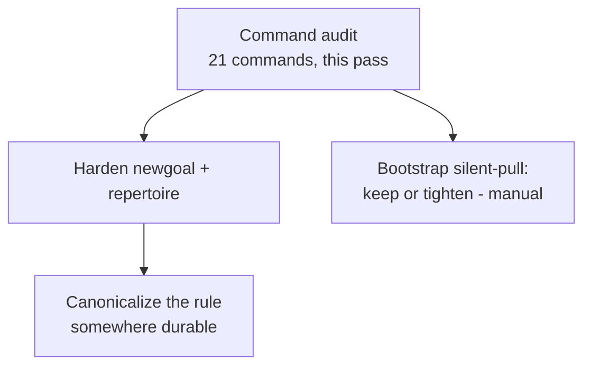

# Archived plan — GOALS 7: Command Boundary Discipline

> Status: completed. Archived from root `GOALS.md` on 2026-09-03.
> This body is a historical snapshot; keep it immutable and add future active work to root `GOALS.md`.

---

## GOALS 7 — Command Boundary Discipline (base_project fix)

**Repro (the actual incident, this session)**: invoked via `/newgoal` — "reestruture o
repertoire para incluir o pesquisar" had already been settled through an explicit
`AskUserQuestion` exchange, so the request read as fully specified. Instead of writing
`GOALS.md` and waiting for a follow-up to execute it, `repertoire.md` (all 3 variants),
`README.md`, `ARCHITECTURE.md`, both `command-menu.md` files, and `dev/ROADMAP.md` were
edited directly, in the same turn. The user's correction: `/newgoal` "não era para permitir
[...] executar alguma coisa" — it creates a goal; the user decides whether to call it
(`/execgoals`) or modify it first. Nothing about this session's specific edits was wrong on
the merits (tests/lint stayed green, the restructuring matched what was agreed) — the
process was wrong: a planning command executed without the plan ever existing as a
reviewable artifact.

**Root cause**: `newgoal.md`'s documented contract (steps 1-7, this very file) never
authorizes execution — the gap isn't permissive text, it's the *absence* of an explicit,
unmissable stop-line. Compare to commands that already have one: `cleanproject.md` states
twice ("Read-only... never move, delete, or rewrite anything in this command", repeated at
its own step 6) and `designreview.md` states plainly ("this command critiques, it doesn't
generate"). `newgoal.md` and `repertoire.md` rely on their job description implying the
boundary instead of stating it — which is exactly the kind of implicit-only rule that's easy
to drift past under real conversational pressure (a request that already feels fully
specified), the same failure mode `/scanproject`'s repeated read-only line and `/fixproject`'s
separate-command split exist specifically to prevent for the scan/fix pair.

### Command audit (done as part of this research pass — re-read directly, not from memory)

All 21 commands, verdict + evidence:

| Command | Verdict | Evidence |
|---|---|---|
| `wpp`, `status`, `audit`, `reviewusage` | tight | Pure read/report, no write path exists in the instructions at all. |
| `scanproject`, `cleanproject` | tight (exemplar) | Explicit "read-only... never edit/move/delete" stated at both the top and the final step. |
| `designreview` | tight (exemplar) | Explicit "critiques, doesn't generate" — the exact pattern to copy for `newgoal`/`repertoire`. |
| `undo`, `uninstall` | tight (exemplar) | Tiered, per-risk confirmation before any destructive action; never bundles tiers. |
| `pr`, `council`, `plugins` | tight | Each has its own explicit "wait for confirmation" / cost gate before the action that matters. |
| `update` | tight | Step 4: "ask the user to confirm before doing anything" before pulling + reinstalling. |
| `diario` | tight | Hard-stop safety check before any write; never self-invoked per `CLAUDE.md`'s suggest-only rule. |
| `ship`, `fixproject`, `execgoals` | tight, by design | Their entire job *is* to execute (ship code, fix findings, run a plan) — showing what will happen before doing it is transparency, not a missing gate; this is a different contract than a planning-only command and shouldn't be forced into the same shape. |
| `newproject` | tight | Explicit "read-only like `architect`... do not create files"; its background `/newgoal` dispatch stays safe once `newgoal` itself is fixed below, since it only ever produces a plan. |
| **`newgoal`** | **needs hardening** | No line anywhere in its 7 steps says implementation is out of scope — the gap this section fixes. |
| **`repertoire`** | **needs hardening** | Same structural gap — a research/planning command with no explicit "never touch other files" line; missed adding this in the same session it was otherwise restructured. |
| `bootstrap` | **worth a decision, not clearly wrong** | Step 1 runs `git pull` (project remote) and step 0 runs `sync pull` (canonical `~/.agents/`) with no per-run confirmation — reasoned as low-risk/reversible in the command's own text (unlike a push), but it's the one command that silently changes local state as a side effect of what's framed as "mapping." Not obviously broken; flagged because the user asked specifically whether others are loose too. |

- [x] **B.1 Add an explicit "never execute" guardrail to `/newgoal`** (`coder`) —
  `source/claude/commands/newgoal.md`, `source/opencode/command/newgoal.md`,
  `source/opencode/command-lite/newgoal.md`. State plainly, both as part of the opening scope
  description and repeated as its own step near the end (matching `scanproject.md`'s top+step-7
  repetition, not a single buried mention): this command produces `GOALS.md` (or, for a pure
  research-type ask, the research deliverable) and nothing else — it never edits other files,
  never runs installs/builds, never implements a prior `GOALS.md`'s items, even when the
  request already reads as fully specified or was agreed through a prior confirmation exchange
  in the same conversation. Executing is exclusively `/execgoals`'s job. Done when: the line
  exists, in equivalent form, in all 3 files, in both locations.
- [x] **B.2 Same guardrail for `/repertoire`** (`coder`) — same 3 files
  (`source/claude/commands/repertoire.md`, `source/opencode/command/repertoire.md`,
  `source/opencode/command-lite/repertoire.md`). State that writing `REPERTOIRE.md` is the
  entire deliverable — findings never trigger a direct code/config change in this command,
  regardless of how actionable they look. Done when: the line exists in all 3 files.
- [x] **B.3 Decide the `/bootstrap` silent-pull exception** (manual) — **decided: keep as-is.**
  User's call: pull is genuinely low-risk/reversible (unlike push), and forcing a confirm gate
  on every `/bootstrap` call would add friction to a command that exists to be fast at session
  start. No file change. Recorded here as the answer, not left open.
- [x] **B.4 Canonicalize the "planning commands never execute" principle** (manual — location
  decided with the user: `source/CLAUDE.md`'s Workflow section, same place the
  `architect`→`coder`→`reviewer` sequence already lives, same spirit — "whoever plans doesn't
  execute"). Added as Workflow item 4 in both `source/CLAUDE.md` and its opencode counterpart
  `source/opencode-instructions.md` (kept in sync, per this project's own convention for that
  pair). Left B.1/B.2's per-file text as full restatements rather than short references — the
  two commands need the rule to survive being read in isolation, without depending on the
  global file also having been loaded.

**Regression test / done-when convention**: this is prompt/instruction text, not code — the
same non-unit-testable situation this file's own GOALS 6 §T.5 already names for
`/council`/`/newgoal`/`/designreview`/`/repertoire`. The verification that actually matters:
the next time a request shaped like this session's incident happens (a fully-specified-sounding
ask arrives wrapped in `/newgoal` or `/repertoire`), the command states plainly that it will
write a plan/briefing only and names `/execgoals` (or an explicit separate ask) as the next
step — checked live, the same way `/ship`'s step-9 default-branch warning in `dev/ROADMAP.md`
item 40 is marked "not tested running `/ship` for real" until it actually happens once.
