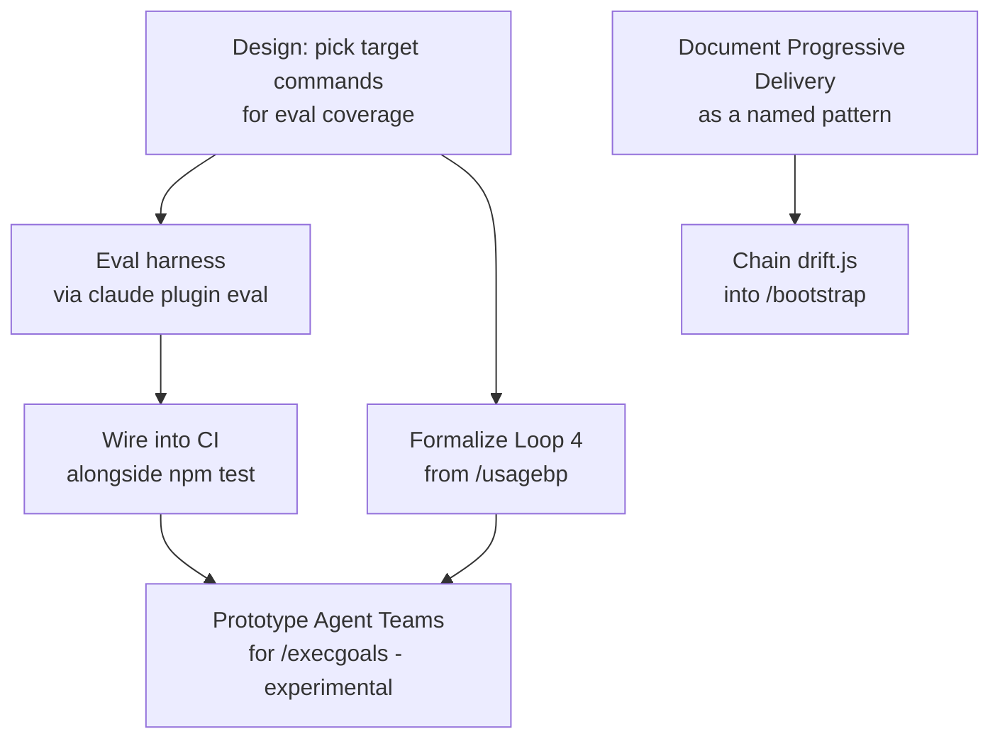

# Archived plan — GOALS 8: Harness & Loop Engineering Adoption

> Status: completed. Archived from root `GOALS.md` on 2026-09-24.
> This body is a historical snapshot; keep it immutable and add future active work to root `GOALS.md`.

---

## GOALS 8 — Harness & Loop Engineering Adoption (base_project feature)

Converts `dev/analise-harness-loop-engineering-2026.md`'s own roadmap (§4) into checkable
items — that document already did the research (harness engineering, loop engineering, and
4 adjacent trends, all sourced); this section doesn't re-research, it makes the plan
executable.

### Design rationale

- The single highest-leverage gap identified: `npm test`/Biome/`tsc` cover this project's
  *scripts* thoroughly (92 tests) but zero automated coverage exists for whether the 21
  commands/agents themselves produce correct behavior when a model actually runs them — every
  verification of a command this session (`/bootstrap`, `/scanproject`, `/ship`, etc.) was
  manual. `claude plugin eval` (native Claude Code capability — eval suites, JSON/report,
  sandbox, CI) closes exactly this gap without inventing new tooling.
- Explicitly out of scope for Phase 1: eval coverage for all 21 commands at once — start with
  the 3-5 already carrying the most explicit safety logic in their own text (`/ship`,
  `/fixproject`, `/uninstall`), where a regression is most costly, per the source analysis's
  own prioritization.
- Agent Teams (GOALS 8's Teams node) stays a prototype, not a production dependency, while
  `CLAUDE_CODE_EXPERIMENTAL_AGENT_TEAMS` remains experimental — same reasoning `dev/ROADMAP.md`
  already applies elsewhere to not betting production behavior on Anthropic-side experimental
  flags.

### Research: eval harness mechanism (H.1/H.2 historical research; informs optional live-model work)

`claude plugin eval` and `skill-creator`'s `evals.json` were both investigated live and ruled
out (see the historical decision below). The external live-model path was researched to answer
what would be needed for a high-fidelity eval and whether there was a better tool than
hand-rolling one. The implemented local harness deliberately avoids that dependency:

- **Better tool found for a future live-model eval — not required by the local harness**:
  [`anthropics/claude-code-action`](https://github.com/anthropics/claude-code-action), the
  official Anthropic GitHub Action. Its "agent mode" runs a direct prompt non-interactively
  (the same underlying mechanism as `claude -p`, packaged as a ready-made Action instead of
  plumbing auth/invocation/output-parsing by hand), accepts `--json-schema` in `claude_args`
  and exposes a schema-validated `structured_output` — closer to a real grading report than
  parsing raw `claude -p --output-format json` text ourselves would be. Runs on your own
  runner, calls go straight to the Anthropic API — no marketplace packaging, no early-access
  gate, no interactive-only constraint (the exact three problems that ruled out both prior
  candidates). If a future live-model eval is authorized, it would need scenario definitions
  plus assertions against `structured_output`, not hand-built invocation plumbing.
- **Confirmed real, not assumed**: `claude -p "<prompt>"` headless mode exists, exits with a
  status code, never opens a permission dialog. Supports `--output-format
  text|json|stream-json`, `--allowedTools`, `--permission-mode` (pre-approves tools so a run
  never hangs), and `ANTHROPIC_API_KEY` takes precedence over subscription auth in `-p` mode —
  the determinism CI needs. `claude-code-action`'s agent mode wraps exactly this.
- **Still open only if a future live-model eval is authorized**:
  1. **Scenario isolation.** Each scenario needs its own throwaway `CLAUDE_HOME` + scratch git
     repo with base_project's own commands actually installed (same pattern the existing
     `install-test` CI job already uses, `$RUNNER_TEMP/claude-home`) — otherwise `/ship` etc.
     don't resolve as real commands inside the eval run. Open question: does
     `claude-code-action` expose a way to point at a custom config/`CLAUDE_HOME`, or does the
     workflow need to run `install.sh` against a scratch home as its own step first, then
     invoke the action inside that environment?
  2. **Tool access shape per scenario.** A refusal scenario (e.g. "`/ship` must refuse to
     commit a staged secret") is only a real test if Claude genuinely *has* the tool access to
     attempt the risky action and chooses not to — not a test that passes only because the
     tool was withheld. `--allowedTools` needs to be scoped deliberately per scenario, not
     just "as open as possible" or "as locked as possible."
  3. **Assertion strategy.** Prefer deterministic checks (git log/diff state, file existence,
     exit codes) over LLM-as-judge grading wherever the outcome is a hard fact — matches this
     project's own harness-engineering research (`dev/analise-harness-loop-engineering-2026.md`)
     that determinism beats probabilistic compliance. Reserve judge-based grading only for
     genuinely qualitative outcomes (e.g. "did it explain the refusal clearly"), and treat those
     results with less confidence than the deterministic ones.
  4. **Cost and trigger strategy.** Each scenario run is a real, billed API call. Needs a
     decision: run on every push (cost scales with commit volume) vs. on a schedule vs.
     PR-label-triggered; which model per scenario (a cheaper/faster model for routine runs vs.
     the model users would actually run these commands with — a real fidelity/cost tradeoff,
     not free to ignore).
  5. **A new secret, and a new attack surface.** This repo's CI has no `ANTHROPIC_API_KEY`
     today — it only tests the *installer*, never makes a real model call. Adding one means a
     real, spendable credential as a GitHub Actions secret. `CONTRIBUTING.md` says this project
     accepts outside PRs — the workflow trigger needs to be scoped so an external PR can't run
     with access to that secret (`pull_request` vs. `pull_request_target` matters here, not a
     detail to skip). This is a real security/cost decision, not just a wiring task.
  6. **Scenario spec per command**, concrete enough to actually write: `/ship` — staged secret
     must never reach `git commit`; force-push never happens regardless of phrasing; detached
     HEAD stops and asks. `/uninstall` — a Tier C action never runs without its own separate
     confirmation, declining Tier A doesn't skip to Tier B/C. `/fixproject` — never commits
     automatically; a finding needing a user-only decision stops and asks instead of guessing.

### Implementation

- [x] **H.1 Deterministic contract harness for `/ship`, `/fixproject`, `/uninstall`** (`architect` then
  `coder`) — implemented `dev/scripts/eval-harness.js` and `dev/harness/scenarios.json` using
  only Node's standard library. It checks all 12 command artifacts (Claude, opencode dense/
  lite, and Codex) for the required safety contracts and evaluates 16 compliant, blocked, and
  unsafe action traces. The harness never invokes an LLM, network, CLI, or credential, so it
  removes the billed external-eval dependency. **Explicit limitation:** it proves source
  contract presence and deterministic policy classification, not that a probabilistic model
  will obey the text; live-model evaluation remains optional and separately scoped.
- [x] **H.2 Wire the deterministic harness into CI** (`coder`) — added `npm run test:harness`,
  a named CI step, and regression assertions in `dev/tests/ci-contract.test.js`. The step uses
  no secret, network, model, or external service.
- [x] **H.3 Formalize Loop 4 (hill-climbing) from `/usagebp`** (`architect` then `coder`) —
  **mechanism decided**: a small self-owned state file,
  `~/.claude/base_project/usage/.zero-use-tracking.json` (`{ id: firstFlaggedDateISO }`) — not
  a note auto-written into a tracked project file, since that would conflict with this
  project's own "never write unasked" norm (`/diario`, the plugin-suggestion rule); this stays
  entirely within `/usagebp`'s own existing "report only, on demand" contract, just makes
  the on-demand report itself remember across runs. Added to step 4a (all 3 variants): first
  sighting gets dated, repeat sightings report elapsed days, past 60 days (this command's own
  "two months" bar) gets called out explicitly, and a finding that resolves gets removed from
  tracking rather than staying stuck reporting zero. **Verification limit, stated honestly**:
  this is prompt/instruction text, not executable code — no unit test can prove an LLM follows
  it, the same class GOALS 7 already names for `/newgoal`/`/repertoire`. What's actually
  verified: the instruction text exists in all 3 files (`grep` confirmed), `npx biome
  check`/`npx tsc` stay clean. Not verified: an actual two-run escalation, which needs a real
  zero-use catalog entry and two real `/usagebp` invocations spaced apart — first live use
  is the real test, same honesty `dev/ROADMAP.md` item 40 already applies to an unexercised
  `/ship` code path.
- [x] **H.4 Document Progressive Delivery as a reusable pattern** (`coder`) — added
  `CONTRIBUTING.md` § "Rolling out a risky change to a command/agent", naming the
  `command-lite`/`command` split (flag, default unchanged, persisted state, promote after
  validation) as the reusable template for any future risky command/agent change. Verified:
  section exists, references the lite/dense implementation by name and path.
- [x] **H.5 Chain `drift.js` into `/bootstrap`** (`coder`) — added to step 0 of all 3
  `bootstrap.md` variants, right after `sync.js pull`. **Design correction made live, not as
  originally written**: ran `drift.js --project . --json` against this repo before writing the
  instruction, and it flagged ~40 lines of `"status": "missing"` (every agent base_project
  itself never adopted) alongside one genuine `"status": "drift"` entry — a literal reading of
  the original item text ("report any drift finding") would have made `/bootstrap` spam
  "missing" noise on every run for any project that hasn't opted into the unified layer, which
  is most projects. The instruction now explicitly filters to `"status": "drift"` only, ignores
  `"missing"`, and points at `apply.js --agent <id> --fix` as the concrete remedy.
- [x] **H.6 Prototype Agent Teams for `/execgoals`** (`architect`, prototype only — not a
  production dependency) — **skipped for now, deliberately, not forgotten**:
  `CLAUDE_CODE_EXPERIMENTAL_AGENT_TEAMS` prototype stays unscheduled — nothing to execute
  without the flag actually set and a real multi-area `GOALS.md` to test dispatch against, and
  betting effort on an Anthropic-side experimental feature isn't worth it yet. Not blocking
  anything else in this section. Revisit once the flag graduates past experimental.

### Tests

- [x] **H.7 Regression coverage for H.5** (`coder`) — extended `dev/tests/drift.test.js` with
  a new case asserting `drift --json`'s exact `"missing"` vs `"drift"` distinction the new
  `/bootstrap` step depends on: a never-adopted project reports zero `"drift"` entries, and
  mutating a projected file flips exactly that entry (and only that one) to `"drift"`. Verified
  by actually running it: `node --test dev/tests/drift.test.js` — both cases pass. Full suite
  `npm test`: 93/93 (up from 92). `npx biome check .`/`npx tsc` clean.

### Registration

- [x] **H.8 Register the deterministic harness and its evidence** (`coder`) — updated
  `dev/ROADMAP.md`, this plan, the research addendum, and all three command menus. The menus
  describe coverage as part of the existing `/ship`, `/fixproject`, and `/uninstall` flows;
  no new user-facing command was created. The original external live-model eval remains
  explicitly documented as optional rather than being represented as completed.

### Sources consulted

Already gathered in `dev/analise-harness-loop-engineering-2026.md` — see that file's own
"Fontes consultadas" section (LangChain's loop engineering framework, Faros.ai's harness
engineering breakdown, PluginEval/`claude plugin eval`, Claude Code Agent Teams) rather than
re-listing them here; this section converts that research into execution items; it doesn't
re-derive it.
