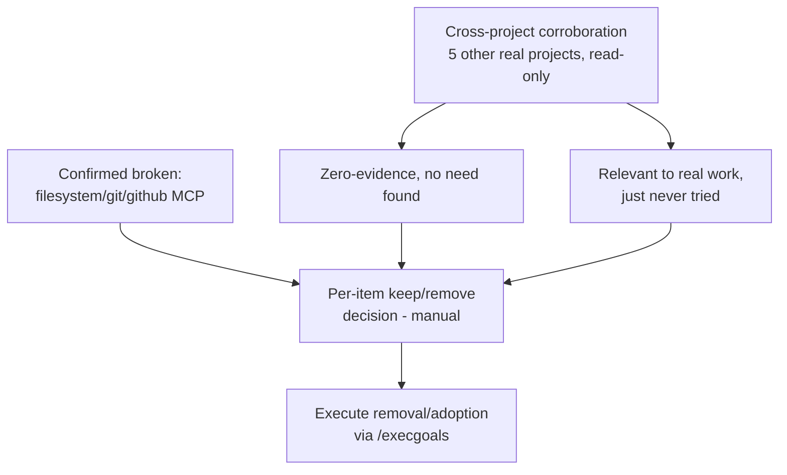

# Archived plan — GOALS 9: Unused Implementation Audit and Cleanup

> Status: completed. Archived from root `GOALS.md` on 2026-09-03.
> This body is a historical snapshot; keep it immutable and add future active work to root `GOALS.md`.

---

## GOALS 9 — Unused Implementation Audit & Cleanup (base_project cleanup)

Doesn't map cleanly onto one of the five goal types — closest in shape to `process.md`'s
`(manual)` convention (most items are a judgment call only the user can make, not something
`/execgoals` can resolve alone), applied to a cleanup decision rather than release readiness.
Source: this session's `/reviewusage` run — 16 days of ledger data (17/08–01/09), 13 sessions,
9,458 tool calls. Per `/reviewusage`'s own stated rule, **do not treat this as a final
decision from one data window** — zero uses over 16 days is a real signal, not yet the "two
months" bar that command itself names as the point a zero stops being noise.

### Cross-project corroboration (read-only, done as part of this research pass)

The ledger alone only proves *no tool call happened* — it can't say whether that's because
nothing needed the tool, or because something relevant was sitting unused. Checked the other
5 real projects touched in the ledger window directly (root listing, `.claude/settings.local.json`,
`.mcp.json`, `package.json`/`requirements.txt`, and folders/files matching each catalog
entry's own `recommend_if` condition) — read-only, nothing in those projects was touched.

- **No project-local MCP registration anywhere.** None of the 5 projects has a `.mcp.json` or
  any `mcpServers` entry in `.claude/settings.local.json`. `supabase`/`postgres`/`ruflo` (all
  `claude: {scope: "local"}` in the catalog, meaning they'd normally register *per project*,
  not globally) were never even wired into a project, not just never called — the zero-use
  finding for these three is now corroborated from a second, independent source, not just the
  global ledger.
- **`sqlite`'s zero-use finding does not hold up — it's relevant, just missed.** ERP's
  `package.json` depends on `@journeyapps/sqlcipher` (an encrypted SQLite variant for Electron)
  — a real, active SQLite-family database. The catalog's own `recommend_if` for `sqlite`
  checks for `better-sqlite3`/`sqlite3` by name and doesn't match `sqlcipher`, which is why
  this never got flagged as relevant during normal use, not because ERP doesn't have a
  SQLite-shaped need. (Caveat: `sqlcipher` is encrypted — the generic
  `@modelcontextprotocol/server-sqlite` may not handle that layer; worth a real try, not an
  assumption either way.)
- **The design-skill entries are relevant to real, current work, not a generic maybe.**
  ERP's `frontend/` is a real Next.js 15 + React 19 admin dashboard (`@fullcalendar/react`,
  charts, drag-and-drop, an `/(admin)/financeiro` route seen in this session's own `/reviewusage`
  tool-path data) — exactly what `emil-design-eng`/`taste-skill`/`styleseed`/
  `ux-ui-agent-skills`'s `recommend_if` describes. Zero invocation despite a matching real
  project existing changes the honest framing from "maybe nobody needs this" to "relevant,
  unused anyway — worth asking directly why, not assuming irrelevance."
- **`strix`'s relevance is stronger than "checked once."** Its `recommend_if` is "handles auth,
  payments, or user data." ERP (admin/finance system) and Personal APP (a personal-trainer
  client-management app storing client data in Firestore, per this session's own `/reviewusage`
  Agent-tool data) both plausibly match. The 6 ledger hits being exploration-only reads as
  "started, didn't finish evaluating it" against real candidates, not "tried and found no use
  for it."
- Nothing found for `headroom` — no project shows a signal that would make it more or less
  relevant than the ledger already suggested; its "universal" `recommend_if` doesn't
  discriminate by project shape, so cross-project checking has nothing to add here either way.

This changes U.3/U.5/U.6 below from "zero-evidence, lean remove" to "some genuinely
zero-evidence (postgres/supabase/ruflo), some relevant-but-untried (sqlite, the design skills,
strix)" — a materially different recommendation than before this check.

### Confirmed broken — not a usage question, a reliability bug

- [x] **U.1 Diagnose or remove the `github` MCP registration** (manual, then `coder`) —
  **real root cause found, not assumed**: inspected the live registration directly
  (`~/.claude.json`'s `mcpServers.github`) and it held the literal, never-replaced string
  `"Authorization": "Bearer YOUR_GITHUB_TOKEN"` — same placeholder baked into
  `source/opencode/mcp.json` and therefore into every `opencode.jsonc` this installer ever
  produced. This was never a code bug; it's a credential-requiring integration that was wired
  as an always-on, zero-setup default, which cannot work. User's call: remove it.
  **What changed**: dropped `github` from `source/opencode/mcp.json`'s always-on set (now just
  `context7`/`filesystem`/`git`, all genuinely credential-free); added it as a proper opt-in
  entry in `source/plugins.json` (`manual: true`, `requires_input` a real token, the exact
  `claude mcp add --transport http` command as its instruction) so the capability isn't lost,
  just moved from silently-broken-by-default to correctly opt-in — same pattern `supabase`
  already uses for its own required token. `README.md`'s "always on" claim corrected.
  **Live cleanup on this machine**: removed the broken entry from `~/.claude.json`
  (backed up first to `.claude.json.pre-github-removal.bak`, not deleted outright) and
  re-ran the installer, confirmed `opencode.jsonc` no longer contains a `github` block.
  Verified: `node dev/scripts/validate-plugins.js` passes, `npm test` 93/93, lint/typecheck
  clean.
- [x] **U.2 Diagnose `filesystem`/`git` MCP instability** (manual, then `coder`) —
  **verdict: expected behavior, no action.** Re-examined the actual evidence rather than
  re-asking: this session's own transcript shows `filesystem`/`git` cycling
  connecting → connected → disconnected at various points, but `/reviewusage`'s ledger shows
  **zero calls to either, ever**, in the whole 16-day window — meaning neither was ever
  actually invoked and found to fail. The connect/disconnect cycling is far more consistent
  with normal MCP lifecycle (idle servers reconnecting on demand) than with a real bug — unlike
  `github` (U.1), there's no error message, no failed call, nothing to point at as broken. Not
  escalating to `coder`: nothing to fix without a real failure to reproduce. Revisit only if an
  actual call to either fails outright.

### Zero observed use over 16 days — candidates, not decisions

Catalog entries with no evidence of use in the ledger and no `install` event recorded (the
ledger has zero `install` events in the whole window, so absence of install evidence isn't
meaningful on its own — usage evidence is what's real here):

- [x] **U.3a `supabase`, `postgres` MCP entries** (manual) — **decided: keep cataloged.**
  Genuinely zero-evidence on two independent sources (ledger + cross-project check), but
  they're opt-in catalog entries, not always-on — zero cost to a user who never touches
  `/plugins`'s catalog pass for them, and removing them just means re-adding later if a
  Postgres/Supabase project shows up. No destructive action taken.
- [x] **U.3b `sqlite` MCP entry** (manual) — **user chose both: widen `recommend_if` AND test
  for real.** Tested for real, with explicit per-action confirmation since it touched a real
  production database: copied ERP's actual `erp_housekimono.sqlite` (never the original) to a
  scratch dir, checked its raw header (not plain-SQLite magic bytes — genuinely
  full-file-encrypted), then tried opening the copy with plain `node:sqlite` (no SQLCipher
  support, same class of driver `@modelcontextprotocol/server-sqlite` uses) — **it failed
  outright: "file is not a database."** Copy deleted immediately after the test, original
  never touched. **Result reverses the original plan**: `recommend_if` now explicitly
  *excludes* `sqlcipher`/`@journeyapps/sqlcipher`, with the proof inline, instead of matching
  it — recommending this MCP for an encrypted-SQLite project would recommend something proven
  not to connect, the same failure shape as U.1's `github` placeholder. Verified:
  `node dev/scripts/validate-plugins.js` passes.
- [x] **U.4 `headroom`, `ruflo` entries** (manual) — **decided: keep cataloged**, same
  reasoning as U.3a — zero-cost optional entries, no destructive action taken. `ruflo`'s own
  catalog entry already carries an explicit "review resource/cost implications before
  installing" warning, which is the honest gate for something this heavy, not removal.
- [x] **U.5 `emil-design-eng`, `taste-skill`, `styleseed`, `ux-ui-agent-skills`,
  `example-skills` skill entries** (manual) — **answer: "esqueci que existiam."** Not a
  rejection — genuine oversight, not a deliberate decline. No catalog change; the entries stay
  installed/cataloged as before. Recorded here so the next time ERP's frontend gets real
  design work, this finding is the reminder that was missing the first time.
- [x] **U.6 `strix` (CLI, security)** (manual) — **real failure reported by the user, not
  hypothetical**: "o strix estoura o limite de tokens antes de terminar de rodar... não
  funciona" — already tried, on a real project, and it did not complete. This is a materially
  different finding than "checked once, never finished evaluating" — it's a known, reported
  failure mode. Added an honest `install.note` caveat to `strix`'s catalog entry naming this
  exact failure (token/context budget exceeded before completion) so `/plugins` doesn't
  recommend it as if it just works. Not removed from the catalog — the failure may be
  project-size-specific, not universal, so the option stays available with the caveat attached
  rather than being deleted outright.

### Decision and execution

- [x] **U.7 Record a keep/remove/try decision per item above** (manual) — done, one line per
  U.1-U.6 above, all with the user's actual answers, not assumed defaults.
- [x] **U.8 Execute confirmed removals via `/execgoals`** (`coder`) — **only one real removal
  came out of U.1-U.6: `github`'s broken always-on registration (U.1), already executed at the
  point U.1 was resolved** — dropped from `source/opencode/mcp.json`, removed from this
  machine's live `~/.claude.json` (backed up first), re-added as a correct opt-in catalog
  entry. Nothing else in this section resulted in a removal: U.3a/U.4 kept cataloged, U.3b/U.6
  got corrected `recommend_if`/caveat text (not deletions), U.5 needed no change. No separate
  bulk-delete pass needed. Verified: `node dev/scripts/validate-plugins.js` passes,
  `npx biome check .`/`npx tsc` clean, `npm test` 93/93.

### Caveat

16 days is still thin on its own for anything left genuinely zero-evidence after the
cross-project check (U.3a, U.4) — the check above resolved the "maybe it just never came up"
question for `sqlite` and the design skills (it did come up, ERP matches both), but
`supabase`/`postgres`/`headroom`/`ruflo` remain unconfirmed by a second source too, just with
weaker (not zero) confidence than a two-month window would give.
