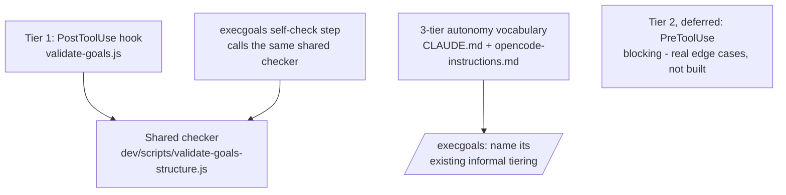

# Archived plan — GOALS 10: Reliability Harness: Structural Guardrails + Tiered Autonomy

> Status: completed. Archived from root `GOALS.md` on 2026-09-03.
> This body is a historical snapshot; keep it immutable and add future active work to root `GOALS.md`.

---

<a id="goals-10-reliability-harness-structural-guardrails--tiered-autonomy-base_project-feature"></a>
## GOALS 10 — Reliability Harness: Structural Guardrails + Tiered Autonomy (base_project feature)

Direct continuation of GOALS 7-8's own incident: this session introduced two real, live
`GOALS.md` structural bugs (duplicate item IDs) while executing GOALS 7-9, caught only because
`grep` was run manually afterward — a memory-dependent catch, not a guaranteed one. Researched
(this session, with sources) before writing this: self-reflection alone is proven weaker than
self-reflection plus an external/objective signal; Claude Code's own `hooks` mechanism is the
real, already-partially-adopted way to make a check objective and automatic instead of textual
and memory-dependent; graduated/tiered autonomy (GAIE framework, the "Permission Ladder"
pattern) is real, documented practice, not a novel idea being improvised here.



### Design rationale — mapped to the project's actual layers, not a generic proposal

- **Hooks layer** (`source/hooks/`, → `~/.claude/base_project/hooks/`, registered in
  `settings.json`'s `PostToolUse` array): this is where the deterministic check belongs.
  Verified directly on this machine, not assumed — `post-edit-format.js` already runs as a
  real `PostToolUse` hook today, receives `tool_name`/`tool_input.file_path` on stdin, self-
  filters by file extension, and *never blocks or fails the edit it's attached to* (same
  constraint the new hook must keep — a structural check that broke a legitimate `GOALS.md`
  edit would be worse than the bug it prevents). `validate-goals.js` mirrors this exact
  pattern: fires on every `Edit`/`Write`/`MultiEdit`, self-filters to paths ending in
  `GOALS.md` (any project's, since base_project's hooks install globally, not scoped to this
  repo), and only *reports* — same non-blocking contract as its neighbor.
- **Scripts layer** (`dev/scripts/`): the check logic itself lives once, in
  `dev/scripts/validate-goals-structure.js`, not duplicated into the hook. Two callers share
  it: the hook (automatic, every edit) and `/execgoals`'s own self-check step (explicit,
  end-of-area) — so "what the hook checks" and "what a manual check verifies" can never drift
  apart into two different definitions of correct.
- **Global instruction layer** (`source/CLAUDE.md`, `source/opencode-instructions.md`): the
  3-tier autonomy vocabulary (auto-approved / notify-and-proceed / human-in-the-loop, from the
  GAIE/Permission-Ladder research) is prose, not a hook — deciding "is this action reversible,
  does it touch data outside base_project's own repo" needs judgment a deterministic check
  can't make. Lands as an elaboration of Workflow item 4 (`Plan ≠ execute`, added in GOALS 7),
  the same section, not a new one.
- **Command layer**: `/execgoals` already does an *informal* version of this tiering — step 3's
  "trivial items apply directly... non-trivial use architect→coder... decision only the user
  can make → stop and ask" is structurally the same 3-way split, just unnamed. The concrete
  incident that should anchor the human-in-the-loop tier explicitly: this session's ERP
  database test (U.3b) — real data, outside base_project's own repo, low reversibility if
  mishandled — is the worked example to cite, the same way `undo.md`/`uninstall.md` already
  anchor tiered confirmation for their own domains.
- **Reference layer** (`project-standards.md`): open question, not decided here — should the
  3-tier vocabulary become something `/scanproject` checks for in *other* projects too, or stay
  scoped to how base_project's own commands operate? Flagged as a decision item, not assumed.
- **Explicitly deferred, not built this pass**: a `PreToolUse` hook that blocks a planning-only
  command (`/newgoal`, `/repertoire`) from editing a non-`GOALS.md`/`REPERTOIRE.md` file before
  the edit happens — genuinely possible (confirmed: the stdin payload carries `prompt_id`, and
  `UserPromptSubmit` events carry the literal prompt text in the same ledger `usage-log.js`
  already writes, so correlating "this tool call's `prompt_id` traces back to a prompt starting
  with `/newgoal`" is real, not hypothetical) — but `PreToolUse` is a hook event type this
  project has never used before (today only `PostToolUse`/`SessionStart`/`UserPromptSubmit`
  exist), and real edge cases aren't resolved: a combined message (`/newgoal /council`) doesn't
  start with a clean `/newgoal` match, and `/newproject`'s background dispatch of `/newgoal`
  carries no literal typed `/newgoal` text at all — same shape problem, different mechanism.
  Worth a real design pass later, not worth guessing into existence now.

### Implementation

- [x] **G.1 `dev/scripts/validate-goals-structure.js`** (`coder`) — the shared checker.
  Catches the two failure modes this session actually demonstrated: (a) a bold item label
  (`**X.N**` / `**X.Na**`) appearing more than once in the same file, (b) unbalanced
  ` ```mermaid ` opens vs. closing ` ``` ` fences. Exports a `check(filePath)` function
  returning `{ ok: boolean, findings: [...] }`, plus a CLI entry point
  (`node dev/scripts/validate-goals-structure.js <path>`) for direct/manual use. Done when: a
  fixture file with a deliberately duplicated item ID fails the check, and the same file with
  it fixed passes.
- [x] **G.2 `source/hooks/validate-goals.js`** (`coder`) — thin `PostToolUse` hook wrapper,
  same shape as `post-edit-format.js`: reads stdin JSON, checks `tool_name` is
  `Edit`/`Write`/`MultiEdit` and `tool_input.file_path` ends in `GOALS.md`, calls G.1's
  `check()`, and — this is a judgment call to confirm, not assumed — prints findings to
  stderr as a visible warning without failing/blocking the tool call (matching
  `post-edit-format.js`'s "must never block the edit it's attached to" constraint) rather than
  using Claude Code's hook-exit-code convention for surfacing an error back to the model, if
  that convention exists and would give a stronger result (worth checking against the current
  Claude Code hooks docs when this is actually built, not assumed from older research).
  Done when: editing a scratch `GOALS.md` to introduce a duplicate ID and saving it via
  Edit/Write produces a visible warning in that same turn, without the edit itself failing.
- [x] **G.3 Register the new hook** (`coder`) — `dev/scripts/install.ps1` and `install.sh`,
  mirroring the existing `post-edit-format.js` registration block exactly (build the hook
  path, a `base_project/hooks/validate-goals.js` marker string, filter out any existing
  registration matching that marker before appending — the same re-install-safe pattern the
  other 4 hooks already use). Confirm whether the existing generic `source/hooks/*.js` sync
  loop already picks up the new file automatically or needs its own line — check directly
  against the current loop rather than assuming either way. Done when: a fresh install into a
  scratch `CLAUDE_HOME` registers the new hook in `settings.json`'s `PostToolUse` array, and a
  second install doesn't duplicate the entry.
- [x] **G.4 Elaborate the 3-tier autonomy vocabulary** (`coder`) — extend the Workflow rules in
  `source/CLAUDE.md` and `source/opencode-instructions.md`: name the three tiers
  (auto-approved / notify-and-proceed / human-in-the-loop), the axes that decide which one
  applies (reversibility, whether the action touches data/state outside base_project's own
  repo, data sensitivity), and cite this session's ERP database test as the worked example for
  human-in-the-loop. Done when: the three tiers and their deciding axes are named explicitly,
  not just implied.
- [x] **G.5 Name `/execgoals`'s existing tiering explicitly** (`coder`) — step 3 already does
  this informally; make the vocabulary from G.4 explicit in the same step's text, and add a new
  step: after finishing a batch of edits to the same file within one area, run G.1's checker
  against it directly (`node dev/scripts/validate-goals-structure.js <file>`) as a manual
  backstop — covers the gap where the hook isn't installed/synced yet (exactly this session's
  own situation, editing `GOALS.md` mid-development before a fresh install ran). Done when: the
  step exists and running it against a file with a known-injected duplicate ID reports it.

### Tests

- [x] **G.6 `dev/tests/validate-goals-structure.test.js`** (`coder`) — unit coverage for G.1
  directly: a fixture with a duplicated item ID fails, a fixture with unbalanced mermaid fences
  fails, a known-good fixture (e.g. a copy of this file's own GOALS 7 section) passes. Done
  when: `npm test` includes this suite and it actually exercises all three cases, not just the
  happy path.

### Registration

- [x] **G.7 Update `dev/ROADMAP.md`, `command-menu.md`, `README.md`/`ARCHITECTURE.md`'s hook
  list** (`coder`) — same discoverability discipline every prior feature in this file uses.
  Done when: the new hook is named wherever the other 4 are already listed, not just present
  in `source/hooks/`.

### Explicitly out of scope for this pass

- [x] The `PreToolUse` blocking mechanism (see Design rationale above) — real edge cases
  unresolved, would be guessed into existence rather than designed if built now.
- [x] Extending the structural checker to `REPERTOIRE.md` or any file shape beyond `GOALS.md`
  — start narrow, on the exact shape that already broke twice; widen later only if a real
  second case shows up, not preemptively.
- [x] Any change to `project-standards.md` — flagged as an open question in Design rationale,
  not decided, so not implemented.

### Sources consulted

- [Reflection Pattern accuracy gains, and the limits of self-reflection alone without an external signal — StackViv](https://stackviv.ai/blog/reflection-ai-agents-self-improvement)
- [Designing AI Agents That Can Self-Correct — MachineLearningMastery.com](https://machinelearningmastery.com/designing-ai-agents-that-can-self-correct/)
- [Governed AI-Assisted Engineering (GAIE): graduated 3-tier human oversight, classified by reversibility/data sensitivity/regulatory impact — arXiv](https://arxiv.org/html/2606.22484v1)
- [The Permission Ladder: 5 autonomy levels, 3-way action classification (auto-approved / notify-and-proceed / human-in-the-loop) — MindStudio](https://www.mindstudio.ai/blog/ai-agent-permission-ladder-autonomy-levels)
- [Claude Code Hooks: deterministic, programmable guardrails; PostToolUse validates but cannot undo, PreToolUse can block — Claude Code Docs / Stroops Lab](https://code.claude.com/docs/en/hooks-guide)
- [Poka-yoke (mistake-proofing), Shigeo Shingo / Toyota Production System — Wikipedia](https://en.wikipedia.org/wiki/Poka-yoke)

---
