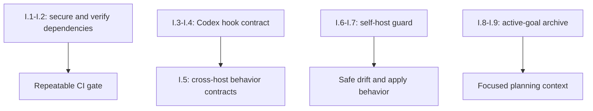

# Archived plan — GOALS 11: Architecture Integrity & Context Economy

> Status: completed. Archived from root `GOALS.md` on 2026-09-03.
> This body is a historical snapshot; keep it immutable and add future active work to root `GOALS.md`.

---

## GOALS 11 — Architecture Integrity & Context Economy (base_project feature)

This is a bounded reliability pass based on the 2026-09-03 architecture scan, not a rewrite of
the installer or a reason to add more slash commands. The baseline is healthy: `npm test`
(98/98), Biome, TypeScript, plugin-schema validation, `doctor`, and the source skill scan all
passed. The selected work addresses four verified gaps instead: a high-severity transitive
production dependency, an event-shape mismatch in the Codex hook projection, a self-host drift
false positive that could replace this repository's own instructions, and historical goal text
being reloaded as active planning context.

### Architecture decision — mapped to the actual repository layers

| Layer / folder | Scan verdict | Decision in this goal |
| --- | --- | --- |
| `source/hooks/` | Correct place for deterministic guardrails, but `post-edit-format.js` does not read Codex's documented `tool_input.command` patch payload. | Fix and test the existing hook; do not add a second hook framework. |
| `source/claude/`, `source/opencode/`, `source/codex/` | Native formats intentionally differ by host and by dense/lite profile. | Keep native sources; test shared behavioral invariants rather than generate one command from another. |
| `dev/scripts/` | `drift.js` compares the base_project repository's mixed global/project instructions byte-for-byte; `apply.js --fix` can therefore target its own root instructions. | Add one shared self-host safety decision, then make drift report that case as not applicable. |
| `dev/schemas/` and `dev/tests/` | Existing schema and platform-install tests are strong; event-payload and self-host contracts are missing. | Add narrow regression fixtures, not a new schema or test harness product. |
| `.github/` and root tooling | Cross-platform CI is healthy, but production audit/update maintenance is absent. | Make the existing checks reproducible through package scripts and add dependency-update visibility; no auto-merge. |
| `GOALS.md`, `dev/ROADMAP.md`, references | `GOALS.md` is 125 KB and mostly completed history, while planning always reads it to merge active work. | Archive completed plan bodies with a concise index; keep open work executable in the root file. |
| `graphify-out/`, generated outputs, `assets/`, local `.claude`/`.opencode` helpers | Generated, cosmetic, or already appropriately scoped. The graph map predates recent commits but is not a source of truth. | No structural change; a scan may label an old map stale, never regenerate it as a read-only side effect. |

### Implementation

- [x] **I.1 Patch the vulnerable production resolution minimally** (`coder`) — update the
  lockfile so the `ajv` transitive `fast-uri` resolution is at a fixed version (the scan found
  `3.1.5`, affected by GHSA-5jgf-p345-68v8; the audit dry run resolved `3.1.7`). Prefer the
  smallest normal package-manager resolution change; do not add an override or upgrade unrelated
  packages unless the lockfile cannot otherwise reach a fixed version. Done when: a clean
  `npm ci` succeeds and `npm audit --omit=dev --audit-level=high` reports no high or critical
  production vulnerability.

- [x] **I.2 Make verification and dependency maintenance deterministic** (`architect then coder`)
  — expose the checks CI already relies on as stable package scripts (`lint`, `typecheck`,
  `audit:prod`, and one composed `verify` entry point), then have CI call that composition without
  duplicating equivalent Biome checks. Add a minimal weekly Dependabot configuration for npm and
  GitHub Actions updates, with no automatic merge or broadened token/credential authority. Done
  when: local and CI verification run the same named checks, the audit policy is visible in CI,
  and update PRs remain ordinary reviewable PRs.

- [x] **I.3 Normalize the existing post-edit formatter for the real Codex event shape** (`coder`)
  — extend `source/hooks/post-edit-format.js` so `editedFiles()` retains its Claude-compatible
  `file_path`/patch handling and also extracts changed files from Codex `apply_patch` events whose
  patch text is in `tool_input.command`. Register a narrow post-tool matcher for only edit-capable
  tools where that host supports one, while retaining the hook's internal filter as defense in
  depth. Do not change `loop-detect` or `usage-log`, which intentionally observe all tool events.
  Done when: an actual Codex-shaped `apply_patch` fixture identifies the edited supported file and
  an unrelated post-tool event does not invoke formatting work.

- [x] **I.4 Put Codex hook installation under an end-to-end contract test** (`coder`) — extend
  `dev/tests/codex.test.js` (or a focused neighboring test) to cover the raw event fixture,
  generated `~/.codex/hooks.json` matcher, reinstallation idempotency, and preservation of
  user-owned hooks. Surface the documented Codex hook trust/review prerequisite in existing
  installation/status documentation, but never attempt to bypass it programmatically. Done when:
  the test would fail for the current `tool_input.command` omission or an over-broad formatter
  registration, and a fresh scratch installation proves the registered shape.

- [x] **I.5 Test cross-platform behavior contracts without generating new commands** (`coder`) —
  add small fixtures that compare only high-risk invariants across the existing Claude, opencode
  dense, opencode lite, and Codex variants: planning-only workflows keep their output boundary,
  `/ship` retains its no-force-push/commit gate, and each registered workflow has exactly one
  installed projection. Keep prose, ordering, and native host ergonomics independent. Done when:
  an accidental boundary regression in any one projection fails a focused test, while no command,
  command generator, or duplicate registry is introduced.

- [x] **I.6 Make the unified layer self-host aware before it can overwrite this repository**
  (`architect then coder`) — establish one durable detection path for the base_project source
  repository (not a hard-coded current absolute path), and use it in `dev/scripts/drift.js` and
  `dev/scripts/apply.js`. Against that source repository, a managed-memory projection must be
  explicitly refused/not applicable before backup, unlink, copy, or symlink behavior begins.
  Normal consumer projects must retain their current drift and repair behavior. Done when:
  invoking the scripts against base_project cannot replace root `AGENTS.md` or `CLAUDE.md`, even
  if a weak model follows a suggested `--fix` command.

- [x] **I.7 Represent self-host projections honestly in scans and tests** (`coder`) — make
  self-host entries a distinct non-drift status (for example `not_applicable`) and teach the
  three `$scanproject` projections to describe it as a limitation, never as something to repair.
  Add regression cases proving: self-host scan exits healthy without a repair suggestion; normal
  stale consumer files still report `drift`; and `apply` leaves self-host files byte-identical.
  Done when: only real consumer drift is eligible for `apply --fix`, with a clear machine-readable
  and human-readable reason for the exception.

### Active context and registration

- [x] **I.8 Archive only completed goal bodies after a structural preflight** (`architect then coder`)
  — after GOALS 10's `G.1` checker exists (or an equivalent one-off preflight proves unique IDs
  and balanced Mermaid fences), move completed GOALS 1-7 and 9 into a versioned
  `dev/goals-archive/` history with an immutable index. Leave GOALS 8, 10, and 11 fully active in
  root `GOALS.md`, and retain concise root summaries plus stable links to every archived plan.
  Update planning instructions to read the active file and archive index by default, not every
  completed plan body. Done when: historical evidence remains navigable, `/execgoals` sees only
  open work, and a new planning pass no longer loads completed-plan detail by default.

- [x] **I.9 Register the finished behavior where users and maintainers actually look** (`coder`) —
  update `dev/ROADMAP.md`, relevant `README.md`/`ARCHITECTURE.md` sections, installer/status
  guidance, and the active-goal index only after the preceding behavior is verified. Record the
  deliberate non-decisions below so a later contributor does not reintroduce a generator or
  second distribution mechanism as "cleanup." Done when: source, installed behavior, tests, and
  operational documentation describe the same architecture.

### Explicitly out of scope for this pass

- [x] New slash commands, new user-facing skills, or a command-generation framework — the current
  21 workflows already cover the needed jobs; behavior contracts are a safer shared layer than a
  fourth command dialect.
- [x] Packaging base_project as a separate Codex plugin — this installer already has one lifecycle
  and one source-of-truth layout; a second distribution path would add synchronization risk with no
  demonstrated user need.
- [x] A broad rewrite of `dev/scripts/apply.js` or the three installers — target the verified
  self-host decision and Codex contract rather than refactoring working platform projections for
  aesthetics.
- [x] Automatic graph refresh during `$scanproject` or automatic hook trust approval — scans remain
  read-only, and Codex's user review/trust boundary remains intact.
- [x] Reopening GOALS 8's deferred LLM evaluation harness decision — this goal improves deterministic
  project contracts and deliberately does not substitute a custom eval system for H.1/H.2/H.8.

### Sources consulted

- [Codex skills: progressive disclosure, focused skills, local skill locations, and explicit invocation policy — OpenAI](https://learn.chatgpt.com/pt-BR/docs/build-skills)
- [Codex hooks: event JSON, `apply_patch` command payload, matchers, and user trust review — OpenAI](https://learn.chatgpt.com/pt-BR/docs/hooks)
- [GHSA-5jgf-p345-68v8: `fast-uri` affected range and fixed releases — GitHub Security Advisory](https://github.com/fastify/fast-uri/security/advisories/GHSA-5jgf-p345-68v8)
- [Dependabot version updates for npm and GitHub Actions — GitHub Docs](https://docs.github.com/en/code-security/how-tos/secure-your-supply-chain/secure-your-dependencies/configuring-dependabot-version-updates?learn=dependency_version_updates&learnProduct=code-security)
