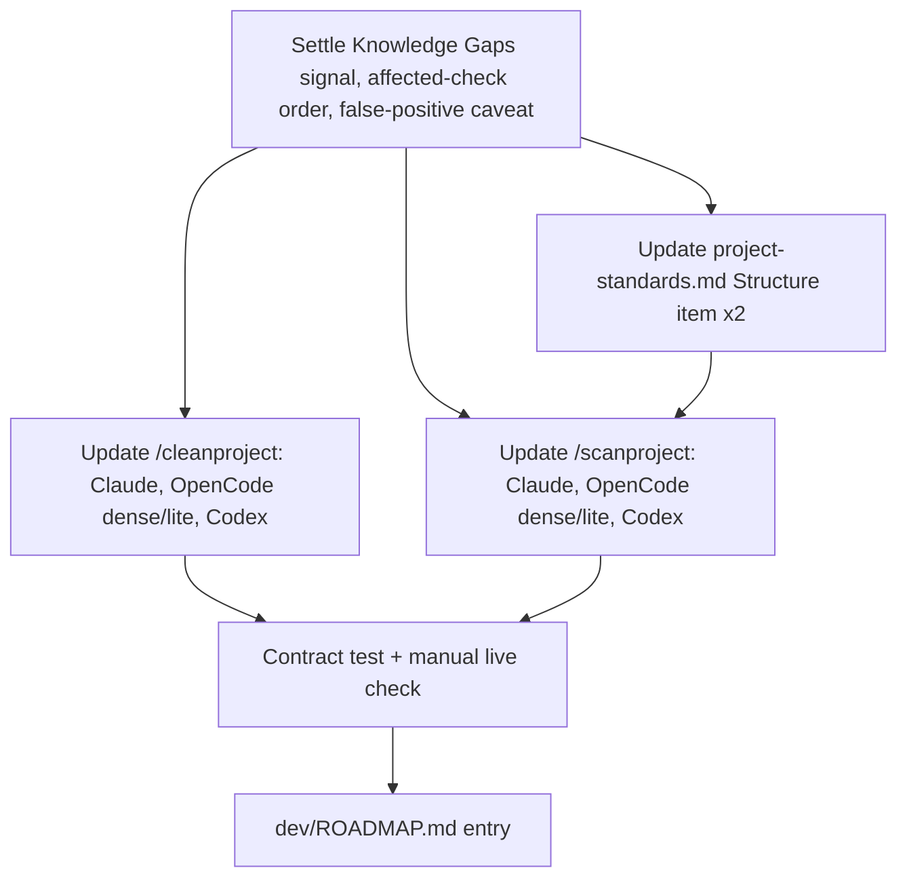

# Archived plan — GOALS 16: Graphify Structural-Gap Signals for /cleanproject and /scanproject

> Status: completed. Archived from root `GOALS.md` on 2026-09-11.
> This body is a historical snapshot; keep it immutable and add future active work to root `GOALS.md`.

---

## GOALS 16 — Graphify Structural-Gap Signals for /cleanproject and /scanproject (base_project feature)

Research (`dev/relatorio-graphify-capacidades-nao-utilizadas-2026.txt`) found that
`graphify cluster-only` — already invoked by `/bootstrap` — writes a `## Knowledge Gaps`
section into `GRAPH_REPORT.md` on every run (isolated nodes: graph degree ≤1 excluding
generic file/concept nodes; thin communities: fewer than `min_community_size` real nodes).
No command reads it today: `/cleanproject` finds "no incoming reference" by manual grep
alone, and `/scanproject`'s Structure item (§9 of `project-standards.md`) has no
deterministic check at all. This goal wires that existing, already-generated signal into
both audits' evidence, across all four source projections (Claude, OpenCode dense/lite,
Codex), and adds the CLI's `graphify affected` reverse-impact trace as stronger proof than
grep before `/cleanproject` calls something dead.

Suggested: sonnet · medium — prompt-text edits across known-good templates with one
judgment call (how to word the false-positive caveat) up front; no irreversible or
cross-system risk.

### Design rationale

Suggested: sonnet · medium — the only real judgment calls are exact wording and where the
CLI-unavailable fallback kicks in; everything else is transcription from the research.

- [x] **G16.1 Record the exact signal and its caveat** (`architect`) — the signal is
  `GRAPH_REPORT.md`'s `## Knowledge Gaps` section, specifically its two subsections
  ("isolated node(s)" and "thin communities... omitted"), generated by
  `graphify cluster-only` (`report.py`, function `generate()`, the "Gaps section" block) —
  already produced by every `/bootstrap` run that reaches step 5, no change to `/bootstrap`
  or the Graphify CLI itself is in scope. Record the caveat verbatim for reuse in every
  command variant: an isolated node/thin community is a signal to verify, not proof of dead
  code — frameworks that wire modules by convention or reflection (DI containers, ORM
  folder auto-discovery, dynamic `import`/`require`, config-driven route registration —
  common in modular ERP-style backends) won't show edges the extractor can resolve, so the
  finding must name the specific isolated node/community from the report, not a generic
  "looks disconnected" claim. **Done when:** the exact section header, both subsection
  names, and the caveat paragraph are written down once here for every implementation item
  below to copy, not re-derived per file.
- [x] **G16.2 Settle `/cleanproject`'s verification order and CLI-unavailable fallback**
  (`architect`) — before flagging a candidate as dead, the command must, in order: (1) check
  whether it's already named in `GRAPH_REPORT.md`'s Knowledge Gaps section when
  `graphify-out/` exists; (2) if the `graphify` CLI is available, run
  `graphify affected "<path>"` (reverse-impact trace over the resolved graph) as the primary
  proof — stronger than a text grep, since it follows resolved edges, not string matches;
  (3) when Graphify is absent or `graphify-out/` doesn't exist, fall back to today's existing
  manual-grep step unchanged — `/cleanproject` must keep working with zero Graphify
  installed, exactly as `/bootstrap` already degrades gracefully when the CLI is missing.
  **Done when:** the fallback path is explicit enough that no implementation item can
  accidentally make Graphify a hard dependency of `/cleanproject`.
- [x] **G16.3 Write the `project-standards.md` §9 (Structure) bullet** (`architect`) — one
  new bullet stating that when `graphify-out/GRAPH_REPORT.md` exists, its Knowledge Gaps
  section is the preferred deterministic check for this item — cite the specific isolated
  nodes/communities named there instead of eyeballing the tree — carrying the same caveat
  from G16.1. **Done when:** the bullet text is final before either `project-standards.md`
  copy is touched.

### Implementation

Suggested: sonnet · medium — mechanical mirroring of settled wording across four known
templates per command; the main risk is drift between variants, not design risk.

- [x] **G16.4 Update `/cleanproject` — Claude** (`coder`) — edit
  `source/claude/commands/cleanproject.md` step 2's "Dead files" bullet and step 3's
  evidence rule to add the Knowledge Gaps check and `graphify affected` verification from
  G16.1/G16.2, with the caveat and fallback inline. **Done when:** the step-2 bullet cites
  Knowledge Gaps by name and step 3 lists `graphify affected` output as acceptable evidence
  alongside the existing grep requirement.
- [x] **G16.5 Update `/cleanproject` — OpenCode dense + lite** (`coder`) — mirror G16.4 into
  `source/opencode/command/cleanproject.md` (currently byte-identical to the Claude source)
  and the condensed STEP-N form in `source/opencode/command-lite/cleanproject.md`, matching
  each file's existing register/terseness. **Done when:** both files carry the same
  Knowledge Gaps + `graphify affected` behavior as G16.4, in that file's own voice.
- [x] **G16.6 Update `/cleanproject` — Codex** (`coder`) — mirror G16.4 into
  `source/codex/skills/cleanproject/SKILL.md` (today's shortest variant, numbered list, no
  Graphify subcommand mentioned yet — only a generic `graphify-out/` file listing in step 1).
  **Done when:** the skill's dead-file step names the Knowledge Gaps section and
  `graphify affected` the same way the other three variants do.
- [x] **G16.7 Update `/scanproject` — Claude** (`coder`) — edit
  `source/claude/commands/scanproject.md` step 2 (or a new sub-step under it) so the
  Structure check reads `GRAPH_REPORT.md`'s Knowledge Gaps section when `graphify-out/`
  exists, cites the named isolated nodes/communities in the §9 finding, and checks the
  report's own "Graph Freshness" section (`built_at_commit` vs `git rev-parse HEAD`) before
  trusting it — suggesting a `/bootstrap` re-run when stale, otherwise leaving the existing
  "`/bootstrap` produces the preferred map" fallback untouched. **Done when:** a §9 finding
  in this command can name a specific isolated node/community, and a stale-graph case is
  flagged instead of silently trusted.
- [x] **G16.8 Update `/scanproject` — OpenCode dense + lite** (`coder`) — mirror G16.7 into
  `source/opencode/command/scanproject.md` and `source/opencode/command-lite/scanproject.md`.
  While here, do not touch the pre-existing `~/.claude/base_project/...` path in the dense
  `opencode/command/scanproject.md` (line 10/21) even though it looks like it should read
  `~/.config/opencode/base_project/...` like the lite version does — that mismatch predates
  this goal and is out of scope; flag it instead of silently fixing it inline. **Done when:**
  both files carry G16.7's behavior and the pre-existing path question is noted, not fixed,
  in the implementation notes.
- [x] **G16.9 Update `/scanproject` — Codex** (`coder`) — mirror G16.7 into
  `source/codex/skills/scanproject/SKILL.md`. **Done when:** the skill's structure check
  names Knowledge Gaps and the freshness check the same way the other three variants do.
- [x] **G16.10 Update `project-standards.md` §9 — both copies** (`coder`) — apply G16.3's
  bullet to `source/claude/references/project-standards.md` (this copy also feeds Codex:
  `dev/scripts/install-codex.js` copies `source/claude/references/` into
  `~/.codex/base_project/references/`, so there is no third physical file to maintain) and
  to `source/opencode/references/project-standards.md` (a genuinely separate copy per
  `install.ps1`/`install.sh` step 8d). **Done when:** both files contain the identical new
  bullet and no third project-standards.md copy was created under `source/codex/`.

### Tests

Suggested: sonnet · medium — a contract test following the existing `updates.test.js`
pattern, plus one manual run to confirm the prompt text actually changes model behavior.

- [x] **G16.11 Add a contract test for the four-way parity** (`coder`) — create
  `dev/tests/graphify-structure-signals.test.js` asserting all four `/cleanproject` variants
  mention the Knowledge Gaps section and `graphify affected`, all four `/scanproject`
  variants mention Knowledge Gaps and the Graph Freshness check, both `project-standards.md`
  copies carry the new §9 bullet, and — as a regression guard — that every variant of both
  commands still contains its existing "read-only, never fix/move/delete" contract language
  unchanged. **Done when:** the test fails if any one of the eight edited files (6 command
  variants + 2 references) drifts from the others or loses the read-only guarantee.
- [x] **G16.12 Perform a live manual check** (`manual`) — run `/cleanproject` and
  `/scanproject` in a project whose `graphify-out/GRAPH_REPORT.md` has a non-empty Knowledge
  Gaps section (the ERP project from this research, or any project with `/bootstrap` already
  run). Confirm: (a) findings cite specific isolated nodes/communities by name, (b)
  `/cleanproject` runs `graphify affected` before recommending removal of a Knowledge-Gaps
  candidate, (c) both commands still run cleanly with `graphify-out/` absent, falling back to
  today's manual-grep/tree-listing behavior with no error. **Done when:** all three
  behaviors are observed in a real run, not just present in the prompt text.

### Registration

Suggested: haiku · low — one mechanical decision-log entry, no menu/status changes since no
command is new.

- [x] **G16.13 Record the decision in `dev/ROADMAP.md`** (`coder`) — add a concise entry
  pointing to GOALS 16, the Knowledge Gaps signal it wires in, and the explicit boundary that
  `/bootstrap` and the Graphify CLI itself are unchanged. **Done when:** a future maintainer
  can tell from `ROADMAP.md` alone why `/cleanproject` and `/scanproject` started citing
  Graphify without re-reading this section.

### Execution evidence (2026-09-11)

- **G16.1–G16.3:** the exact Knowledge Gaps signal, the fallback order for `/cleanproject`,
  and the §9 bullet text are recorded verbatim in Design rationale above, before any file
  edit — every implementation item copied that wording rather than re-deriving it.
- **G16.4–G16.10:** all four `/cleanproject` and `/scanproject` variants plus both
  `project-standards.md` copies carry the Knowledge Gaps signal, the `graphify affected`
  verification step (cleanproject) or Graph Freshness check (scanproject), and the
  false-positive caveat; the pre-existing `~/.claude/...` path mismatch in
  `source/opencode/command/scanproject.md` was left untouched as decided.
- **G16.11:** `dev/tests/graphify-structure-signals.test.js` added and passing (3/3),
  asserting four-way parity across both commands, the §9 bullet in both reference copies,
  byte-identity between the two `project-standards.md` files, and that every variant's
  pre-existing read-only contract line is still present.
- **G16.12:** live check run against this repository itself —
  `graphify extract . --code-only --no-cluster` (no API key needed) then
  `graphify cluster-only . --no-label --no-viz` produced a real `GRAPH_REPORT.md` with a
  non-empty Knowledge Gaps section (410 isolated nodes, e.g. `$schema`/`indentWidth` from
  `biome.json` — a genuine example of the caveat's convention-driven false positive: JSON
  config keys, not dead code). `graphify affected "indentWidth"` returned "No affected
  nodes found", the exact evidence shape `/cleanproject` is now instructed to require. The
  report's `built_at_commit` (`dd9be334`) matched `git rev-parse HEAD` at the time, proving
  the freshness check reads correctly. `graphify-out/` stayed gitignored throughout
  (confirmed via `git check-ignore`) and left no repository footprint.
- **G16.13:** `dev/ROADMAP.md` item 53 records the decision, implementation, and boundary.
- **Full quality gate:** `npm run lint`, `npm run typecheck`, `npm run validate:plugins`,
  `npm run check:unused-deps`, `npm test` (132 tests; 131 passed — the one failure,
  `dev/tests/validate-goals-structure.test.js`'s archive-checksum check, is a pre-existing,
  unrelated SHA-256/line-ending mismatch in `dev/goals-archive/` predating this goal,
  confirmed via `git status` showing that directory untouched; flagged separately, not part
  of this goal's scope), and `npm run test:harness` (12/12 artifacts, 16/16 scenarios) all
  passed for the files this goal touched.

### Explicitly out of scope

- Changing `/bootstrap`'s extraction step (`graphify .` vs `graphify update .`), installing
  `graphify hook install` git hooks, or registering `graphify-mcp` as an MCP server — all
  remain candidates in `dev/relatorio-graphify-capacidades-nao-utilizadas-2026.txt` for a
  separate goal.
- Using `graphify god-nodes`, `graphify query`, `graphify path`, `graphify explain`,
  `graphify diagnose multigraph`, `--postgres`/`--cargo` introspection, `prs`, `benchmark`,
  or the `save-result`/`reflect` memory loop anywhere in `/cleanproject` or `/scanproject` —
  only the Knowledge Gaps section and `graphify affected` are in scope for this goal.
- Fixing the pre-existing `~/.claude/...` vs `~/.config/opencode/...` path mismatch in
  `source/opencode/command/scanproject.md` noted in G16.8 — unrelated bug, separate goal.
- Making Graphify a required dependency of either command — both must keep working,
  unchanged, when `graphify-out/` doesn't exist.
- Removing the stray pip-installed `graphifyy` copy noted in the research report's §3.8 —
  incidental, user's call, not part of this goal.

### Sources consulted

- `dev/relatorio-graphify-capacidades-nao-utilizadas-2026.txt` — this session's own research
  into Graphify's unused capabilities; §2 and §3.1 are the direct basis for this goal.
- `graphify` package source (`report.py` `generate()`, "Gaps section"; `cluster.py`
  `_partition()`), installed as `graphifyy` v0.9.58 via `uv tool` — confirms the Knowledge
  Gaps section's exact fields and how communities are detected.
- `source/claude/commands/cleanproject.md`, `source/opencode/command/cleanproject.md`,
  `source/opencode/command-lite/cleanproject.md`, `source/codex/skills/cleanproject/SKILL.md`
  — current step numbering and evidence rules being extended.
- `source/claude/commands/scanproject.md`, `source/opencode/command/scanproject.md`,
  `source/opencode/command-lite/scanproject.md`, `source/codex/skills/scanproject/SKILL.md`
  — current §9/Structure check and the `~/.claude/...` path mismatch noted in G16.8.
- `source/claude/references/project-standards.md`, `source/opencode/references/project-standards.md`
  — the two physical copies of the checklist item being extended.
- `dev/scripts/install.ps1` (step 8d) and `dev/scripts/install-codex.js` (lines ~160–168) —
  proof that Codex's checklist copy comes from `source/claude/references/`, not a third
  source file.
