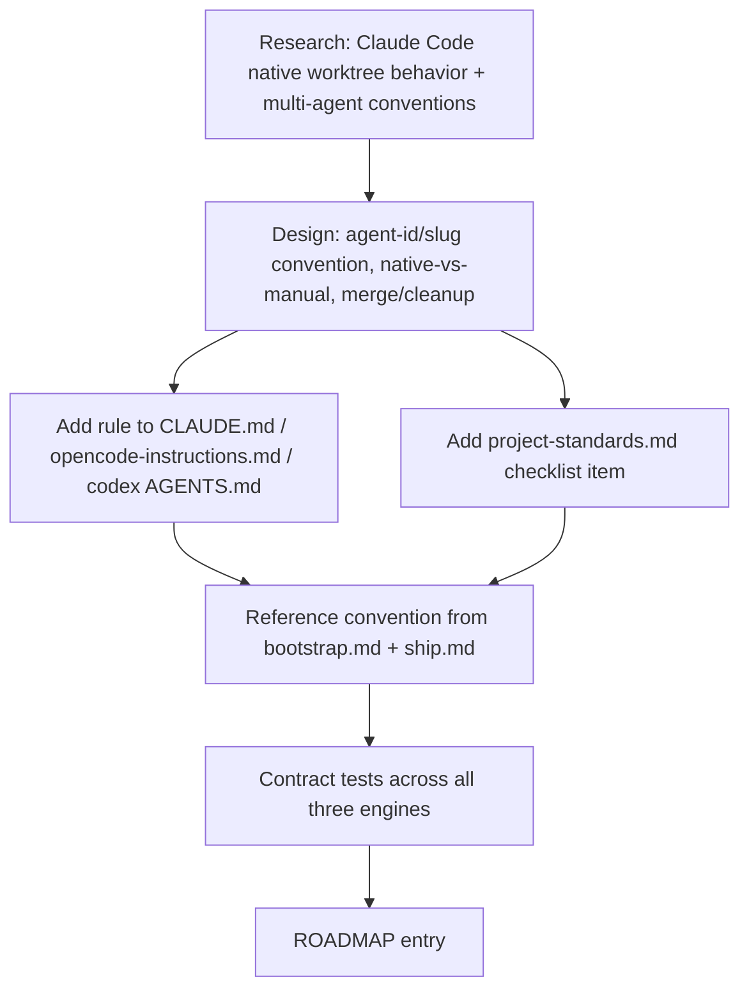

# Archived plan — GOALS 16: Multi-Agent Branch & Worktree Isolation Policy

## GOALS 16 — Multi-Agent Branch & Worktree Isolation Policy (base_project feature)

The user hit a real incident on an ERP project: more than one AI worked on the same
project without a branch/worktree convention, and their changes collided. The request is a
general rule — for every project, not just this one — defining how an AI should hold its own
branch and, ideally, its own physical git worktree, so concurrent AI sessions (or an AI and a
human) never edit the same working directory or branch at once. The user's own proposal was
one persistent branch per AI identity (`Branch_<AIName>`) plus a worktree per branch, on top
of one shared `main`.

Live research (Claude Code's own worktrees documentation, fetched during this planning pass)
confirms Claude Code already does something adjacent automatically: an auto-created session
worktree lands under `.claude/worktrees/<name>/` on a branch named `claude/<adjective-noun>`
(unnamed session) or `worktree-<name>` (`--worktree <name>`) — this session's own branch,
`claude/branches-por-ia-ca97b1`, is a live example. There is no shipped way to make Claude
Code's native auto-worktree feature obey a custom naming template from `CLAUDE.md` today (open
upstream request: [anthropics/claude-code#85998](https://github.com/anthropics/claude-code/issues/85998),
not yet implemented) — so this plan does not try to override that. Instead it generalizes the
user's request into the same `<agent-id>/<slug>` shape Claude Code already uses by default,
documents it as an explicit cross-engine convention, and closes the gap for the engines that
have no native equivalent (Codex CLI, OpenCode), which today have nothing stopping two agents
from editing the same checkout at once — the exact failure mode from the ERP incident.
Published multi-agent-coding guidance converges on the same shape: "one task → one branch →
one worktree → one agent" for filesystem-level isolation with no shared dirty working tree.

Suggested: sonnet · medium — a bounded documentation/policy change across three known parity
files plus mechanical contract tests; nothing here is irreversible or ambiguous once the
convention itself is settled.

### Design rationale

Suggested: sonnet · medium — the only real decision is the naming/responsibility convention;
everything downstream is mechanical once that's written down.

- [x] **B.1 Define the branch-naming and identity convention** (`architect`) — adopt
  `<agent-id>/<slug>`, where `<agent-id>` is a short lowercase identifier for whichever AI/tool
  is doing the work (`claude`, `codex`, `opencode`, or another explicit identifier for a
  different tool) and `<slug>` is a short kebab-case description of the current task. Record
  explicitly that this generalizes the user's literal request (one persistent branch per AI,
  `Branch_<AIName>`) into the shape Claude Code's own native worktree feature already
  auto-assigns, so the rule standardizes what Codex/OpenCode should do to match instead of
  fighting the engine that already does this. State that `main` (or the repository's actual
  default branch, resolved the same way `/ship` step 9 already does — never assumed) is the
  only branch representing reviewed, merged, shared truth; no AI commits work-in-progress
  directly to it. **Done when:** the convention, its rationale, and the explicit generalization
  from the user's original request are written down before any source file changes.
  **Proof:** recorded above and in `dev/ROADMAP.md` item 53 before B.5 touched any source file.

- [x] **B.2 Define when the convention applies and who creates the branch/worktree**
  (`architect`) — scope it to non-trivial work, the same threshold `source/CLAUDE.md`'s
  existing Workflow section already uses for "plan before non-trivial changes"; a trivial
  one-line ask doesn't need a dedicated branch/worktree. For Claude Code: prefer the native
  `EnterWorktree` tool / `--worktree` flag over manually running `git worktree add`, since the
  engine already isolates file edits, blocks writes to the main checkout, and handles cleanup;
  fall back to manual `git worktree add -b <agent-id>/<slug>` only where no native equivalent
  exists (Codex CLI, OpenCode, or another engine). The AI itself checks the current branch at
  the start of substantive work and creates/enters the right branch or worktree before editing
  — this is not deferred to the user. **Done when:** the trigger threshold and the
  native-vs-manual fallback are unambiguous per engine. **Proof:** `EnterWorktree`-first /
  manual-`git worktree add`-fallback split is written into all three global instruction files
  (B.5) exactly as decided here.

- [x] **B.3 Define the merge and cleanup path** (`architect`) — work reaches `main` only
  through the existing `/pr` → review → merge flow, never a direct push to the default branch
  from an agent branch (reuses the existing tiered-autonomy human-in-the-loop rule for a
  material scope choice, and the default-branch warning `/ship` step 9 already prints). After a
  branch merges, its worktree and branch are removed (`git worktree remove`, delete the merged
  branch) rather than left to accumulate — mirrors Claude Code's own documented stale-worktree
  sweep, which Codex/OpenCode have no equivalent of, so they need the same discipline applied
  manually. **Done when:** the merge/cleanup rule is written down and explicitly reuses
  `/pr`/`/ship` rather than inventing a new merge command. **Proof:** the merge/cleanup rule in
  B.5 points at `/pr`/`/ship` and `git worktree remove`, no new command was created.

- [x] **B.4 Preserve scope boundaries** (`architect`) — do not change `/ship`'s actual push
  permissions (it still pushes whatever branch the user is on; this adds awareness, not a new
  hard block), do not create a new slash command solely for branch/worktree setup, do not
  change any default branch name, and do not attempt to override Claude Code's native
  auto-worktree naming (unsupported today — see `anthropics/claude-code#85998`). This is a
  documented workflow convention, not new tooling. **Done when:** the out-of-scope list is
  written and no implementation item requires a capability that doesn't exist today. **Proof:**
  B.5–B.10 changed no default branch name, no `/ship` push permission, and added no new
  command; `anthropics/claude-code#85998` is cited as the reason native naming isn't overridden.

### Implementation

Suggested: sonnet · medium — mechanical prose edits across three known parity files, following
the exact pattern GOALS 12's V.7–V.9 already used for operating-profile guidance.

- [x] **B.5 Add the convention to all three global instruction layers** (`coder`) — add a new
  section (after the existing "Workflow" section, alongside "Autonomy & Confirmations") to
  `source/CLAUDE.md`, `source/opencode-instructions.md`, and `source/codex/AGENTS.md`: the
  `<agent-id>/<slug>` convention, the native-vs-manual-worktree rule per engine, the
  "`main` is reviewed/merged truth only" rule, and the merge/cleanup step. Keep each file's own
  structure and vocabulary; don't restate the other files' wording verbatim. **Done when:** all
  three files contain the same rule content adapted to each file's own voice, and none
  contradicts the existing Workflow/Autonomy sections already there. **Proof:**
  `source/CLAUDE.md`, `source/opencode-instructions.md`, `source/codex/AGENTS.md` each gained a
  "Multi-agent branching & worktrees" / "Multi-Agent Branching and Worktrees" section right
  after Workflow, verified by `dev/tests/branch-worktree-policy.test.js`.

- [x] **B.6 Add a checklist item to `project-standards.md`** (`coder`) — under "## 2. Version
  control", add: when a project is developed by more than one AI/agent (concurrently or across
  sessions), each agent works on its own `<agent-id>/<slug>` branch/worktree rather than
  committing directly on `main` — with the same "not every project needs this" judgment-call
  framing the file already uses for its other items. **Done when:** `/scanproject`/`/fixproject`
  can evaluate this item the same way they evaluate the file's other checklist items, without a
  special-cased code path. **Proof:** the new "## 2. Version control" bullet in
  `project-standards.md` uses the same free-text judgment-call phrasing as the file's other
  items — no new evaluation code path.

- [x] **B.7 Reference the convention from `/bootstrap` and `/ship` without duplicating it**
  (`coder`) — in all three `bootstrap.md` variants (Claude, OpenCode dense/lite, Codex), add a
  short check near the existing git-sync step: if starting non-trivial work and the current
  branch is the repository's default branch, follow the branch/worktree convention in the
  relevant global instruction file before editing (point at it, don't restate it). In
  `ship.md`'s existing step 9 default-branch warning, add one line noting that pushing the
  default branch directly from an agent session is exactly the case B.5's convention exists to
  avoid — informational, not a new blocking rule; `/ship` keeps pushing whatever branch it's
  asked to. **Done when:** `/bootstrap` and `/ship` reference the convention by name instead of
  re-explaining it, and neither command's existing behavior (sync, push mechanics) changes.
  **Proof:** all 4 `bootstrap.md`/`SKILL.md` variants and all 4 `ship.md`/`SKILL.md` variants
  now name the convention by section title instead of restating it; `/ship`'s force-push and
  push-mechanics text is byte-identical apart from the added sentence, confirmed by
  `dev/tests/branch-worktree-policy.test.js`.

### Tests

Suggested: sonnet · medium — grep-style contract assertions across three source files, the
same shape as the repo's existing cross-runtime parity tests.

- [x] **B.8 Add deterministic contract coverage** (`coder`) — extend or add a
  `dev/tests/*.test.js` file asserting: the `<agent-id>/<slug>` convention text and the "`main`
  is reviewed/merged truth only" rule exist in `source/CLAUDE.md`,
  `source/opencode-instructions.md`, and `source/codex/AGENTS.md`; the native-vs-manual
  worktree distinction is present; `project-standards.md` contains the new Version Control
  item; `bootstrap.md` (all variants) and `ship.md` reference the convention. Assert `/ship`'s
  force-push and default-branch-push mechanics are unchanged from the existing test's
  assertions. **Done when:** the test fails if any of the three engines loses the rule or the
  wording drifts into contradicting the existing Workflow/Autonomy sections, without requiring
  git, network, or a real model call. **Proof:** `dev/tests/branch-worktree-policy.test.js`
  created; `node --test dev/tests/branch-worktree-policy.test.js` passes 5/5.

- [x] **B.9 Run the complete local quality gate** (`reviewer`) — run `npm run verify` (lint,
  typecheck, tests, plugin validation, unused-deps), `npm run test:harness`,
  `node dev/scripts/validate-goals-structure.js GOALS.md`, and `git diff --check`. **Done
  when:** all pass and no unrelated dirty work is staged, reverted, or rewritten.
  **Proof:** Biome (1 JS file touched: the new test), TypeScript, plugin validation, and
  unused-deps all passed; `npm run test:harness` passed 12/12 artifacts and 16/16 scenarios;
  `npm audit --omit=dev --audit-level=high` found 0 vulnerabilities; `validate-goals-structure.js`
  reports `structure OK`; `git diff --check` reported no whitespace errors. `npm test` was
  133/134 — the one failure (`validate-goals-structure.test.js`'s archive-checksum assertion for
  GOALS 1) is pre-existing: `git status`/`git diff --stat` on `dev/goals-archive/` show zero
  changes from this work, so the mismatch predates this goal and is unrelated to it; not fixed
  here since GOALS 16 has no item authorizing edits to archived historical bodies. Reported
  separately, not silently absorbed into "all pass."

### Registration

Suggested: haiku · low — a single, mechanical roadmap entry once everything above is decided.

- [x] **B.10 Record the decision in the chronological roadmap** (`coder`) — add a concise
  `dev/ROADMAP.md` entry pointing to this goal, the `<agent-id>/<slug>` convention, the
  native-vs-manual split per engine, and the explicit generalization from the user's original
  one-persistent-branch-per-AI request. **Done when:** a future maintainer can find why the
  convention looks the way it does without re-reading this GOALS section. **Proof:**
  `dev/ROADMAP.md` item 53 records the incident, the convention, the native-vs-manual split, and
  the generalization from `Branch_<AIName>`.

### Explicitly out of scope

- A new slash command dedicated to branch/worktree setup.
- Changing `/ship`'s actual push permissions or adding a hard block on pushing the default
  branch — this plan adds awareness/guidance, not enforcement.
- Overriding Claude Code's native auto-worktree branch naming — not supported today.
- A CI-enforced branch-naming check (e.g. a pre-push hook rejecting non-conforming branch
  names) — out of scope unless the user asks for enforcement, not just convention.
- Multi-repo or cross-machine agent coordination — this is a single-repository, single-machine
  git convention.

### Sources consulted

- [Run parallel sessions with worktrees — Claude Code Docs](https://code.claude.com/docs/en/worktrees)
  — fetched live: default `.claude/worktrees/<name>/` location, `worktree-<name>` /
  `claude/<adjective-noun>` branch naming, `EnterWorktree`/`ExitWorktree`, `worktree.baseRef`,
  and the stale-worktree cleanup sweep.
- [anthropics/claude-code#85998](https://github.com/anthropics/claude-code/issues/85998) — open
  feature request for `CLAUDE.md`-driven branch naming; confirms this is not yet supported, so
  the plan works with the engine's current default instead of assuming a future override.
- [Git Worktrees for AI Coding: How to Run Multiple Agents Without Conflicts — MindStudio](https://www.mindstudio.ai/blog/git-worktrees-parallel-ai-coding-agents)
  and [How to Use Git Worktrees to Run Multiple AI Agents on the Same Repo — DEV Community](https://dev.to/battyterm/how-to-use-git-worktrees-to-run-multiple-ai-agents-on-the-same-repo-1on8)
  — "one task → one branch → one worktree → one agent" convention and merge/staging-branch
  practice for larger parallel efforts.
- `source/CLAUDE.md`, `source/opencode-instructions.md`, `source/codex/AGENTS.md` — existing
  Workflow/Autonomy sections this rule sits alongside, and the exact three-file parity pattern
  GOALS 12 (V.7–V.9) already established for this kind of operating guidance.
- `source/claude/references/project-standards.md`, `source/claude/commands/bootstrap.md`,
  `source/claude/commands/ship.md` — existing checklist and command bodies this plan extends
  rather than duplicates.
