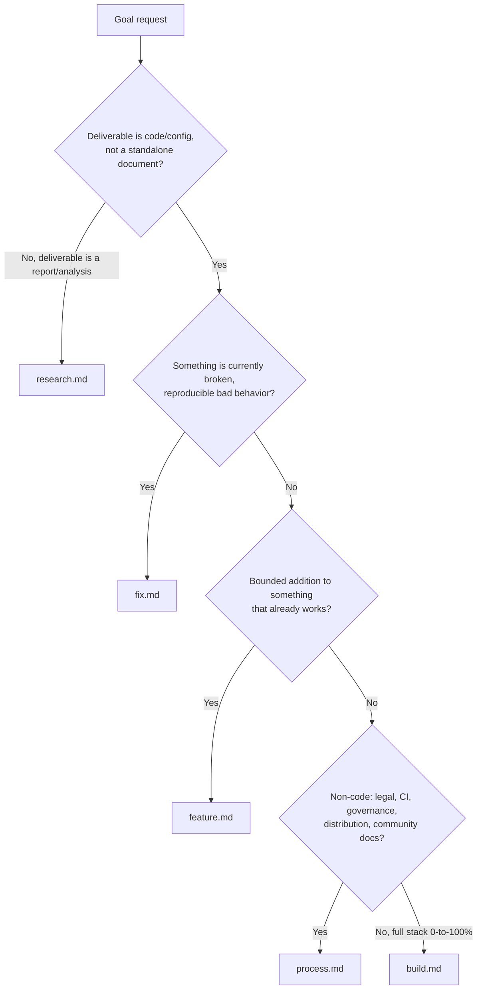

---
# base_project:managed
description: Research and write a 0-to-100% build plan for the current project as GOALS.md (lite).
---

Produce `GOALS.md` at the project root: a build plan detailed enough that `/execgoals` can execute it without re-researching anything. This is research-heavy and front-loaded — go deep now so nothing needs rediscovering later.

This command never implements anything — not the plan it just wrote, not a request that already sounds fully specified, not something already agreed earlier in this same conversation. Writing the plan is the entire job. Running it is `/execgoals`'s job, always.

STEP 1 — Gather context without re-asking. If this session already established the stack, kind of project, and starting state earlier in the conversation, reuse it. Otherwise ask one brief round: stack/language, kind of project, greenfield vs. existing. Skip anything already obvious from the current directory.

STEP 2 — Read `~/.config/opencode/base_project/references/project-standards.md` first — the shared definition of a well-formed project. Every plan should satisfy it, not reinvent it.

STEP 3 — Classify the goal type before researching or writing anything. Every plan is one of five types, each with its own defaults and definition of "done." Read `~/.config/opencode/base_project/references/goal-types/<type>.md` in full for whichever fits:

If genuinely ambiguous after the flowchart, ask the user one short question rather than guessing. If a plan is mostly one type with a minority of items from another, classify by what the request is centered on.

Never reuse `build.md`'s stack-area breakdown for a goal that isn't actually a build.

Exception: a pure research-type ask with nothing to execute after skips `GOALS.md` entirely — produce the deliverable document directly per `research.md`'s convention. If the research instead feeds a later build/feature, write it as its own `GOALS.md` section using `research.md`'s items, ordered first.

STEP 4 — Research for real, in one pass, as deep as the chosen type needs. Use web search for current best practices and concrete tool/library choices where the type calls for it.

STEP 5 — If `/council` was invoked together with this command (same message): for each item where the choice is genuinely contested (a real fork like monolith vs. microservices), run `/council` on that decision, including its own confirmation gate, before writing the choice into `GOALS.md`. Record only the President's verdict.

STEP 6 — If `/repertoire` was invoked together with this command (same message): let it finish first, read the `REPERTOIRE.md` it produces, then research tech/build specifics. `/repertoire` researches the subject; this step researches how to build it.

STEP 7 — Write `GOALS.md` in English, regardless of the conversation's language. Structure it as concrete, checkable items grouped by the chosen module's areas, not prose paragraphs. Tag `(manual)` wherever `/execgoals` can't run it alone. Order items by what has to exist before what. Under each `GOALS N` heading, include a short Mermaid flowchart showing the dependency order between that section's areas — area/subsystem-level nodes only, not one node per checkbox.

STEP 7a — Annotate each module with a suggested model + effort, right after its flowchart: one line, `Suggested: <model> · <effort> — <one-clause reason>`. Model from `{haiku, sonnet, opus}`, effort from `{low, medium, high, xhigh}`, picked per that module's own risk/complexity, never one fixed setting for the whole plan: haiku/low for mechanical low-risk work (boilerplate, config, docs); sonnet/medium for typical implementation; sonnet/high or opus/high for nontrivial logic or ambiguous/multi-system scope; opus/xhigh for irreversible or high-cost-of-failure work (migrations, auth/security, infra, destructive ops). This is a suggestion applied by hand, not an automatic mid-session switch.

STEP 8 — Never overwrite silently. If `GOALS.md` already exists, read the active root file first and merge new findings in. If `dev/goals-archive/README.md` exists, read that index too; open an individual archived plan only when historic scope/evidence matters, so completed detail is not default planning context. `GOALS.md` is tracked in version control, not gitignored.

STEP 9 — Report only: the file path (or the research deliverable's path for a research-type ask), and — only when run standalone, not backgrounded — a short outline of the sections written, not the full content.

STEP 10 — Never execute. This command writes `GOALS.md` (or the research deliverable) and nothing else. Never edit other files, never run installs/builds, never implement a prior `GOALS.md`'s items — no matter how complete the request sounds. If something needs building, that's `/execgoals` or a separate explicit ask, never this command.

$ARGUMENTS
